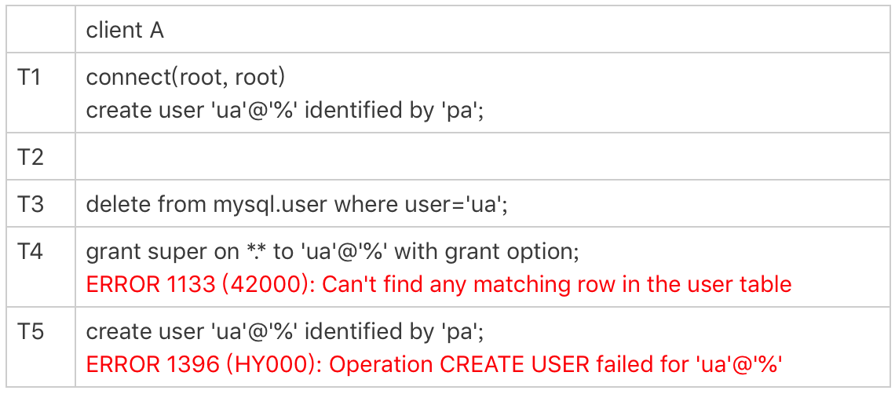

# 用户权限

在MySQL里面，给用户赋权是通过`grant`语句实现的。不论使用`grant`改变什么权限，只要之后跟着执行一个`flush privileges`命令，这个权限就会立马生效。但并不是所有的`grant`语句都需要跟着执行`flush privileges`命令，新的权限才会立马生效。

## 创建用户

```
mysql> create user 'ua'@'%' identified by 'pa';
```

这条语句创建了一个用户’`ua’@’%’`（`%`表示任意值），密码是pa。在MySQL里面，**`用户名(user)+地址(host)`才表示一个用户**，因此 `ua@ip1 `和 `ua@ip2`代表的是两个不同的用户。

这条命令做了两个动作：

1. 磁盘上，往`mysql.user`表里插入一行，由于没有指定权限，所以这行数据上所有表示权限的字段的值都是N；
2. 内存里，往数组`acl_users`里插入一个`acl_user`对象，这个对象的`access`字段值为0。


## 全局权限

全局权限，作用于整个MySQL实例，这些权限信息保存在`mysql.user`表里。下面的语句可以给用户ua赋予最高权限：

```
mysql> grant all privileges on *.* to 'ua'@'%' with grant option;
```

这个`grant`命令做了两个动作：

1. 磁盘上，将`mysql.user`表里，用户`'ua'@'%'`这一行的所有表示权限的字段的值都修改为‘Y’；
2. 内存里，从数组`acl_users`中找到这个用户对应的对象，将`access`值（权限位）修改为二进制的“全1”。

在这个`grant`命令执行完成后，如果有新的客户端使用用户名ua登录成功，**MySQL会为新连接维护一个线程对象**，然后从acl_users数组里查到这个用户的权限，并将权限值拷贝到这个线程对象中。之后在这个连接中执行的语句，所有关于全局权限的判断，都直接使用线程对象内部保存的权限位。

grant 命令对于全局权限，同时更新了磁盘和内存。命令完成后即时生效，接下来新创建的连接会使用新的权限。但对于一个已经存在的连接，它的全局权限不受grant命令的影响，因为该连接的线程对象没有得到更新。

> **一般在生产环境上要合理控制用户权限的范围**。如果一个用户有所有权限，一般就不应该设置为所有IP地址都可以访问。
>
> grant的时候是支持通配符的：`_`表示一个任意字符，`%`表示任意字符串。这个技巧在一个分库分表方案里面，同一个分库上有多个db的时候，比较方便。

如果要回收上面的grant语句赋予的权限，可以使用下面这条命令：

```
mysql> revoke all privileges on *.* from 'ua'@'%';
```

这条revoke命令的用法与grant类似，做了如下两个动作：

1. 磁盘上，将`mysql.user`表里，用户`'ua'@'%'`这一行的所有表示权限的字段的值都修改为“N”；
2. 内存里，从数组`acl_users`中找到这个用户对应的对象，将`access`的值修改为0。


在使用grant语句赋权时，可能会看到这样的写法：

```
mysql> grant super on *.* to 'ua'@'%' identified by 'pa';
```

这条命令加了`identified by ‘密码’`， 语句的逻辑里面除了赋权外，还包含了：

1. 如果用户`'ua'@'%'`不存在，就创建这个用户，密码是pa；
2. 如果用户ua已经存在，就将密码修改成pa。

这是一种不建议的写法，因为这种写法很容易就会不慎把密码给改了。


## database权限

下面的命令可以让用户ua拥有test库的所有权限：

```
mysql> grant all privileges on test.* to 'ua'@'%' with grant option;
```

基于库的权限记录保存在`mysql.db`表中，在内存里则保存在数组`acl_dbs`中。这条grant命令做了如下两个动作：

1. 磁盘上，往`mysql.db`表中插入了一行记录，所有权限位字段设置为“Y”；
2. 内存里，增加一个对象到数组`acl_dbs`中，这个对象的权限位为“全1”。


grant修改db权限的时候，是同时对磁盘和内存生效的。

每次需要判断一个用户对一个数据库读写权限的时候，都需要遍历一次`acl_dbs`数组，根据user、host和db找到匹配的对象，然后根据对象的权限位来判断。

grant操作对于已经存在的连接的影响，在全局权限和基于db的权限效果是不同的。


> `set global sync_binlog`这个操作是需要super权限的。

虽然用户ua的super权限在T3时刻已经通过`revoke`语句回收了，但是在T4时刻执行`set global`的时候，权限验证还是通过了。这是因为super是全局权限，这个权限信息在**线程对象**中，而`revoke`操作影响不到这个线程对象。

而在T5时刻去掉ua对db1库的所有权限后，在T6时刻session B再操作db1库的表，就会报错“权限不足”。这是因为`acl_dbs`是一个全局数组，所有线程判断db权限都用这个数组，这样revoke操作马上就会影响到session B。

这里在代码实现上有一个特别的逻辑，**如果当前会话已经处于某一个db里面，之前use这个库的时候拿到的库权限会保存在会话变量中**。所以在T6时刻，session C和session B对表`t`的操作逻辑是一样的。但是session B报错，而session C可以执行成功。这是因为session C在T2 时刻执行的`use db1`，拿到了这个库的权限，在切换出db1库之前，session C对这个库就一直有权限。


## 表权限 和 列权限

表权限定义存放在表`mysql.tables_priv`中，列权限定义存放在表`mysql.columns_priv`中，这两类权限，组合起来存放在内存的hash结构`column_priv_hash`中。

```
create table db1.t1(id int, a int);

grant all privileges on db1.t1 to 'ua'@'%' with grant option;
GRANT SELECT(id), INSERT (id,a) ON mydb.mytbl TO 'ua'@'%' with grant option;
```

跟db权限类似，这两个权限每次grant的时候都会修改数据表，也会同步修改内存中的hash结构。因此，对这两类权限的操作，也**会马上影响到已经存在的连接**。


## flush privileges

`flush privileges`命令会清空`acl_users`数组，然后从`mysql.user`表中读取数据重新加载，重新构造一个`acl_users`数组。也就是说，以数据表中的数据为准，会将全局权限内存数组重新加载一遍。同样地，对于db权限、表权限和列权限，MySQL也做了这样的处理。

如果内存的权限数据和磁盘数据表相同的话，不需要执行`flush privileges`。而如果我们都是用`grant/revoke`语句来执行的话，内存和数据表本来就是保持同步更新的。

因此，**正常情况下，grant命令之后，没有必要跟着执行flush privileges命令。**

当**数据表中的权限数据跟内存中的权限数据不一致**的时候，`flush privileges`语句可以用来重建内存数据，达到一致状态。这种不一致往往是由不规范的操作导致的，比如**直接用DML语句操作系统权限表**。


T3时刻虽然已经用`delete`语句删除了用户ua，但是在T4时刻，仍然可以用ua连接成功。原因就是，这时候内存中`acl_users`数组中还有这个用户，因此系统判断时认为用户还正常存在。

在T5时刻执行过`flush`命令后，内存更新，T6时刻再要用ua来登录的话，就会报错“无法访问”了。

直接操作系统表是不规范的操作，这个不一致状态也会导致一些更“诡异”的现象发生。



由于在T3时刻直接删除了数据表的记录，而内存的数据还存在。这就导致了：

1. T4时刻给用户ua赋权限失败，因为`mysql.user`表中找不到这行记录；
2. 而T5时刻要重新创建这个用户也不行，因为在做内存判断的时候，会认为这个用户还存在。


## 总结


