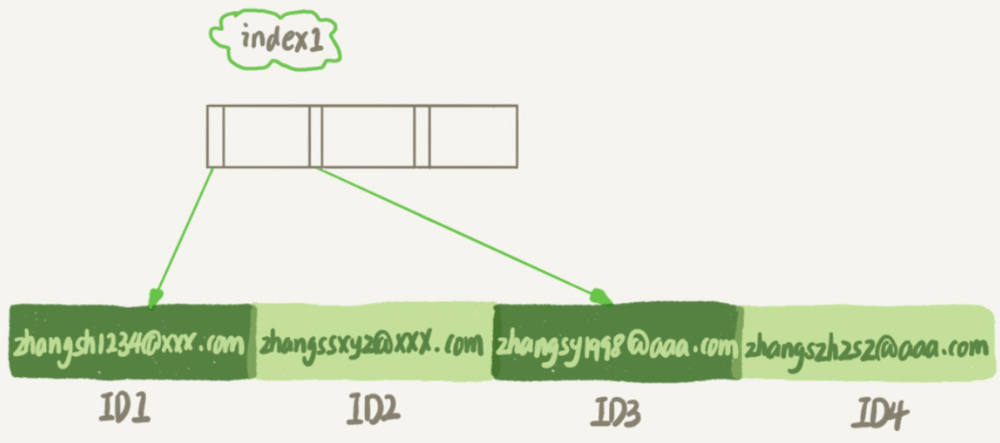

# 字符串索引

假设在维护一个支持邮箱登录的系统，用户表是这么定义的：

```text
mysql> create table SUser(
ID bigint unsigned primary key,
email varchar(64), 
... 
) engine=innodb;
```

由于要使用邮箱登录，所以业务代码中一定会出现类似于这样的语句：

```text
mysql> select f1, f2 from SUser where email='xxx';
```

如果email这个字段上没有索引，那么这个语句就只能做全表扫描。

## 创建索引

MySQL支持字符串的**前缀索引**，即定义字符串的一部分作为索引。默认情况下，如果创建字符串索引的语句不指定前缀长度，那么索引就会包含整个字符串。

```text
mysql> alter table SUser add index index1(email);
或
mysql> alter table SUser add index index2(email(6));
```

第一个语句创建的index1索引里面，包含了每个记录的整个字符串；而第二个语句创建的index2索引里面，对于每个记录都是只取前6个字节。它们的数据结构和存储方式如下：




由于`email(6)`这个索引结构中每个邮箱字段都只取前6个字节（即：zhangs），所以占用的空间会更小，这就是使用前缀索引的优势。但它的缺点是，可能会增加额外的记录扫描次数。

## 索引的执行

```text
mysql> select id,name,email from SUser where email='zhangssxyz@xxx.com';
```

**如果使用的是index1**（即email整个字符串的索引结构），执行顺序是这样的：

1. 从index1索引树找到满足索引值是’zhangssxyz@xxx.com’的这条记录，取得ID2的值；
2. 到主键上查到主键值是ID2的行，判断email的值是正确的，将这行记录加入结果集；
3. 取index1索引树上刚刚查到的位置的下一条记录，发现已经不满足email='zhangssxyz@xxx.com’的条件了，循环结束。

这个过程中，只需要回主键索引取一次数据，所以系统认为只扫描了一行。

**如果使用的是index2**（即email\(6\)索引结构），执行顺序是这样的：

1. 从index2索引树找到满足索引值是’zhangs’的记录，找到的第一个是ID1；
2. 到主键上查到主键值是ID1的行，判断出email的值不是’zhangssxyz@xxx.com’，这行记录丢弃；
3. 取index2上刚刚查到的位置的下一条记录，发现仍然是’zhangs’，取出ID2，再到ID索引上取整行然后判断，这次值对了，将这行记录加入结果集；
4. 重复上一步，直到在index2上取到的值不是’zhangs’时，循环结束。

在这个过程中，要回主键索引取4次数据，也就是扫描了4行。

使用前缀索引后，可能会导致查询语句读数据的次数变多。不过，对于这个查询语句来说，如果定义的index2不是`email(6)`而是`email(7)`，也就是说取email字段的前7个字节来构建索引的话，因为满足前缀’zhangss’的记录只有一个，也能够直接查到ID2，只扫描一行就结束了。

**使用前缀索引，定义好长度，就可以做到既节省空间，又不用额外增加太多的查询成本。**

## 确定前缀索引的长度

在建立索引时关注的是**区分度**，区分度越高越好。因为区分度越高，意味着重复的键值越少。因此，我们可以通过统计索引上有多少个不同的值来判断要使用多长的前缀。

首先计算有多少不同的值：

```text
mysql> select count(distinct email) as L from SUser;
```

然后，依次选取不同长度的前缀来看这个值，比如看4~7个字节的前缀索引：

```text
mysql> select 
  count(distinct left(email,4)）as L4,
  count(distinct left(email,5)）as L5,
  count(distinct left(email,6)）as L6,
  count(distinct left(email,7)）as L7,
from SUser;
```

使用前缀索引很可能会损失区分度，所以需要预先设定一个可以接受的损失比例，比如5%。然后，在返回的L4~L7中，找出不小于$ L \* 95\%$的值，假设这里L6、L7都满足，就可以选择前缀长度为6。

## 前缀索引对覆盖索引的影响

**前缀索引除了会使扫描行数变多，还会使覆盖索引失效。**在选择是否使用前缀索引时需要考虑这个因素。

```text
mysql> select id,email from SUser where email='zhangssxyz@xxx.com';
```

相比之前的查询语句：

```text
mysql> select id,name,email from SUser where email='zhangssxyz@xxx.com';
```

上一个查询语句只要求返回id和email字段，如果使用index1（即email整个字符串的索引结构）的话，可以利用覆盖索引，从index1查到结果后直接就返回了，不需要回到ID索引再去查一次。

而如果使用index2（即`email(6)`索引结构）的话，就不得不回到ID索引再去判断email字段的值。

即使将index2的定义修改为`email(18)`的前缀索引，这时候虽然index2已经包含了所有的信息，但InnoDB还是要回到id索引再查一下，因为**系统并不确定前缀索引的定义是否截断了完整信息**。

## 使用前缀索引时的优化

对于类似于邮箱这样的字段来说，使用前缀索引的效果可能还不错。但是，遇到前缀的区分度不够好的情况时，我们要怎么办呢？

比如身份证号，一共18位，其中前6位是地址码，所以同一个县的人的身份证号前6位一般会是相同的。

如果对身份证号做长度为6的前缀索引的话，这个索引的区分度就非常低了。

如果创建长度为12以上的前缀索引，也许才能够满足区分度要求，但是空间开销又很大。同时会影响搜索效率，因为索引选取的越长，占用的磁盘空间就越大，相同的数据页能放下的索引值就越少，搜索的效率也就会越低。

如果业务需求里面**只有按照身份证进行等值查询**的需求，没有范围查询的需求，有如下优化方式：

* **使用倒序存储。**

  ```text
  mysql> select field_list from t where id_card = reverse('input_id_card_string');
  ```

  由于身份证号的最后6位没有地址码这样的重复逻辑，所以最后这6位很可能就提供了足够的区分度。当然了，实践中要先使用`count(distinct)`方法去做个验证。

* **使用hash字段**。

  ```text
  mysql> alter table t add id_card_crc int unsigned, add index(id_card_crc);
  ```

  在表上再创建一个整数字段，来保存身份证的校验码，同时在这个字段上创建索引。

  每次插入新记录的时候，都同时用`crc32()`这个函数得到校验码填到这个新字段。

  由于校验码可能存在冲突，也就是说两个不同的身份证号通过`crc32()`函数得到的结果可能是相同的，所以查询语句`where`部分要判断`id_card`的值是否精确相同。

  ```text
  mysql> select field_list from t where id_card_crc=crc32('input_id_card_string') and id_card='input_id_card_string';
  ```

  这样，索引的长度变成了4个字节，比原来小了很多。

### 倒序存储和hash字段的异同点

* **相同点**：都不支持范围查询。
* **区别**：
  * 从**占用的额外空间**来看，倒序存储方式在主键索引上，不会消耗额外的存储空间，而hash字段方法需要增加一个字段。当然，倒序存储方式使用4个字节的前缀长度应该是不够的，如果再长一点，这个消耗跟额外这个hash字段也差不多抵消了。
  * 在**CPU消耗**方面，倒序方式每次写和读的时候，都需要额外调用一次`reverse`函数，而hash字段的方式需要额外调用一次`crc32()`函数。如果只从这两个函数的计算复杂度来看的话，`reverse`函数额外消耗的CPU资源会更小些。
  * 从**查询效率**上看，使用hash字段方式的查询性能相对更稳定一些。因为`crc32`算出来的值虽然有冲突的概率，但是概率非常小，可以认为每次查询的平均扫描行数接近1。而倒序存储方式毕竟用的还是前缀索引的方式，也就是说还是会增加扫描行数。

## 思考题

如果你在维护一个学校的学生信息数据库，学生登录名的统一格式是”学号@gmail.com", 而学号的规则是：十五位的数字，其中前三位是所在城市编号、第四到第六位是学校编号、第七位到第十位是入学年份、最后五位是顺序编号。

系统登录的时候都需要学生输入登录名和密码，验证正确后才能继续使用系统。就只考虑登录验证这个行为的话，你会怎么设计这个登录名的索引呢？

因为对于同一个学校，学号的前六位是固定不变的，因此只需要存储第7位到最后一位，一共9位数，可以用整型数存储，只需要4个字节的空间。

当然，由于学校的学生数不多，数据行数最多也就几十万，为了业务简单，直接存原来的字符串即可，而不需要优化，毕竟优化也是需要成本的。

### 字符串截断

假设下表有100万行数据，其中有10万行数据的`b`的值是’1234567890’。

```text
mysql> CREATE TABLE `table_a` (
  `id` int(11) NOT NULL,
  `b` varchar(10) DEFAULT NULL,
  PRIMARY KEY (`id`),
  KEY `b` (`b`)
) ENGINE=InnoDB;
```

现在执行下面的查询语句：

```text
mysql> select * from table_a where b='1234567890abcd';
```

最理想的情况是，MySQL看到字段b定义的是`varchar(10)`，而输入参数长度大于10，直接返回空结果。

或者把`’1234567890abcd’`拿到索引里面去做匹配，也能够快速判断出索引树b上并没有这个值，也很快就能返回空结果。

但实际上，MySQL也不是这么做的。这条SQL语句的执行很慢，流程是这样的：

1. 在传给**引擎**执行的时候，做了字符截断。因为引擎里面这个行只定义了长度是10，所以只截了前10个字节，就是`’1234567890’`进去做匹配；
2. 这样满足条件的数据有10万行；
3. 因为是`select *`， 所以要做10万次回表；
4. 但是每次回表以后查出整行，**到server层判断**，b的值都不是`’1234567890abcd’`;
5. 返回结果是空。

**虽然执行过程中可能经过函数操作，但是最终在拿到结果后，server层还是要做一轮判断的。**

