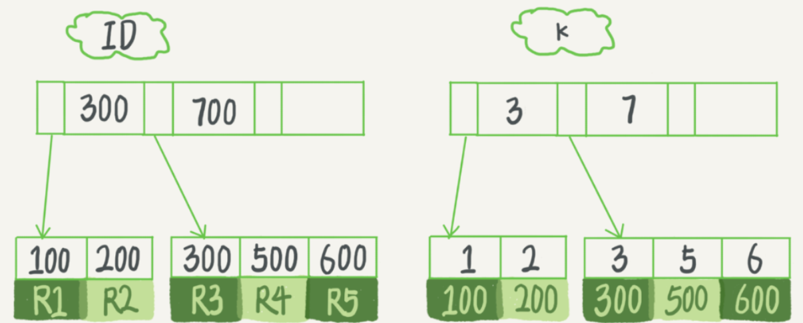
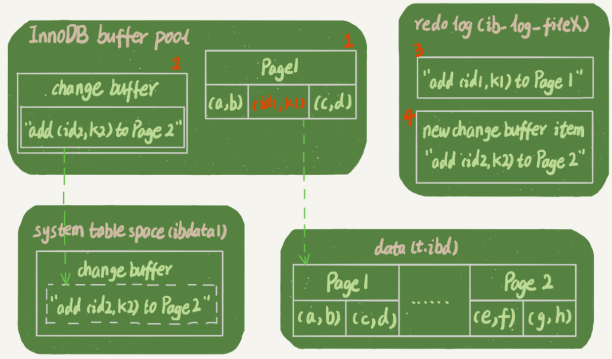
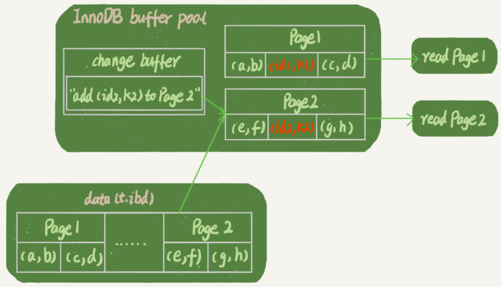

# 普通索引VS唯一索引

在建索引的时候，使用普通索引和唯一索引\(`unique`\)，对于性能会有什么影响？以下图的数据\(假设字段 k 上的值都不重复\)为例，从查询和更新语句的性能来看。



## 查询

假设，执行查询的语句是`select id from T where k=5`。这个查询语句在索引树上查找的过程，先是通过B+树从树根开始，按层搜索到叶子节点，即右下角的数据页，然后在数据页内部通过二分法来定位记录。

* 对于普通索引来说，查找到满足条件的第一个记录`(5,500)`后，需要查找下一个记录，直到碰到第一个不满足`k=5`条件的记录。
* 对于唯一索引来说，由于索引定义了唯一性，查找到第一个满足条件的记录后，就会停止继续检索。

这个不同带来的性能差异其实不大，因为InnoDB的数据是按数据页为单位来读写的。当需要读一条记录的时候，并不是只将这个记录本身从磁盘读出来，而是以页为单位，将其整体读入内存。在InnoDB中，每个数据页的大小默认是16KB。

因为引擎是按页读写的，当找到`k=5`的记录的时候，它所在的数据页就都在内存里了。对于普通索引来说，要多做的那一次“查找和判断下一条记录”的操作，就只需要一次指针寻找和一次计算。

不过，如果`k=5`这个记录刚好是这个数据页的最后一个记录，那么要取下一个记录，必须读取下一个数据页，这个操作会稍微复杂一些。但是对于整型字段，一个数据页可以放近千个key，因此出现这种情况的概率会很低。所以，在计算平均性能差异时，可以认为这个操作成本对于现在的CPU来说可以忽略不计。

## 更新

### change buffer

change buffer只能用于普通索引，它的作用是记录数据页的更改操作。虽然名字叫作change buffer，实际上它是可以持久化的数据。也就是说，change buffer在内存中有拷贝，也会被写入到磁盘上。

当需要更新一个数据页时：

* 如果数据页在内存中就直接更新
* 如果这个数据页还没有在内存中的话，在不影响数据一致性的前提下，InooDB会将这些更新操作缓存在change buffer中，这样就不需要从磁盘中读入这个数据页了。在**下次查询需要访问这个数据页的时候**，将数据页读入内存，然后执行change buffer中与这个页有关的操作。通过这种方式就能保证这个数据逻辑的正确性。

将change buffer中的操作应用到原数据页，得到最新结果的过程称为**merge**。除了访问这个数据页会触发merge外，系统有后台线程会定期merge。在数据库正常关闭（shutdown）的过程中，也会执行merge操作。

> merge的执行流程是这样的：
>
> 1. 从磁盘读入数据页到内存（老版本的数据页）；
> 2. 从change buffer里找出这个数据页的change buffer 记录\(可能有多个），依次应用，得到新版数据页；
> 3. 写redo log。这个redo log包含了数据的变更和change buffer的变更。
>
> 到这里merge过程就结束了。这时候，**数据页和内存中change buffer对应的磁盘位置都还没有修改，属于脏页**，之后各自刷回自己的物理数据，就是另外一个过程了。

显然，如果能够将更新操作先记录在change buffer，**减少读磁盘**，语句的执行速度会得到明显的提升。而且，数据读入内存是需要占用buffer pool的，所以这种方式还能够避免占用内存，提高内存利用率。

change buffer用的是buffer pool里的内存，因此不能无限增大。change buffer的大小，可以通过参数`innodb_change_buffer_max_size`来动态设置。这个参数设置为50的时候，表示change buffer的大小最多只能占用buffer pool的50%。

### 插入数据

**对于唯一索引来说，所有的更新操作都要先判断这个操作是否违反唯一性约束。**比如，要插入`(4,400)`这个记录，就要先判断现在表中是否已经存在`k=4`的记录，而这必须要将数据页读入内存才能判断。如果都已经读入到内存了，那直接更新内存会更快，就没必要使用change buffer了。

这也就是为什么唯一索引的更新不能使用change buffer，只有普通索引可以使用。

如果要在这张表中插入一个新记录`(4,400)`的话，InnoDB的处理流程是这样的：

* **这个记录要更新的目标页在内存中**

  * 对于唯一索引来说，找到3和5之间的位置，判断到没有冲突，插入这个值，语句执行结束；
  * 对于普通索引来说，找到3和5之间的位置，插入这个值，语句执行结束。

  由于都是对内存的操作，普通索引和唯一索引对更新语句性能影响的差别，只是一个判断，只会耗费微小的CPU时间。

* **这个记录要更新的目标页不在内存中**

  * 对于唯一索引来说，需要将数据页读入内存，判断到没有冲突，插入这个值，语句执行结束；
  * 对于普通索引来说，则是将更新记录在change buffer，语句执行就结束了。

  将数据从磁盘读入内存涉及随机IO的访问，是数据库里面成本最高的操作之一。change buffer因为减少了随机磁盘访问，所以对更新性能的提升是会很明显的。

> 某个数据库内存命中率突然从99%降低到了75%，整个系统处于阻塞状态，更新语句全部堵住。
>
> 其原因就是该业务有大量插入数据的操作，而其中的某个普通索引在前一天被改成了唯一索引，导致每次插入时都要读数据页，判断是否有冲突。

### change buffer的使用场景

change buffer在什么条件下使用，能得到更大的收益？

因为merge的时候是真正进行数据更新的时刻，而change buffer的主要目的就是将记录的变更动作缓存下来，所以**在一个数据页做merge之前，change buffer记录的变更越多（也就是这个页面上要更新的次数越多），收益就越大。**

对于**写多读少的业务**来说，页面在写完以后马上被访问到的概率比较小，此时change buffer的使用效果最好。这种业务模型常见的就是账单类、日志类的系统。

反过来，假设一个业务的更新模式是写入之后马上会做查询，那么即使满足了条件，将更新先记录在change buffer，但之后由于马上要访问这个数据页，会立即触发merge过程。这样随机访问IO的次数不会减少，反而增加了change buffer的维护代价。所以，对于这种业务模式来说，change buffer反而起到了副作用。

## 索引选择和实践

这两类索引在查询能力上是没差别的，主要考虑的是对更新性能的影响，因此建议尽量选择普通索引。

如果所有的更新后面，都马上伴随着对这个记录的查询，那么就应该关闭change buffer。而在其他情况下，change buffer都能提升更新性能。

特别是在使用机械硬盘时，change buffer这个机制的收效是非常显著的。所以，当你有一个类似“历史数据”的库，并且出于成本考虑用的是机械硬盘时，应该特别关注这些表里的索引，尽量使用普通索引，然后把change buffer 尽量开大，以确保这个“历史数据”表的数据写入速度。

由于唯一索引用不上change buffer的优化机制，因此如果业务可以接受，从性能角度出发优先考虑非唯一索引。

* **业务正确性优先**。前面讨论的前提是“业务代码已经保证不会写入重复数据”的情况下，讨论性能问题。如果业务不能保证，或者业务就是要求数据库来做约束，那么就必须创建唯一索引。

  这种情况下，可以为大量插入数据慢、内存命中率低的情况，提供一个排查思路。

* 在一些“归档库”的场景，可以考虑使用非唯一索引。比如，线上数据只需要保留半年，然后历史数据保存在归档库。这时候，归档数据已经是确保没有唯一键冲突了。要提高归档效率，可以考虑把表里面的唯一索引改成普通索引。

## change buffer 和 redo log

> WAL 提升性能的核心机制，也是尽量减少随机读写。

假设在表上执行插入语句：

```text
mysql> insert into t(id,k) values(id1,k1),(id2,k2);
```

假设当前k索引树的状态：查找到插入位置后，k1所在的数据页在内存\(InnoDB buffer pool\)中，k2所在的数据页不在内存中。



这条语句涉及了四个部分：内存、redo log（ib\_log\_fileX）、 数据表空间（t.ibd）、系统表空间（ibdata1）。

这条更新语句做了如下的操作（按照图中的数字顺序）：

1. Page 1在内存中，直接更新内存；
2. Page 2没有在内存中，就在内存的change buffer区域，记录下“我要往Page 2插入一行”这个信息
3. 将上述两个动作记入redo log中（图中3和4）。

做完上面这些，事务就可以完成了。这条更新语句的成本很低，就是写了两处内存，然后写了一处磁盘（两次操作合在一起写了一次磁盘），而且还是顺序写的。而且图中的两个虚线箭头，是后台操作，不影响更新的响应时间。

之后执行查询数据的语句：

```text
mysql> select * from t where k in (k1, k2);
```

如果读语句发生在更新语句后不久，内存中的数据都还在，那么此时的这两个读操作就与系统表空间（ibdata1）和 redo log（ib\_log\_fileX）无关了。



1. 读Page 1的时候，直接从内存返回。这也是WAL之后读数据，不一定要读盘（从redo log里面把数据更新以后返回）的原因。虽然磁盘上还是之前的数据，但是这里直接从内存返回结果，结果是正确的。
2. 要读Page 2的时候，需要把Page 2从磁盘读入内存中，然后应用change buffer里面的操作日志，生成一个正确的版本并返回结果。直到需要读Page 2的时候，这个数据页才会被读入内存。

如果要简单地对比这两个机制在提升更新性能上的收益的话，**redo log 主要节省的是随机写磁盘的IO消耗（转成顺序写），而change buffer主要节省的则是随机读磁盘的IO消耗。**

## 思考题

change buffer一开始是写内存的，如果这个时候机器掉电重启，会不会导致change buffer丢失呢？change buffer丢失可不是小事儿，再从磁盘读入数据可就没有了merge过程，就等于是数据丢失了。会不会出现这种情况呢？

答案是不会丢失的，虽然是只更新内存，但是在事务提交的时候，我们把change buffer的操作也记录到redo log里了，所以崩溃恢复的时候，change buffer也能找回来。

