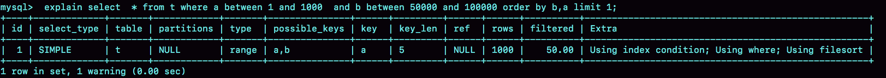

# 选错索引的原因

创建具有10万条记录的实验表，这个表在字段`a、b`上都有索引，可重复读隔离级别：

```text
mysql> drop table if exists t;

mysql> CREATE TABLE `t` (
  `id` int(11) NOT NULL,
  `a` int(11) DEFAULT NULL,
  `b` int(11) DEFAULT NULL,
  PRIMARY KEY (`id`),
  KEY `a` (`a`),
  KEY `b` (`b`)
) ENGINE=InnoDB;

mysql> delimiter ;;
mysql> create procedure idata()
begin
  declare i int;
  set i=1;
  while(i<=100000)do
    insert into t values(i, i, i);
    set i=i+1;
  end while;
end;;
mysql> delimiter ;
mysql> call idata();
```

接下来执行一条查询语句：

```text
mysql> select * from t where a between 10000 and 20000;
```

通过`explain`命令查看这条语句的执行情况：

```text
mysql> explain select * from t where a between 10000 and 20000;
```


key这个字段值是’a’，表示优化器选择了索引a。

但是，再日常不断地删除历史数据和新增数据的场景下，就有可能出现选错索引的问题了。例如在一个事务执行的过程中，启动另一个事务，删除表`t`的数据并重新创建10w行数据，再执行相同的查询语句。


```text
mysql> set long_query_time=0;
mysql> select * from t where a between 10000 and 20000; /*Q1*/
mysql> select * from t force index(a) where a between 10000 and 20000;/*Q2*/
```

* 第一句，将慢查询日志的阈值设置为0，表示这个线程接下来的语句都会被记录入慢查询日志中
* 第三句，加了`force index(a)`来和session B原来的查询语句执行情况对比

这三条语句执行后，慢查询日志如下：


Q1扫描了10万行，显然是走了全表扫描，执行时间是40毫秒。Q2扫描了10001行，执行了21毫秒。也就是说，在没有使用`force index`的时候，MySQL用错了索引，导致了更长的执行时间。

## 优化器逻辑

选择索引是优化器的工作，优化器选择索引的目的，是找到一个最优的执行方案，并用最小的代价去执行语句。在数据库里面，扫描行数是影响执行代价的因素之一。扫描的行数越少，意味着访问磁盘数据的次数越少，消耗的CPU资源越少。

> 扫描行数并不是唯一的判断标准，优化器还会结合是否使用临时表、是否排序等因素进行综合判断。
>
> 不过在这个例子中，只需要考虑扫描行数。

### 怎么判断扫描行数

MySQL在真正开始执行语句之前，并不能精确地知道满足这个条件的记录有多少条，而只能**根据统计信息来估算记录数**。

这个统计信息就是**索引的“区分度”**。一个索引上不同的值越多，这个索引的区分度就越好。一个索引上不同的值的个数，我们称之为“**基数**”（cardinality）。也就是说，这个基数越大，索引的区分度越好。

我们可以使用`show index`方法，看到一个索引的基数。虽然这个表的每一行的三个字段值都是一样的，但是在统计信息中，这三个索引的基数值并不同，而且其实都不准确。


**MySQL是通过采样统计的方法得到索引的基数。**如果把整张表取出来一行行统计，虽然可以得到精确的结果，但是代价太高了，所以只能选择“采样统计”。

采样统计的时候，InnoDB默认会选择N个数据页，统计这些页面上的不同值，得到一个平均值，然后乘以这个索引的页面数，就得到了这个索引的基数。而数据表是会持续更新的，索引统计信息也不会固定不变。所以，当变更的数据行数超过$1/M$的时候，会自动触发重新做一次索引统计。

在MySQL中，有两种存储索引统计的方式，可以通过设置参数`innodb_stats_persistent`的值来选择：

* 设置为on的时候，表示统计信息会持久化存储。这时，默认的N是20，M是10。
* 设置为off的时候，表示统计信息只存储在内存中。这时，默认的N是8，M是16。

由于是采样统计，所以不管N是20还是8，这个基数都是很容易不准的。

这次的索引统计值（cardinality列）虽然不够精确，但大体上还是差不多的，选错索引一定还有别的原因。


Q1的结果还是符合预期的，rows（预计扫描行数）的值是104620；但是Q2的rows值是37116，偏差就大了。而之前的`explain`命令看到的rows是只有10001行，是这个偏差误导了优化器的判断。

之所以优化器放着扫描37000行的执行计划不用，却选择了扫描行数是100000的执行计划，是因为10万行的执行计划，使用的是主键索引，而37000行的执行计划，用的是普通索引，每次从索引a上拿到主键的值后，还得回到主键索引上查出整行数据，优化器考虑了这个代价。

使用普通索引需要把回表的代价算进去，删除数据前开始执行的`explain`，也考虑了这个策略的代价 ，但它的选择是对的。也就是说，这个策略并没有问题。

所以MySQL选错索引，还得归咎到没能准确地判断出扫描行数。既然是统计信息不对，那就通过`analyze table t`命令进行修正，它会重新统计索引信息。


**在实践中，如果发现explain的结果预估的rows值跟实际情况差距比较大，可以采用这个方法来处理。**

#### 这个例子出现的原因

通过session A的配合，让session B删除数据后又重新插入了一遍数据，然后就发现`explain`结果中，rows字段从10001变成37000多。

而如果没有session A的配合，只是单独执行`delete from t 、call idata()、explain`这三句话，会看到rows字段其实还是10000左右。

`delete`语句删掉了所有的数据，然后再通过`call idata()`插入了10万行数据，看上去是覆盖了原来的10万行。

但是，session A开启了事务并没有提交，所以之前插入的10万行数据是不能删除的。这样，之前的数据每一行数据都有两个版本，旧版本是delete之前的数据，新版本是标记为deleted的数据。

这样，索引a上的数据其实就有两份。既然这样，如果主键的扫描行数也翻倍，那么主键的扫描行数与索引a的扫描行数还是跟删除数据前近似，那也应该选择索引a。但是实际上，主键的扫描行数仍然是10万左右，**主键是直接按照表的行数来估计的**。而表的行数，优化器直接用的是`show table status`的值。


### 索引选择异常和处理

```text
mysql> select * from t where (a between 1 and 1000)  and (b between 50000 and 100000) order by b limit 1;
```

这个查询没有符合条件的记录，因此会返回空集合。那么在执行这条语句时，会选择哪个索引呢？


* 如果使用索引a进行查询，那么就是扫描索引a的前1000个值，然后取到对应的id，再到主键索引上去查出每一行，然后根据字段b来过滤。显然这样需要扫描1000行。
* 如果使用索引b进行查询，那么就是扫描索引b的最后50001个值，与上面的执行过程相同，也是需要回到主键索引上取值再判断，所以需要扫描50001行。

使用索引a的话，执行速度明显会快很多，但是`explain`的结果并不是如此。

```text
mysql> explain select * from t where (a between 1 and 1000) and (b between 50000 and 100000) order by b limit 1;
```


1. 扫描行数的估计值依然不准确；
2. 这个例子里MySQL又选错了索引。

既然优化器放弃了使用索引a，说明a还不够合适。这是因为查询语句里面有`order by b limit 1`，优化器认为使用索引b可以避免排序（b本身是索引，已经是有序的了，如果选择索引b的话，不需要再做排序，只需要遍历），所以即使扫描行数多，也判定为代价更小。

可以改为`order by b,a limit 1`，语义的逻辑是相同的，因为要求按照b,a排序，就意味着使用这两个索引都需要排序。因此，扫描行数成了影响决策的主要条件，于是此时优化器选了只需要扫描1000行的索引a。。



这种修改并不是通用的优化手段，只是刚好在这个语句里面有`limit 1`，因此如果有满足条件的记录， `order by b limit 1`和`order by b,a limit 1`都会返回b是最小的那一行，逻辑上一致，才可以这么做。

除了这种修改，还可以用下面的方式，用`limit 100`让优化器意识到，使用b索引代价是很高的。

```text
mysql> select * from  (select * from t where (a between 1 and 1000)  and (b between 50000 and 100000) order by b limit 100)alias limit 1;
```

#### 总结

三种方法：

* **采用force index强行选择一个索引**。MySQL会根据词法解析的结果分析出可能可以使用的索引作为候选项，然后在候选列表中依次判断每个索引需要扫描多少行。如果`force index`指定的索引在候选索引列表中，就直接选择这个索引，不再评估其他索引的执行代价。

  不过这种方法不具有通用性，如果索引名字改了，语句也得跟着改，而且数据库迁移的话，有可能出现不兼容的情况。

  使用`force index`最主要的问题还是变更的及时性。因为选错索引的情况还是比较少出现的，所以开发的时候通常不会先写上`force index`。而是等到线上出现问题的时候，才会再去修改SQL语句、加上`force index`。但是修改之后还要测试和发布，对于生产系统来说，这个过程不够敏捷。

* **引导MySQL使用我们期望的索引**，即上面修改SQL语句的方式，不过也不具备通用性。
* **在有些场景下，我们可以新建一个更合适的索引，来提供给优化器做选择，或删掉误用的索引。**

  这种情况其实比较少，尤其是经过DBA索引优化过的库，再碰到这个bug，找到一个更合适的索引一般比较难。

  关于删掉索引，如果优化器错误选择的索引其实根本没有必要存在，删掉这个索引，优化器也就可以选择到正确的索引。

