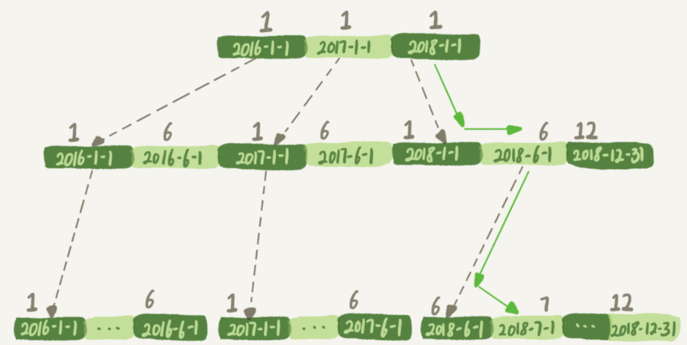
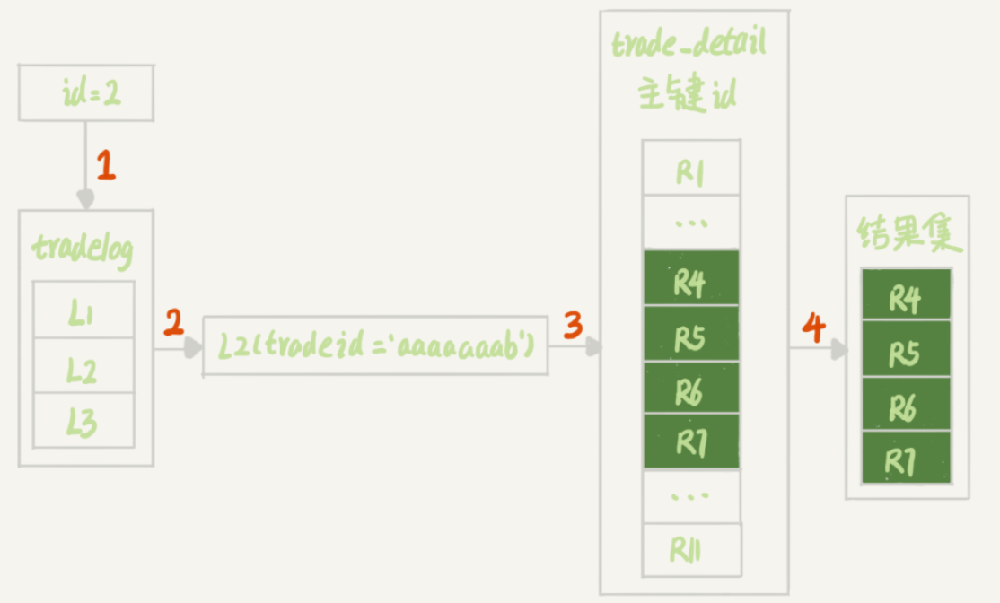

# 索引字段函数操作

在MySQL中，有很多看上去逻辑相同，但性能却差异巨大的SQL语句。对这些语句使用不当的话，就会不经意间导致整个数据库的压力变大。

假设有一个交易系统，交易记录表包含交易流水号\(`tradeid`\)、交易员id\(`operator`\)、交易时间\(`t_modified`\)等字段。

```text
mysql> CREATE TABLE `tradelog` (
  `id` int(11) NOT NULL,
  `tradeid` varchar(32) DEFAULT NULL,
  `operator` int(11) DEFAULT NULL,
  `t_modified` datetime DEFAULT NULL,
  PRIMARY KEY (`id`),
  KEY `tradeid` (`tradeid`),
  KEY `t_modified` (`t_modified`)
) ENGINE=InnoDB DEFAULT CHARSET=utf8mb4;
```

> 相比以前的建表语句，这里指定了字符集为utf8mb4。

## 显式函数调用

假设，现在表中包含了从2016年初到2018年底的所有数据，运营部门有一个需求是，要统计发生在所有年份中7月份的交易记录总数：

```text
mysql> select count(*) from tradelog where month(t_modified)=7;
```

虽然`t_modified`字段上有索引，但是这个语句走的是全表扫描。因为MySQL有一个规定：**如果对字段做了函数计算，就用不上索引了。**



但如果条件是`where t_modified='2018-7-1’`的话，就可以用上索引了。引擎会按照上面绿色箭头的路线，快速定位到 `t_modified='2018-7-1’`需要的结果。

实际上，B+树提供的这个快速定位能力，来源于**同一层兄弟节点的有序性**。

但是，如果计算`month()`函数的话，传入7的时候，在树的第一层就不知道该怎么办了。

**对索引字段做函数操作，可能会破坏索引值的有序性，因此优化器就决定放弃走树搜索功能。**需要注意的是，虽然放弃走树搜索功能，走全表扫描，但优化器并不是要放弃使用这个索引。


放弃了树搜索功能，优化器可以选择遍历主键索引，也可以选择遍历索引`t_modified`，优化器对比索引大小后发现，**索引`t_modified`更小，遍历这个索引比遍历主键索引来得更快**。因此最终还是会选择索引`t_modified`。

`key="t_modified"`表示的是，使用了`t_modified`这个索引；在测试表数据中插入了3行数据，`rows=3`，说明这条语句扫描了整个索引的所有值；`Extra`字段的`Using index`，表示的是使用了覆盖索引。

如果想让这条语句用上索引，那就不能使用`month()`函数，可以将SQL语句改为：

```text
mysql> select count(*) from tradelog where
    -> (t_modified >= '2016-7-1' and t_modified<'2016-8-1') or
    -> (t_modified >= '2017-7-1' and t_modified<'2017-8-1') or 
    -> (t_modified >= '2018-7-1' and t_modified<'2018-8-1');
```


即使是对于**不改变有序性**的函数，优化器也不会考虑使用索引。比如，对于`select * from tradelog where id + 1 = 10000`这个SQL语句，这个加1操作并不会改变有序性，但是MySQL优化器还是不能用`id`索引快速定位到9999这一行。所以，在写SQL语句的时候，手动改写成 `where id = 10000 -1`才可以。


## 隐式函数调用

### 隐式类型转换

```text
mysql> select * from tradelog where tradeid=3;
```

注意到`tradeid`类型是`varchar(32)`，而输入的参数却是整型，`explain`的结果却显示，这条语句需要走全表扫描。

说明这条语句存在类型转换，那么是数字类型的输入参数转换为字符串，还是字符串字段转换为数字呢？

> **类型转换规则**
>
> 可以通过下面的语句验证MySQL中数字和字符串转换时的规则：
>
> ```text
> mysql> select "10" > 9;
> ```
>
> 如果结果为1，说明是将`“10”`转换为数字10；如果结果是0，说明是将数字9转换为字符串。
>
> ```text
> mysql> select "10" > 9;
> +----------+
> | "10" > 9 |
> +----------+
> |        1 |
> +----------+
> ```
>
> 因此，**在MySQL中，字符串和数字做比较的话，是将字符串转换成数字。**

虽然发生了类型转换，但为什么这条语句会走全表扫描呢？

因为对于优化器来说，这条语句相当于：

```text
mysql> select * from tradelog where  CAST(tradid AS signed int) = 110717;
```

即对字段应用了类型转换函数，使优化器放弃了走树搜索功能。

作为对比，id的类型是`int`，如果查询语句如下，优化器又会怎么做？

```text
mysql> select * from tradelog where id="3";
```


很明显，对输入参数从字符串类型转换为数字类型后，就不影响主键索引的使用了。


### 隐式字符编码转换

系统里还有另外一个表`trade_detail`，用于记录交易的操作细节。

```text
mysql> CREATE TABLE `trade_detail` (
  `id` int(11) NOT NULL,
  `tradeid` varchar(32) DEFAULT NULL,
  `trade_step` int(11) DEFAULT NULL, /*操作步骤*/
  `step_info` varchar(32) DEFAULT NULL, /*步骤信息*/
  PRIMARY KEY (`id`),
  KEY `tradeid` (`tradeid`)
) ENGINE=InnoDB DEFAULT CHARSET=utf8;

insert into tradelog values(1, 'aaaaaaaa', 1000, now());
insert into tradelog values(2, 'aaaaaaab', 1000, now());
insert into tradelog values(3, 'aaaaaaac', 1000, now());

insert into trade_detail values(1, 'aaaaaaaa', 1, 'add');
insert into trade_detail values(2, 'aaaaaaaa', 2, 'update');
insert into trade_detail values(3, 'aaaaaaaa', 3, 'commit');
insert into trade_detail values(4, 'aaaaaaab', 1, 'add');
insert into trade_detail values(5, 'aaaaaaab', 2, 'update');
insert into trade_detail values(6, 'aaaaaaab', 3, 'update again');
insert into trade_detail values(7, 'aaaaaaab', 4, 'commit');
insert into trade_detail values(8, 'aaaaaaac', 1, 'add');
insert into trade_detail values(9, 'aaaaaaac', 2, 'update');
insert into trade_detail values(10, 'aaaaaaac', 3, 'update again');
insert into trade_detail values(11, 'aaaaaaac', 4, 'commit');
```

> 这里的编码集变成了utf8

这时候，查找id为2的交易的交易细节：

```text
mysql> select d.* from tradelog l, trade_detail d where d.tradeid=l.tradeid and l.id=2;
```

首先查`tradelog`表得到id为2的交易的交易流水号，然后在`trade_detail`表中找该流水号的记录。


1. 第一行显示优化器会先在`tradelog`表上查到`id=2`的行，这个步骤用上了主键索引，`rows=1`表示只扫描一行；
2. 第二行`key=NULL`，表示没有用上`trade_detail`表上的`tradeid`索引，进行了全表扫描。

在这个执行计划里，是从`tradelog`表中取`tradeid`字段，再去`trade_detail`表里查询匹配字段。把`tradelog`称为**驱动表**，把`trade_detail`称为**被驱动表**，把`tradeid`称为**关联字段**。



但是这里没有表`trade_detail`里`tradeid`字段的索引，这是因为两个表的字符集不同，一个是utf8，一个是utf8mb4，所以做表连接查询的时候用不上关联字段的索引，不过这只是表面原因。

单独把在`trade_detail`表里对关联字段的搜索拿出来，SQL语句如下：

```text
mysql> select * from trade_detail where tradeid=$L2.tradeid.value;
```

其中，`$L2.tradeid.value`的字符集是utf8mb4。而`trade_detail`表的字符串是utf8。

字符集utf8mb4是utf8的超集，所以当这两个类型的字符串在做比较的时候，MySQL内部的操作是，先把utf8字符串转成utf8mb4字符集，再做比较。因此上面的语句其实是：

```text
mysql> select * from trade_detail where CONVERT(traideid USING utf8mb4)=$L2.tradeid.value;
```

字符集不同只是条件之一，**连接过程中要求在被驱动表的索引字段上加函数操作**，是直接导致对被驱动表做全表扫描的原因。

作为对比验证，查找`trade_detail`表里`id=3`的操作，对应的操作者是谁，SQL语句为：

```text
mysql> select l.operator from tradelog l, trade_detail d where d.tradeid=l.tradeid and d.id=3;
```


这个语句里`trade_detail`表成了驱动表，而`explain`结果的第二行显示，这次的查询操作用上了被驱动表`tradelog`里的索引\(`tradeid`\)，扫描行数是1。

因为在`tradelog`表上执行的SQL语句实际是：

```text
mysql> select operator from tradelog where traideid=CONVERT($R4.tradeid.value USING utf8mb4);
```

这里的`CONVERT`函数是加在输入参数上的，这样就可以用上被驱动表的`traideid`索引。

因此，如果要优化语句

```text
mysql> select d.* from tradelog l, trade_detail d where d.tradeid=l.tradeid and l.id=2;
```

的执行过程，有两种做法：

* 比较常见的优化方法是，把`trade_detail`表上的`tradeid`字段的字符集也改成`utf8mb4`，这样就没有字符集转换的问题了。

```text
mysql> alter table trade_detail modify tradeid varchar(32) CHARACTER SET utf8mb4 default null;
```

* 但如果数据量比较大， 或者业务上暂时不能做这个DDL的话，那就只能修改SQL语句了。

```text
mysql> select d.* from tradelog l, trade_detail d where d.tradeid=CONVERT(l.tradeid USING utf8) and l.id=2;
```


