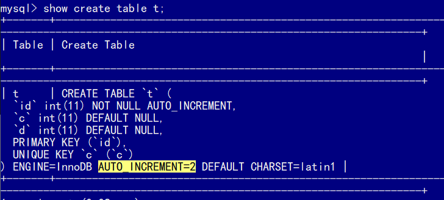
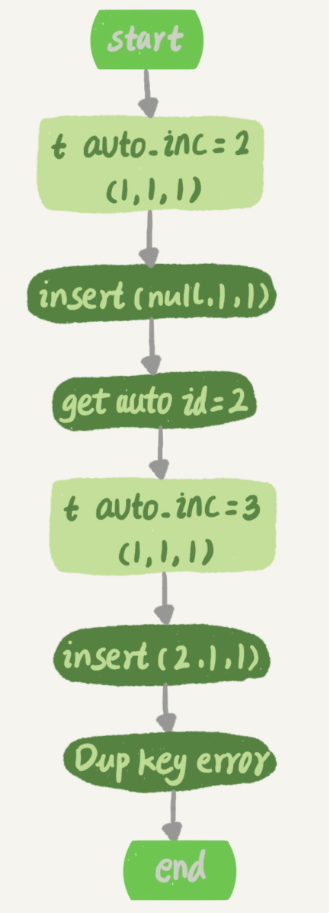
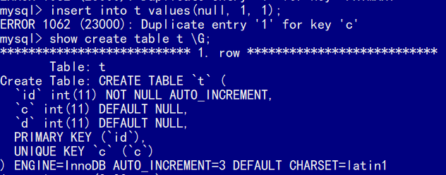
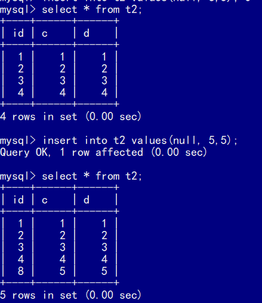
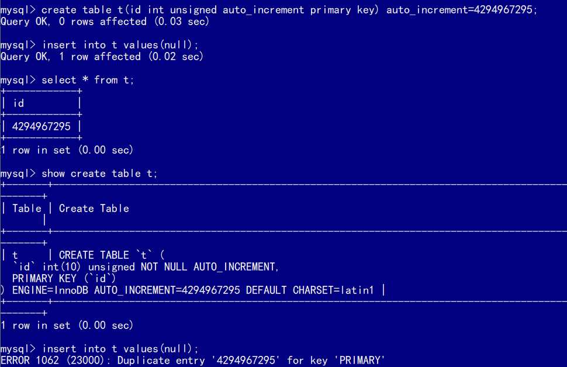
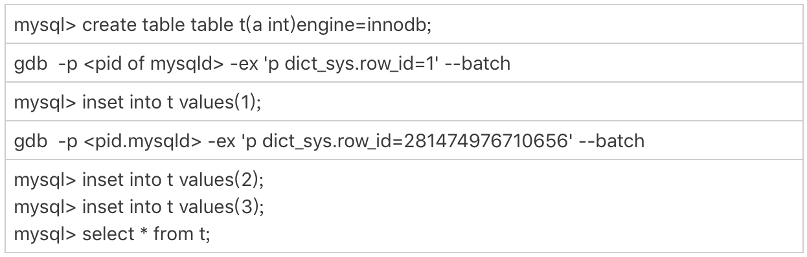
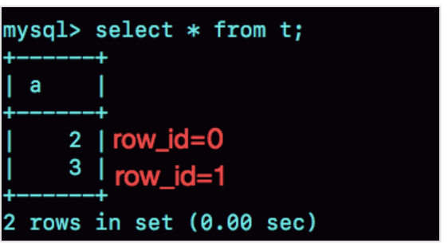
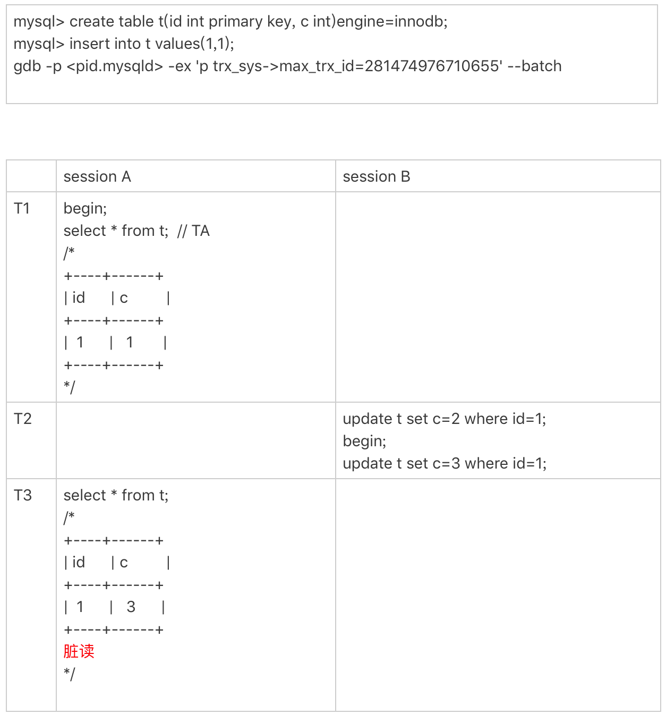

# 自增主键

自增主键可以让主键索引尽量地保持递增顺序插入，避免了页分裂，因此索引更紧凑。自增主键可以保证顺序，但**不能保证连续性**。

```
CREATE TABLE `t` (
  `id` int(11) NOT NULL AUTO_INCREMENT,
  `c` int(11) DEFAULT NULL,
  `d` int(11) DEFAULT NULL,
  PRIMARY KEY (`id`),
  UNIQUE KEY `c` (`c`)
) ENGINE=InnoDB;
```


## 自增主键保存在哪

往表`t`插入一行不带主键的数据，表`t`就会自动为其生成主键，然后执行`show create table`命令：



表定义里面出现了一个`AUTO_INCREMENT=2`，表示下一次插入数据时，如果需要自动生成自增值，会生成`id=2`。

这样的输出会让人误以为自增值是保存在表结构定义里，实际上，**表的结构定义存放在后缀名为.frm的文件中，但是并不会保存自增值。**不同的引擎对于自增值的保存策略不同。

- MyISAM引擎的自增值保存在数据文件中。
- InnoDB引擎的自增值，保存在了内存里。直到MySQL 8.0版本后，才有了“自增值持久化”的能力，也就是才实现了“如果发生重启，表的自增值可以恢复为MySQL重启前的值”，具体情况是：
  - 在MySQL 5.7及之前的版本，自增值保存在内存里，并没有持久化。每次重启后，第一次打开表的时候，都会去找自增值的最大值`max(id)`，然后将`max(id)+1`作为这个表当前的自增值。
    举例来说，如果一个表当前数据行里最大的id是10，`AUTO_INCREMENT=11`。这时候如果删除`id=10`的行，AUTO_INCREMENT还是11。但如果马上重启实例，重启后这个表的AUTO_INCREMENT就会变成10。
    也就是说，MySQL重启可能会修改一个表的AUTO_INCREMENT的值。
  - 在MySQL 8.0版本，将自增值的变更记录在了redo log中，重启的时候依靠redo log恢复重启之前的值。


## 自增值修改机制

在MySQL里面，如果字段id被定义为AUTO_INCREMENT，在插入一行数据的时候，自增值的行为如下：

1. 如果插入数据时id字段指定为0、null 或未指定值，那么就把这个表当前的 AUTO_INCREMENT值填到自增字段；

2. 如果插入数据时id字段指定了具体的值，就直接使用语句里指定的值。

   根据要插入的值和当前自增值的大小关系，自增值的变更结果也会有所不同。假设，某次要插入的值是X，当前的自增值是Y。

   1. 如果X<Y，那么这个表的自增值不变；

   2. 如果X≥Y，就需要把当前自增值修改为新的自增值。

      **新的自增值生成算法是**：从`auto_increment_offset`开始，以`auto_increment_increment`为步长，持续叠加，直到找到第一个大于X的值，作为新的自增值。

`auto_increment_offset `和 `auto_increment_increment`是两个系统参数，分别用来表示**自增的初始值和步长**，默认值都是1。

> 在一些场景下，使用的就不全是默认值。比如，双M的主备结构里要求双写的时候，就可能会设置成`auto_increment_increment=2`，让一个库的自增id都是奇数，另一个库的自增id都是偶数，避免两个库生成的主键发生冲突。

当`auto_increment_offset`和`auto_increment_increment`都是1的时候，新的自增值生成逻辑很简单，就是：

1. 如果准备插入的值>=当前自增值，新的自增值就是“准备插入的值+1”；
2. 否则，自增值不变。


## 自增值的修改时机

当前表`t`里面已经有了`(1,1,1)`这条记录，再执行一条插入数据命令。`c`字段是唯一索引，而插入的数据中`c`还是1。

```
mysql> insert into t values(null, 1, 1); 
```

这个语句的执行流程就是：

1. 执行器调用InnoDB引擎接口写入一行，传入的这一行的值是(0,1,1);
2. InnoDB发现用户没有指定自增id的值，获取表t当前的自增值2；
3. 将传入的行的值改成(2,1,1);
4. 将表的自增值改成3；
5. 继续执行插入数据操作，由于已经存在c=1的记录，所以报Duplicate key error，语句返回。



这个表的自增值改成3，是**在真正执行插入数据的操作之前**。这个语句真正执行的时候，因为碰到唯一键c冲突，所以`id=2`这一行并没有插入成功，但也**没有将自增值再改回去**。

所以，之后再插入新的数据行时，拿到的自增id就是3，即出现了自增主键不连续的情况。




## 自增锁的优化

自增id锁并不是一个事务锁，而是每次申请完就马上释放，以便允许别的事务再申请。

不过，在MySQL 5.0版本的时候，自增锁的范围是**语句级别**：如果一个语句申请了一个表自增锁，这个锁会等语句执行结束以后才释放。显然，这样设计会影响并发度。

MySQL 5.1.22版本引入了一个新策略，新增参数`innodb_autoinc_lock_mode`，默认值是1，有三个取值：

- 0：表示采用之前MySQL 5.0版本的策略，即语句执行结束后才释放锁；

- 1：
  - 普通insert语句，自增锁在申请之后就马上释放；

  - 类似`insert … select`这样的批量插入数据的语句，自增锁还是要等语句结束后才被释放
    **批量插入数据，包含的语句类型是insert … select、replace … select和load data语句。**

    不包括普通的insert语句里包含多个value值的情况，因为这种语句在申请自增id的时候，是可以精确计算出需要多少个id的，然后一次性申请，申请完成后锁就可以释放了。

- 2：所有的申请自增主键的动作都是申请后就释放锁。

默认设置下，`insert … select `要使用语句级的锁，是为了保证数据的一致性。


在这个场景里，如果session B是申请了自增值以后马上就释放自增锁，那么就可能出现这样的情况：

- session B先插入了两个记录，(1,1,1)、(2,2,2)；
- 然后，session A来申请自增id得到`id=3`，插入了（3,5,5)；
- 之后，session B继续执行，插入两条记录(4,3,3)、 (5,4,4)。

如果现在的`binlog_format=statement`，由于两个session是同时执行插入数据命令的，所以binlog里面对表`t2`的更新日志只有两种情况：要么先记session A的，要么先记session B的。

但不论是哪一种，这个binlog拿去从库执行，或者用来恢复临时实例，备库和临时实例里面，session B这个语句执行出来，生成的结果里面，id都是连续的。这时，这个库就发生了数据不一致。

要解决这个问题，有两种思路：

1. 一种思路是，让原库的批量插入数据语句，固定生成连续的id值，即让自增锁直到语句执行结束才释放。
2. 另一种思路是，在binlog里面把插入数据的操作都如实记录进来，到备库执行的时候，不再依赖于自增主键去生成。这种情况，就是innodb_autoinc_lock_mode设置为2，同时binlog_format设置为row。这种方法既能提升并发性，也能保证数据的一致性。


## 自增值不连续的场景

上面的**唯一键冲突**是导致自增主键id不连续的一种原因，同样地，**事务回滚**也会产生类似的现象。

```
insert into t values(null,1,1); // (1, 1, 1)

begin;
insert into t values(null,2,2);
rollback;

insert into t values(null,2,2); //插入的行是(3, 2, 2)
```

为什么在出现唯一键冲突或者回滚的时候，MySQL没有把表`t`的自增值改回去呢？如果把表`t`的当前自增值从3改回2，再插入新数据的时候，不就可以生成`id=2`的一行数据？

**自增值不能回退，是为了提高性能。**

假设有两个并行执行的事务，在申请自增值的时候，为了避免两个事务申请到相同的自增id，肯定要加锁，然后顺序申请。

1. 假设事务A申请到了id=2， 事务B申请到id=3，那么这时候表t的自增值是4，之后继续执行。
2. 事务B正确提交了，但事务A出现了唯一键冲突。
3. 如果允许事务A把自增id回退，也就是把表t的当前自增值改回2，那么就会出现这样的情况：表里面已经有id=3的行，而当前的自增id值是2。
4. 接下来，继续执行的其他事务就会申请到id=2，然后再申请到id=3。这时，就会出现插入语句报错“主键冲突”。

而为了解决这个主键冲突，有两种方法：

1. 每次申请id之前，先判断表里面是否已经存在这个id。如果存在，就跳过这个id。但是，这个方法的成本很高。因为，本来申请id是一个很快的操作，现在还要再去主键索引树上判断id是否存在。
2. 把自增id的锁范围扩大，必须等到一个事务执行完成并提交，下一个事务才能再申请自增id。这个方法的问题，就是锁的粒度太大，系统并发能力大大下降。

因此，InnoDB放弃了这个设计，语句执行失败也不回退自增id。也正是因为这样，所以才只保证了自增id是递增的，但不保证是连续的。


批量插入语句也可能会导致自增值不连续。执行批量插入语句时，由于不知道要插入多少行数据，即不知道要申请多少个自增id，一种直接的想法就是需要一个时申请一个。但如果一个`select … insert`语句要插入10万行数据，按照这个逻辑的话就要申请10万次。这种申请自增id的策略，在大批量插入数据的情况下，不但速度慢，还会影响并发插入的性能。

因此，对于批量插入数据的语句，MySQL有一个**批量申请自增id的策略**：

1. 语句执行过程中，第一次申请自增id，会分配1个；
2. 1个用完以后，这个语句第二次申请自增id，会分配2个；
3. 2个用完以后，还是这个语句，第三次申请自增id，会分配4个；
4. 依此类推，同一个语句去申请自增id，每次申请到的自增id个数都是上一次的两倍。

```
insert into t values(null, 1,1);
insert into t values(null, 2,2);
insert into t values(null, 3,3);
insert into t values(null, 4,4);
create table t2 like t;
insert into t2(c,d) select c,d from t;
insert into t2 values(null, 5,5);
```

`insert…select`，实际上往表`t2`中插入了4行数据。但是，这四行数据是分三次申请的自增id，第一次申请到了id=1，第二次被分配了id=2和id=3， 第三次被分配到id=4到id=7。

由于这条语句实际只用上了4个id，所以id=5到id=7就被浪费掉了。之后，再执行`insert into t2 values(null, 5,5)`，实际上插入的数据就是`(8,5,5)`。



执行`insert into t2(c,d) select c,d from t;`这个语句的时候，如果隔离级别是可重复读（repeatable read），`binlog_format=statement`。这个语句会对**表`t`**的所有记录和间隙加锁，为什么呢？

假如原库不对`t`表所有记录和间隙加锁，如果有其他事物新增数据并先于这个批量操作提交，由于事物的隔离级别是可重复读，`t2`是看不到新增的数据的。但是记录的binlog是statement格式，备库或基于binlog恢复的临时库，`t2`会看到新增的数据，出现数据不一致的情况。


## binlog

在`binlog_format=statement`时，语句A先获取`id=1`，然后语句B获取`id=2`；接着语句B提交，写binlog，然后语句A再写binlog。这时候，如果binlog重放，是不是会发生语句B的`id`为1，而语句A的`id`为2的不一致情况呢？

如果`binlog_format=row`，是肯定不会出现这种情况的，因为`Write row event`里面直接写了每一行的所有字段的值。

不过在`binlog_format=statement`下，也是不会出现这种情况的。

```
mysql> SET SESSION binlog_format = 'STATEMENT';
mysql> create table t(id int auto_increment primary key);
mysql> insert into t values(null);
```

接下来查看这条语句的binlog：

```
mysql> show binlog events in 'binlog.000008';
+---------------+-----+----------------+-----------+-------------+----------------------------------+
| Log_name      | Pos | Event_type     | Server_id | End_log_pos | Info                             |
+---------------+-----+----------------+-----------+-------------+----------------------------------+
......
| binlog.000008 | 521 | Anonymous_Gtid |         1 |         586 | SET @@SESSION.GTID_NEXT=                                                                                                  'ANONYMOUS'  |
| binlog.000008 | 586 | Query          |         1 |         665 | BEGIN                            |
| binlog.000008 | 665 | Intvar         |         1 |         697 | INSERT_ID=1                      |
| binlog.000008 | 697 | Query          |         1 |         797 | use `test`; insert into t                                                                                                values(null) |
| binlog.000008 | 797 | Xid            |         1 |         828 | COMMIT /* xid=9 */               |
+---------------+-----+----------------+-----------+-------------+----------------------------------+
```

在`insert`语句之前，还有一句`INSERT_ID=1`，这条命令的意思是，这个线程里下一次需要用到自增值的时候，不论当前表的自增值是多少，固定用1这个值。

这个`INSERT_ID`语句是固定跟在`insert`语句之前的。因此，主库上语句A的`id`是1，语句B的`id`是2，但是写入binlog的顺序先B后A，那么binlog就变成：

```
SET INSERT_ID=2;
语句B;
SET INSERT_ID=1;
语句A;
```

即使两个INSERT语句在主备库的执行顺序不同，自增主键字段的值也不会不一致。


## 自增id用完

### 表定义自增值id

表定义的自增值达到上限后的逻辑是：再申请下一个id时，得到的值保持不变。



第一个`insert`语句插入数据成功后，这个表的`AUTO_INCREMENT`没有改变（还是4294967295），就导致了第二个`insert`语句又拿到相同的自增`id`值，再试图执行插入语句，报主键冲突错误。

$2^{32}-1=4294967295$不是一个特别大的数，对于一个频繁插入删除数据的表来说，是可能会被用完的。因此在建表的时候需要考察表是否有可能达到这个上限，如果有可能，就应该创建成8个字节的`bigint unsigned`。


### InnoDB系统自增row_id

如果创建的InnoDB表没有指定主键，那么InnoDB会自动创建一个不可见的，长度为6个字节的`row_id`。InnoDB维护了一个全局的`dict_sys.row_id`值，所有无主键的InnoDB表，共用这个`row_id`，每插入一行数据，都将当前的`dict_sys.row_id`值作为要插入数据的`row_id`，然后把`dict_sys.row_id`的值加1。

实际上，在代码实现时`row_id`是一个长度为8字节的无符号长整型(bigint unsigned)。但是，InnoDB在设计时，给`row_id`留的只是6个字节的长度，这样写到数据表中时只放了最后6个字节，所以`row_id`能写到数据表中的值，就有两个特征：

1. `row_id`写入表中的值范围，是从0到$2^{48}-1$；
2. 当$dict\_sys.row\_id=2^{48}$时，如果再有插入数据的行为要来申请`row_id`，拿到以后再取最后6个字节的话就是0。

也就是说，写入表的`row_id`是从0开始到$2^{48}-1$。达到上限后，下一个值就是0，然后继续循环。

当然，$2^{48}-1$这个值本身已经很大了，但是如果一个MySQL实例跑得足够久的话，还是可能达到这个上限的。在InnoDB逻辑里，申请到`row_id=N`后，就将这行数据写入表中；如果表中已经存在`row_id=N`的行，新写入的行就会覆盖原有的行。

要验证这个结论的话，可以通过gdb修改系统的自增`row_id`来实现。





用gdb将`dict_sys.row_id`设置为$2^{48}$之后，再插入的`a=2`的行会出现在表`t`的第一行，因为这个值的`row_id=0`。之后再插入的`a=3`的行，由于`row_id=1`，就覆盖了之前`a=1`的行，因为`a=1`这一行的`row_id`也是1。

从这个角度看，还是应该在InnoDB表中主动创建自增主键。因为，表自增id到达上限后，再插入数据时报主键冲突错误，是更能被接受的。

毕竟覆盖数据，就意味着数据丢失，影响的是数据可靠性；报主键冲突，是插入失败，影响的是可用性。而一般情况下，**可靠性优先于可用性**。


### Xid

redo log和binlog，它们有一个共同的字段叫作Xid，它在MySQL中是用来对应事务的。

**Xid的生成**：MySQL内部维护了一个全局变量`global_query_id`，每次执行语句的时候将它赋值给`Query_id`，然后给这个变量加1。如果当前语句是这个事务执行的第一条语句，那么MySQL还会同时把`Query_id`赋值给这个事务的`Xid`。

`global_query_id`是一个纯内存变量，重启之后就清零了。所以在同一个数据库实例中，不同事务的Xid也是有可能相同的。但是**MySQL重启之后会重新生成新的binlog文件**，这就保证了，同一个binlog文件里，Xid一定是惟一的。

虽然MySQL重启不会导致同一个binlog里面出现两个相同的Xid，但是如果`global_query_id`达到上限后，就会继续从0开始计数。从理论上讲，还是会出现同一个binlog里面出现相同Xid的场景。

因为`global_query_id`定义的长度是8个字节，这个自增值的上限是$2^{64}-1$。要出现这种情况，必须是下面这样的过程：

1. 执行一个事务，假设Xid是A；
2. 接下来执行$2^{64}$次查询语句，让`global_query_id`回到A；
3. 再启动一个事务，这个事务的Xid也是A。

不过，$2^{64}$这个值太大了，大到可以认为这个可能性只会存在于理论上。


### Innodb trx_id

Xid和InnoDB的`trx_id`是两个容易混淆的概念。

- Xid是由server层维护的。
- InnoDB内部使用Xid，就是为了能够在InnoDB事务和server之间做关联。但是，InnoDB自己的`trx_id`，用于判断数据的可见性，是另外维护的。

InnoDB内部维护了一个`max_trx_id`全局变量，每次需要申请一个新的`trx_id`时，就获得`max_trx_id`的当前值，然后将`max_trx_id`加1。

InnoDB数据可见性的核心思想是：每一行数据都记录了更新它的`trx_id`，当一个事务读到一行数据的时候，判断这个数据是否可见的方法，就是通过事务的一致性视图与这行数据的`trx_id`做对比。

对于正在执行的事务，可以从`information_schema.innodb_trx`表中看到事务的`trx_id`。


session B里，从`innodb_trx`表里查出的这两个字段，第二个字段`trx_mysql_thread_id`就是线程id。显示线程id，是为了说明这两次查询看到的事务对应的线程id都是5，也就是session A所在的线程。

T2时刻显示的`trx_id`是一个很大的数；T4时刻显示的`trx_id`是1289，看上去是一个比较正常的数字。这是什么原因呢？

实际上，在T1时刻，session A还没有涉及到更新，是一个只读事务。而**对于只读事务，InnoDB并不会分配trx_id**。也就是说：

1. 在T1时刻，`trx_id`的值其实就是0。而这个很大的数，只是显示用的。
2. 直到session A 在T3时刻执行insert语句的时候，InnoDB才真正分配了`trx_id`。所以，T4时刻，session B查到的这个`trx_id`的值就是1289。

> 除了显而易见的修改类语句外，如果在select 语句后面加上`for update`，这个事务也不是只读事务。

> **`trx_id`值并不是按照加1递增的**。
>
> `update `和 `delete`语句除了事务本身，还涉及到标记删除旧数据，也就是要把数据放到purge队列里等待后续物理删除，这个操作也会让`max_trx_id`加1， 因此在一个事务中至少加2。
>
> InnoDB的后台操作，比如表的索引信息统计这类操作，也是会启动内部事务的。

**T2时刻查到的这个很大的数字是怎么来的呢？**

这个数字是每次查询的时候由系统临时计算出来的，它的算法是：把当前事务的trx变量的指针地址转成整数，再加上$2^{48}$。使用这个算法，就可以保证以下两点：

1. 因为同一个只读事务在执行期间，它的指针地址是不会变的，所以不论是在 `innodb_trx`还是在`innodb_locks`表里，同一个只读事务查出来的`trx_id`就会是一样的。
2. 如果有并行的多个只读事务，每个事务的`trx`变量的指针地址肯定不同。这样，不同的并发只读事务，查出来的`trx_id`就是不同的。

在显示值里面加上$2^{48}$，目的是要保证只读事务显示的`trx_id`值比较大，正常情况下就会区别于读写事务的id。但是，`trx_id`跟`row_id`的逻辑类似，定义长度也是8个字节。因此，在理论上还是可能出现一个读写事务与一个只读事务显示的`trx_id`相同的情况。不过这个概率很低，并且也没有什么实质危害，可以不管它。

**只读事务不分配真正的trx_id，有什么好处呢？**

- 可以减小事务视图里面活跃事务数组的大小。因为当前正在运行的只读事务，是不影响数据的可见性判断的。所以，在创建事务的一致性视图时，InnoDB就只需要拷贝读写事务的`trx_id`。
- 可以减少`trx_id`的申请次数。在InnoDB里，即使只是执行一个普通的select语句，在执行过程中，也是要对应一个只读事务的。所以只读事务优化后，普通的查询语句不需要申请`trx_id`，就大大减少了并发事务申请`trx_id`的锁冲突。

由于只读事务不分配`trx_id`，一个自然而然的结果就是`trx_id`的增加速度变慢了。

但是，`max_trx_id`会持久化存储，重启也不会重置为0。从理论上讲，只要一个MySQL服务跑得足够久，就可能出现`max_trx_id`达到$2^{48}-1$的上限，然后从0开始的情况。

当达到这个状态后，MySQL就会持续出现一个脏读的bug。

接下来的操作都是在可重复读隔离级别下。首先需要把当前的`max_trx_id`先修改成$2^{48}-1$。



由于已经把系统的`max_trx_id`设置成了$2^{48}-1$，所以在session A启动的事务TA的低水位就是$2^{48}-1$。

在T2时刻，session B执行第一条`update`语句的事务id就是$2^{48}-1$，而第二条`update`语句的事务id就是0了，这条`update`语句执行后生成的数据版本上的`trx_id`就是0。

在T3时刻，session A执行`select`语句的时候，判断可见性发现，`c=3`这个数据版本的`trx_id`是0，小于事务TA的低水位，因此认为这个数据可见。但这个是脏读。

由于低水位值会持续增加，而事务id从0开始计数，就导致了系统在这个时刻之后，所有的查询都会出现脏读的。

并且，MySQL重启时`max_trx_id`也不会清0，也就是说重启MySQL，这个bug仍然存在。

> 假设一个MySQL实例的TPS是每秒50万，持续这个压力的话，在17.8年后，才会出现这个情况。


### thread_id

线程id是MySQL中最常见的一种自增id，系统保存了一个全局变量`thread_id_counter`，每新建一个连接，就将`thread_id_counter`赋值给这个新连接的线程变量。

`thread_id_counter`定义的大小是4个字节，因此达到$2^{32}-1$后，它就会重置为0，然后继续增加。但是，你不会在`show processlist`里看到两个相同的`thread_id`。

这是因为MySQL设计了一个唯一数组的逻辑，给新线程分配`thread_id`的时候，逻辑代码是这样的：

```
do {
  new_id = thread_id_counter++;
} while (!thread_ids.insert_unique(new_id).second);
```


