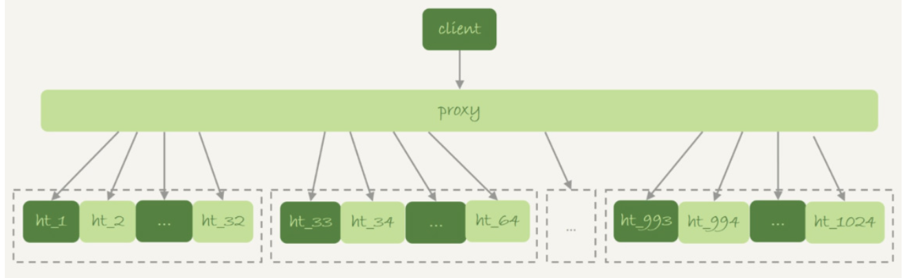

# 临时表

## 临时表 VS 内存表

临时表并不等同于内存表。

内存表，指的是使用Memory引擎的表，建表语法是`create table … engine=memory`。这种表的数据都保存在内存里，系统重启的时候会被清空，但是表结构还在。除了这两个特性看上去比较“奇怪”外，从其他的特征上看，它就是一个正常的表。

临时表，可以使用各种引擎类型 。如果是使用InnoDB引擎或者MyISAM引擎的临时表，写数据的时候是写到磁盘上的。当然，临时表也可以使用Memory引擎。


## 特性


- 建表语法是`create temporary table …`

- 一个临时表只能被创建它的session访问，对其他线程不可见。

  图中session A创建的临时表t，对于session B就是不可见的。

  不同session可以创建同名的临时表。

- 临时表可以与普通表同名

- 同一个session里，有同名的临时表和普通表的时候，`show create`语句，以及增删改查语句访问的是临时表

- `show tables`命令不显示临时表

- 由于临时表只能被创建它的session访问，所以在这个session结束的时候，会自动删除临时表。


## 应用

由于不用担心线程之间的重名冲突，临时表经常会被用在复杂查询的优化过程中。其中，分库分表系统的跨库查询就是一个典型的使用场景。

一般分库分表的场景，就是要把一个逻辑上的大表分散到不同的数据库实例上。比如。将一个大表ht，按照字段f，拆分成1024个分表，然后分布到32个数据库实例上：



一般情况下，这种分库分表系统都有一个中间层proxy。不过，也有一些方案会让客户端直接连接数据库，也就是没有proxy这一层。

在这个架构中，**分区key的选择是以“减少跨库和跨表查询”为依据的**。如果大部分的语句都会包含**f的等值条件**，那么就要用f做分区键。这样，在proxy这一层解析完SQL语句以后，就能确定将这条语句路由到哪个分表做查询。例如下面的查询语句：

```
mysql> select v from ht where f=N;
```

通过分表规则（比如，N%1024)来确认需要的数据被放在了哪个分表上。这种语句只需要访问一个分表，是分库分表方案最欢迎的语句形式了。

如果这个表上还有另外一个索引k，并且查询语句是这样的：

```
mysql> select v from ht where k >= M order by t_modified desc limit 100;
```

这时候，由于查询条件里面没有用到分区字段f，只能到所有的分区中去查找满足条件的所有行，然后统一做`order by `的操作。这种情况下，有两种比较常用的思路：

- **在proxy层的进程代码中实现排序**。这种方式的优势是处理速度快，拿到分库的数据以后，直接在内存中参与计算。不过，这个方案的缺点也比较明显：

  1. 需要的开发工作量比较大。如果涉及到复杂的操作，比如group by，甚至join这样的操作，对中间层的开发能力要求比较高
  2. 对proxy端的压力比较大，尤其是很容易出现内存不够用和CPU瓶颈的问题

- **把各个分库拿到的数据，汇总到一个MySQL实例的一个表中，然后在这个汇总实例上做逻辑操作。**

  比如上面这条语句，执行流程为：

  - 在汇总库上创建一个临时表temp_ht，表里包含三个字段v、k、t_modified；
  - 在各个分库上执行

  ```
  select v,k,t_modified from ht_x where k >= M order by t_modified desc limit 100;
  ```

  - 把分库执行的结果插入到temp_ht表中；
  - 执行下面的语句得到结果。

  ```
  select v from temp_ht order by t_modified desc limit 100; 
  ```

  

**在实践中，可能每个分库的计算量都不饱和，所以会直接把临时表temp_ht放到32个分库中的某一个上。**


## 为什么可以重名

```
mysql> create temporary table temp_t(id int primary key)engine=innodb;
```

执行这个语句的时候，MySQL要给这个InnoDB表创建一个frm文件保存表结构定义，还要有地方保存表数据。

**这个frm文件放在临时文件目录下，文件名的后缀是.frm，前缀是`#sql{进程id}_{线程id}_序列号`**。可以使用`select @@tmpdir`命令，来显示实例的临时文件目录。

关于表中数据的存放方式，在不同的MySQL版本中有着不同的处理方式：

- 在5.6以及之前的版本里，MySQL会在临时文件目录下创建一个相同前缀、以.ibd为后缀的文件，用来存放数据文件；
- 而从 5.7版本开始，MySQL引入了一个**临时文件表空间**，专门用来存放临时文件的数据。因此，我们就不需要再创建ibd文件了。

从文件名的前缀规则，可以发现，创建一个叫作t1的InnoDB临时表，MySQL在存储上认为这个临时表的表名跟普通表t1是不同的，因此同一个库下面已经有普通表t1的情况下，还是可以再创建一个临时表t1的。


session A的线程id是4，session B的线程id是5，所以session A和session B创建的临时表，在磁盘上的文件不会重名。

MySQL维护数据表，除了物理上要有文件外，内存里面也有一套机制区别不同的表，每个表都对应一个`table_def_key`。

- 一个普通表的`table_def_key`的值是由“库名+表名”得到的，所以如果在同一个库下创建两个同名的普通表，创建第二个表的过程中就会发现`table_def_key`已经存在了。
- 而对于临时表，`table_def_key`在“库名+表名”基础上，又加入了“server_id+thread_id”。

session A和sessionB创建的两个临时表t1，它们的`table_def_key`不同，磁盘文件名也不同，因此可以并存。

在实现上，每个线程都维护了自己的**临时表链表**。这样每次session内操作表的时候，先遍历链表，检查是否有这个名字的临时表，如果有就优先操作临时表，如果没有再操作普通表；在session结束的时候，对链表里的每个临时表，执行 “DROP TEMPORARY TABLE +表名”操作。


## 主备复制

关于临时表的操作，也会记录到binlog中，而临时表只是session内可见的，主备复制时，让备库也执行临时表的操作，是否有必要？

假设在主库执行下面的语句：

```
mysql> create table t_normal(id int primary key, c int)engine=innodb;/*Q1*/
mysql> create temporary table temp_t like t_normal;/*Q2*/
mysql> insert into temp_t values(1,1);/*Q3*/
mysql> insert into t_normal select * from temp_t;/*Q4*/
```

如果关于临时表的操作都不记录，那么在备库就只有`create table t_normal`表和`insert into t_normal select * from temp_t`这两个语句的binlog日志，备库在执行到`insert into t_normal`的时候，就会报错“表temp_t不存在”。

如果把binlog设置为row格式，在记录`insert into t_normal`的binlog时，记录的是这个操作的数据，即：`write_row event`里面记录的逻辑是“插入一行数据（1,1)”。那就不需要临时表的binlog了。

如果当前的`binlog_format=row`，那么跟临时表有关的语句，就不会记录到binlog里。只在`binlog_format=statment/mixed `的时候，binlog中才会记录临时表的操作。

这种情况下，创建临时表的语句会传到备库执行，因此备库的同步线程就会创建这个临时表。主库在线程退出的时候，会自动删除临时表，但是备库同步线程是持续在运行的。所以，这时候就需要在主库上再写一个`DROP TEMPORARY TABLE`传给备库执行。

> MySQL在记录binlog的时候，不论是`create table`还是`alter table`语句，都是原样记录，甚至于连空格都不变。但是如果执行`drop table t_normal`，系统记录binlog就会写成标准的格式：
>
> ```
> DROP TABLE `t_normal` /* generated by server */
> ```
>
> 这是因为，如果`binlog_format=row`，在主库上执行 `drop table t_normal, temp_t`这个命令，那么binlog中就只能记录：
>
> ```
> DROP TABLE `t_normal` /* generated by server */
> ```
>
> 因为备库上并没有表temp_t，将这个命令重写后再传到备库执行，才不会导致备库同步线程停止。
>
> 所以，`drop table`命令记录binlog的时候，就必须对语句做改写。`/* generated by server */`说明这是一个被服务端改写过的命令。


主库上不同的线程创建同名的临时表是没关系的，但是传到备库执行是怎么处理的呢？


主库M上的两个session创建了同名的临时表t1，这两个`create temporary table t1` 语句都会被传到备库S上。

但是，备库的应用日志线程是共用的，也就是说要在应用线程里面先后执行这个create 语句两次。（即使开了多线程复制，也可能被分配到从库的同一个worker中执行）。

MySQL在记录binlog的时候，会**把主库执行这个语句的线程id写到binlog中**。这样，在备库的应用线程就能够知道执行每个语句的主库线程id，并利用这个线程id来构造临时表的`table_def_key`：

1. session A的临时表t1，在备库的`table_def_key`就是：库名+t1+“M的serverid”+“session A的thread_id”;
2. session B的临时表t1，在备库的`table_def_key`就是 ：库名+t1+“M的serverid”+“session B的thread_id”。

由于`table_def_key`不同，所以这两个表在备库的应用线程里面是不会冲突的。


## 改名

```
mysql> create temporary table tmp_t(id int primary key)engine=innodb;
Query OK, 0 rows affected (0.00 sec)

mysql> alter table tmp_t rename to tmp_t2;
Query OK, 0 rows affected (0.00 sec)
Records: 0  Duplicates: 0  Warnings: 0

mysql> rename table tmp_t2 to tmp_t3;
ERROR 1017 (HY000): Can't find file: '.\test\tmp_t2.frm' (errno: 2 - No such file or directory)
```

执行`rename table`语句的时候，要求按照“库名/表名.frm”的规则去磁盘找文件，但是临时表在磁盘上的frm文件是放在tmpdir目录下的，并且文件名的规则是`#sql{进程id}_{线程id}_序列号.frm`，因此会报“找不到文件名”的错误。

而alter语句是修改表的`table_def_key`。


## 内部临时表

排序时使用的sort buffer，join语句用到的join buffer，还有内存临时表，用来存放语句执行过程中的中间数据，以辅助SQL语句的执行。MySQL在什么时候会使用内部临时表呢？

### union 执行流程

```
create table t1(id int primary key, a int, b int, index(a));
delimiter ;;
create procedure idata()
begin
  declare i int;

  set i=1;
  while(i<=1000)do
    insert into t1 values(i, i, i);
    set i=i+1;
  end while;
end;;
delimiter ;
call idata();
```

执行下面的查询语句：

```
mysql> (select 1000 as f) union (select id from t1 order by id desc limit 2);
```

`union`的语义是，取这两个子查询结果的并集。并集就是这两个集合加起来，**重复的行只保留一行**。


- 第二行的`key=PRIMARY`，说明第二个子句用到了索引`id`。
- 第三行的Extra字段，表示在对子查询的结果集做union的时候，使用了临时表(Using temporary)。

这个语句的执行流程如下：

1. 创建一个内存临时表，这个临时表只有一个整型字段f，并且f是主键字段。
2. 执行第一个子查询，得到1000这个值，并存入临时表中。
3. 执行第二个子查询：
   - 拿到第一行`id=1000`，试图插入临时表中。但由于1000这个值已经存在于临时表了，违反了唯一性约束，所以插入失败，然后继续执行；
   - 取到第二行`id=999`，插入临时表成功。
4. 从临时表中按行取出数据，返回结果，并删除临时表，结果中包含两行数据分别是1000和999。


这里的内存临时表起到了暂存数据的作用，而且计算过程还用上了临时表主键`id`的唯一性约束，实现了union的语义。

如果把上面的语句中的`union`改成`union all`的话，就没有了“去重”的语义。这样执行的时候，就依次执行子查询，得到的结果直接作为结果集的一部分，发给客户端。因此也就不需要临时表了。


### group by 执行流程

```
mysql> select id%10 as m, count(*) as c from t1 group by m;
```

这个语句把表`t1`里的数据，按照 `id%10` 进行分组统计，并按照m的结果排序后输出。它的explain结果如下：


- `Using index`，表示这个语句使用了覆盖索引，**选择索引a，不需要回表**；
- `Using temporary`，表示使用了临时表；
- `Using filesort`，表示需要排序。

执行流程如下：

1. 创建内存临时表，表里有两个字段`m`和`c`，主键是`m`；
2. 扫描表`t1`的索引a，依次取出叶子节点上的`id`值，计算`id%10`的结果，记为`x`；
   - 如果临时表中没有主键为`x`的行，就插入一个记录`(x,1)`;
   - 如果表中有主键为`x`的行，就将x这一行的c值加1；
3. 遍历完成后，再根据字段m做排序，得到结果集返回给客户端。


最后一步，就是对内存临时表的排序。


该语句执行结果如下：


如果不需要对结果进行排序，可以在SQL语句末尾增加`order by null`：

```
mysql> select id%10 as m, count(*) as c from t1 group by m order by null;
```

这时候的explain结果就不会有`Using filesort`了，而结果的顺序也发生了变化，因为根据索引a的顺序访问到的第一行数据的id是1，扫描到`id=10`的时候才插入`m=0`这一行，因此结果集里最后一行才是`m=0`。


这个例子里由于临时表只有10行，内存可以放得下，因此全程只使用了内存临时表。但是，内存临时表的大小是有限制的，由参数`tmp_table_size`控制，默认是16M。执行下面的语句，将这个参数改小，并把`id%10`改为`id%100`，使返回结果超出内存临时表的最大值。

```
set tmp_table_size=1024;
select id%100 as m, count(*) as c from t1 group by m order by null limit 10;
```


这时候就会把内存临时表转成磁盘临时表，磁盘临时表默认使用的引擎是InnoDB。

如果这个表`t1`的数据量很大，很可能这个查询需要的磁盘临时表就会占用大量的磁盘空间。

> 上面两个查询的结果中，使用内存临时表时，0是在结果集的最后一行；使用磁盘临时表时，0是在结果集的第一行。
>
> 这与内存表和innoDB表的数据组织方式相关。

### group by 优化方法 --索引

不论是使用内存临时表还是磁盘临时表，`group by`逻辑都需要**构造一个带唯一索引的表**，执行代价都是比较高的。如果表的数据量比较大，上面这个`group by`语句执行起来就会很慢。

> 执行group by语句为什么需要临时表？
>
> group by的语义逻辑，是**统计不同的值出现的个数**。但是，由于每一行的`id%100`的结果是无序的，所以就需要有一个临时表，来记录并统计结果。
>
> 如果扫描过程中可以保证出现的数据是有序的，那就不需要临时表了。


如果有这样的一个数据结构，可以确保输入的数据是有序的，那么计算group by的时候，就只需要从左到右，顺序扫描，依次累加。也就是下面这个过程：

- 当碰到第一个1的时候，已经知道累积了X个0，结果集里的第一行就是`(0,X)`;
- 当碰到第一个2的时候，已经知道累积了Y个1，结果集里的第一行就是`(1,Y)`;

按照这个逻辑执行的话，扫描到整个输入的数据结束，就可以拿到group by的结果，不需要临时表，也不需要再额外排序。

InnoDB的索引，就可以满足这个输入有序的条件。在MySQL 5.7版本支持了generated column机制，用来实现**列数据的关联更新**。

```
mysql> alter table t1 add column z int generated always as(id % 100), add index(z);
```

这个语句创建一个列`z`，它的值与`id`列进行了关联，然后在`z`列上创建一个索引，上面的`group by`语句就可以改写为：

```
mysql> select z, count(*) as c from t1 group by z;
```


从Extra字段可以看到，这个语句的执行不再需要临时表，也不需要排序了。


### group by优化方法 --直接排序

如果碰上不适合创建索引的场景，而这个`group by`语句中需要放到临时表上的数据量特别大，如果还是按照“先放到内存临时表，插入一部分数据后，发现内存临时表不够用了再转成磁盘临时表”的逻辑，不如直接使用磁盘临时表。

通过在`group by`语句中加入`SQL_BIG_RESULT`这个提示，就可以告诉优化器：这个语句涉及的数据量很大，请直接用磁盘临时表。MySQL的优化器一看，磁盘临时表是B+树存储，存储效率不如数组来得高。既然数据量很大，那从磁盘空间考虑，还是直接用数组来存吧。

```
mysql> select SQL_BIG_RESULT id%100 as m, count(*) as c from t1 group by m;
```

这个语句执行流程如下：

1. 初始化sort_buffer，确定放入一个整型字段，记为m；
2. 扫描表`t1`的索引a，依次取出里面的`id`值, 将 `id%100`的值存入sort_buffer中；
3. 扫描完成后，对sort_buffer的字段m做排序（如果sort_buffer内存不够用，就会利用磁盘临时文件辅助排序）；
4. 排序完成后，就得到了一个有序数组。根据有序数组，得到数组里面的不同值，以及每个值的出现次数。


从Extra字段可以看到，这个语句的执行没有再使用临时表，而是直接用了排序算法。

通过上述例子，可以发现：

1. 如果语句执行过程可以一边读数据，一边直接得到结果，是不需要额外内存的，否则就需要额外的内存，来保存中间结果；
2. join_buffer是无序数组，sort_buffer是有序数组，临时表是二维表结构；
3. 如果执行逻辑需要用到二维表特性，就会优先考虑使用临时表。比如union的例子中，需要用到唯一索引约束， group by还需要用到另外一个字段来存累积计数。

以及使用`group by`时的原则：

1. 如果对`group by`语句的结果没有排序要求，要在语句后面加 `order by null`；
2. 尽量让`group by`过程用上表的索引，确认方法是explain结果里没有`Using temporary `和 `Using filesort`；
3. 如果`group by`需要统计的数据量不大，尽量只使用内存临时表；也可以通过适当调大`tmp_table_size`参数，来避免用到磁盘临时表；
4. 如果数据量实在太大，使用`SQL_BIG_RESULT`这个提示，来告诉优化器直接使用排序算法得到group by的结果。


### group by 和 distinct

如果只需要去重，不需要执行聚合函数，`distinct `和`group by`的效率就是一样的了。

如果表`t`的字段a上没有索引，那么下面这两条语句的性能是相同的。

```
select a from t group by a order by null;
select distinct a from t;
```

> 这种`group by`的写法，并不是SQL标准的写法。标准的`group by`语句，是需要在select部分加一个聚合函数，比如：
>
> ```
> select a, count(*) from t group by a order by null;
> ```

没有了`count(*)`以后，不再需要执行“计算总数”的逻辑，第一条语句的逻辑就变成是：按照字段a做分组，相同的a的值只返回一行。而这就是`distinct`的语义，所以不需要执行聚合函数时，distinct 和group by这两条语句的语义和执行流程是相同的，因此执行性能也相同。

1. 创建一个临时表，临时表有一个字段a，并且在这个字段a上创建一个唯一索引；
2. 遍历表`t`，依次取数据插入临时表中：
   - 如果发现唯一键冲突，就跳过；
   - 否则插入成功；
3. 遍历完成后，将临时表作为结果集返回给客户端。

