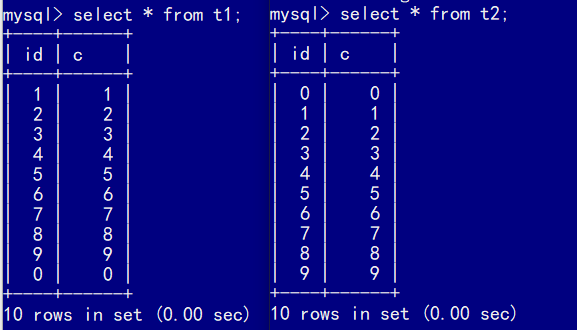
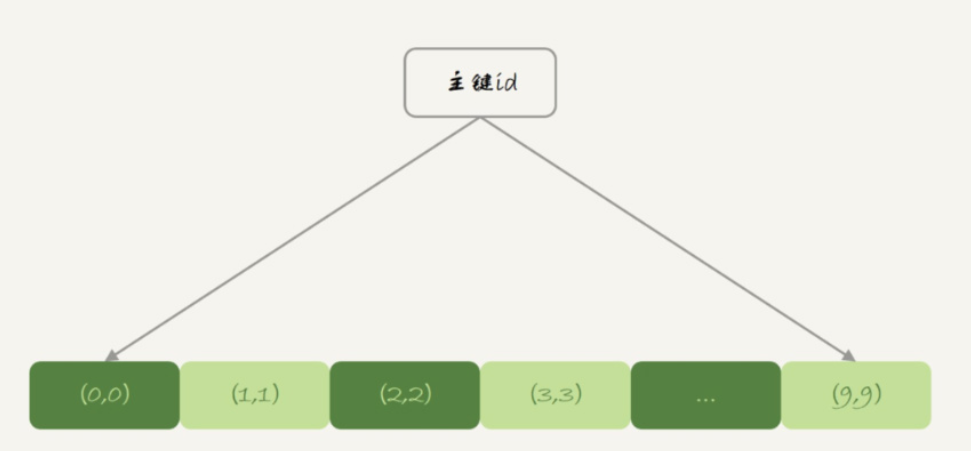
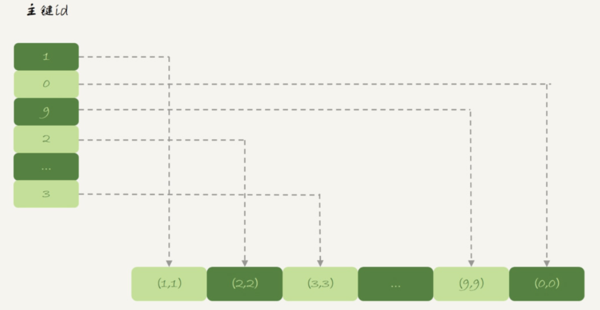
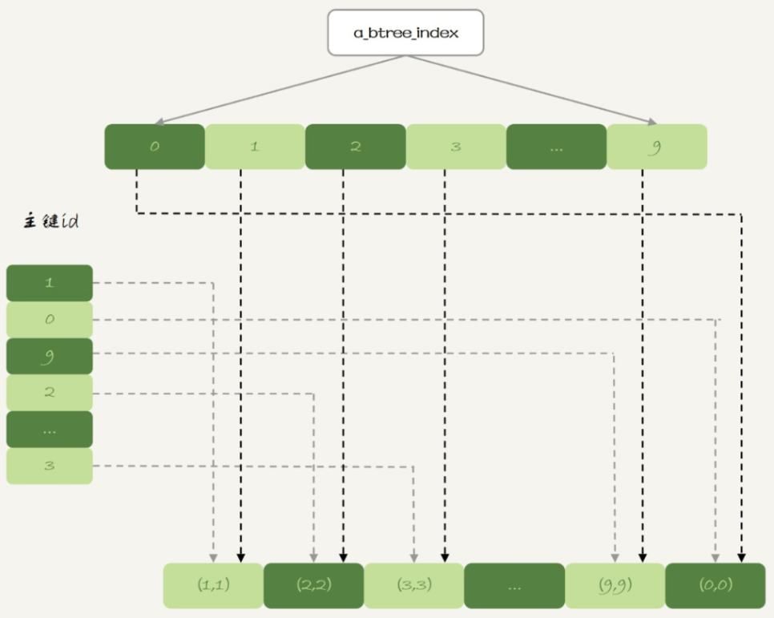
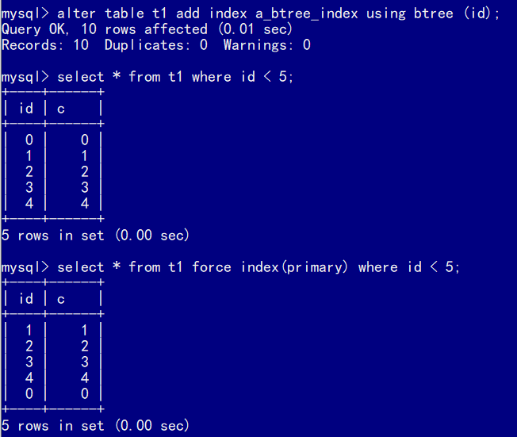
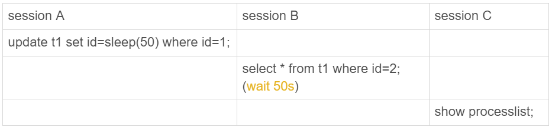
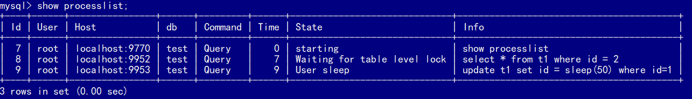
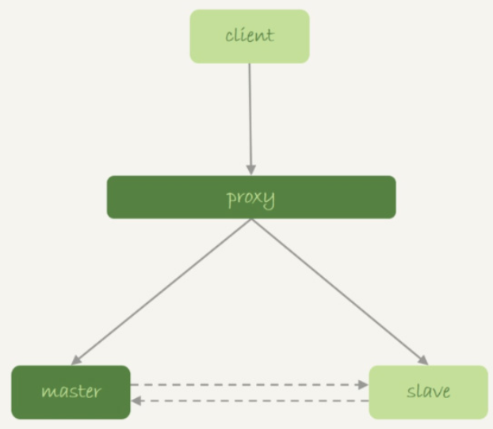

# 内存表

## 数据组织结构

创建两张结构相同，存储引擎不同的表：

```
mysql> create table t1(id int primary key, c int) engine=Memory;
mysql> create table t2(id int primary key, c int) engine=innodb;
mysql> insert into t1 values(1,1),(2,2),(3,3),(4,4),(5,5),(6,6),(7,7),(8,8),(9,9),(0,0);
mysql> insert into t2 values(1,1),(2,2),(3,3),(4,4),(5,5),(6,6),(7,7),(8,8),(9,9),(0,0);
```

然后，在两个表上执行`select *`。



内存表`t1`的返回结果里面0在最后一行，而InnoDB表`t2`的返回结果里0在第一行。这是由这两个引擎的主键索引的组织方式导致的。

表`t2`用的是InnoDB引擎，InnoDB表的数据就放在主键索引树上，主键索引是B+树。主键索引上的值是有序存储的。在执行`select *`的时候，就会按照叶子节点从左到右扫描，所以得到的结果里，0就出现在第一行。



而**Memory引擎的数据和索引是分开的**。内存表的数据部分以数组的方式单独存放，而主键id索引里，存的是每个数据的位置。主键id是hash的key，可以看到索引上的key并不是有序的。



在内存表`t1`中，执行`select *`的时候，走的是**全表扫描**，也就是顺序扫描这个数组。而数据是按照写入顺序存放的，因此，0是最后一个写入，就是最后一个被读到，并放入结果集的数据。

如果把`t1`的插入语句中的`(0, 0)`放到最前面，那`select *`的结果就是相同的顺序了。

```
insert into t1 values(0,0),(1,1),(2,2),(3,3),(4,4),(5,5),(6,6),(7,7),(8,8),(9,9);
```

可见，InnoDB和Memory引擎的数据组织方式是不同的：

- InnoDB引擎把数据放在主键索引上，其他索引上保存的是主键id。这种方式，称之为**索引组织表**（Index Organizied Table）。
- Memory引擎采用的是把数据单独存放，索引上保存数据位置的数据组织形式，称之为**堆组织表**（Heap Organizied Table）。

这两个引擎的典型不同：

1. InnoDB表的数据总是有序存放的，而**内存表的数据就是按照写入顺序存放的**；
2. 当数据文件有空洞的时候，InnoDB表在插入新数据的时候，为了保证数据有序性，只能在固定的位置写入新值，而**内存表找到空位就可以插入新值**；
3. 数据位置发生变化的时候，InnoDB表只需要修改主键索引，而内存表需要修改所有索引；
4. InnoDB表用主键索引查询时需要走一次索引查找，用普通索引查询的时候，需要走两次索引查找。而内存表没有这个区别，所有索引的“地位”都是相同的。
5. InnoDB支持变长数据类型，不同记录的长度可能不同；内存表不支持Blob 和 Text字段，并且即使定义了`varchar(N)`，实际也当作`char(N)`，即固定长度字符串来存储，因此内存表的每行数据长度相同。

由于内存表的这些特性，每个数据行被删除以后，空出的这个位置都可以被接下来要插入的数据复用。比如，在表`t1`中执行：

```
delete from t1 where id=5;
insert into t1 values(10,10);
select * from t1;
```

返回结果里，`id=10`这一行出现在`id=4`之后，也就是原来`id=5`这行数据的位置。

由于表`t1`的主键索引是哈希索引，因此如果执行**范围查询**，是用不上主键索引的，需要走全表扫描。比如

```
mysql> select * from t1 where id<5;
```


## hash索引和B-Tree索引

内存表是支持B-Tree索引的，在`id`列上创建一个B-Tree索引：

```
mysql> alter table t1 add index a_btree_index using btree (id);
```

	

之后范围查询的时候，优化器就会使用新增的B树索引。下面是使用B树索引和使用`force index`强行使用主键`id`这个索引时的结果。




## 缺点

内存表的优势是速度快，其中的一个原因就是Memory引擎支持hash索引。更重要的原因是，内存表的所有数据都保存在内存，而内存的读写速度总是比磁盘快。

但是，在生产环境中不建议使用内存表。

### 锁

**内存表不支持行锁，只支持表锁。**因此，一张表只要有更新，就会堵住其他所有在这个表上的读写操作。



在这个执行序列里，session A的update语句要执行50秒，在这个语句执行期间session B的查询会进入锁等待状态。session C的`show processlist `结果输出如下：



跟行锁比起来，表锁对并发访问的支持不够好。所以，内存表的锁粒度问题，决定了它在处理并发事务的时候，性能也不会太好。	

### 数据持久性问题

数据放在内存中，是内存表的优势，但也是一个劣势。因为，数据库重启的时候，所有的内存表都会被清空。在高可用架构下，内存表的这个特点简直可以当做bug来看待了。


在M-S架构下：

1. 业务正常访问主库；
2. 备库硬件升级，**备库重启**，内存表`t1`内容被清空；
3. 备库重启后，客户端发送一条`update`语句，修改表`t1`的数据行，这时备库应用线程就会报错“找不到要更新的行”。

这样就会导致主备同步停止。如果这时候发生主备切换的话，客户端会看到，表`t1`的数据“丢失”了。

在这种有proxy的架构里，默认主备切换的逻辑是由数据库系统自己维护的。这样对客户端来说，就是“网络断开，重连之后，发现内存表数据丢失了”。

这种情况下，主备发生切换，连接会断开，业务端能够感知到异常。

但是，由于MySQL知道重启之后，内存表的数据会丢失。担心**主库**重启之后，出现主备不一致，MySQL在实现上做了这样一件事儿：在数据库重启之后，往binlog里面写入一行`DELETE FROM t1`。

如果使用的是双M结构，在**备库**重启的时候，备库binlog里的`delete`语句就会传到主库，然后把主库内存表的内容删除。这样在使用的时候就会发现，主库的内存表数据突然被清空了。




大部分情况下，**建议把普通内存表都用InnoDB表来代替。**

1. 如果表更新量大，那么并发度是一个很重要的参考指标，InnoDB支持行锁，并发度比内存表好
2. 能放到内存表的数据量都不大。如果考虑的是读的性能，一个读QPS很高并且数据量不大的表，即使是使用InnoDB，数据也是都会缓存在InnoDB Buffer Pool里的。因此，使用InnoDB表的读性能也不会差。


## 使用场景

在数据量可控，不会耗费过多内存的情况下，可以考虑使用内存表。**内存临时表**刚好可以无视内存表的两个不足，主要是下面的三个原因：

1. 临时表不会被其他线程访问，没有并发性的问题；
2. 临时表重启后也是需要删除的，清空数据这个问题不存在；
3. 备库的临时表也不会影响主库的用户线程。

例如改写`join`语句时，创建内存临时表存储中间数据：

```
create temporary table temp_t(id int primary key, a int, b int, index (b))engine=memory;
insert into temp_t select * from t2 where b>=1 and b<=2000;
select * from t1 join temp_t on (t1.b=temp_t.b);
```

1. 相比于InnoDB表，使用内存表不需要写磁盘，往表temp_t的写数据的速度更快；
2. 索引b使用hash索引，查找的速度比B-Tree索引快；
3. 临时表数据只有2000行，占用的内存有限。

 

假设一个数据库上，有一个内存表。备库重启之后肯定会导致备库的内存表数据被清空，进而导致主备同步停止。这时，最好的做法是将它修改成InnoDB引擎表。但如果现在的业务场景暂时不允许修改引擎，可以加上什么自动化逻辑，来避免主备同步停止呢？

既然主库暂时不能修改引擎，那么就把备库的内存表引擎先都改成InnoDB。对于每个内存表，执行

```
set sql_log_bin=off;
alter table tbl_name engine=innodb;
```

这样就能避免备库重启的时候，数据丢失的问题。

由于主库重启后，会往binlog里面写“`delete from tbl_name`”，这个命令传到备库，备库的同名的表数据也会被清空。因此，就不会出现主备同步停止的问题。

如果由于主库异常重启，触发了HA，这时候之前修改过引擎的备库变成了主库。而原来的主库变成了新备库，在新备库上把所有的内存表（这时候表里没数据）都改成InnoDB表。

所以，如果不能直接修改主库上的表引擎，可以配置一个自动巡检的工具，在**备库**上发现内存表就把引擎改了。


