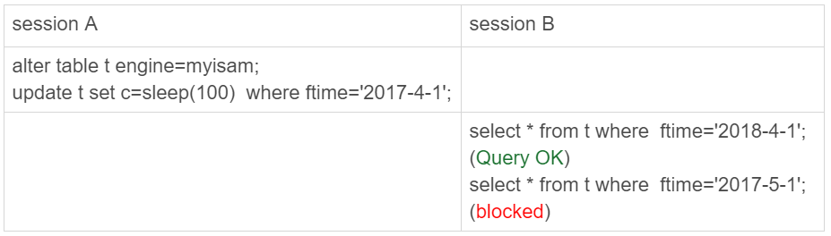
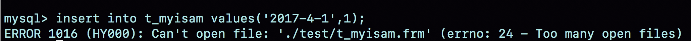

# 分区表

可以根据范围、hash、list对表进行分区，例如通过范围分区：

```
mysql> CREATE TABLE `t` (
  `ftime` datetime NOT NULL,
  `c` int(11) DEFAULT NULL,
  KEY (`ftime`)
) ENGINE=InnoDB DEFAULT CHARSET=latin1
PARTITION BY RANGE (YEAR(ftime))
(PARTITION p_2017 VALUES LESS THAN (2017) ENGINE = InnoDB,
 PARTITION p_2018 VALUES LESS THAN (2018) ENGINE = InnoDB,
 PARTITION p_2019 VALUES LESS THAN (2019) ENGINE = InnoDB,
PARTITION p_others VALUES LESS THAN MAXVALUE ENGINE = InnoDB);

mysql> insert into t values('2017-4-1',1),('2018-4-1',1);
```


在表`t`中初始化插入了两行记录，按照定义的分区规则，这两行记录分别落在p_2018和p_2019这两个分区上。

这个表包含了一个`.frm`文件和4个`.ibd`文件，每个分区对应一个`.ibd`文件。也就是说：

- 对于引擎层来说，这是4个表；
- 对于Server层来说，这是1个表。


## 引擎层行为

### innoDB


初始化表`t`的时候，插入的两行数据的`ftime`的值分别是，‘2017-4-1’ 和’2018-4-1’ 。session A的`select`语句对索引`ftime`上这两个记录之间的间隙加了锁。如果是一个普通表的话，那么T1时刻，在表`t`的`ftime`索引上，间隙和加锁状态如下：


‘2017-4-1’ 和’2018-4-1’ 这两个记录之间的间隙是会被锁住的。那么，sesion B的两条插入语句应该都要进入锁等待状态。

但是session B的第一个insert语句是可以执行成功的。这是因为，对于引擎来说，p_2018和p_2019是两个不同的表，也就是说2017-4-1的下一个记录并不是2018-4-1，而是p_2018分区的supremum。所以T1时刻，在表`t`的`ftime`索引上，间隙和加锁的状态是这样的：


这时候的`show engine innodb status`的部分结果如下：


### MyISAM

用`alter table t engine=myisam`，把表`t`改成MyISAM表，然后进行下面的操作：



在session A里用`sleep(100)`将这条语句的执行时间设置为100秒。由于MyISAM引擎只支持表锁，所以这条update语句会锁住整个表`t`上的读。但是session B的第一条查询语句是可以正常执行的，第二条语句才进入锁等待状态。

这正是因为MyISAM的表锁是在引擎层实现的，session A加的表锁，其实是锁在分区p_2018上。因此，只会堵住在这个分区上执行的查询，落到其他分区的查询是不受影响的。


## 分区策略

单表过大是使用分区表的原因，如果不使用分区表的话，就要使用手动分表的方式。

比如，按照年份来划分，我们就分别创建普通表t_2017、t_2018、t_2019等等。手工分表的逻辑，也是找到需要更新的所有分表，然后依次执行更新。在性能上，这和分区表并没有实质的差别。

分区表和手工分表，一个是由server层来决定使用哪个分区，一个是由应用层代码来决定使用哪个分表。因此，从引擎层看，这两种方式也是没有差别的。

这两个方案的区别，主要是在server层上。从server层看，分区表有一个被广为诟病的问题：**打开表的行为**。

每当第一次访问一个分区表的时候，MySQL需要把所有的分区都访问一遍。**一个典型的报错情况**是这样的：如果一个分区表的分区很多，比如超过了1000个，而MySQL启动的时候，`open_files_limit`参数使用的是默认值1024，那么就会在访问这个表的时候，由于需要打开所有的文件，导致打开表文件的个数超过了上限而报错。



上面是在一个包含了很多分区的MyISAM表`t_myisam`上，执行一条插入语句后报错的情况。虽然这条insert语句，明显只需要访问一个分区，但语句却无法执行。

> 不过如果使用InnoDB引擎的话，就不会出现这个问题。
>
> `innodb_open_files`参数，可以限制Innodb能打开的表的数量。在InnoDB引擎打开文件超过 `innodb_open_files`这个值的时候，就会关掉一些之前打开的文件。
>
> 因此，InnoDB分区表使用了本地分区策略以后，即使分区个数大于`open_files_limit `，打开InnoDB分区表也不会报“打开文件过多”这个错误。

MyISAM分区表使用的分区策略，称为**通用分区策略**（generic partitioning），**每次访问分区都由server层控制**。通用分区策略，是MySQL一开始支持分区表的时候就存在的代码，在文件管理、表管理的实现上很粗糙，因此有比较严重的性能问题。

> MySQL 8.0版本开始，就不允许创建MyISAM分区表了，只允许创建已经实现了本地分区策略的引擎。只有InnoDB和NDB这两个引擎支持了本地分区策略。

从MySQL 5.7.9开始，InnoDB引擎引入了**本地分区策略**（native partitioning）。这个策略是**在InnoDB内部自己管理打开分区的行为**。


## 分区表的server层行为

从server层看的话，一个分区表就只是一个表。


虽然session B只需要操作p_2107这个分区，但是由于session A持有整个表`t`的MDL锁，就导致了session B的`alter`语句被堵住。

分区表在做DDL的时候，影响会更大。如果使用的是普通分表，那么在`truncate`一个分表的时候，肯定不会跟另外一个分表上的查询语句，出现MDL锁冲突。


## 应用场景

分区表的一个显而易见的优势是**对业务透明**，相对于用户分表来说，使用分区表的业务代码更简洁。还有，分区表可以很**方便的清理历史数据**。

如果一项业务跑的时间足够长，往往就会有根据时间删除历史数据的需求。这时候，按照时间分区的分区表，就可以直接通过`alter table t drop partition …`这个语法删掉分区，从而删掉过期的历史数据。这个操作是**直接删除分区文件**，效果跟drop普通表类似。与使用delete语句删除数据相比，优势是速度快、对系统影响小。


假如现在要创建一个自增字段id。**MySQL要求分区表中的主键必须包含分区字段**。如何在表`t`的基础上做修改？

由于MySQL要求主键包含所有的分区字段，所以肯定是要创建联合主键的：`(ftime, id)`或者`(id, ftime)`。

从利用率上来看，应该使用`(ftime, id)`这种模式。因为用ftime做分区key，说明大多数语句都是包含ftime的，使用这种模式，可以利用前缀索引的规则，减少一个索引。这时的建表语句是：

```
CREATE TABLE `t` (
  `id` int(11) NOT NULL AUTO_INCREMENT,
  `ftime` datetime NOT NULL,
  `c` int(11) DEFAULT NULL,
  PRIMARY KEY (`ftime`,`id`)
) ENGINE=MyISAM DEFAULT CHARSET=latin1
PARTITION BY RANGE (YEAR(ftime))
(PARTITION p_2017 VALUES LESS THAN (2017) ENGINE = MyISAM,
 PARTITION p_2018 VALUES LESS THAN (2018) ENGINE = MyISAM,
 PARTITION p_2019 VALUES LESS THAN (2019) ENGINE = MyISAM,
 PARTITION p_others VALUES LESS THAN MAXVALUE ENGINE = MyISAM);
```

建议尽量使用InnoDB引擎，**InnoDB表要求至少有一个索引，以自增字段作为第一个字段**，所以需要加一个id的单独索引。

```
CREATE TABLE `t` (
  `id` int(11) NOT NULL AUTO_INCREMENT,
  `ftime` datetime NOT NULL,
  `c` int(11) DEFAULT NULL,
  PRIMARY KEY (`ftime`,`id`),
  KEY `id` (`id`)
) ENGINE=InnoDB DEFAULT CHARSET=latin1
PARTITION BY RANGE (YEAR(ftime))
(PARTITION p_2017 VALUES LESS THAN (2017) ENGINE = InnoDB,
 PARTITION p_2018 VALUES LESS THAN (2018) ENGINE = InnoDB,
 PARTITION p_2019 VALUES LESS THAN (2019) ENGINE = InnoDB,
 PARTITION p_others VALUES LESS THAN MAXVALUE ENGINE = InnoDB);
```

当然也可以把字段反过来，创建成：

```
  PRIMARY KEY (`id`,`ftime`),
  KEY `id` (`ftime`)
```