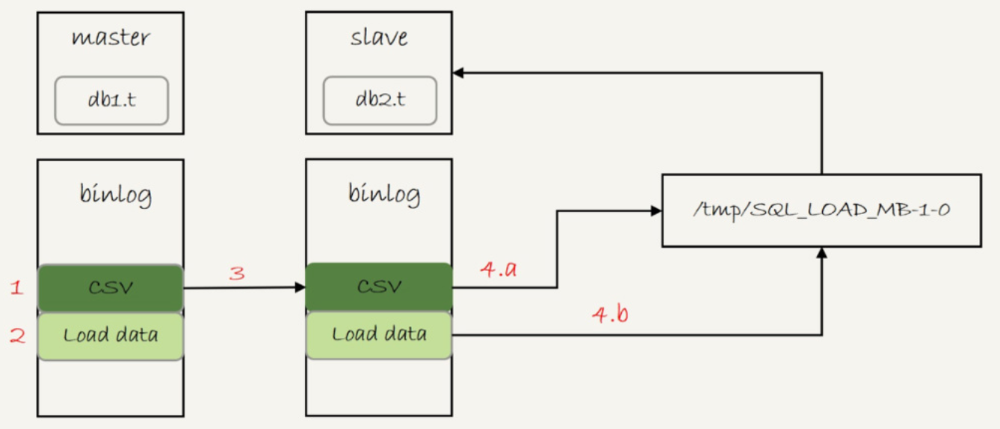

# 表数据的复制

创建`db1.t`和`db2.t`两个表，将`db1.t`的数据拷贝到`db2.t`里。

```
create database db1;
use db1;

create table t(id int primary key, a int, b int, index(a))engine=innodb;
delimiter ;;
  create procedure idata()
  begin
    declare i int;
    set i=1;
    while(i<=1000)do
      insert into t values(i,i,i);
      set i=i+1;
    end while;
  end;;
delimiter ;
call idata();

create database db2;
create table db2.t like db1.t
```


## mysqldump方法

假设要把`db1.t`里面`a > 900`的数据行导出来，插入到`db2.t`中，**mysqldump命令可以将数据导出成一组insert语句**：

```
$ mysqldump -h$host -P$port -u$user --add-locks=0 --no-create-info --single-transaction  --set-gtid-purged=OFF db1 t --where="a>900" --result-file=/client_tmp/t.sql
```

- `--add-locks=0 `：在输出的文件结果里，不增加 `LOCK TABLES t WRITE;`
- `--no-create-info `：不需要导出表结构
- `--single-transaction  `：在导出数据的时候不需要对表`db1.t`加表锁，而是使用`START TRANSACTION WITH CONSISTENT SNAPSHOT`的方法
- `--set-gtid-purged=OFF`：不输出跟GTID相关的信息
- `-–result-file`指定了输出文件的路径，生成的文件是在客户端机器上的

生成的文件中包含了下图的insert语句，一条INSERT语句里面会包含多个value对，这是为了后续用这个文件来写入数据的时候，执行速度可以更快。

> 通过`--net_buffer_length` 传给mysqldump，可以控制生成的单行SQL语句不会超过参数`net_buffer_length`，即限制value对的数量。


如果希望生成的文件中一条INSERT语句只插入一行数据的话，可以在执行mysqldump命令时，加上参数`–skip-extended-insert`。

生成了insert语句后，下一步就是到`db2.t`上插入数据：

```
$ mysql -h127.0.0.1 -P13000 -uroot db2 -e "source /client_tmp/t.sql"
```

source命令可以读取`/client_tmp/t.sql`文件的内容，默认以分号为结尾读取一条条的SQL语句，然后将SQL语句发送到服务端执行。因此，不论是在慢查询日志（slow log），还是在binlog，记录的都是这些要被真正执行的INSERT语句。

虽然mysqldump可以在where参数增加过滤条件，来实现只导出部分数据，但是不能使用join这种比较复杂的where条件写法。


## 导出CSV文件

MySQL提供了下面的语法，用来将查询结果导出到**服务端**本地目录：

```
mysql> select * from db1.t where a>900 into outfile '/server_tmp/t.csv';
```

1. 这条语句会将结果保存在服务端。如果执行命令的客户端和MySQL服务端不在同一个机器上，客户端机器的临时目录下是不会生成`t.csv`文件的。
2. `into outfile`指定了文件的生成位置，这个位置受参数`secure_file_priv`的限制。参数`secure_file_priv`的可选值和作用分别是：
   - empty：不限制文件生成的位置，这是不安全的设置；
   - 一个表示路径的字符串：要求生成的文件只能放在这个指定的目录，或者它的子目录；
   - NULL：禁止在这个MySQL实例上执行`select … into outfile` 操作。
3. 这条命令不会覆盖文件，因此需要确保`/server_tmp/t.csv`这个文件不存在，否则执行语句时就会因为有同名文件的存在而报错。
4. 这条命令生成的文本文件中，原则上一个数据行对应文本文件的一行。如果字段中包含换行符，在生成的文本中也会有换行符。不过类似换行符、制表符这类符号，前面都会跟上`\`这个转义符，这样就可以跟字段之间、数据行之间的分隔符区分开。

**select …into outfile方法不会生成表结构文件**，所以导数据时还需要单独的命令得到**表结构定义**。mysqldump提供了一个`tab`参数，可以同时导出表结构定义文件和csv数据文件：

```
$ mysqldump -h$host -P$port -u$user ---single-transaction  --set-gtid-purged=OFF db1 t --where="a>900" --tab=$secure_file_priv
```

这条命令会在`$secure_file_priv`定义的目录下，创建一个`t.sql`文件保存**建表语句**，同时创建一个`t.txt`文件保存**CSV数据。**


在服务端得到CSV文件后，就可以通过`load data`命令将数据导入目标表了：

```
mysql> load data infile '/server_tmp/t.csv' into table db2.t;
```

这条语句的执行流程如下：

1. 打开文件`/server_tmp/t.csv`，以制表符`\t`作为字段间的分隔符，以换行符`\n`作为记录之间的分隔符，进行数据读取；
2. 启动事务。
3. 判断每一行的字段数与表`db2.t`是否相同：
   - 若不相同，则直接报错，事务回滚；
   - 若相同，则构造成一行，调用InnoDB引擎接口，写入到表中。
4. 重复步骤3，直到`/server_tmp/t.csv`整个文件读入完成，提交事务。


### 备库执行

**如果binlog_format=statement，这个load语句记录到binlog里以后，怎么在备库重放呢？**

由于`/server_tmp/t.csv`文件只保存在主库所在的主机上，如果只是把这条语句原文写到binlog中，在备库执行的时候，备库的本地机器上没有这个文件，就会导致主备同步停止。

所以，这条语句执行的完整流程，是这样的：

1. 主库执行完成后，将`/server_tmp/t.csv`文件的内容直接写到binlog文件中
2. 往binlog文件中写入语句`load data local infile '/tmp/SQL_LOAD_MB-1-0' INTO TABLE db2.t;`
3. 把这个binlog日志传到备库。
4. 备库的apply线程在执行这个事务日志时：
   a. 先将binlog中`t.csv`文件的内容读出来，写入到本地临时目录`/tmp/SQL_LOAD_MB-1-0` 中；
   b. 再执行`load data`语句，往备库的`db2.t`表中插入跟主库相同的数据。




备库执行的`load data`语句里面，多了一个`local`。它的意思是“将执行这条命令的客户端所在机器的本地文件`/tmp/SQL_LOAD_MB-1-0`的内容，加载到目标表db2.t中”。**load data命令有两种用法**：

1. 不加“local”，是读取服务端的文件，这个文件必须在`secure_file_priv`指定的目录或子目录下；
2. 加上“local”，读取的是**客户端的文件**，只要mysql客户端有访问这个文件的权限即可。这时候，MySQL客户端会先把本地文件传给服务端，然后执行上述的load data流程。

使用`load data local`的原因还包括，为了确保备库应用binlog正常。因为备库可能配置了`secure_file_priv=null`，这时如果不用local的话，可能会导入失败，造成主备同步延迟。

使用mysqlbinlog工具解析binlog文件，并应用到目标库的时候，通过下面的命令把日志直接解析出来发给目标库执行，增加`local`，就能让这个方法支持非本地的`$host`。

```
$ mysqlbinlog $binlog_file | mysql -h$host -P$port -u$user -p$pwd
```


## 物理拷贝方法

mysqldump方法和导出CSV文件的方法，都是逻辑导数据的方法，也就是将数据从表`db1.t`中读出来，生成文本，然后再写入目标表`db2.t`中。

物理方法并不是直接把`db1.t`表的`.frm`文件和`.ibd`文件拷贝到`db2`目录下。因为，一个InnoDB表，除了包含这两个物理文件外，还需要在数据字典中注册。直接拷贝这两个文件的话，因为数据字典中没有`db2.t`这个表，系统是不会识别和接受它们的。

在MySQL 5.6版本引入了**可传输表空间**(transportable tablespace)的方法，可以通过导出+导入表空间的方式，实现物理拷贝表的功能。

假设想在db1库下，复制一个跟表`t`相同的表`r`，具体的执行步骤如下：

1. ` create table r like t`，创建一个相同表结构的空表，这时会生成`r.ibd`和`r.frm`两个文件

2. `alter table r discard tablespace`，这时候`r.ibd`文件会被删除

3. `flush table t for export`，这时候db1目录下会生成一个`t.cfg`文件，同时表`t`处于只读状态，直到`unlock`才释放读锁

4. 在db1目录下执行`cp t.cfg r.cfg; cp t.ibd r.ibd;`这两个命令，拷贝得到的两个文件，MySQL进程要有读写权限

5. `unlock tables`，这时候`t.cfg`文件会被删除；

6. `alter table r import tablespace`，将这个`r.ibd`文件作为表`r`的新的表空间，由于这个文件的数据内容和`t.ibd`是相同的，所以表`r`中就有了和表`t`相同的数据。

   为了让文件里的表空间id和数据字典中的一致，会修改`r.ibd`的表空间id。而这个表空间id存在于每一个数据页中。因此，如果是一个很大的文件（比如TB级别），每个数据页都需要修改，所以这个import语句的执行是需要一些时间的。不过相比于逻辑导入的方法，import语句的耗时是非常短的。


物理拷贝的方式速度最快，尤其对于大表拷贝来说是最快的方法。如果出现误删表的情况，用备份恢复出误删之前的临时库，然后再把临时库中的表拷贝到生产库上，是恢复数据最快的方法。但是，这种方法的使用也有一定的局限性：

- 必须是**全表拷贝**，不能只拷贝部分数据；
- 需要到服务器上拷贝数据，在用户无法登录数据库主机的场景下无法使用；
- 由于是通过拷贝物理文件实现的，源表和目标表都是使用InnoDB引擎时才能使用。而前面两种逻辑备份方法，是可以跨引擎使用的。


