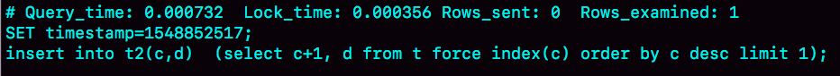

# insert的锁

普通的insert语句是一个很轻量的操作，但有些insert语句在执行过程中需要给其他资源加锁，或者无法在申请到自增id以后就立马释放自增锁。

## insert … select 语句

```
CREATE TABLE `t` (
  `id` int(11) NOT NULL AUTO_INCREMENT,
  `c` int(11) DEFAULT NULL,
  `d` int(11) DEFAULT NULL,
  PRIMARY KEY (`id`),
  UNIQUE KEY `c` (`c`)
) ENGINE=InnoDB;

insert into t values(null, 1,1);
insert into t values(null, 2,2);
insert into t values(null, 3,3);
insert into t values(null, 4,4);

create table t2 like t;
```

在**可重复读**隔离级别下，`binlog_format=statement`时执行下面的语句时，需要对**表`t`**的所有行和间隙加锁。这是出于对日志和数据的一致性的考虑。

```
mysql> insert into t2(c,d) select c,d from t;
```


实际的执行效果是，如果session B先执行，由于session B对表`t`主键索引加的锁包括`(-∞,1]`这个next-key lock，会在语句执行完成后，才允许session A的`insert`语句执行。

如果没有锁的话，就可能出现session B的insert语句先执行，但是后写入binlog的情况。于是，在`binlog_format=statement`的情况下，binlog里面就记录了这样的语句序列：

```
insert into t values(-1,-1,-1);
insert into t2(c,d) select c,d from t;
```

这个语句到了备库执行，就会把`id=-1`这一行也写到表`t2`中，出现主备不一致。

执行`insert … select `的时候，对目标表也不是锁全表，而是**只锁住需要访问的资源**。


## insert 循环写入

现在要往表`t2`中插入一行数据，这一行的`c`值是表`t`中`c`值的最大值加1：

```
mysql> insert into t2(c,d)  (select c+1, d from t force index(c) order by c desc limit 1);
```

这个语句的加锁范围，就是表`t`索引c上的`(3,4]`和`(4,supremum]`这两个next-key lock，以及主键索引上`id=4`这一行。

它的执行流程也比较简单，从表t中按照索引c倒序，扫描第一行，拿到结果写入到表t2中。因此整条语句的扫描行数是1。



但如果把这样的一行数据插入到**表`t`**中的话，慢查询日志中的`Rows_examined`的值是5。

```
mysql> insert into t(c,d)  (select c+1, d from t force index(c) order by c desc limit 1);
```


这条语句的explain结果如下：


Extra字段的`Using temporary`，表示这个语句用到了临时表。也就是说，执行过程中，需要把表`t`的内容读出来，写入临时表。

图中rows显示的是1，如果是把子查询的结果读出来(扫描1行)，写入临时表，然后再从临时表读出来(扫描1行)，写回表`t`中。那么，这个语句的扫描行数就应该是2，而不是5。所以不是这样子。

实际上，Explain结果里的`rows=1`是因为受到了`limit 1` 的影响。

从另一个角度考虑的话，可以通过查看`Innodb_rows_read`的值看看InnoDB扫描了多少行：


这个语句执行前后，`Innodb_rows_read`的值增加了4。因为默认临时表是使用Memory引擎的，所以这4行查的都是表`t`，也就是说对表`t`做了全表扫描。整个执行过程应该是：

1. 创建临时表，表里有两个字段c和d。
2. 按照索引c扫描表t，依次取c=4、3、2、1，然后回表，读到c和d的值写入临时表。这时，`Rows_examined=4`。
3. 由于语义里面有`limit 1`，所以只取了临时表的第一行，再插入到表`t`中。这时，`Rows_examined`的值加1，变成了5。

这个语句会导致在表`t`上做全表扫描，并且会给索引c上的所有间隙都加上共享的next-key lock。所以，这个语句执行期间，其他事务不能在这个表上插入数据。

这个语句的执行为什么需要临时表，原因是这类**一边遍历数据，一边更新数据**的情况，如果读出来的数据直接写回原表，就可能在遍历过程中，读到刚刚插入的记录，新插入的记录如果参与计算逻辑，就跟语义不符。

由于在MySQL实现上，这个语句没有在子查询中就使用`limit 1`，从而导致了这个语句的执行需要遍历整个表`t`，之后再`limit 1`。它的优化方法也比较简单：先`insert into`到临时表`temp_t`，这样就只需要扫描一行；然后再从表`temp_t`里面取出这行数据插入表`t`。由于这个语句涉及的数据量很小，可以考虑使用内存临时表来做这个优化。

```
create temporary table temp_t(c int,d int) engine=memory;
insert into temp_t  (select c+1, d from t force index(c) order by c desc limit 1);
insert into t select * from temp_t;
drop table temp_t;
```


## insert 唯一键冲突

对于有唯一键的表，插入数据时出现唯一键冲突是常见的情况。


在可重复读隔离级别下执行，session B要执行的`insert`语句进入了锁等待状态。这是因为session A要插入`(11, 10, 10)`这一行数据时，发生了唯一键冲突，而这时session A并不只是简单地报错返回，还在冲突的索引上加了锁：索引c上的`(5, 10]`的next-key lock。

> MySQL认为如果冲突的是主键索引或者唯一索引，就会加next-key lock。

下面是唯一键冲突导致的死锁场景，在session A执行`rollback`语句回滚的时候，session C几乎同时发现死锁并返回。


这个死锁产生的逻辑是这样的：

1. 在T1时刻，启动session A，并执行`insert`语句，此时在索引c的`c=5`上加了记录锁。由于这个索引是唯一索引，因此退化为记录锁。
2. 在T2时刻，session B要执行相同的insert语句，发现了唯一键冲突，加上读锁；同样地，session C也在索引c上，c=5这一个记录上，加了读锁。
3. T3时刻，session A回滚。这时候，session B和session C都试图继续执行插入操作，都要加上写锁。两个session都要等待对方释放行锁，所以就出现了死锁。


## insert into … on duplicate key update

对于主键冲突后直接报错的情况，如果改写成下面的语句，就会给索引c上`(5,10] `加一个排他的next-key lock（写锁）。

```
mysql> insert into t values(11,10,10) on duplicate key update d=100; 
```

> `insert into … on duplicate key update` ：插入一行数据，如果碰到唯一键约束，就执行后面的更新语句。

如果有多个列违反了唯一性约束，就会按照索引的顺序，修改跟第一个索引冲突的行。现在表`t`里面已经有了`(1,1,1)`和`(2,2,2)`这两行。


要插入的数据`(2, 1, 100)`，主键与`(2, 2, 2)`冲突，唯一键`c`与`(1, 1, 1)`冲突，在执行时，先判断的是主键id，MySQL认为这个语句跟`id=2`这一行冲突，所以修改的是`id=2`的行。

执行这条语句的`affected rows`返回的是2，是因为insert和update都认为自己成功，update计数加了1， insert计数也加了1。实际上，真正更新的只有一行。

