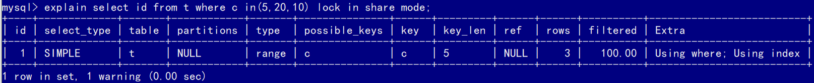
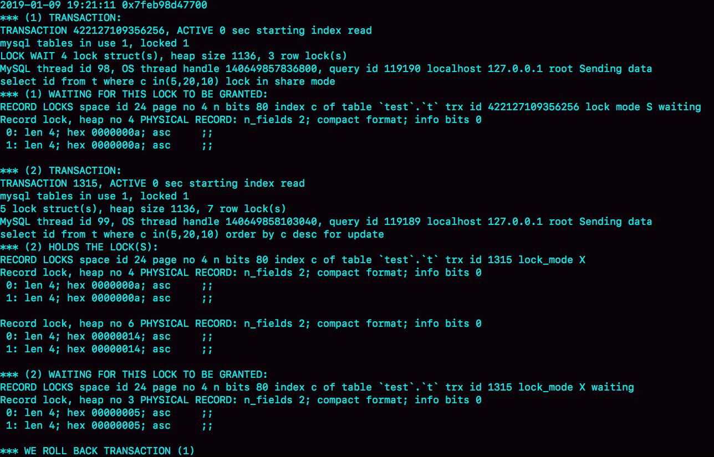
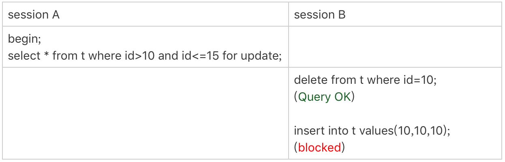
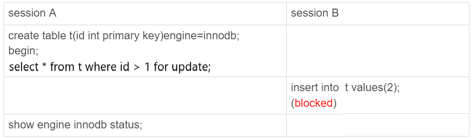
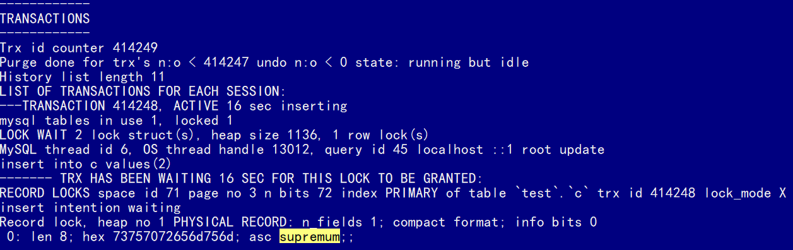
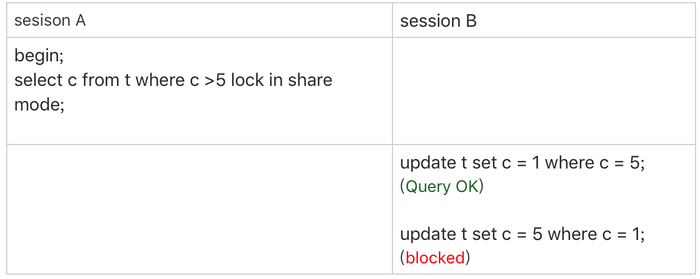

# 加锁规则

**锁是加到索引上去的，加锁规则里面，包含了两个“原则”、两个“优化”和一个“bug”：**

1. 原则1：加锁的基本单位是next-key lock，next-key lock是前开后闭区间。
2. 原则2：查找过程中访问到的对象才会加锁。
3. 优化1：**索引上的等值查询**，给**唯一索引**加锁的时候，next-key lock退化为行锁。
4. 优化2：**索引上的等值查询**，**向右**遍历时且最后一个值不满足等值条件的时候，next-key lock退化为间隙锁。
5. 一个bug：唯一索引上的**范围查询**会访问到不满足条件的第一个值为止。

以下表为例，阐述加锁的细节。\(可重复读隔离级别\)

```text
mysql> CREATE TABLE `t` (
  `id` int(11) NOT NULL,
  `c` int(11) DEFAULT NULL,
  `d` int(11) DEFAULT NULL,
  PRIMARY KEY (`id`),
  KEY `c` (`c`)
) ENGINE=InnoDB;

mysql> insert into t values(0,0,0),(5,5,5),
(10,10,10),(15,15,15),(20,20,20),(25,25,25);
```

## 唯一索引等值锁


由于表`t`中没有`id=7`的记录，首先根据原则1：加锁的基本单位是next-key lock，会给`(5, 10]`加上next-key lock。否则就是只给`id=7`这一行记录加上行锁，因为`id`索引是唯一索引，且是等值查询，next-key lock会退化为行锁。

根据优化2：索引上的等值查询，向右遍历时且最后一个值不满足等值条件的时候，next-key lock退化为间隙锁。即不会给`id=10`这行数据加上行锁。最终加锁范围是`(5, 10)`。

因此，session B要往这个间隙里面插入`id=8`的记录会被锁住，但是session C修改`id=10`这行是可以的。

## 非唯一索引等值锁


首先，**`lock in share mode`只锁覆盖索引**，但是如果是`for update`，系统会认为你接下来要更新数据，因此会顺便给主键索引上满足条件的行加上行锁。

因此，session A给`c=5`这一行加上了读锁，根据原则1，会给`(0, 5]`加上next-key lock。

因为`c`是普通索引，因此`c=5`的数据可能有多行（虽然这里只有1行），所以会继续向右遍历，直到`c=10`才放弃。这个过程中，根据原则2，会再加上`(5, 10]`的next-key lock。但同时满足了优化2，等值查询且最后一个值不满足等值条件，此时`(5, 10]`的next-key lock会退化成`(5, 10)`的间隙锁。

最后，根据原则2：查找过程中**访问到的对象才会加锁**，而**这个查询语句用到了覆盖索引，不需要访问主键索引，所以主键上没有加任何锁。**因此session B的更新成功了。

> 如果要用`lock in share mode`来给行加读锁避免数据被更新的话，就必须得绕过覆盖索引的优化，在查询字段中加入索引中不存在的字段。比如，将session A的查询语句改成`select d from t where c=5 lock in share mode`。

## 主键索引范围锁

对于下面两条语句，虽然逻辑上是相同的，但它们加锁的规则不太一样。因为存在`id=10`的数据，且`id`为主键索引，第一条语句只会给`id=10`加行锁。

```text
mysql> select * from t where id=10 for update;
mysql> select * from t where id>=10 and id<11 for update;
```


session A开始执行时，要找到第一个`id=10`的行，本该是next-key lock`(5,10]`，根据优化1， 主键`id`上的等值条件，退化成行锁，只加了`id=10`这一行的行锁。

范围查找就往后继续找，找到`id=15`这一行停下来，因此需要加next-key lock`(10,15]`。

因此，session A这时候锁的范围就是主键索引上，行锁`id=10`和next-key lock`(10,15]`。

> 首次session A定位查找`id=10`的行的时候，是当做等值查询来判断的，而向右扫描到`id=15`的时候，用的是范围查询判断。

## 非唯一索引范围锁

与上一个例子不同的是，这次用的是普通索引字段`c`。


在第一次用`c=10`定位记录的时候，索引c上加了`(5,10]`这个next-key lock后，由于索引`c`是非唯一索引，没有优化规则，也就是说不会蜕变为行锁，因此最终sesion A加的锁是，索引`c`上的`(5,10]` 和`(10,15]` 这两个next-key lock。

## 唯一索引范围锁bug


session A是一个范围查询，按照原则1的话，应该是索引`id`上只加`(10,15]`这个next-key lock，并且因为`id`是唯一键，所以循环判断到`id=15`这一行就应该停止了。

但是实现上，**InnoDB会往前扫描到第一个不满足条件的行为止**，也就是`id=20`。由于这是个范围扫描，因此索引`id`上的`(15,20]`这个next-key lock也会被锁上。

照理说，这里锁住`id=20`这一行的行为，其实是没有必要的。因为扫描到`id=15`，就可以确定不用往后再找了。

## 非唯一索引上存在"等值"的例子

```text
mysql> insert into t values(30,10,30);
```

这时候，有两条数据的`c`都是10，而在`c`上是有索引的。


即使`c`的值相同，但是它们的主键值`id`是不同的（10和30），因此这两个`c=10`的记录之间，也是有间隙的。

> 接下来用`(c=10,id=30)`这样的形式，来表示索引上的一行。


`delete`语句加锁的逻辑，跟`select ... for update` 是类似的。

session A 在遍历的时候，先访问第一个`c=10`的记录，这时候会给索引`c`加`(c=5,id=5)`到`(c=10,id=10)`这个next-key lock。

然后，session A向右查找，直到碰到`(c=15,id=15)`这一行，循环才结束。根据优化2，这是一个**等值查询**，向右查找到了不满足条件的行，所以会退化成`(c=10,id=10)` 到`(c=15,id=15)`的间隙锁。


蓝色区域左右两边都是虚线，表示开区间，即`(c=5,id=5)`和`(c=15,id=15)`这两行上都没有锁。

## limit 语句加锁


session A的`delete`语句加了`limit 2`。表`t`里`c=10`的记录其实只有两条，因此加不加`limit 2`，删除的效果都是一样的，但是加锁的效果却不同。session B的`insert`语句可以执行了。

这是因为，`delete`语句明确加了`limit 2`的限制，因此在遍历到`(c=10, id=30)`这一行之后，满足条件的语句已经有两条，循环就结束了。


**在删除数据的时候尽量加limit**。这样不仅可以控制删除数据的条数，让操作更安全，还可以减小加锁的范围。

## 一个死锁的例子


1. session A 启动事务后执行查询语句加`lock in share mode`，在索引c上加了next-key lock`(5,10]`和间隙锁`(10,15)`；
2. session B 的`update`语句也要在索引c上加next-key lock`(5,10]` ，进入锁等待。session B申请到了`(5, 10)`的间隙锁，在等待`c=10`的行锁。
3. 然后session A要再插入`(8,8,8)`这一行，被session B的间隙锁锁住。由于出现了死锁，InnoDB让session B回滚。

## 扫描顺序


1. 由于是`order by c desc`，第一个要定位的是索引c上“最右边的”`c=20`的行，找第一个值时是等值查询，所以会加上间隙锁`(20,25)`和next-key lock `(15,20]`。
2. 在索引c上向左遍历，要扫描到`c=10`才停下来，所以next-key lock会加到`(5,10]`，这正是阻塞session B的insert语句的原因。
3. 在扫描过程中，`c=20、c=15、c=10`这三行都存在值，由于是`select *`，所以会在主键索引上加三个行锁。

session A 的`select`语句锁的范围就是：

1. 索引c上`(5, 25)`；
2. 主键索引上`id=15、20`两个行锁。

假如session A的`select`语句是`order by c asc`，则在索引c上加的锁是`(10, 15] (15, 20] (20, 25]`。


## 不等号条件里的等值查询

```
begin;
select * from t where id>9 and id<12 order by id desc for update;
```

这个语句加锁范围是主键索引上的`(0,5]、(5,10]、(10, 15)`，`id=15`这一行并没有加上行锁，这是应用了优化2（索引上的**等值查询**，向右遍历的时候`id=15`不满足条件，所以next-key lock退化为了间隙锁 ），

但是，这条语句没有等于号，为什么会有等值查询呢？

加锁动作是发生在语句执行过程中的，所以在分析加锁行为的时候，要从索引上的数据结构开始。


首先这个查询语句的语义是`order by id desc`，要拿到满足条件的所有行，优化器必须先找到“第一个id<12的值”。这个过程是通过索引树的搜索过程得到的，在引擎内部，其实是要找到`id=12`的这个值，只是最终没找到，但找到了`(10,15)`这个间隙。然后向左遍历，在遍历过程中，就不是等值查询了，会扫描到`id=5`这一行，所以会加一个`next-key lock (0,5]`。

在执行过程中，通过树搜索的方式定位记录的时候，用的是“等值查询”的方法。


## 等值查询的过程

分析下面语句的加锁范围。

```
begin;
select id from t where c in(5,20,10) lock in share mode;
```

这条查询语句用到了`in`，首先看看该语句的`explain`结果：



这条`in`语句使用了索引`c`并且`rows=3`，说明这三个值都是通过B+树搜索定位的。

在查找`c=5`的时候，先锁住了`(0,5]`。但是因为c不是唯一索引，为了确认还有没有别的记录`c=5`，就要向右遍历，找到`c=10`才确认没有了，这个过程满足优化2，所以加了间隙锁(5,10)。

同样的，执行`c=10`这个逻辑的时候，加锁的范围是`(5,10]` 和` (10,15)`；执行`c=20`这个逻辑的时候，加锁的范围是`(15,20] `和 `(20,25)`。

通过这个分析，我们可以知道，这条语句在索引c上加的三个记录锁的顺序是：先加`c=5`的记录锁，再加`c=10`的记录锁，最后加`c=20`的记录锁。这些锁是在执行过程中**一个一个加的**，而不是一次性加上去的。


如果在另一个事务中执行了下面的语句，此时的加锁范围，又是什么呢？

```
mysql> select id from t where c in(5,20,10) order by c desc for update;
```

由于间隙锁不互锁，所以关注行锁，由于是`order by c desc`，所以是先锁`c=20`，然后`c=10`，最后是`c=5`。

与前一个事务相比，加锁相同的资源，但是加锁顺序相反。当这两条语句并发执行的时候，就可能出现死锁。

### 看死锁

前面两个语句并发执行时，出现了死锁，此时执行`show engine innodb status`命令：



- `(1) TRANSACTION`，是第一个事务的信息
  - `WAITING FOR THIS LOCK TO BE GRANTED`，说明这个事务在等待锁
  - `index c of table test.t`，说明在等的是表`t`的索引`c`上面的锁；
  - `lock mode S waiting` 表示这个语句要加一个读锁，当前的状态是等待中；
  - `Record lock`说明这是一个行锁；
  - `n_fields 2`表示这个索引记录有两个字段，也就是字段`c`和主键字段`id`；
  - `0: len 4; hex 0000000a; asc ;;`是第一个字段，也就是`c`。值是十六进制a，也就是10；
  - `1: len 4; hex 0000000a; asc ;;`是第二个字段，也就是主键`id`，值也是10；
  - 这两行里面的asc表示的是，接下来要打印出值里面的“可打印字符”，但10不是可打印字符，因此就显示空格。
  - 第一个事务信息就只显示出了等锁的状态，在等待`(c=10,id=10)`这一行的锁。
  - 既然出现死锁了，就表示这个事务也占有别的锁，但是没有显示出来。可以从第二个事务的信息中推导出来。
- `(2) TRANSACTION`，是第二个事务的信息
  - `HOLDS THE LOCK(S)`部分显示这个事务持有的锁
  - `index c of table test.t `表示锁是在表`t`的索引`c`上
  - `hex 0000000a和hex 00000014`表示这个事务持有`c=10`和`c=20`这两个记录锁
  - `WAITING FOR THIS LOCK TO BE GRANTED`，表示在等`(c=5,id=5)`这个记录锁
- `WE ROLL BACK TRANSACTION (1)`，是最终的处理结果，表示回滚了第一个事务。

即`lock in share mode`的语句，持有`c=5`的记录锁，在等`c=10`的锁；`for update`这个语句，持有`c=20`和`c=10`的记录锁，在等`c=5`的记录锁。

1. 由于锁是一个个加的，要避免死锁，**对同一组资源，要按照尽量相同的顺序访问**；
2. 在发生死锁的时刻，`for update` 这条语句占有的资源更多，回滚成本更大，所以InnoDB选择了回滚成本更小的`lock in share mode`语句，来回滚。


### 看锁等待



由于session A并没有锁住`c=10`这个记录，所以session B删除`id=10`这一行是可以的。但是之后，session B再想`insert id=10`这一行回去就不行了。

此时`show engine innodb status`结果如下：


`index PRIMARY of table test.t `，表示这个语句被锁住是因为表`t`主键上的某个锁。

`lock_mode X locks gap before rec insert intention waiting`，`insert intention`表示当前线程准备插入一个记录，这是一个插入意向锁。`gap before rec `表示这是一个**间隙锁**，而不是记录锁。

> `lock_mode X waiting`表示next-key lock
> `lock_mode X locks rec but not gap`是只有行锁
> `locks gap before rec`，只有间隙锁

`n_fields 5`表示这一个记录有5列：

- `0: len 4; hex 0000000f; asc ;;`，这是主键`id`字段，十六进制`f`就是`id=15`。表明这个间隙是`id=15`之前的，因为`id=10`已经不存在了，它表示的就是`(5,15)`。
- `1: len 6; hex 000000000513; asc ;;`，长度为6字节的事务id，表示最后修改这一行的是`trx id`为1299。
- `2: len 7; hex b0000001250134; asc % 4;;` ，长度为7字节的回滚段信息。这里的acs后面有显示内容(`%`和`4`)，这是因为刚好这个字节是可打印字符。
- 后面两列是`c`和`d`的值，都是15。

由于delete操作把`id=10`这一行删掉了，原来的两个间隙`(5,10)、(10,15`）变成了一个`(5,15)`。

**所谓“间隙”，其实根本就是由“这个间隙右边的那个记录”定义的。**

> **一个空表有间隙吗？**
>
> 一个空表就只有一个间隙。比如，在空表上执行：
>
> ```
> begin;
> select * from t where id>1 for update;
> ```
>
> 这个查询语句加锁的范围就是next-key lock` (-∞, supremum]`。
>
> 
>
> 


## update例子



根据c>5查到的第一个记录是`c=10`，因此不会加`(0,5]`这个next-key lock，所以session A加锁的范围是索引c上的 `(5,10]、(10,15]、(15,20]、(20,25]和(25,supremum]`。

session B的第一个update语句，要把`c=5`改成`c=1`，可以拆为下面两个步骤：

1. 插入`(c=1, id=5)`这个记录；
2. 删除`(c=5, id=5)`这个记录。

这时候`(5,10]`的next-key lock会更新为`(1,10]`，因为间隙锁是由右边的记录(`c=10`)定义的。

接下来session B要执行 `update t set c = 5 where c = 1`这个语句了，一样地可以拆成两步：

1. 插入`(c=5, id=5)`这个记录；
2. 删除`(c=1, id=5)`这个记录。

而第一步就会被间隙锁堵住。


## 读提交

在读提交隔离级别下，上面的例子就相当于过程中去掉间隙锁的部分，只剩下行锁的部分。读提交有一个优化：语句执行过程中加上的行锁，在语句执行完成后，就要把“不满足条件的行”上的行锁直接释放了，不需要等到事务提交。

也就是说，读提交隔离级别下，锁的范围更小，锁的时间更短，这也是不少业务都默认使用读提交隔离级别的原因。

