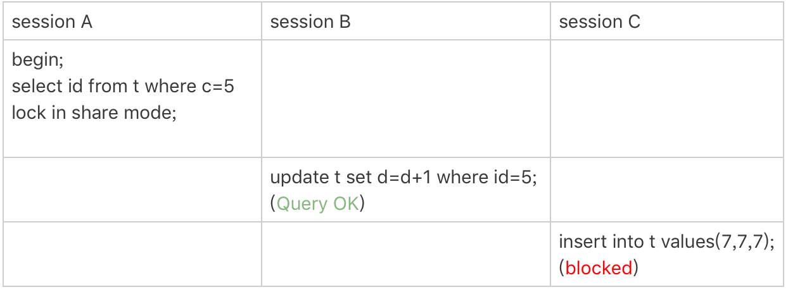
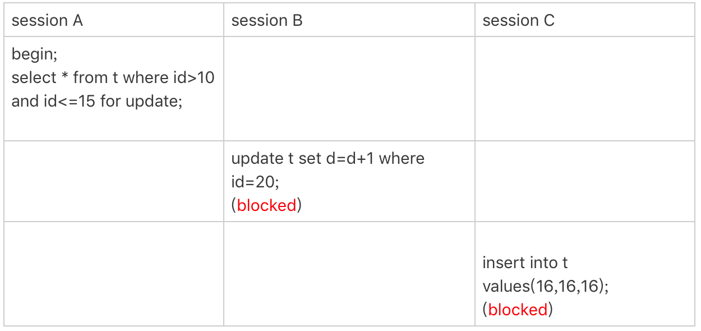
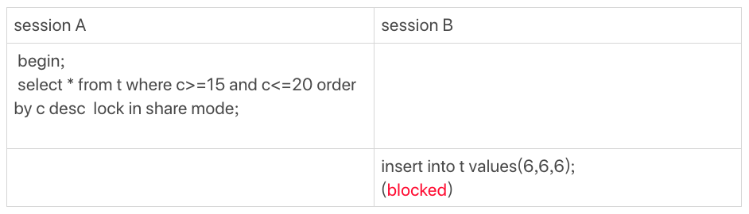

# 加锁规则

**锁是加到索引上去的，加锁规则里面，包含了两个“原则”、两个“优化”和一个“bug”：**

1. 原则1：加锁的基本单位是next-key lock，next-key lock是前开后闭区间。
2. 原则2：查找过程中访问到的对象才会加锁。
3. 优化1：**索引上的等值查询**，给**唯一索引**加锁的时候，next-key lock退化为行锁。
4. 优化2：**索引上的等值查询**，向右遍历时且最后一个值不满足等值条件的时候，next-key lock退化为间隙锁。
5. 一个bug：唯一索引上的**范围查询**会访问到不满足条件的第一个值为止。

以下表为例，阐述加锁的细节。\(可重复读隔离级别\)

```text
mysql> CREATE TABLE `t` (
  `id` int(11) NOT NULL,
  `c` int(11) DEFAULT NULL,
  `d` int(11) DEFAULT NULL,
  PRIMARY KEY (`id`),
  KEY `c` (`c`)
) ENGINE=InnoDB;

mysql> insert into t values(0,0,0),(5,5,5),
(10,10,10),(15,15,15),(20,20,20),(25,25,25);
```

## 唯一索引等值锁


由于表`t`中没有`id=7`的记录，首先根据原则1：加锁的基本单位是next-key lock，会给`(5, 10]`加上next-key lock。否则就是只给`id=7`这一行记录加上行锁，因为`id`索引是唯一索引，且是等值查询，next-key lock会退化为行锁。

根据优化2：索引上的等值查询，向右遍历时且最后一个值不满足等值条件的时候，next-key lock退化为间隙锁。即不会给`id=10`这行数据加上行锁。最终加锁范围是`(5, 10)`。

因此，session B要往这个间隙里面插入`id=8`的记录会被锁住，但是session C修改`id=10`这行是可以的。

## 非唯一索引等值锁



首先，**`lock in share mode`只锁覆盖索引**，但是如果是`for update`，系统会认为你接下来要更新数据，因此会顺便给主键索引上满足条件的行加上行锁。

因此，session A给`c=5`这一行加上了读锁，根据原则1，会给`(0, 5]`加上next-key lock。

因为`c`是普通索引，因此`c=5`的数据可能有多行（虽然这里只有1行），所以会继续向右遍历，直到`c=10`才放弃。这个过程中，根据原则2，会再加上`(5, 10]`的next-key lock。但同时满足了优化2，等值查询且最后一个值不满足等值条件，此时`(5, 10]`的next-key lock会退化成`(5, 10)`的间隙锁。

最后，根据原则2：查找过程中**访问到的对象才会加锁**，而**这个查询语句用到了覆盖索引，不需要访问主键索引，所以主键上没有加任何锁。**因此session B的更新成功了。

> 如果要用`lock in share mode`来给行加读锁避免数据被更新的话，就必须得绕过覆盖索引的优化，在查询字段中加入索引中不存在的字段。比如，将session A的查询语句改成`select d from t where c=5 lock in share mode`。

## 主键索引范围锁

对于下面两条语句，虽然逻辑上是相同的，但它们加锁的规则不太一样。因为存在`id=10`的数据，且`id`为主键索引，第一条语句只会给`id=10`加行锁。

```text
mysql> select * from t where id=10 for update;
mysql> select * from t where id>=10 and id<11 for update;
```


session A开始执行时，要找到第一个`id=10`的行，本该是next-key lock`(5,10]`，根据优化1， 主键`id`上的等值条件，退化成行锁，只加了`id=10`这一行的行锁。

范围查找就往后继续找，找到`id=15`这一行停下来，因此需要加next-key lock`(10,15]`。

因此，session A这时候锁的范围就是主键索引上，行锁`id=10`和next-key lock`(10,15]`。

> 首次session A定位查找`id=10`的行的时候，是当做等值查询来判断的，而向右扫描到`id=15`的时候，用的是范围查询判断。

## 非唯一索引范围锁

与上一个例子不同的是，这次用的是普通索引字段`c`。


在第一次用`c=10`定位记录的时候，索引c上加了`(5,10]`这个next-key lock后，由于索引`c`是非唯一索引，没有优化规则，也就是说不会蜕变为行锁，因此最终sesion A加的锁是，索引`c`上的`(5,10]` 和`(10,15]` 这两个next-key lock。

## 唯一索引范围锁bug



session A是一个范围查询，按照原则1的话，应该是索引`id`上只加`(10,15]`这个next-key lock，并且因为`id`是唯一键，所以循环判断到`id=15`这一行就应该停止了。

但是实现上，**InnoDB会往前扫描到第一个不满足条件的行为止**，也就是`id=20`。由于这是个范围扫描，因此索引`id`上的`(15,20]`这个next-key lock也会被锁上。

照理说，这里锁住`id=20`这一行的行为，其实是没有必要的。因为扫描到`id=15`，就可以确定不用往后再找了。

## 非唯一索引上存在"等值"的例子

```text
mysql> insert into t values(30,10,30);
```

这时候，有两条数据的`c`都是10，而在`c`上是有索引的。


即使`c`的值相同，但是它们的主键值`id`是不同的（10和30），因此这两个`c=10`的记录之间，也是有间隙的。

> 接下来用`(c=10,id=30)`这样的形式，来表示索引上的一行。


`delete`语句加锁的逻辑，跟`select ... for update` 是类似的。

session A 在遍历的时候，先访问第一个`c=10`的记录，这时候会给索引`c`加`(c=5,id=5)`到`(c=10,id=10)`这个next-key lock。

然后，session A向右查找，直到碰到`(c=15,id=15)`这一行，循环才结束。根据优化2，这是一个**等值查询**，向右查找到了不满足条件的行，所以会退化成`(c=10,id=10)` 到`(c=15,id=15)`的间隙锁。


蓝色区域左右两边都是虚线，表示开区间，即`(c=5,id=5)`和`(c=15,id=15)`这两行上都没有锁。

## limit 语句加锁


session A的`delete`语句加了`limit 2`。表`t`里`c=10`的记录其实只有两条，因此加不加`limit 2`，删除的效果都是一样的，但是加锁的效果却不同。session B的`insert`语句可以执行了。

这是因为，`delete`语句明确加了`limit 2`的限制，因此在遍历到`(c=10, id=30)`这一行之后，满足条件的语句已经有两条，循环就结束了。


**在删除数据的时候尽量加limit**。这样不仅可以控制删除数据的条数，让操作更安全，还可以减小加锁的范围。

## 一个死锁的例子


1. session A 启动事务后执行查询语句加`lock in share mode`，在索引c上加了next-key lock`(5,10]`和间隙锁`(10,15)`；
2. session B 的`update`语句也要在索引c上加next-key lock`(5,10]` ，进入锁等待。session B申请到了`(5, 10)`的间隙锁，在等待`c=10`的行锁。
3. 然后session A要再插入`(8,8,8)`这一行，被session B的间隙锁锁住。由于出现了死锁，InnoDB让session B回滚。

## 扫描顺序



1. 由于是`order by c desc`，第一个要定位的是索引c上“最右边的”`c=20`的行，找第一个值时是等值查询，所以会加上间隙锁`(20,25)`和next-key lock `(15,20]`。
2. 在索引c上向左遍历，要扫描到`c=10`才停下来，所以next-key lock会加到`(5,10]`，这正是阻塞session B的insert语句的原因。
3. 在扫描过程中，`c=20、c=15、c=10`这三行都存在值，由于是`select *`，所以会在主键索引上加三个行锁。

session A 的`select`语句锁的范围就是：

1. 索引c上`(5, 25)`；
2. 主键索引上`id=15、20`两个行锁。

假如session A的`select`语句是`order by c asc`，则在索引c上加的锁是`(10, 15] (15, 20] (20, 25]`。

## 读提交

在读提交隔离级别下，上面的例子就相当于过程中去掉间隙锁的部分，只剩下行锁的部分。读提交有一个优化：语句执行过程中加上的行锁，在语句执行完成后，就要把“不满足条件的行”上的行锁直接释放了，不需要等到事务提交。

也就是说，读提交隔离级别下，锁的范围更小，锁的时间更短，这也是不少业务都默认使用读提交隔离级别的原因。

