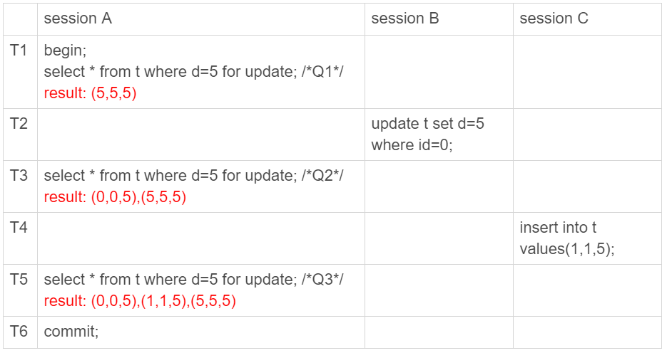
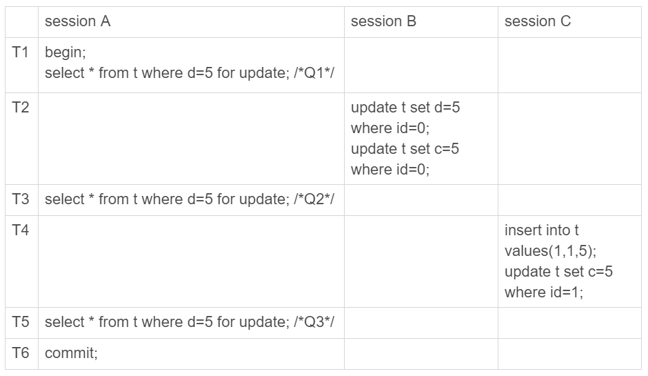

# 幻读

```text
mysql> CREATE TABLE `t` (
  `id` int(11) NOT NULL,
  `c` int(11) DEFAULT NULL,
  `d` int(11) DEFAULT NULL,
  PRIMARY KEY (`id`),
  KEY `c` (`c`)
) ENGINE=InnoDB;

mysql> insert into t values(0,0,0),(5,5,5), (10,10,10),(15,15,15),(20,20,20),(25,25,25);
```

对于这个表，执行下面的语句时，是怎么加锁的？\(**可重复读**隔离级别\)

```text
begin;
select * from t where d=5 for update;
commit;
```

这个语句会命中`d=5`的这一行，对应的主键`id=5`，因此在`select`语句执行完成后，`id=5`这一行会加一个写锁，而且由于两阶段锁协议，这个写锁会在执行`commit`语句的时候释放。

由于字段`d`上没有索引，因此这条查询语句会做全表扫描。那么，其他被扫描到的，但是不满足条件的5行记录上，会不会被加锁呢？

## 幻读是什么

先看看如果只给`id=5`这一行数据加锁，而其他行不加锁，会怎么样。



session A在三个不同的时刻执行了相同的SQL语句，这条语句使用的是当前读，并且加上了**写锁**。

1. Q1只返回`id=5`这一行；
2. 在T2时刻，session B把`id=0`这一行的d值改成了5，因此T3时刻Q2查出来的是`id=0`和`id=5`这两行；
3. 在T4时刻，session C又插入一行`（1,1,5）`，因此T5时刻Q3查出来的是`id=0`、`id=1`和`id=5`的这三行。

其中，**Q3读到`id=1`这一行的现象，被称为“幻读”。**也就是说，幻读指的是一个事务在前后两次查询同一个范围的时候，后一次查询看到了前一次查询没有看到的行。

1. 在可重复读隔离级别下，普通的查询是快照读，是不会看到别的事务插入的数据的。因此，**幻读在“当前读”下才会出现。**
2. 上面session B的修改结果，被session A之后的select语句用“当前读”看到，不能称为幻读。**幻读仅专指“新插入的行”。**

如果按照事务的可见性规则分析，因为这三个查询都是加了`for update`，都是当前读。而当前读的规则，就是要能读到所有已经提交的记录的最新值。并且，session B和sessionC的两条语句，执行后就会提交，所以Q2和Q3就是应该看到这两个事务的操作效果，而且也看到了，这跟事务的可见性规则并不矛盾。但实际上，这对数据和日志的一致性产生了影响。

## 幻读产生的问题

### 破坏语义

session A在T1时刻就声明了，“我要把所有d=5的行锁住，不准别的事务进行读写操作”。而实际上，这个语义被破坏了。



session B的第二条语句`update t set c=5 where id=0`，语义是“把`id=0、d=5`这一行的c值，改成了5”。

由于在T1时刻，session A 还只是给`id=5`这一行加了行锁， 并没有给`id=0`这行加上锁。因此，session B在T2时刻，是可以执行这两条`update`语句的。这样，就破坏了 session A 里Q1语句要锁住所有`d=5`的行的加锁声明。

session C也是一样的道理，对`id=1`这一行的修改，也是破坏了Q1的加锁声明。

### 数据一致性

锁的设计是为了保证数据的一致性。而这个一致性，不止是数据库内部数据状态在此刻的一致性，还包含了**数据和日志在逻辑上的一致性**。


让session A在T1时刻添加一个更新语句，看看如果只锁住`id=5`的数据行，生成的日志怎样。

`update`的加锁语义和`select …for update` 是一致的，所以这时候加上这条`update`语句也很合理。session A声明说“要给d=5的语句加上锁”，就是为了要更新数据，新加的这条`update`语句就是把它认为加上了锁的这一行的d值修改成了100。

在上图的流程执行时，数据库状态变化如下：

1. 经过T1时刻，`id=5`这一行变成`(5,5,100)`，当然这个结果最终是在T6时刻正式提交的;
2. 经过T2时刻，`id=0`这一行变成`(0,5,5)`;
3. 经过T4时刻，表里面多了一行`(1,5,5)`;
4. 其他行跟这个执行序列无关，保持不变。

这时候binlog内容如下：

1. T2时刻，session B事务提交，写入了两条语句；
2. T4时刻，session C事务提交，写入了两条语句；
3. T6时刻，session A事务提交，写入了`update t set d=100 where d=5` 这条语句。

```text
update t set d=5 where id=0; /*(0,0,5)*/
update t set c=5 where id=0; /*(0,5,5)*/

insert into t values(1,1,5); /*(1,1,5)*/
update t set c=5 where id=1; /*(1,5,5)*/

update t set d=100 where d=5;/*所有d=5的行，d改成100*/
```

这个日志序列，拿到备库执行的话，这三行的值变成了`(0,5,100)、(1,5,100)和(5,5,100)`。即`id=0`和`id=1`这两行，发生了数据不一致。

## 可重复读级别防幻读机制

### 行锁

严格来讲，行锁并不是针对幻读的，因为幻读专指**新插入的数据**，而行锁是针对已存在的数据。在这里行锁是用来解决示例中的问题的。

如果给扫描过程中碰到的行都加上写锁，那么其他行就都不能更新了，对应session B会被堵住，


binlog执行序列：

```text
insert into t values(1,1,5); /*(1,1,5)*/
update t set c=5 where id=1; /*(1,5,5)*/

update t set d=100 where d=5;/*所有d=5的行，d改成100*/

update t set d=5 where id=0; /*(0,0,5)*/
update t set c=5 where id=0; /*(0,5,5)*/
```

对于`id=0`这一行数据，数据不一致的问题就解决了。

但是`id=1`这一行数据，在数据库里面的结果是`(1,5,5)`，而根据binlog的执行结果是`(1,5,100)`。因为在T3时刻，我们给所有行加锁的时候，`id=1`这一行还不存在，不存在也就加不上锁。

### 间隙锁

**即使把所有的记录都加上锁，还是阻止不了新插入的记录。**因为新插入记录这个动作，要更新的是**记录之间的“间隙”**。因此，为了解决幻读问题，InnoDB引入了**间隙锁**\(Gap Lock\)。

间隙锁，锁的就是两个值之间的空隙。比如表`t`，初始化插入了6个记录，这就产生了7个间隙。


这样，在执行 `select * from t where d=5 for update`的时候，就不止是给数据库中已有的6个记录加上了行锁，还同时加了7个间隙锁。这样就确保了无法再插入新的记录。

> 数据行是可以加上锁的实体，数据行之间的间隙，也是可以加上锁的实体。
>
> 
>
> 跟行锁有冲突关系的是“另外一个行锁”。
>
> 而**跟间隙锁有冲突关系的，则是“往这个间隙中插入一个记录”这个操作**，间隙锁之间不互锁。


这里session B并不会被堵住。因为表`t`里并没有`c=7`这个记录，因此session A加的是不是行锁，而是间隙锁`(5,10)`。而session B也是在这个间隙加的间隙锁。它们有共同的目标，即：保护这个间隙，不允许插入值。但，它们之间是不冲突的。

间隙锁和行锁合称next-key lock，每个next-key lock是**前开后闭区间**。也就是说，表`t`初始化以后，如果用`select * from t for update`要把整个表所有记录锁起来，就形成了7个next-key lock，分别是 `(-∞,0]、(0,5]、(5,10]、(10,15]、(15,20]、(20, 25]、(25, +supremum]`。

> 对于next-key lock，\(a, b\] 相当于给\(a, b\)区间加间隙锁，给key=b的数据行加行锁。
>
> 因为+∞是开区间，实现上，InnoDB给每个索引加了一个不存在的最大值`supremum`，这样才符合“都是前开后闭区间”。
>
> **加锁顺序**：先加\(a, b\)的间隙锁，然后再加key=b的数据行的行锁。

#### 影响并发

有一个这样的业务逻辑：任意锁住一行，如果这一行不存在的话就插入，如果存在这一行就更新它的数据：

```text
begin;
select * from t where id=N for update;

/*如果行不存在*/
insert into t values(N,N,N);
/*如果行存在*/
update t set d=N set id=N;

commit;
```

这个逻辑一旦有并发，就会碰到死锁。但是每次操作前用`for update`锁起来，已经是最严格的模式了，怎么还会有死锁呢？

因为当有两个线程查询的都是不存在的数据行时，就会锁住同一个间隙，所以两个线程就都死锁了。


1. session A 执行`select … for update`语句，由于`id=9`这一行并不存在，因此会加上间隙锁`(5,10)`;
2. session B 执行`select … for update`语句，同样会加上间隙锁`(5,10)`，间隙锁之间不会冲突，因此这个语句可以执行成功；
3. session B 试图插入一行`(9,9,9)`，被session A的间隙锁挡住了，只好进入等待；
4. session A试图插入一行`(9,9,9)`，被session B的间隙锁挡住了。

至此，两个session进入互相等待状态，形成死锁。当然，InnoDB的死锁检测马上就发现了这对死锁关系，让session A的insert语句报错返回了。

**间隙锁的引入，可能会导致同样的语句锁住更大的范围，这其实是影响了并发度的**。

不过，**间隙锁是在可重复读隔离级别下才会生效的。**

如果把隔离级别设置为读提交的话，就没有间隙锁了。但同时，要解决可能出现的数据和日志不一致问题，需要把binlog格式设置为row。如果读提交隔离级别够用，即业务不需要可重复读的保证，这样考虑到读提交下操作数据的锁范围更小（没有间隙锁），这个选择是合理的。

