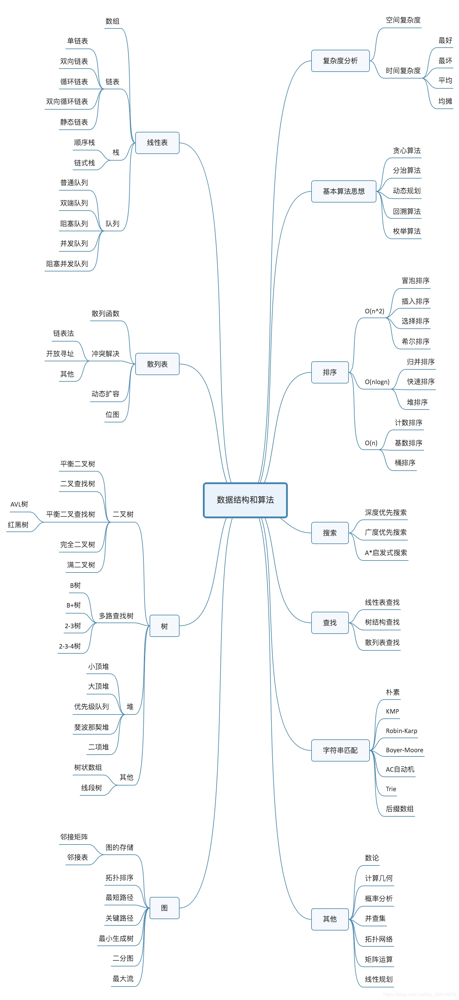

# 算法与数据结构

## 做法

- Chunk it up（切碎知识点）：庖丁解牛、脉络连接
  
- Deliberate practicing（刻意练习）：练习缺陷、不舒服、弱点地方 
- Feedback（获得反馈）
  - 主动型：高手代码、第一视角直播
  - 被动式：code review、教练

[主定理](https://zh.wikipedia.org/wiki/%E4%B8%BB%E5%AE%9A%E7%90%86)


## 大纲




## 时间复杂度

### 非多项式量级

非多项式量级只有两个：$O(2^n)$和$O(n!)$。

当数据规模n越来越大时，非多项式量级算法的执行时间会急剧增加，求解问题的执行时间会无限增长。所以，非多项式时间复杂度的算法其实是非常低效的算法。


### 多项式量级

* $O(1)$：常量级时间复杂度，并不是指只执行了一行代码。只要代码的执行时间不随n的增大而增长，这样代码的时间复杂度都记作O(1)。
* $O(logn)和O(nlogn)$：对数阶时间复杂度

  ```text
   i=1;
   while (i <= n) {
       i = i * 2;
   }
  ```

  变量$i$从1开始，每循环一次就乘以2。$i$的取值是一个等比数列：$2^0、2^1 …… 2^x$，只要知道$x$的值，就知道这行代码执行了多少次。解$2^x=n$得$x=log_2 n$，因此时间复杂度是$O(log_2 n)$。

  即使让$i$每循环一次乘以3，时间复杂度则是$O(log_3 n)$。

  实际上，不管是以2为底、以3为底，还是以10为底，我们可以把所有对数阶的时间复杂度都记为$O(logn)$。

  > 对数之间是可以互相转换的，$log_3n$就等于$log_32  _log_2n$，所以$O(log_3n) = O(C_  log_2n)$，其中$C=log_32$是一个常量，可以忽略。

  如果一段代码的时间复杂度是$O(logn)$，循环执行$n$遍，时间复杂度就是$O(nlogn)$了。

最好情况时间复杂度、最坏情况时间复杂度、平均情况时间复杂度、均摊时间复杂度（amortized time complexity，一种特殊的平均时间复杂度）。

均摊时间复杂度相应的**摊还分析**：对一个数据结构进行一组连续操作中，大部分情况下时间复杂度都很低，只有个别情况下时间复杂度比较高，而且这些操作之间存在前后连贯的时序关系，这个时候，我们就可以将这一组操作放在一块儿分析，看是否能将较高时间复杂度那次操作的耗时，平摊到其他那些时间复杂度比较低的操作上。

在能够应用均摊时间复杂度分析的场合，一般均摊时间复杂度就等于最好情况时间复杂度。

