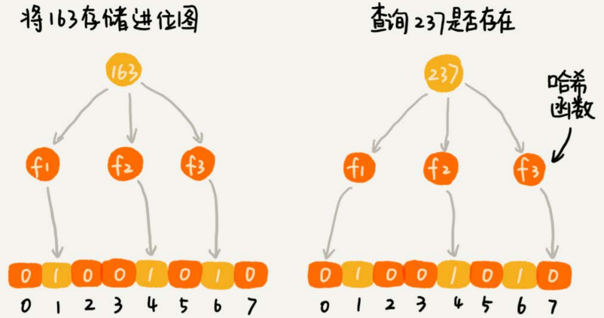
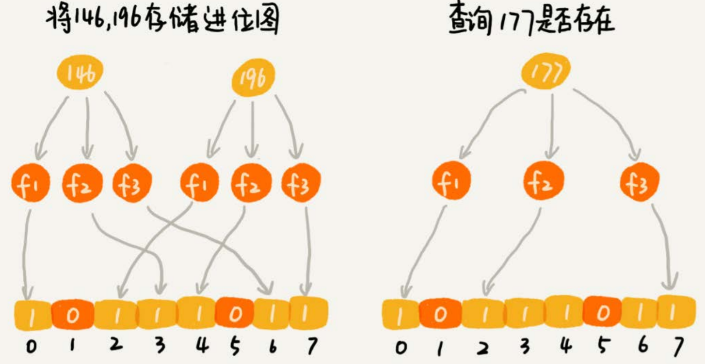

# 位图 布隆过滤器

在爬虫中实现URL过滤器，防止重复爬取相同的网页。用什么数据结构存储已经爬取过的URL，以及判重操作呢？

散列表、红黑树、跳表这些动态数据结构，都能支持快速地插入、查找数据，但是占用内存太大。以散列表为例，假设我们要爬取10亿个网页，为了判重，把这10亿网页链接存储在散列表中。

假设一个URL的平均长度是64字节，那单纯存储这10亿个URL，需要大约60GB的内存空间。因为散列表必须维持较小的装载因子，才能保证不会出现过多的散列冲突，导致操作的性能下降。而且，用链表法解决冲突的散列表，还会存储链表指针。所以，如果将这10亿个URL构建成散列表，那需要的内存空间会远大于60GB，有可能会超过100GB。


## 位图

位图是一种比较“特殊”的散列表，先将要存储的对象通过哈希函数映射到数组的某个下标，然后改变该下标的值。

假设有1千万个整数，整数的范围在1到1亿之间。如何快速查找某个整数是否在这1千万个整数中呢？

申请一个大小为1亿、数据类型为布尔类型的数组。我们将这1千万个整数作为数组下标，将对应的数组值设置成`true`。比如，整数5对应下标为5的数组值设置为true，也就是`array[5]=true`。

当我们查询某个整数K是否在这1千万个整数中的时候，我们只需要将对应的数组值`array[K]`取出来，看是否等于true。如果等于true，那说明1千万整数中包含这个整数K；相反，就表示不包含这个整数K。

由于布尔类型取值只有true或者false，而一个二进制位也有0、1两种取值，因此可以用二进制位替代布尔类型，进一步减少内存开销。

```text
type BitMap struct {
    data []byte
    nbits int
}

func NewBitMap(nbits int) BitMap {
    return &BitMap{
        nbits: nbits,
        data: make([]byte, nbits/8 + 1),
    }
}

func(this BitMap) Set(k int) {
    if k > this.nbits {
        return
    }
    this.data[k/8] |= (1 << (k % 8))
}

func(this BitMap) Get(k int) bool {
    if k > this.nbits {
        return false
    }
    return (this.data[k/8] & (1 << (k % 8))) != 0
}
```

**数字所在的范围不是很大**，使用位图就可以节省很多内存。


### 其他应用

对数字排序：有1亿个整数，数据范围是从1到10亿，快速并且省内存地给这1亿个数据从小到大排序。

用位图只需要 125MB（$10亿/1百万 / 8$） 内存，将1亿个数字依次添加到位图中，然后再将位图按下标从小到大输出值为1的下标，时间复杂度为$O(N)$，N为位图大小。


## 布隆过滤器

> Bloom filter: False is always false. True is maybe true.

布隆过滤器是对位图的改进，它用**多个哈希函数**共同定位一个数据。

使用K个哈希函数，对同一个数字进行求哈希值，那会得到K个不同的哈希值，我们分别记作$X_{1}$，$X_{2}$，$X_{3}$，…，$X_{K}$。我们把这K个数字作为位图中的下标，将对应的BitMap\[$X_{1}$\]，BitMap\[$X_{2}$\]，BitMap\[$X_{3}$\]，…，BitMap\[$X_{K}$\]都设置成true，也就是说，**用K个二进制位，来表示一个数字的存在。**

当我们要查询某个数字是否存在的时候，用同样的K个哈希函数，对这个数字求哈希值，分别得到$Y_{1}$，$Y_{2}$，$Y_{3}$，…，$Y_{K}$。我们看这K个哈希值，对应位图中的数值是否都为true，如果都是true，则说明，这个数字存在，如果有其中任意一个不为true，那就说明这个数字不存在。



对于两个不同的数字来说，经过一个哈希函数处理之后，可能会产生相同的哈希值。但是经过K个哈希函数处理之后，K个哈希值都相同的概率就非常低了。尽管采用K个哈希函数之后，两个数字哈希冲突的概率降低了，但是，这种处理方式又带来了新的问题，那就是容易误判。



布隆过滤器的误判有一个特点，那就是，它只会误判为存在。

* 如果某个数字经过布隆过滤器判断不存在，那说明这个数字真的不存在，不会发生误判
* 如果某个数字经过布隆过滤器判断存在，这个时候才会有可能误判，有可能并不存在。

不过，只要调整哈希函数的个数、位图大小跟要存储数字的个数之间的比例，那就可以将这种误判的概率降到非常低。

也可以为每个哈希函数分配一个位图，这样可以降低冲突概率。

除了有一定的误判率，布隆过滤器的另一个缺点是**删除困难**，当删除某个元素时，直接将几个hash值都清空，可能会影响到其他已有元素的判断。

布隆过滤器用多个哈希函数对同一个网页链接进行处理，CPU只需要将网页链接从内存中读取一次，进行多次哈希计算，理论上讲这组操作是**CPU密集型**的。

而在散列表的处理方式中，需要读取散列冲突拉链的多个网页链接，分别跟待判重的网页链接，进行字符串匹配。这个操作涉及很多内存数据的读取，所以是**内存密集型**的。

CPU计算可能是要比内存访问更快速的，所以，理论上讲，布隆过滤器的判重方式，更加快速。


### 其他应用

除了对URL判重，还可以使用布隆过滤器统计网站每天的UV数（Unique Visitor），使用布隆过滤器，对重复访问的用户，进行去重。

