# 图

## 基本概念

例如社交网络中人与人之间的关系，每个用户可以看作一个顶点，用户间有关系则有边相连。

微信中，两个人互加好友，则类似连接**无向图**中两个顶点的边；微博中，A关注B，则类似在**有向图**中添加一条从A顶点指向B顶点的边。

无向图中有**度**的概念，表示一个顶点有多少条边。

有向图中，则把度分为**入度**（In-degree，有多少条边指向这个顶点）和**出度**（Out-degree，有多少条边是以这个顶点为起点指向其他顶点）。对应到微博的例子，入度就表示有多少粉丝，出度就表示关注了多少人。

**带权图**：边有权重

### 存储方法

#### 邻接矩阵

Adjacency Matrix，底层使用二维数组。

* 对于无向图来说，如果顶点$i$与顶点$j$之间有边，就将$A[i][j]$和$A[j][i]$标记为1
* 对于有向图来说，如果顶点$i$到顶点$j$之间，有一条箭头从顶点$i$指向顶点$j$的边，就将$A[i][j]$标记为1
* 对于带权图，数组中就存储相应的权重。

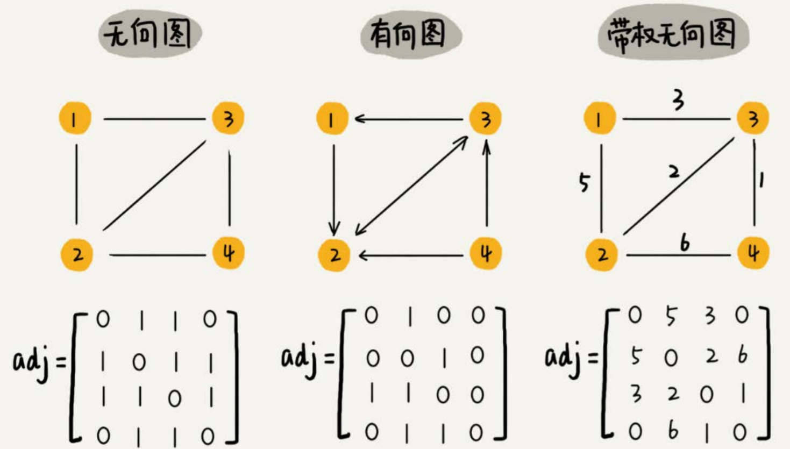

用邻接矩阵来表示一个图，优点是简单、直观，方便使用矩阵运算实现图的运算，缺点是比较浪费存储空间。

对于无向图来说，如果$A[i][j]$等于1，那$A[j][i]$也肯定等于1。实际上，我们只需要存储一个就可以了。也就是说，无向图的二维数组中，如果我们将其用对角线划分为上下两部分，那我们只需要利用上面或者下面这样一半的空间就足够了，另外一半白白浪费掉了。

如果我们存储的是**稀疏图**（Sparse Matrix），即有很多顶点，但每个顶点的边并不多，那邻接矩阵的存储方法就更加浪费空间了。比如微信有好几亿的用户，对应到图上就是好几亿的顶点。但是每个用户的好友并不会很多，一般也就三五百个而已。如果我们用邻接矩阵来存储，那绝大部分的存储空间都被浪费了。

#### 邻接表

Adjacency List，每个顶点对应一条链表，链表中存储的是与这个顶点相连接的其他顶点。

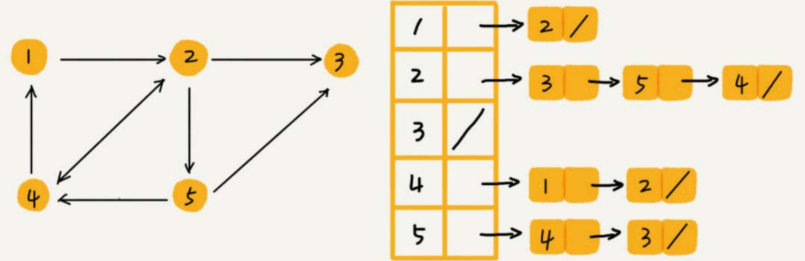

邻接表与邻接矩阵相比，就是用时间换空间。

就像图中的例子，如果我们要确定，是否存在一条从顶点2到顶点4的边，那我们就要遍历顶点2对应的那条链表，看链表中是否存在顶点4。而且，链表的存储方式对缓存不友好。所以，比起邻接矩阵的存储方式，在邻接表中查询两个顶点之间的关系就没那么高效了。

不过，我们也可以将链表换成高效的数据结构，例如平衡二叉搜索树、跳表等。

## 搜索

图上的搜索算法，最直接的理解就是，在图中找出从一个顶点出发，到另一个顶点的路径。具体方法有很多，比如两种最简单、最“暴力”的深度优先、广度优先搜索，还有A\*、IDA\*等启发式搜索算法。

以无向图为例，演示搜索算法。

```text
type Graph struct {
    Count int // 顶点个数
    Adj [][]int // 邻接表
}

func NewGraph(count int) *Graph {
    return &Graph{    
        Count: count,
        Adj: make([][]int, count),
    }
}

func(this *Graph) AddEdge(a, b int) {
    if a >= this.Count || b >= this.Count {
        return
    }
    this.Adj[a] = append(this.Adj[a], b)
    this.Adj[b] = append(this.Adj[b], a)
}
```

### 广度优先BFS

**层层推进**，先查找离起始顶点最近的，然后是次近的，依次往外搜索。

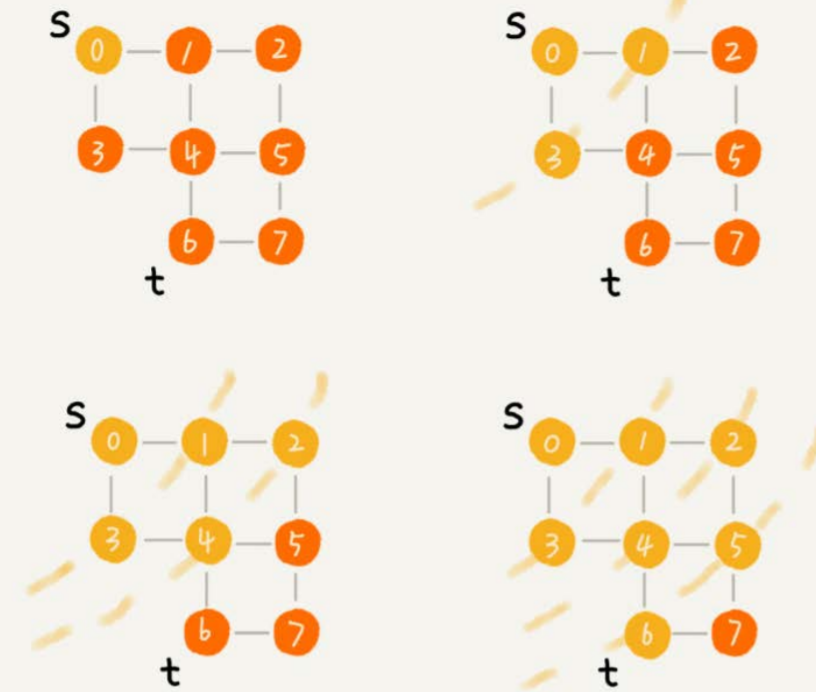

```text
func(this *Graph) BFS(a, b int) {
    if a == b {
        return
    }

    visited := [this.Count]bool // 记录顶点是否被访问
    visited[a] = true

    queue := []int{s} // 队列实现广度优先
    prev := [this.Count]int    // 记录每个顶点的前驱顶点
    for i := range prev {
        prev[i] = -1
    }

    for len(queue) != 0 {
        cur := queue[0]
        queue = queue[1:]
        for i := 0; i < len(this.Adj[cur]); i++ {
            next := this.Adj[cur][i]
            if !visited[next] {
                queue = append(queue, next)
                prev[next] = cur
                visited[next] = true
                if next == b {
                    print(prev, a, b)
                    return
                }
            }
        }
    }
}

func print(prev []int, a, b int) {
    if prev[b] != -1 && a != b {
        print(prev, a, prev[b])
    }
    fmt.Printf("%+v ", b)
}
```

### 深度优先DFS

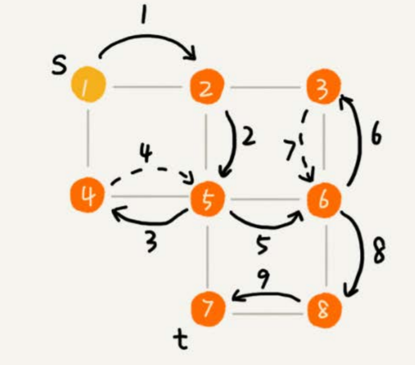

（实线箭头表示遍历，虚线箭头表示回退。）

从图中可以看出，深度优先搜索找出来的路径，并不是顶点s到顶点t的最短路径。

```text
var found bool
func(this *Graph) DFS(a, b int) {
    if a == b {
        return
    }

    found := false // 记录是否找到b
    visited := make([]bool, this.Count)
    prev := make([]int, this.Count)
    for i := range prev {
        prev[i] = -1
    }
    recurDFS(a, b, visited, prev)
    print(prev, a, b)
}

func(this *Graph) recurDFS(a, b int, visited []bool, prev []int) {
    visited[a] = true

    for i := 0; i < len(this.Adj[a]); i++ {
        next := this.Adj[a][i]
        if !visited[next] {
            prev[next] = a
            if b == next {
                found = true
                return
            }
            recurDFS(next, b, visited, prev)
        }
        if found {
            return
        }
    }
}
```

## 拓扑排序

在编译一个项目时，需要先确定代码源文件的编译依赖关系，即按照依赖关系，依次编译每个源文件。比如，A.cpp依赖B.cpp，那在编译的时候，编译器需要先编译B.cpp，才能编译A.cpp。

编译器通过分析源文件或者程序员事先写好的编译配置文件（比如Makefile文件），来获取这种局部的依赖关系。那编译器又该如何通过源文件两两之间的局部依赖关系，确定一个全局的编译顺序呢？

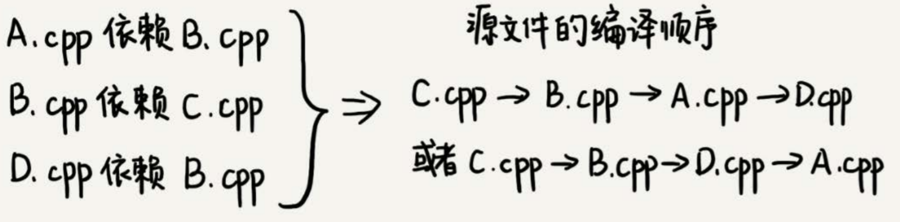

这个问题的解决思路与图的拓扑排序相关，什么是拓扑排序呢？

### 定义

我们在穿衣服的时候都有一定的顺序，我们可以把这种顺序想成，衣服与衣服之间有一定的依赖关系。比如说，你必须先穿袜子才能穿鞋，先穿内裤才能穿秋裤。假设我们现在有八件衣服要穿，它们之间的两两依赖关系我们已经很清楚了，那如何安排一个穿衣序列，能够满足所有的两两之间的依赖关系？

这就是个拓扑排序问题。在很多时候，**拓扑排序的序列并不是唯一的**。

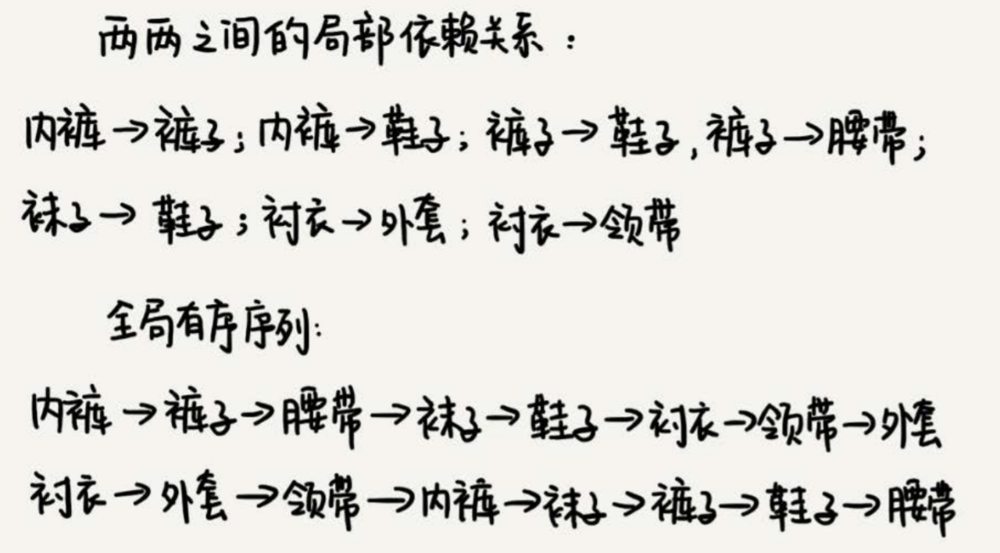

### 实现

我们可以把源文件与源文件之间的依赖关系，抽象成一个**有向无环图**。**每个源文件对应图中的一个顶点，源文件之间的依赖关系就是顶点之间的边。**

如果a先于b执行，也就是说b依赖于a，那么就在顶点a和顶点b之间，构建一条从a指向b的边。

```text
type Graph struct {
    Count int // 顶点个数
    Adj [][]int // 邻接表
}

func NewGraph(count int) *Graph {
    return &Graph{    
        Count: count,
        Adj: make([][]int, count),
    }
}

func(this *Graph) AddEdge(a, b int) { // a先于b，边a->b
    if a >= this.Count || b >= this.Count {
        return
    }
    this.Adj[a] = append(this.Adj[a], b)
}
```

#### Kahn算法

贪心算法思想：如果某个顶点入度为0， 那就表示，没有任何顶点必须先于这个顶点执行，那么这个顶点就可以执行了。

我们先从图中，找出一个入度为0的顶点，将其输出到拓扑排序的结果序列中，并且把这个顶点从图中删除（也就是把这个顶点可达的顶点的入度都减1）。循环执行上面的过程，直到所有的顶点都被输出。最后输出的序列，就是满足局部依赖关系的拓扑排序。

```text
func(this Graph) TopoSortByKahn() {
    inDegree := make([]int, this.Count) // 统计每个顶点的入度
    for i := 0; i < this.Count; i++ {
        for j := 0; j < len(this.Adj[i]); j++ {
            inDegree[this.Adj[i][j]]++
        }
    }

    var queue []int
    for i := 0; i < this.Count; i++ {
        if inDegree[i] == 0 {
            queue = append(queue, i)
        }
    }

    for len(queue) > 0 {
        index := queue[0]
        queue = queue[1:]
        fmt.Print(index, '->')
        for i := 0; i < len(this.Adj[index]); i++ {
            inDegree[this.Adj[index][i]]--
            if inDegree[this.Adj[index][i]] == 0 {
                queue = append(queue, i)
            }
        }
    }
}
```

如果最后输出的顶点个数，少于图中顶点个数，图中还有入度不是0的顶点，那就说明，图中存在环。

#### DFS算法

```text
func(this Graph) TopoSortByDFS() {
    inverseAdj := make([][]int, this.Count) // 逆邻接表
    for i := 0; i < this.Count; i++ {
        for j := 0; j < len(this.Adj[i]); j++ {
            inverseAdj[this.Adj[i][j]] = append(inverseAdj[this.Adj[i][j]], i)
        }
    }

    visited := make([]bool, this.Count)
    for i := 0; i < this.Count; i++ {
        if !visited[i] {
            visited[i] = true
            dfs(i, inverseAdj, visited)
        }
    }
}

func dfs(vertex int, inverseAdj [][]int, visited []bool) {
    for i := 0; i < len(inverseAdj[vertex]); i++ {
        if visited[inverseAdj[vertex][i]] {
            continue
        }
        visited[inverseAdj[vertex][i]] = true
        dfs(inverseAdj[vertex][i], inverseAdj, visited)
    }
    // 先输出它可达的所有顶点，也就是说，先把它依赖的所有的顶点输出,再输出自己
    fmt.Print(vertex, "->")
}
```

## 最短路径

地图软件的路径规划，最短路线、最少用时或最少红绿灯。先进行建模，把每个岔路口看作一个顶点，岔路口与岔路口之间的路看作一条边，路的长度就是边的权重（对于最短路线）。

如果路是单行道，我们就在两个顶点之间画一条有向边；如果路是双行道，我们就在两个顶点之间画两条方向不同的边。这样，整个地图就被抽象成一个**有向有权图**。

问题就转化为，在一个有向有权图中，求两个顶点间的最短路径。

```text
type Edge struct {
    Sid int // 起始顶点编号
    Eid int // 终止顶点编号
    Weight int // 权重
}

func NewEdge(sid, eid, weight int) Edge {
    return Edge{
        Sid: sid,
        Eid: eid,
        Weight: weight,
    }
}

// 用于Dijkstra算法中
type Vertex struct {
    Id int // 顶点编号
    Dist int // 从起点到该点距离
}

func NewVertex(id, dist int) Vertex {
    return Vertex{
        Id: id,
        Dist: dist,
    }    
}

type Graph struct {
    Count int // 顶点个数
    Adj [][]Edge // 邻接表
}

func NewGraph(count int) *Graph {
    return &Graph{    
        Count: count,
        Adj: make([][]Edge, count),
    }
}

func(this *Graph) AddEdge(a, b, weight int) { // 边a->b
    if a >= this.Count || b >= this.Count {
        return
    }
    this.Adj[a] = append(this.Adj[a], NewEdge(a, b, weight))
}
```

### Dijkstra算法

单源最短路径算法（一个顶点到一个顶点），贪心算法，每次选择最小的边。

```text
// 从顶点a到b的最短路径
func(this Graph) Dijkstra(a, b int) {
    predecessor := make([]int, this.Count)
    vertexs := make([]Vertex, this.Count) // 记录从起始顶点到每个顶点的距离
    for i := range vertexs {
        vertexs[i] = NewVertex(i, math.MaxInt32) // 初始化距离无限大
    }

    queue := make([]Vertex, 1) // 优先级队列，最小堆
    vertexs[a].Dist = 0
    queue = append(queue, vertexs[a])
    inqueue := make([]bool, this.Count) // 记录是否已经在最小堆中
    inqueue[a] = true

    for len(queue) > 1 { // 下标0处不存储
        minVertex := queue[1] // 取 距离已选顶点 最近的顶点
        if minVertex.Id == b {
            break
        }
        // 删除元素后需要堆化
        queue[1] = queue[len(queue) - 1]
        queue = queue[:len(queue) - 1]
        heapify2(queue)

        // 取出每一条与当前顶点相连的边，计算使用当前顶点作为中继的距离
        for i := 0; i < len(this.Adj[minVertex.Id]); i++ {
            edge := this.Adj[minVertex.Id][i] 
            oldDist := vertexs[edge.Eid].Dist
            if minVertex.Dist + edge.Weight < oldDist {
                vertexs[edge.Eid].Dist = minVertex.Dist + edge.Weight
                predecessor[edge.Eid] = minVertex.Id
                if inqueue[edge.Eid] == false {
                    //从下往上堆化
                    queue = append(queue, vertexs[edge.Eid])
                    heapify(queue)
                    inqueue[edge.Eid] = true
                } else {
                    update(queue, edge.Eid, vertexs[edge.Eid].Dist)
                }
            }
        }
    }

    print(a, b, predecessor)
}

// 从下往上堆化
func heapify(queue []Vertex) {
    i := len(queue) - 1
    for i > 1 && queue[i].Dist < queue[i/2].Dist {
        queue[i], queue[i/2] = queue[i/2], queue[i]
        i /= 2
    }
}

// 从上往下堆化
func heapify2(queue []Vertex) {
    i := 1
    size := len(queue)
    for {
        min := i
        if 2*i < size && queue[i].Dist > queue[i*2].Dist {
            min = i * 2
        }
        if 2*i+1 < size && queue[min].Dist > queue[i*2+1].Dist {
            min = i * 2 + 1
        }


        if min == i {
            return
        }
        queue[i], queue[min] = queue[min], queue[i]
        i = min
    }
}

// 更新Id为id的顶点，因为每次更新后，该顶点的dist肯定是减少的，所以从下往上堆化即可
func update(queue []Vertex, id, newDist int) {
    var pos int
    for i := 1; i < len(queue); i++ {
        if queue[i].Id == id {
            pos = i
            break
        }
    }

    queue[pos].Dist = newDist
    for pos > 1 && queue[pos].Dist < queue[pos/2].Dist {
        queue[pos], queue[pos/2] = queue[pos/2], queue[pos]
        pos /= 2
    }
}

func print(a, b int, predecessor []int) {
    if b == a {
        fmt.Print(a)
    } else {
        print(a, predecessor[b], predecessor)
        fmt.Print("->", b)
    }
}
```

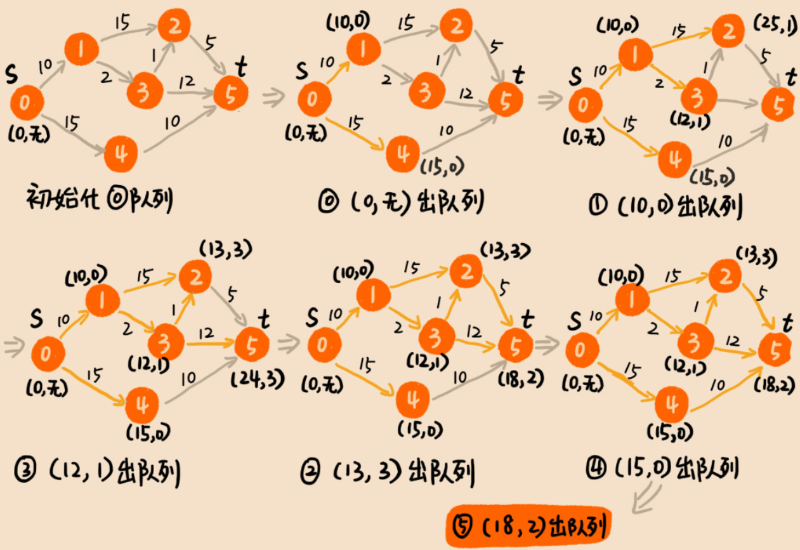

从理论上讲，用Dijkstra算法可以计算出两点之间的最短路径。但是，对于一个超级大地图来说，岔路口、道路都非常多，对应到图这种数据结构上来说，就有非常多的顶点和边。如果为了计算两点之间的最短路径，在一个超级大图上动用Dijkstra算法，遍历所有的顶点和边，显然会非常耗时。

类似出行路线这种工程上的问题，我们没有必要非得求出个绝对最优解。很多时候，为了兼顾执行效率，我们只需要计算出一个可行的次优解就可以了。

虽然地图很大，但是两点之间的最短路径或者说较好的出行路径，并不会很“发散”，只会出现在两点之间和两点附近的区块内。所以我们可以在整个大地图上，划出一个小的区块，这个小区块恰好可以覆盖住两个点，但又不会很大。我们只需要在这个小区块内部运行Dijkstra算法，这样就可以避免遍历整个大图，也就大大提高了执行效率。

如果两点距离比较远，从北京海淀区某个地点，到上海黄浦区某个地点，那上面这种处理方法，显然就不工作了，毕竟覆盖北京和上海的区块并不小。\(hint：在地图App中，缩小放大一下地图，看看地图上的路线的变化\)

对于这样两点之间距离较远的路线规划，我们可以把北京海淀区或者北京看作一个顶点，把上海黄浦区或者上海看作一个顶点，先规划大的出行路线。比如，如何从北京到上海，必须要经过某几个顶点，或者某几条干道，然后再细化每个阶段的小路线。

最短路径问题就解决了，对于最少时间和最少红绿灯问题，解法也是类似的，只要将边的权重变成通过边的时间或者这条边上红绿灯数量。

除了路线规划，还可以用在一些看似完全不相关的问题上。

假设有一个翻译系统，只能针对单个词来做翻译。如果要翻译一整个句子，我们需要将句子拆成一个一个的单词，再丢给翻译系统。针对每个单词，翻译系统会返回一组可选的翻译列表，并且针对每个翻译打一个分，表示这个翻译的可信程度。

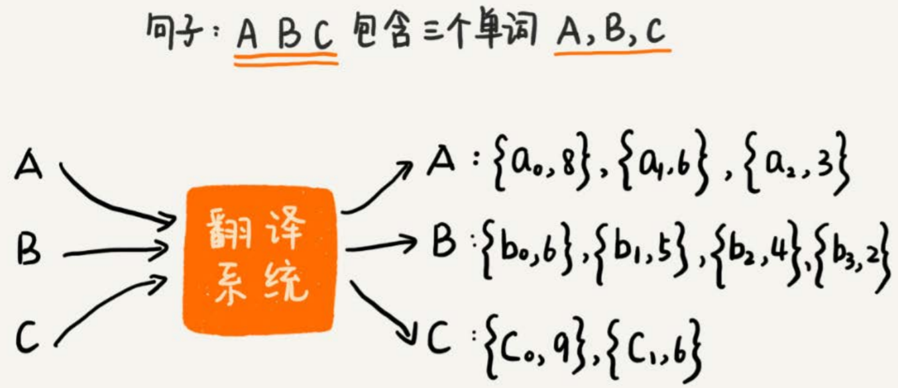

针对每个单词，我们从可选列表中，选择其中一个翻译，组合起来就是整个句子的翻译。每个单词的翻译的得分之和，就是整个句子的翻译得分。随意搭配单词的翻译，会得到一个句子的不同翻译。针对整个句子，我们希望计算出得分最高的前k个翻译结果。

可以通过回溯穷举所有可能结果，但是这样效率不高，时间复杂度是$O\(m^n\)$，其中，$m$表示平均每个单词的可选翻译个数，$n$表示一个句子中包含多少个单词。

由于每个单词的可选翻译是**按照分数从大到小排列**的，所以$a_{0}b_{0}c_{0}$肯定是得分最高组合结果。我们把$a_{0}b_{0}c_{0}$及得分作为一个对象，放入到优先级队列中。

借助Dijkstra算法的核心思想，我们每次从优先级队列中取出一个得分最高的组合，并基于这个组合进行扩展。扩展的策略是每个单词的翻译分别替换成该单词的下一个翻译。比如$a_{0}b_{0}c_{0}$扩展后，会得到三个组合，$a_{1}b_{0}c_{0}$、$a_{0}b_{1}c_{0}$、$a_{0}b_{0}c_{1}$。我们把扩展之后的组合，加到优先级队列中。重复这个过程，直到获取到k个翻译组合或者队列为空。


假设句子包含`n`个单词，每个单词平均有`m`个可选的翻译，我们求得分最高的前`k`个组合结果。每次一个组合出队列，就对应着一个组合结果，我们希望得到`k`个，那就对应着`k`次出队操作。每次有一个组合出队列，就有`n`个组合入队列。优先级队列中出队和入队操作的时间复杂度都是$O\(logX\)$，X表示队列中的组合个数。所以，总的时间复杂度就是$O\(k\_n\_logX\)$。

`k`次出入队列，队列中的总数据不会超过`kn`，也就是说，出队、入队操作的时间复杂度是$O\(log\(k\_n\)\)$。所以，总的时间复杂度就是$O\(k\_n\_log\(k\_n\)\)$，比之前的指数级时间复杂度降低了很多。

### A\*算法

Dijkstra算法每次都找距离最短的顶点，有可能从起点到该顶点的方向与从起点到终点的方向相反。而A\*算法会综合考虑当前距离起点最近的顶点 和 新顶点与终点的大概距离。

以游戏中的自动寻路功能为例，人物的起点就是他当下所在的位置，终点就是鼠标点击的位置。我们需要在地图中，找一条从起点到终点的路径。这条路径要绕过地图中所有障碍物，并且看起来要是一种非常聪明的走法。所谓“聪明”，笼统地解释就是，走的路不能太绕。理论上讲，最短路径显然是最聪明的走法，是这个问题的最优解。

但是求解最短路径，对于比较大的地图，使用Dijkstra算法效率太低。实际上，像出行路线规划、游戏寻路，这些真实软件开发中的问题，一般情况下，我们都不需要非得求最优解（也就是最短路径）。在**权衡路线规划质量和执行效率**的情况下，我们只需要寻求一个次优解就足够了。

Dijkstra算法有点儿类似BFS算法，它每次找到跟起点最近的顶点，往外扩展。这种往外扩展的思路，其实有些盲目。以下图为例，每个顶点在地图中的位置，我们用一个二维坐标`（x，y）`来表示。

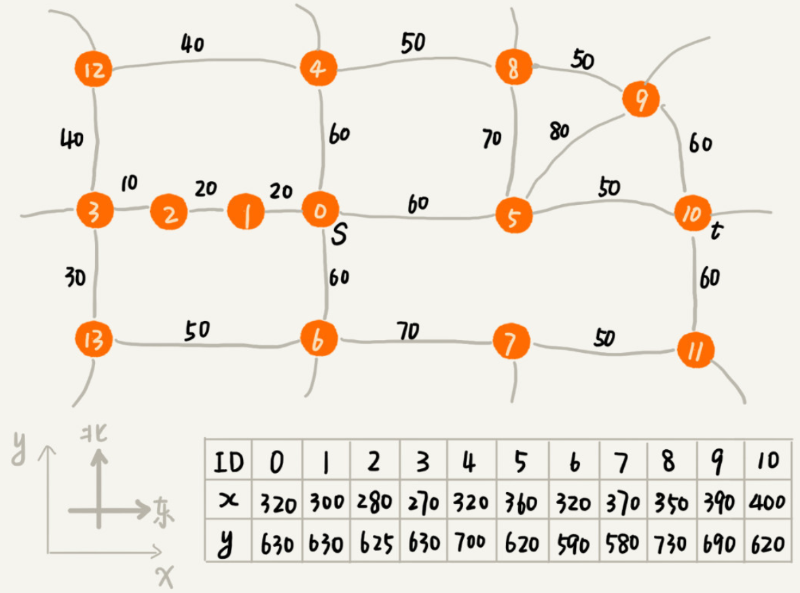

在Dijkstra算法的实现思路中，我们用一个优先级队列，来记录**已经遍历到的顶点以及这个顶点与起点的路径长度**。顶点与起点路径长度越小，就越先被从优先级队列中取出来扩展，上图中，尽管我们找的是从s到t的路线，但是最先被搜索到的顶点依次是1，2，3。这个搜索方向跟我们期望的路线方向（s到t是从西向东）是反着的，路线搜索的方向明显“跑偏”了。

之所以会“跑偏”，是因为我们只考虑了顶点与起点的路径长度的大小，与起点越近的顶点，就会越早出队列。并没有考虑到这个顶点到终点的距离，所以，在地图中，尽管1，2，3三个顶点离起始顶点最近，但离终点却越来越远。

而A\*算法解决这种盲目的方法，就是引入了待考察顶点与终点的距离。这个距离，可以是欧几里得距离，也可以是曼哈顿距离（两点之间横纵坐标的距离之和，实际使用该距离，因为计算简单）。

当我们遍历到某个顶点的时候，从起点走到这个顶点的路径长度是确定的，我们记作`g(i)`（i是这个顶点的编号，下同）。

然后使用曼哈顿距离估计这个顶点跟终点之间的大概距离，把这个距离记作`h(i)`。

原来只是单纯地通过顶点与起点之间的路径长度`g(i)`，来判断谁先出队列，现在有了顶点到终点的路径长度估计值，我们通过两者之和`f(i)=g(i)+h(i)`，来判断哪个顶点该最先出队列。`f(i)`的专业叫法是估价函数（evaluation function）。

#### 实现

使用的数据结构与Dijkstra算法中的相同，除了`Vertex`需要加入横纵坐标 和 堆化时根据每个顶点的`F`值进行判断。

```text
type Vertex struct {
    Id int // 顶点编号
    Dist int // 从起点到该点距离
    X, Y int // 横纵坐标
    F int // F = Dist + g
}

func NewVertex(id, dist, x, y int) Vertex {
    return Vertex{
        Id: id,
        Dist: dist,
        X: x,
        Y: y,
    }    
}

func hManhattan(Vertex v1, Vertex v2) int { // Vertex表示顶点，后面有定义
 return int(math.Abs(float64(v1.X - v2.X)) + math.Abs(float64(v1.Y - v2.Y)));
}
```

A\*算法的代码实现的主要逻辑是跟Dijkstra算法的代码实现，主要有3点区别：

* **优先级队列构建的方式不同**。A\*算法是根据`f`值来构建优先级队列，而Dijkstra算法是根据dist值来构建优先级队列
* A\*算法在更新顶点dist值的时候，会同步更新`f`值
* **循环结束的条件也不一样**。Dijkstra算法是在终点出队列的时候才结束，A\*算法是一旦遍历到终点就结束

```text
func(this *Graph) AStar(a, b int) {
     predecessor := make([]int, this.Count)
    vertexs := make([]Vertex, this.Count) // 记录从起始顶点到每个顶点的距离
    for i := range vertexs {
        vertexs[i] = NewVertex(i, math.MaxInt32, x, y) // 初始化距离无限大
    }

    queue := make([]Vertex, 1) // 优先级队列，最小堆
    vertexs[a].Dist = 0
    vertexs[a].F = 0
    queue = append(queue, vertexs[a])
    inqueue := make([]bool, this.Count) // 记录是否已经在最小堆中
    inqueue[a] = true

    for len(queue) > 1 { // 下标0处不存储
        minVertex := queue[1] // 取 距离已选顶点 最近的顶点
        // 删除元素后需要堆化
        queue[1] = queue[len(queue) - 1]
        queue = queue[:len(queue) - 1]
        heapify2(queue)

        // 取出每一条与当前顶点相连的边，计算使用当前顶点作为中继的距离
        for i := 0; i < len(this.Adj[minVertex.Id]); i++ {
            edge := this.Adj[minVertex.Id][i] 
            oldDist := vertexs[edge.Eid].Dist
            if minVertex.Dist + edge.Weight < oldDist {
                vertexs[edge.Eid].Dist = minVertex.Dist + edge.Weight
                vertexs[edge.Eid].F = vertexs[edge.Eid].Dist + hManhattan(vertexs[edge.Eid], vertexes[b])
                predecessor[edge.Eid] = minVertex.Id
                if inqueue[edge.Eid] == false {
                    //从下往上堆化
                    queue = append(queue, vertexs[edge.Eid])
                    heapify(queue)
                    inqueue[edge.Eid] = true
                } else {
                    update(queue, edge.Eid, vertexs[edge.Eid].Dist)
                }
            }

            if edge.Eid == b {
                break // 只要到达终点b即可，不必是最优解
            }
        }
    }

    print(a, b, predecessor)
}
```

尽管A\*算法可以更加快速的找到从起点到终点的路线，但它找到的不一定是最短路线。要找出起点a到终点b的最短路径，最简单的方法是，通过回溯穷举所有从a到达b的不同路径，然后对比找出最短的那个。不过很显然，回溯算法的执行效率非常低，是指数级的。

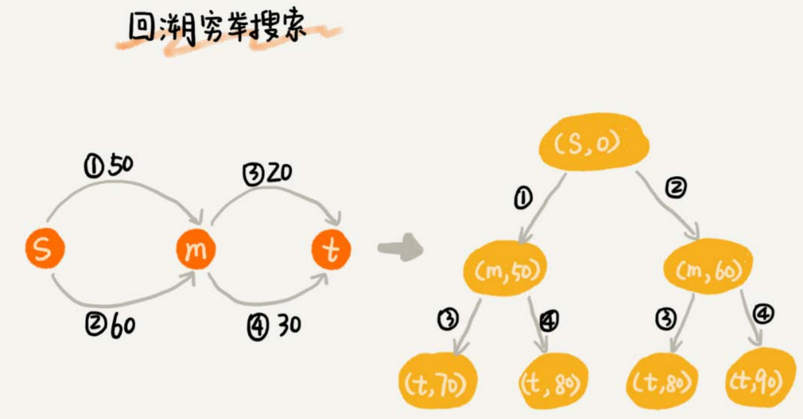

Dijkstra算法在此基础之上，利用动态规划的思想，对回溯搜索进行了剪枝，只保留起点到某个顶点的最短路径，继续往外扩展搜索。动态规划相较于回溯搜索，只是换了一个实现思路，但它实际上也考察到了所有从起点到终点的路线，所以才能得到最优解。

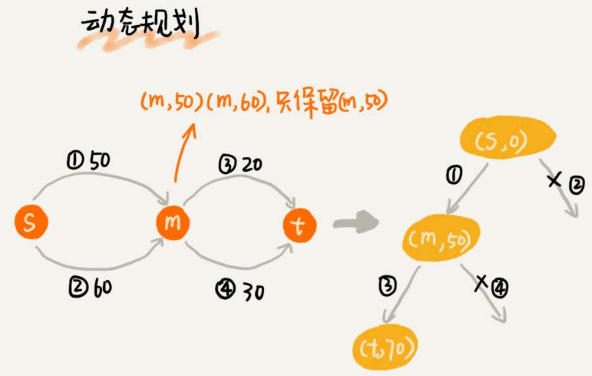

A\*算法之所以不能像Dijkstra算法那样，找到最短路径，主要原因是两者的while循环结束条件不一样。

* Dijkstra算法是在终点出队列的时候才结束，这时候终点的`dist`值是优先级队列中所有顶点的最小值，即便再运行下去，终点的`dist`值也不会再被更新了。
* A\*算法是一旦遍历到终点就结束while循环，这个时候，终点的`dist`值未必是最小值。

A\*算法利用贪心算法的思路，每次都找`f`值最小的顶点出队列，一旦搜索到终点就不在继续考察其他顶点和路线了。所以，它并没有考察所有的路线，也就不一定能找出最短路径了。


### Floyd算法

求图中顶点两两间的最短距离，在不存在负权环的情况下使用。

```
g[n][n]: 初始化为两点间的距离

for k := 0; k < n; k++ { // 考虑经过第k个点
    for i := 0; i < n; i++ {
		for j := 0; j < n; j++ {
			g[i][j] = min(g[i][j], g[i][k] + g[k][j])
		}
    }
}
```


## 应用

### 微博用户关系

假设需要支持下列操作：

* 判断用户A是否关注了用户B
* 判断用户A是否被B关注
* 用户A关注用户B
* 用户A取消关注用户B
* 根据用户名称的首字母排序，分页获取用户的粉丝列表
* 根据用户名称的首字母排序，分页获取用户的关注列表

因为社交网络是一张稀疏图，使用邻接矩阵存储比较浪费存储空间，所以采用邻接表来存储。

但是仅用一个邻接表是不够的，查找某个用户关注了哪些用户非常容易，但是如果要想知道某个用户都被哪些用户关注了，即用户的粉丝列表，是非常困难的。

所以可以再用一个逆邻接表。

* 邻接表中存储了用户的关注关系，逆邻接表中存储的是用户的被关注关系。
* 对应到图上，邻接表中，每个顶点的链表中，存储的就是这个顶点指向的顶点。

  逆邻接表中，每个顶点的链表中，存储的是指向这个顶点的顶点。

* 如果要查找某个用户关注了哪些用户，可以在邻接表中查找；

  如果要查找某个用户被哪些用户关注了，从逆邻接表中查找。

基础的邻接表不适合**快速**判断两个用户之间是否是关注与被关注的关系，因为还需要按照用户名称的首字母排序，分页来获取用户的粉丝列表或者关注列表，用跳表这种结构再合适不过了。因为，跳表插入、删除、查找都非常高效，时间复杂度是$O\(logn\)$，空间复杂度上稍高，是$O\(n\)$。最重要的一点，跳表中存储的数据本来就是有序的了，分页获取粉丝列表或关注列表，就非常高效。

对于小规模的数据，比如社交网络中只有几万、几十万个用户，我们可以将整个社交关系存储在内存中。

但是如果像微博那样有上亿的用户，数据规模太大，我们就无法全部存储在内存中了。可以通过哈希算法等数据分片方式，将邻接表存储在不同的机器上。

例如下图，在机器1上存储顶点1，2，3的邻接表，在机器2上，存储顶点4，5的邻接表。逆邻接表的处理方式也一样。

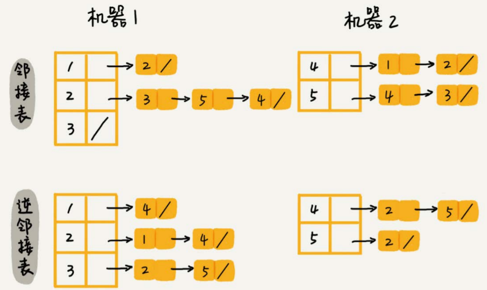

当要查询顶点与顶点关系的时候，就利用同样的哈希算法，先定位顶点所在的机器，然后再在相应的机器上查找。

也可以使用硬盘存储，或者图数据库。

