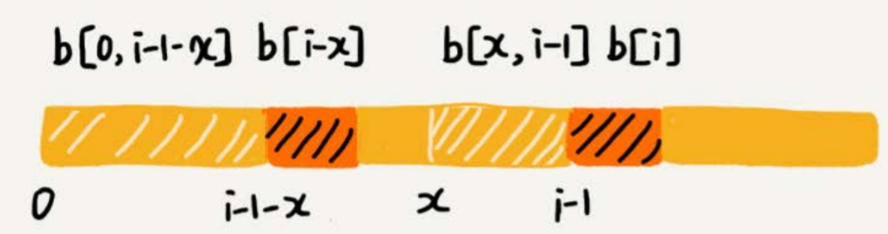
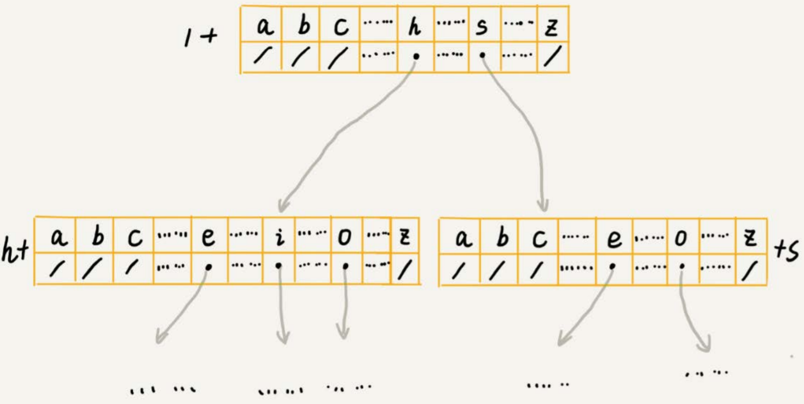

# 字符串

在字符串A中查找字符串B，定义字符串A是**主串**，字符串B是**模式串**。把主串的长度记作`n`，模式串的长度记作`m`。因为是在主串中查找模式串，所以`n > m`。


## 单模式匹配

一个串跟一个串进行匹配。

### Brute Force

在主串中，检查起始位置分别是0、1、2…n-m且长度为$m$的$n-m+1$个子串，看有没有跟模式串匹配的。

每次出现不匹配时，只能将主串上的指针后移一位，将模式串的指针指向第一个字符。

在极端情况下，比如主串是“aaaaa…aaaaaa”，模式串是“aaaaab”。每次都比对m个字符，要比对n-m+1次，所以，这种算法的最坏情况时间复杂度是$O(n*m)$。

尽管理论上，BF算法的时间复杂度很高，但在实际的开发中，它却是一个比较常用的字符串匹配算法。

- 实际的软件开发中，大部分情况下，模式串和主串的长度都不会太长。
- 每次模式串与主串中的子串匹配的时候，当中途遇到不能匹配的字符的时候，就可以就停止了，不需要把模式串中的m个字符全都比对一下。所以，尽管理论上的最坏情况时间复杂度是$O(n*m)$，但是，统计意义上，大部分情况下，算法执行效率要比这个高很多。
- 朴素字符串匹配算法思想简单，代码实现也非常简单。简单意味着不容易出错，如果有bug也容易暴露和修复。符合KISS原则（**K**eep **I**t **S**imple, **S**tupid）。


### RK

Rabin-Karp算法，由它的两位发明者的名字来命名。利用哈希思想，求出模式串的哈希值，以及$n-m+1$个字串的哈希值。如果存在子串的哈希值等于模式串的哈希值，则再进一步对比两个串。

#### 哈希算法的选择

- **k进制**。假设要匹配的字符串的字符集中只包含K个字符，可以用一个K进制数来表示一个子串，这个K进制数转化成十进制数，作为子串的哈希值。

  比如要处理的字符串只包含a～z这26个小写字母，那我们就用二十六进制来表示一个字符串。我们把a～z这26个字符映射到0～25这26个数字，a就表示0，b就表示1，以此类推，z表示25。

  > “cba”的哈希值：‘c’\*26\*26 + ‘b’\*26 + ‘a’ \* 1 = 2\*26\*26 + 1\*26 + 0 \* 1

  **这种表示法不会产生哈希冲突。**

  但如果模式串很长，相应的主串中的子串也会很长，计算得到的哈希值就可能很大，有可能超过计算机中整型数据可以表示的范围，

- **取字符的ascii值**，哈希冲突概率大。得到与模式串哈希值相同的字串后，需要对两个串进行逐字符的比较。

- **为每个字符对应一个质数**。相比上一种方法，有效降低哈希冲突概率。


以K进制哈希算法为例，在计算主串中相邻两个子串的哈希值时，可用快速得到结果。


$26^{(m-1)}$这部分的计算，我们可以通过查表的方法来提高效率。事先计算好$26^0$、$26^1$、$26^2$……$26^{(m-1)}$，并且
存储在一个长度为m的数组中，数组的下标对应公式中的“次方”。当我们需要计算26的x次方的时候，就可以从数组的下标为x的位置取值，直接使用，省去了计算的时间。


哈希算法的冲突概率要相对控制得低一些，如果存在大量冲突，就会导致RK算法的时间复杂度退化，效率下降。极端情况下，如果存在大量的冲突，每次都要再对比子串和模式串本身，那时间复杂度就会退化成$O(n*m)$。不过一般情况下，冲突不会很多，RK算法的效率还是比BF算法高的。


### BM

在BF算法中，当遇到不匹配的字符时，模式串往后滑动一位，然后从模式串的第一个字符开始重新匹配。

即主串上的指针往后移动一位，模式串上的指针回到第一个字符。


在上图中，主串中的`c`在模式串中是不存在的，所以，模式串向后滑动的时候，只要`c`与模式串有重合，肯定无法匹配。所以，我们可以一次性把模式串往后多滑动几位，把模式串移动到`c`的后面。


BM算法就是在寻找这种规律，在模式串与主串匹配的过程中，当模式串和主串某个字符不匹配的时候，能够跳过一些肯定不会匹配的情况，将模式串往后多滑动几位。

BM算法包含两部分，分别是坏字符规则（bad character rule）和好后缀规则（good suffix shift）。


#### 坏字符规则

BF和RK算法，在匹配过程中，是按**模式串的下标从小到大**的顺序，依次与主串中的字符进行匹配的。

而BM算法的匹配顺序比较特别，它是按照**模式串下标从大到小**的顺序，倒着匹配的。


从模式串的末尾往前倒着匹配，当我们发现某个字符没法匹配的时候。我们把这个没有匹配的字符叫作**坏字符**（主串中的字符）。


我们拿坏字符c在模式串中查找，发现模式串中并不存在这个字符，也就是说，字符c与模式串中的任何字符都不可能匹配。这个时候，我们可以将模式串直接往后滑动三位，将模式串滑动到c后面的位置，再从模式串的末尾字符开始比较。


这时，模式串中最后一个字符d，还是无法跟主串中的a匹配，但不能直接将模式串往后滑动三位。因为，坏字符a在模式串中是存在的，模式串中下标是0的位置也是字符a。这种情况下，我们可以将模式串往后滑动两位，让两个a上下对齐，然后再从模式串的末尾字符开始，重新匹配。


**每一次不匹配的时候，模式串后移多少位呢？**

当发生不匹配的时候，把**坏字符对应的模式串中的字符下标记作`si`**。

- 如果坏字符在模式串中存在，把这个**坏字符在模式串中的下标记作`xi`**。如果坏字符在模式串里多处出现，那在计算`xi`的时候，选择**最靠后的那个**，因为这样不会让模式串滑动过多，导致本来可能匹配的情况被滑动略过。
- 如果不存在，我们把`xi`记作-1。

模式串往后移动的位数就等于`si-xi`。


利用坏字符规则，BM算法在最好情况下的时间复杂度非常低，是$O(n/m)$。比如，主串是`aaabaaabaaabaaab`，模式串是`aaaa`。每次比对，模式串都可以直接后移四位，所以，匹配具有类似特点的模式串和主串的时候，BM算法非常高效。

不过，单纯使用坏字符规则还是不够的。因为根据`si-xi`计算出来的移动位数，有可能是负数，比如主串是`aaaaaaaaaaaaaaaa`，模式串是`baaa`，坏字符是`a`，`si`为0，`xi`为3。不但不会向后滑动模式串，还有可能倒退。所以，BM算法还需要用到“好后缀规则”。


#### 好后缀规则


当模式串滑动到图中的位置的时候，模式串和主串有2个字符是匹配的，倒数第3个字符发生了不匹配的情况。

先不考虑坏字符规则，看看如何使用好后缀规则计算后滑位数。

把已经匹配的bc叫作好后缀，记作`{u}`。拿它在模式串中从后往前查找，如果找到了另一个跟`{u}`相匹配的子串`{u*}`，那我们就将模式串滑动到子串`{u*}`与主串中`{u}`对齐的位置。


如果在模式串中找不到另一个等于`{u}`的子串，就直接将模式串，滑动到主串中`{u}`的后面，因为之前的任何一次往后滑动，都没有匹配主串中`{u}`的情况。


但是，当模式串中不存在等于`{u}`的子串时，我们不能直接将模式串滑动到主串`{u}`的后面。


在这种情况下，尽管好后缀在模式串中不存在可匹配的子串，但是当模式串滑动到**前缀与主串中`{u}`的后缀有部分重合**的时候，并且**重合的部分相等**的时候，就有可能会存在完全匹配的情况。


所以，针对这种情况，我们不仅要看好后缀在模式串中，是否有另一个匹配的子串，还要考察好后缀的**后缀子串**，是否存在跟**模式串的前缀子串**匹配的。


#### 实现

当模式串和主串中的某个字符不匹配的时候，如何选择用好后缀规则还是坏字符规则，来计算模式串往后滑动的位数？

分别计算好后缀和坏字符往后滑动的位数，然后取两个数中最大的，作为模式串往后滑动的位数。

##### 坏字符规则

当遇到坏字符时，要计算往后移动的位数`si-xi`，其中`xi`的计算是重点，如何查找坏字符在模式串中出现的位置呢？

将模式串中的每个字符及其**最后一次出现**的下标都存到散列表中；如果字符集不大，也可以使用一个数组，将字符的ascii码作为数组下标，存储最后一次出现的位置。


正是因为存储的是最后一次出现的下标，而不是在坏字符对应的模式串中的字符 的前部分字符查找坏字符的位置，导致了`si-xi​`可能是负数。

```
const CHARACTER_SET_SIZE = 256;

// bc即坏字符数组
func generateBadCharacter(pattern string, bc []int) {
	// 初始化为-1
	for i := range bc {
		bc[i] = -1
	}
	for i := range pattern {
		bc[int(pattern[i])] = i
	}
} 
```


##### 算法框架

将坏字符规则添加到BM算法框架中(先不考虑好后缀规则，也不考虑`si-xi`出现负数的情况)：

```
func BM(pattern, str string) int {
	m := len(pattern)
	n := len(str)
	var bc = make([]int, CHARACTER_SET_SIZE)
	generateBadCharacter(pattern, bc)
	
	i := 0 // 主串上的指针
	for i <= n - m {
		j := m - 1 // 模式串的指针
		for ; j >= 0; j-- {
			// 从后往前比较
			if pattern[j] != str[i + j] {
				break
			}
		}
		
		if j < 0 {	// 匹配成功
			return i
		}
		
		i += j - bc[int(str[i+j])]
	}
	
	return -1
}
```


##### 好后缀规则

好后缀的处理规则中最核心的内容：

- 在模式串中，查找跟好后缀匹配的另一个子串
- 在**好后缀的后缀子串**中，查找最长的、能跟**模式串前缀子串**匹配的后缀子串

因为好后缀也是模式串本身的后缀子串，所以，我们可以在模式串和主串正式匹配之前，通过预处理模式串，预先计算好模式串的每个后缀子串，对应的另一个可匹配子串的位置。

**如何表示模式串中不同的后缀子串呢？**

因为后缀子串的最后一个字符的位置是固定的，下标为`m-1`，我们只需要记录长度就可以了。通过长度，我们可以确定一个唯一的后缀子串。


引入`suffix`数组，这个数组的下标`k`，表示后缀子串的长度，下标对应的数组值存储的是，在模式串中跟好后缀`{u}`相匹配的子串`{u*}`的起始下标值。


如果模式串中有多个（大于1个）子串跟后缀子串`{u}`匹配，那`suffix`数组中应该存储模式串中最靠后的那个子串的起始位置（下标最大的那个子串的起始位置），这样可以避免模式串往后滑动得过头了。

`suffix`数组只解决了好后缀规则中的第一个问题，还需要一个bool类型的`prefix`数组，来记录模式串的后缀子串是否能匹配模式串的前缀子串。


拿下标从`0`到`i`的子串（`i`可以是`0`到`m-2`）与整个模式串，求公共后缀子串。如果公共后缀子串的长度是`k`，那我们就记录`suffix[k]=j`（`j`表示公共后缀子串的起始下标）。如果`j`等于`0`，也就是说，公共后缀子串也是模式串的前缀子串，我们就记录`prefix[k]=true`。


```
func generateGoodSuffix(pattern string, suffix []int, prefix []bool) {
	for i := range suffix {
		suffix[i] = -1
		prefix[i] = false
	}
	
	m := len(pattern)
	for i := range pattern {
		j := i
		k := 0 // 公共后缀字串长度
		for j >= 0 && pattern[j] == pattern[m - k - 1] {
			j--
			k++
			suffix[k] = j + 1
		}
		
		if j == -1 { // 公共后缀子串也是模式串的前缀子串
			prefix[k] = true
		}
	}

}
```

有了`suffix`和`prefix`数组，假设好后缀长度为`k`，则先看`suffix[k]`的值，如果不为-1，即存在相同的子串，则将模式串往后移动到子串与好后缀对齐，即移动`j - suffix[k] + 1`位（`j`表示坏字符对应的模式串中的字符下标）。


如果`suffix[k]`等于-1，表示模式串中不存在另一个跟好后缀匹配的子串片段。则考虑**好后缀的后缀子串**`b[r, m-1]`（其中，`r`取值从`j+2`到`m-1`）的长度`k=m-r`，如果`prefix[k]`等于true，表示长度为`k`的后缀子串，有可匹配的前缀子串，这样就可以把模式串后移`r`位。


如果两条规则都没有找到可以匹配好后缀及其后缀子串的子串，我们就将整个模式串后移`m`位。


模式串是`aaaaaaa`这种包含很多重复的字符的模式串，预处理的时间复杂度就是$O(m^2)$。当然，大部分情况下，时间复杂度不会这么差。


##### 完整代码

```
func BM(pattern, str string) int {
	m := len(pattern)
	n := len(str)
	var bc = make([]int, CHARACTER_SET_SIZE)
	generateBadCharacter(pattern, bc)
	
	suffix := make([]int, m)
	prefix := make([]bool, m)
	generateGoodSuffix(pattern, suffix, prefix)
	
	i := 0 // 主串上的指针
	for i <= n - m {
		j := m - 1 // 模式串的指针
		for ; j >= 0; j-- {
			// 从后往前比较
			if pattern[j] != str[i + j] {
				break
			}
		}
		
		if j < 0 {	// 匹配成功
			return i
		}
		
		x := j - bc[int(str[i+j])] // 使用坏字符规则滑动的位数
		y := 0	// 使用好后缀 滑动的位数
		if j < m - 1 {	// j 是坏字符的下标
			y := moveByGS(j, m, suffix, prefix)
		}
		
		if y > x {
			i += y
		} else {
			i += x
		}
	}
	
	return -1
}

func moveByGS(j, m int, suffix []int, prefix []bool) int {
	k := m - j - 1 // 后缀长度
	if suffix[k] != -1 {
		return j - suffix[k] + 1
	}
	
	// 没有完整匹配整个后缀的子串，只能在好后缀的后缀子串中找与模式串前缀子串匹配的子串
	for r := j + 2; j < m; j++ {
		if prefix[m - r] { // 从r开始的后缀子串 匹配上了从0开始的前缀子串
			return r
		}
	}
	return m
}
```


### KMP

#### 原理

在模式串和主串匹配的过程中，把不能匹配的那个字符仍然叫作**坏字符**，把已经匹配的那段字符串叫作**好前缀**。


当遇到坏字符的时候，就要把模式串往后滑动，在滑动的过程中，只要模式串和好前缀有上下重合，前面几个字符的比较，就相当于拿好前缀的后缀子串，跟模式串的前缀子串在比较。


KMP算法就是在试图寻找一种规律：在模式串和主串匹配的过程中，当遇到坏字符后，对于已经比对过的好前缀，能否找到一种规律，将模式串一次性滑动很多位？


把好前缀的所有后缀子串中，最长的可匹配前缀子串的那个后缀子串，叫作**最长可匹配后缀子串**；对应的前缀子串，叫作**最长可匹配前缀子串**。


**如何求好前缀的最长可匹配前缀和后缀子串呢？**

这个问题与主串无关，只需要通过模式串本身就能求解。可以提前构建一个数组，用来存储**模式串中每个前缀（这些前缀都有可能是好前缀）的最长可匹配前缀子串 的结尾字符下标**。把这个数组定义为`next`数组，有些地方也叫做**失效函数**（failure function）。

数组的下标是**每个前缀结尾字符下标**，数组的值是**这个前缀的最长可以匹配前缀子串的结尾字符下标**。


#### 算法框架

```
func KMP(pattern, str string) {
	m := len(pattern)
	n := len(str)
	next := make([]int, m)
	getNexts(next, pattern)
	
	j := 0 // 模式串指针
	for i := 0; i < n; i++ {
		for j > 0 && pattern[j] != str[i] {
			j = next[j - 1] + 1 // 找到好前缀的最长可匹配后缀子串 对应的 前缀子串 的下一个位置
		}
		
		if pattern[j] == str[i] {
			j++
		}
		
		if j == m {
			return i - m + 1
		}
	}
	return -1
}
```


#### next数组计算

按照下标**从小到大**，依次计算`next`数组的值。当我们要计算`next[i]`的时候，前面的`next[0]，next[1]，……，next[i-1]`应该已经计算出来了。利用已经计算出来的`next`值，推导`next[i]`的值。

如果`next[i-1]=k-1`，也就是说，子串`b[0, k-1]`是`b[0, i-1]`的最长可匹配前缀子串。如果子串`b[0, k-1]`的下一个字符`b[k]`，与`b[0, i-1]`的下一个字符`b[i]`匹配，那子串`b[0,k]`就是`b[0, i]`的最长可匹配前缀子串。所以，`next[i]`等于`k`。


但是，如果`b[0, k-1]`的下一字符`b[k]`跟`b[0, i-1]`的下一个字符`b[i]`不相等呢？这个时候就不能简单地通过`next[i-1]`得到`next[i]`了。

假设`b[0, i]`的最长可匹配后缀子串是`b[r, i]`。如果我们把最后一个字符去掉，那`b[r, i-1]`肯定是`b[0, i-1]`的可匹配后缀子串，但不一定是最长可匹配后缀子串。所以，既然`b[0, i-1]`最长可匹配后缀子串对应的模式串的前缀子串的下一个字符并不等于`b[i]`，那么我们就可以考察`b[0, i-1]`的次长可匹配后缀子串`b[x, i-1]`对应的可匹配前缀子串`b[0, i-1-x]`的下一个字符`b[i-x]`是否等于`b[i]`。如果等于，那`b[x, i]`就是`b[0, i]`的最长可匹配后缀子串。



**如何求得`b[0, i-1]`的次长可匹配后缀子串呢？**

次长可匹配后缀子串肯定被包含在最长可匹配后缀子串中，而最长可匹配后缀子串又对应最长可匹配前缀子串`b[0, y]`。于是，查找`b[0, i-1]`的次长可匹配后缀子串，这个问题就变成，查找`b[0, y]`的最长匹配后缀子串的问题了。


按照这个思路，我们可以考察完所有的`b[0, i-1]`的**可匹配后缀子串**`b[y, i-1]`，直到找到一个可匹配的后缀子串，它**对应的前缀子串**的下一个字符等于`b[i]`，那这个`b[y,i]`就是`b[0, i]`的最长可匹配后缀子串。

```
// 数组的下标是每个前缀结尾字符下标，数组的值是这个前缀的最长可以匹配前缀子串的结尾字符下标。
func getNexts(next []int, pattern string) {
	m := len(pattern)
	next[0] = -1
	k := -1 // 前缀的最长可以匹配前缀子串的结尾字符下标，不是长度
	for i := 1; i < m; i++ {
		for k != -1 && pattern[k + 1] != pattern[i] {
			k = next[k]
		}
		if pattern[k + 1] == pattern[i] {
			k++
		}
		next[i] = k
	}
}
```


## 多模式匹配

在一个串中同时查找多个串。

### Trie树

搜索引擎的搜索关键字提示功能，底层的数据结构就是Trie树。


Trie树，也叫“字典树”。它是一种**专门处理字符串匹配的数据结构**，用来解决在一组字符串集合中快速查找某个字符串的问题。


#### 构造

假设有6个字符串，它们分别是：`how，hi，her，hello，so，see`。希望在里面**多次**查找某个字符串是否存在。如果每次查找，都是拿要查找的字符串跟这6个字符串依次进行字符串匹配，那效率就比较低。

这个时候，我们就可以先对这6个字符串做一下预处理，组织成Trie树的结构，之后每次查找，都是在Trie树中进行匹配查找。Trie树的本质，就是**利用字符串之间的公共前缀，将重复的前缀合并在一起**。最后构造出来如下：


其中，**根节点不包含任何信息**。每个节点表示一个字符串中的字符，从根节点到红色节点的一条路径表示一个字符串（注意：*红色节点并不都是叶子节点*）。

Trie构造过程的每一步，都相当于往Trie树中插入一个字符串。当所有字符串都插入完成之后，Trie树就构造好了。


#### 查找字符串

当我们在Trie树中查找一个字符串的时候，比如查找字符串“her”，那我们将要查找的字符串分割成单个的字符h，e，r，然后从Trie树的根节点开始匹配。如图所示，绿色的路径就是在Trie树中匹配的路径。


如果我们要查找的是字符串“he”呢？还是用上面同样的方法，从根节点开始，沿着某条路径来匹配，如图所示，绿色的路径，是字符串“he”匹配的路径。但是，**路径的最后一个节点“e”并不是红色的**。也就是说，“he”是某个字符串的前缀子串，但并不能完全匹配任何字符串。


#### 实现

Trie树是一棵多叉树，可以通过一个下标与字符一一映射的数组，来存储子节点的指针。



假设字符串中只有从a到z这26个小写字母，我们在数组中下标为0的位置，存储指向子节点a的指针，下标为1的位置存储指向子节点b的指针，以此类推，下标为25的位置，存储的是指向的子节点z的指针。如果某个字符的子节点不存在，我们就在对应的下标的位置存储null。

```
type TrieNode struct {
	Ch byte
	IsEndingChar bool
	Children [26]*TrieNode
}

func NewTrieNode(ch byte) *TrieNode {
	return &TrieNode{
		Ch: ch,
	}
}

type Trie struct {
	Root *TrieNode
}

func NewTrieTree() *Trie {
	return &Trie{ NewTrieNode('\\') }
}

func(this *Trie) Insert(str string) {
	root := this.Root
	for i := range str {
		index := str[i] - 'a'
		if root.Children[index] == nil {
			root.Children[index] = NewTrieNode(str[i])
		}
		root = root.Children[index]
	}
	root.IsEndingChar = true
}

func(this *Trie) Find(str string) bool {
	root := this.Root
	for i := range str {
		index := str[i] - 'a'
		if root.Children[index] == nil {
			return false
		}
		root = root.Children[index]
	}
	return root.IsEndingChar
}
```

如果要在一组字符串中，频繁地查询某些字符串，用Trie树会非常高效。构建Trie树的过程，需要扫描所有的字符串，时间复杂度是$O(n)$（n表示所有字符串的长度和）。但是一旦构建成功之后，后续的查询操作会非常高效。

每次查询时，如果要查询的字符串长度是k，那我们只需要比对大约k个节点，就能完成查询操作。**跟原本那组字符串的长度和个数没有任何关系。**所以说，构建好Trie树后，在其中查找字符串的时间复杂度是$O(k)$，k表示要查找的字符串的长度。


#### 优化

上边Trie树的每个节点，用数组来存储子节点的指针。如果字符串中包含从a到z这26个字符，那每个节点都要存储一个长度为26的数组，并且每个数组元素存储一个8字节指针（或者是4字节）。

即便一个节点只有很少的子节点，远小于26个，比如3、4个，我们也要维护一个长度为26的数组。

如果字符串中不仅包含小写字母，还包含大写字母、数字、甚至是中文，那需要的存储空间就更多了。所以，在某些情况下，Trie树不一定会节省存储空间。在重复的前缀并不多的情况下，Trie树不但不能节省内存，还有可能会浪费更多的内存。

我们可以稍微牺牲一点查询的效率，将每个节点中的数组换成其他数据结构，来存储一个节点的子节点指针。

假设我们用有序数组，数组中的指针按照所指向的子节点中的字符的大小顺序排列。查询的时候，我们可以通过二分查找的方法，快速查找到某个字符应该匹配的子节点的指针。但是，在往Trie树中插入一个字符串的时候，我们为了维护数组中数据的有序性，就会稍微慢了点。


Trie树的变体有很多，比如，**缩点优化**，就是对只有一个子节点的节点，而且此节点不是一个串的结束节点，可以将此节点与子节点合并。这样可以节省空间，但却增加了编码难度。


#### Trie树与散列表、红黑树的比较

Trie树对要处理的字符串有及其严苛的要求：

- 字符串中包含的字符集不能太大。如果字符集太大，那存储空间可能就会浪费很多。即便可以优化，但也要付出牺牲查询、插入效率的代价。
- 要求字符串的前缀重合比较多，不然空间消耗会变大很多。
- 如果要用Trie树解决问题，那我们就要自己从零开始实现一个Trie树，还要保证没有bug，这个在工程上是将简单问题复杂化，除非必须，一般不建议这样做。
- 通过指针串起来的数据块是不连续的，而Trie树中用到了指针，所以，对缓存并不友好，性能上会打个折扣。

综合这几点，针对在一组字符串中查找字符串的问题，更倾向于用散列表或者红黑树，这两种数据结构都不需要自己去实现，直接利用编程语言中提供的现成类库就行了。

实际上，**Trie树只是不适合精确匹配查找**，这种问题更适合用散列表或者红黑树来解决。**Trie树比较适合的是查找前缀匹配的字符串**。


### AC自动机

很多支持用户发表文本内容的网站，比如BBS，大都会有敏感词过滤功能，用来过滤掉用户输入的一些淫秽、反动、谩骂等内容。

这些功能最基本的原理就是字符串匹配算法，也就是通过维护一个**敏感词的字典**，当用户输入一段文字内容之后，通过字符串匹配算法，来查找用户输入的这段文字，是否包含敏感词。如果有，就用“***”把它替代掉。

这个问题属于多模式串匹配，即在多个模式串和一个主串之间做匹配，也就是说，在一个主串中查找多个模式串。


#### 基于单模式串和Trie树实现的敏感词过滤

尽管，单模式串匹配算法也能完成多模式串的匹配工作。例如我们可以针对每个敏感词，通过单模式串匹配算法（比如KMP算法）与用户输入的文字内容进行匹配。但是，这样做的话，每个匹配过程都需要扫描一遍用户输入的内容。整个过程下来就要扫描很多遍用户输入的内容。如果敏感词很多，比如几千个，并且用户输入的内容很长，假如有上千个字符，那我们就需要扫描几千遍这样的输入内容。很显然，这种处理思路比较低效。


与单模式匹配算法相比，多模式匹配算法在这个问题的处理上就很高效了。它只需要扫描一遍主串，就能在主串中一次性查找多个模式串是否存在，从而大大提高匹配效率。

Trie树就是一种多模式串匹配算法。我们可以对敏感词字典进行预处理，构建成Trie树结构。这个预处理的操作只需要做一次，如果敏感词字典动态更新了，比如删除、添加了一个敏感词，那我们只需要动态更新一下Trie树就可以了。

当用户输入一个文本内容后，我们把用户输入的内容作为主串，从第一个字符（假设是字符C）开始，在Trie树中匹配。当匹配到Trie树的叶子节点，或者中途遇到不匹配字符的时候，我们**将主串的开始匹配位置后移一位**，也就是从字符C的下一个字符开始，重新在Trie树中匹配。

**基于Trie树的这种处理方法，有点类似单模式串匹配的BF算法。**


#### 经典的多模式串匹配算法：AC自动机

在单模式串匹配算法中，KMP算法对BF算法进行改进，引入了next数组，让匹配失败时，尽可能将模式串往后多滑动几位。借鉴单模式串的优化改进方法，能否对多模式串Trie树进行改进，进一步提高Trie树的效率呢？

AC自动机算法，全称是Aho-Corasick算法。其实，**Trie树跟AC自动机之间的关系，就像单串匹配中朴素的串匹配算法，跟KMP算法之间的关系一样**，只不过前者 针对的是多模式串而已。所以，**AC自动机实际上就是在Trie树之上，加了类似KMP的next数组**，只不过此处的next数组是构建在树上罢了。

```
type ACNode struct {
	Ch byte
	Children [26]*ACNode
	IsEndingChar bool
	Length int // 当IsEndingChar为true时，记录字符串长度。默认值 -1
	Fail *ACNode // 失败指针
}

func NewACNode(ch byte) *ACNode {
	return &ACNode{
		Ch: ch,
		IsEndingChar: false,
		Length: -1,
	}
}

type ACTree struct {
	Root *ACNode
}

func NewACTree() *ACTree {
	return &ACTree{
		Root: NewACNode("\\"),
	}
}
```


##### 构建

AC自动机的构建，包含两个操作：

- 将多个模式串构建成Trie树
- 在Trie树上构建失败指针（相当于KMP中的失效函数next数组）。

以这4个模式串：c，bc，bcd，abcd构建Trie树如下图：


假设我们沿Trie树走到p节点，即下图中的紫色节点，那p的失败指针就是**从root走到紫色节点形成的字符串`abc`，跟所有模式串前缀匹配的最长可匹配后缀子串**，就是箭头指的bc模式串。


字符串abc的后缀子串有两个bc，c，我们拿它们与其他模式串匹配，如果某个后缀子串可以匹配某个**模式串的前 缀**，那我们就把这个后缀子串叫作**可匹配后缀子串**。

从可匹配后缀子串中，找出最长的一个，即**最长可匹配后缀子串**。将p节点的失败指针指向那个最长匹配后缀子串对应的模式串的**前缀的最后一个节点**。

计算每个节点的失败指针这个过程看起来有些复杂。其实，如果我们把树中相同深度的节点放到同一层，那么某个节点的失败指针只有可能出现在它所在层的上一层。

类似KMP算法思想，当我们要求某个节点的失败指针的时候，可以通过已经求得的、深度更小的那些节点的失败指针来推导。也就是说，我们可以**逐层**依次来求解每个节点的失败指针。所以，失败指针的构建过程，是一个按层遍历树的过程。

首先root的失败指针为NULL，也就是指向自己。当我们已经求得某个节点p的失败指针之后，如何寻找它的子节点的失败指针呢？

假设节点`p`的失败指针指向节点`q`，我们看节点`p`的子节点`pc`对应的字符，是否也可以在节点`q`的子节点中找到。如果找到了节点`q`的一个子节点`qc`，对应的字符跟节点`pc`对应的字符相同，则将节点pc的失败指针指向节点`qc`。


如果节点`q`中没有子节点的字符等于节点`pc`包含的字符，则令`q=q->fail`，继续上面的查找，直到`q`是`root`为止，如果还没有找到相同字符的子节点，就让节点`pc`的失败指针指向`root`。


```
func(this *ACTree) BuildFailurePointer() {
	root := this.Root
	root.Fail = nil
	queue := []*ACNode{root} // 通过队列实现层次访问
	
	for len(queue) > 0 {
		cur := queue[0]
		queue = queue[1:]
		
		for i := 0; i < 26; i++ {
			child := cur.Children[i]
			if child == nil {
				continue
			}
			
			if cur == root {
				child.Fail = root
			} else {
				// 从父节点的Fail指向的节点的Children中找有没有与child一样字符的节点
				curFail := cur.Fail
				for curFail != nil {
					curFailChild := curFail.Children[int(child.Ch - 'a')]
					if curFailChild != nil {
						child.Fail = curFailChild
						break
					}
					curFail = curFail.Fail
				}
				if curFail == nil {
					child.Fail = root
				}
			}
			queue = append(queue, child)
		}
	}
}
```


##### 匹配

在匹配过程中，主串从`i=0`开始，AC自动机从指针`p=root`开始，假设模式串是`pattern`，主串是`str`。

- 如果`p`指向的节点有一个等于`str[i]`的子节点`x`，我们就更新`p`指向`x`，这个时候我们需要通过失败指针，检测一系列失败指针为结尾的路径是否是模式串（结合代码看）。处理完之后，我们将`i`加一，继续这两个过程；
- 如果`p`指向的节点没有等于`b[i]`的子节点，那失败指针就派上用场了，我们让`p=p->fail`，然后继续这2个过程。


```
func(this *ACTree) Match(str string) {
	n := len(str)
	p := this.Root
	for i := 0; i < n; i++ {
		index := int(str[i] - 'a')
		for p.Children[index] == nil && p != this.Root {
			p = p.Fail
		}
		p = p.Children[index]
		if p == nil { // 没有匹配的
			p = this.Root
		}
		
		tmp := p
		for tmp != this.Root {
			if tmp.IsEndingChar {
				pos := i - tmp.Length + 1
				fmt.Println("匹配起始下标：", pos, " 长度：", tmp.Length)
			}
			tmp = tmp.Fail	// 检测一系列失败指针为结尾的路径是否是模式串
		}
	}
}
```


##### 时间复杂度

Trie树构建的时间复杂度是$O(m*len)$，其中`len`表示敏感词的平均长度，`m`表示敏感词的个数。

假设Trie树中总的节点个数是`k`，每个节点构建失败指针的时候，最耗时的环节是`while`循环中的`q=q->fail`，每运行一次这个语句，`q`指向节点的深度都会减少1，而树的高度最高也不会超过`len`，所以每个节点构建失败指针的时间复杂度是$O(len)$。整个失败指针的构建过程就是$O(k*len)$。

不过，AC自动机的构建过程都是预先处理好的，构建好之后，并不会频繁地更新，所以不会影响到敏感词过滤的运行效率。


用AC自动机做匹配的时间复杂度：

`for`循环依次遍历主串中的每个字符，`for`循环内部最耗时的部分也是`while`循环，而这一部分的时间复杂度也是$O(len)$，所以总的匹配的时间复杂度就是$O(n*len)$。

因为敏感词并不会很长，而且这个时间复杂度只是一个非常宽泛的上限，实际情况下，可能近似于$O(n)$，所以AC自动机做敏感词过滤，性能非常高。

因为失效指针可能大部分情况下都指向`root`节点，所以绝大部分情况下，在AC自动机上做匹配的效率要远高于刚刚计算出的比较宽泛的时间复杂度。只有在极端情况下，如图所示，AC自动机的性能才会退化的跟Trie树一样。


## 总结

| 类别             | 算法         | 特点                                                         | 时间复杂度                     |
| ---------------- | ------------ | ------------------------------------------------------------ | ------------------------------ |
| **单模式串匹配** | **BF**       | 简单场景，主串和模式串都不太长                               | $O(m*n)$                       |
|                  | **KP**       | 字符集范围不要太大且模式串不要太长， 否则hash值可能冲突      | $O(n)$                         |
|                  | **BM**       | 模式串最好不要太长（因为预处理较重）。<br />比如IDE编辑器里的查找场景 | 预处理$O(m*m)$<br />匹配$O(n)$ |
|                  | **KMP**      | 适合所有场景，整体实现起来也比BM简单                         | $O(n+m)$                       |
| **多模式串匹配** | **Trie**     | 适合多模式串公共前缀较多的匹配 $O(n*k)$<br />根据公共前缀进行查找的场景，例如搜索框的自动补全提示 $O(k)$ |                                |
|                  | **AC自动机** | 适合大量文本中多模式串的精确匹配查找                         | 可以到$O(n)$                   |

