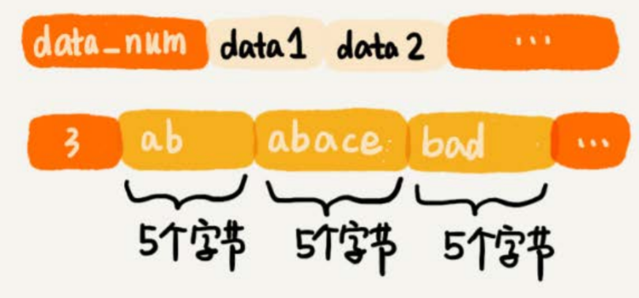

# Redis常用数据类型的数据结构

Redis是一种键值（Key-Value）数据库。相对于关系型数据库（比如MySQL），Redis也被叫作**非关系型数据库**。

像MySQL这样的关系型数据库，表的结构比较复杂，会包含很多字段，可以通过SQL语句，来实现非常复杂的查询需求。而Redis中只包含“键”和“值”两部分，只能通过“键”来查询“值”。正是因为这样简单的存储结构，也让Redis的**读写效率非常高**。

Redis主要是作为**内存数据库**来使用，即数据是存储在内存中的。不过，它也支持将数据存储在硬盘中。

Redis中，**键的数据类型是字符串**，值的数据类型有很多，常用的数据类型有字符串、列表、字典、集合、有序集合。

## 列表（list）

列表支持存储一组数据，有两种实现方法，一种是压缩列表（ziplist），另一种是双向循环链表。

当列表中存储的**数据量比较小**的时候，列表就可以采用压缩列表的方式实现。具体需要同时满足下面两个条件：

* 列表中保存的单个数据（有可能是字符串类型的）小于64字节
* 列表中数据个数少于512个

> ### 压缩列表
>
> 类似数组，通过一片连续的内存空间，来存储数据。不过，它跟数组不同的一点是，它**允许存储的数据大小不同**。
>
> 
>
> **压缩**是相对于数组的存储，压缩列表具有**节省内存**的优点。
>
> 数组要求每个元素的大小相同，如果我们要存储不同长度的字符串，那就需要用**最大长度的字符串大小**作为元素的大小（假设是20个字节）。那当我们存储小于20个字节长度的字符串的时候，便会浪费部分存储空间。
>
> 
>
> 压缩列表**不支持随机访问**，有点类似链表。Redis一般都是通过key获取整个value的值，也就是整个压缩列表的数据，并不需要随机访问。

压缩列表这种存储结构，一方面比较节省内存，另一方面可以支持不同类型数据的存储。而且，因为数据存储在一片连续的内存空间，通过键来获取值为列表类型的数据，读取的效率也非常高。

当列表中存储的数据量比较大的时候，也就是不能同时满足刚刚讲的两个条件的时候，列表就要通过**双向循环链表**来实现了。

redis的双向链表，除了节点结构体，还定义了一个list结构体，存放链表的首尾指针、长度等信息。

```c
typedef struct listnode {
    struct listNode *prev;
     struct listNode *next;
     void *value;
} listNode;

typedef struct list {
     listNode *head;
     listNode *tail;
     unsigned long len;
     // ....省略其他定义
} list;
```

## 字典（hash）

字典类型用来存储一组数据对，每个数据对又包含键值两部分。字典类型也有两种实现方式：**压缩列表**和**散列表**。

只有当存储的数据量比较小的情况下，Redis才使用压缩列表来实现字典类型。具体需要满足两个条件：

* 字典中保存的键和值的大小都要小于64字节
* 字典中键值对的个数要小于512个

当不能同时满足上面两个条件的时候，Redis就使用散列表来实现字典类型。Redis使用\[MurmurHash2\]\([https://zh.wikipedia.org/wiki/Murmur%E5%93%88%E5%B8%8C](https://zh.wikipedia.org/wiki/Murmur哈希)\)这种运行速度快、随机性好的哈希算法作为哈希函数。对于哈希冲突问题，Redis使用**链表法**来解决。除此之外，Redis还支持散列表的动态扩容、缩容。

当数据动态增加之后，散列表的装载因子会不停地变大。为了避免散列表性能的下降，当**装载因子大于1的时候，Redis会触发扩容**，将散列表扩大为原来大小 的2倍左右。

当数据动态减少之后，为了节省内存，当**装载因子小于0.1的时候，Redis就会触发缩容**，缩小为字典中数据个数的大约一半大小。

扩容缩容要做大量的数据搬移和哈希值的重新计算，所以比较耗时。针对这个问题，Redis使用**渐进式扩容缩容策略**，将数据的搬移分批进行，避免了大量数据一次性搬移导致的服务停顿。

## 集合（set）

集合用来存储一组**不重复**的数据，有两种实现方法：**基于有序数组**和**基于散列表**。

当要存储的数据，同时满足下面这样两个条件的时候，Redis就采用有序数组，来实现集合这种数据类型。

* 存储的数据都是整数
* 存储的数据元素个数不超过512个

当不能同时满足这两个条件的时候，Redis就使用散列表来存储集合中的数据。

## 有序集合（sortedset）

有序集合存储一组数据，并且每个数据会附带一个得分。通过得分的大小，将数据组织成**跳表**这样的数据结构，以支持快速地按照得分值、得分区间获取数据。

当数据量比较小的时候，Redis会用**压缩列表**来实现有序集合。具体点说就是，使用压缩列表来实现有序集合的前提，有这样两个：

* 所有数据的大小都要小于64字节
* 元素个数要小于128个

> 对于Redis中的很多数据结构，在数据量比较小的情况下，都是通过多种数据结构来实现的，主要是出于时间和空间的考虑，当数据量小的时候通过数组下标访问最快、占用内存最小。
>
> 当数据量大的时候，由于数组需要占用连续的内存空间，所以就需要使用链表了，同时为了保证速度又需要和数组结合，也就有了散列表。

## 数据结构持久化

Redis的数据格式由“键”和“值”两部分组成。而“值”又支持很多数据类型，比如字符串、列表、字典、集合、有序集合。像字典、集合等类型，底层用到了散列表，散列表中有指针的概念，而指针指向的是内存中的存储地址。 那Redis是如何将这样一个跟具体内存地址有关的数据结构存储到磁盘中的呢？

针对这种与指针相关的持久化问题，主要有两种思路：

* **清除原有的存储结构，只将数据存储到磁盘中。**当我们需要从磁盘还原数据到内存的时候，再重新将数据组织成原来的数据结构。实际上，Redis采用的就是这种持久化思路。

  不过，这种方式也有一定的弊端。那就是数据从硬盘还原到内存的过程，会耗用比较多的时间。比如，我们现在要将散列表中的数据存储到磁盘。当我们从磁盘中，取出数据重新构建散列表的时候，需要重新计算每个数据的哈希值。如果磁盘中存储的是几GB的数据，那重构数据结构的耗时就不可忽视了。

* **保留原来的存储格式，将数据按照原有的格式存储在磁盘中。**以散列表为例，我们可以将散列表的大小、每个数据被散列到的槽的编号等信息，都保存在磁盘中。有了这些信息，我们从磁盘中将数据还原到内存中的时候，就可以避免重新计算哈希值。

对于二叉树的持久化，采用第一种思路，先填充叶子节点形成完全二叉树，然后以数组的形式存储到硬盘。

