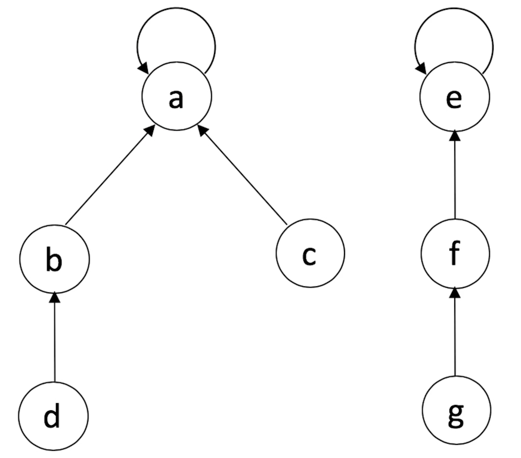
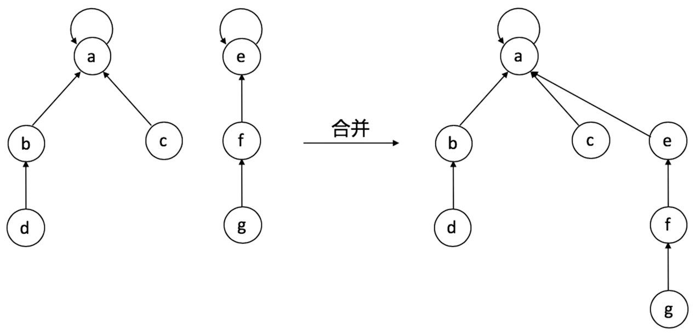
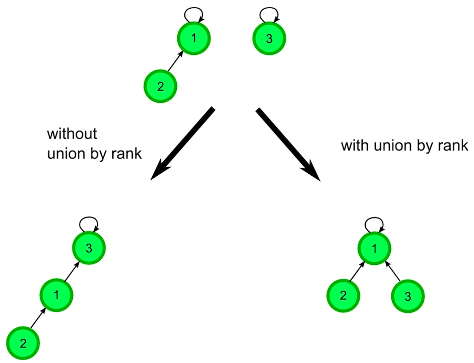
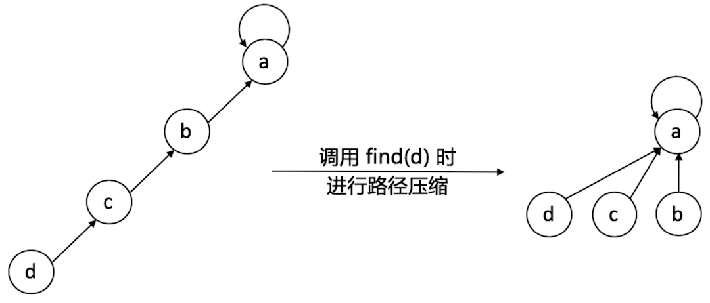

# 并查集

并查集（union & find）是一种树型的数据结构，用于处理一些不交集（disjoint sets）的合并及查询问题。

* **Find**：确定元素属于哪一个子集。它可以被用来确定两个元素是否属于同一子集
* **Union**：将两个子集合并成同一个集合

## 实现

通常用数组实现，数组下标`i`表示第`i`个元素，数组值表示该元素所属的父节点下标。

初始时每个节点的值都是自己的下标（各自为营）。


```text
type QuickUnionUF struct {
    Roots []int
}

func NewQuickUnionUF(n int) *QuickUnionUF {
    this := &QuickUnionUF{
        Roots: make([]int, n)
    }
    for i := range this.Roots {
        this.Roots[i] = i
    }
    return this
}

// 返回元素i所属集合的root
func(this *QuickUnionUF) FindRoot(i int) int {
    root := i
    for this.Roots[root] != root {
        root = this.Roots[root]
    }
    return root
}

// 元素i、j是否处于同一个集合
func(this *QuickUnionUF) Connected(i, j int) bool {
    return this.FindRoot(i) == this.FindRoot(j)
}

// 合并两个集合
func(this *QuickUnionUF) Union(i, j int) {
    iroot := this.FindRoot(i)
    jroot := this.FindRoot(j)
    this.Roots[iroot] = jroot
}
```

调用多次`Union`后：



再次合并：



## 优化

### 根据深度（rank）优化

下图两个并查集合并的时候，有两种选择：

* 直接将1的root指向3
* 将3的root指向1



合并之后，查找2的root时，第一种情况需要走两步，而第二种情况只需要走一步。

第二种情况的组织结构更扁平，在并查集中，将深度称为rank，深度越小，效率越高。

**合并的时候，将rank较低的并查集，合并到rank较高的并查集中，**以生成总体rank较低的并查集。

```text
type UFNode struct {
    Parent int
    Rank int // 深度
}

type QuickUnionUF struct {
    Roots []UFNode
}

func NewQuickUnionUF(n int) *QuickUnionUF {
    this := &QuickUnionUF{
        Roots: make([]UFNode, n)
    }
    for i := range this.Roots {
        this.Roots[i].Parent = i
        this.Roots[i].Rank = 1
    }
    return this
}

// 返回元素i所属集合的root
func(this *QuickUnionUF) FindRoot(i int) int {
    root := i
    for this.Roots[root].Parent != root {
        root = this.Root[root].Parent
    }
    return root
}

// 元素i、j是否处于同一个集合
func(this *QuickUnionUF) Connected(i, j int) bool {
    return this.FindRoot(i) == this.FindRoot(j)
}

func(this *QuickUnionUF) Union(i, j int) {
    iroot := this.FindRoot(i)
    jroot := this.FindRoot(j)
    if iroot == jroot {
        return
    }

    if this.Roots[iroot].Rank <= this.Roots[jroot].Rank {
        this.Roots[iroot].Parent = jroot
        this.Roots[jroot].Rank++
    } else {
        this.Roots[jroot].Parent = iroot
        this.Roots[iroot].Rank++
    }
}
```

### 路径压缩



让每个节点都指向它们的root，用了该优化后，基本上就不需要rank了。

```text
type QuickUnionUF struct {
    Roots []int
    Count int // 集合数量
}

func NewQuickUnionUF(n int) *QuickUnionUF {
    this := &QuickUnionUF{
        Roots: make([]int, n),
        Count: n,
    }
    for i := range this.Roots {
        this.Roots[i] = i
    }
    return this
}

// 返回元素i所属集合的root
func(this *QuickUnionUF) FindRoot(i int) int {
    root := i
    for this.Roots[root] != root { // 先找到最终的root
        root = this.Roots[root]
    }

    // 在这里进行优化，将从i到root的经过的节点的root指向最终的root
    for i != root {
        this.Roots[i], i = root, this.Roots[i]
    }

    return root
}

// 元素i、j是否处于同一个集合
func(this *QuickUnionUF) Connected(i, j int) bool {
    return this.FindRoot(i) == this.FindRoot(j)
}

// 合并两个集合
func(this *QuickUnionUF) Union(i, j int) {
    iroot := this.FindRoot(i)
    jroot := this.FindRoot(j)
    if iroot != jroot {
        this.Roots[iroot] = jroot
        this.Count--
    }
}
```

