# 排序

## 排序

需要关注算法的最好情况、最坏情况、平均情况时间复杂度，以及在这些复杂度对应的原始数据是什么样的（有序度）。

时间复杂度的**系数、常数 、低阶**同样需要关注。时间复杂度反应的是数据规模n很大的时候的一个增长趋势，所以它表示的时候会忽略系数、常数、低阶。但是实际的软件开发中，我们排序的可能是10个、100个、1000个这样规模很小的数据，所以，在对同一阶时间复杂度的排序算法性能对比的时候，我们就要把系数、常数、低阶也考虑进来。

**比较次数和交换次数**

内存消耗：**原地排序**O(1)

稳定性：如果待排序的序列中存在值相等的元素，经过排序之后，相等元素之间原有的先后顺序不变。

> 给电商交易系统中的“订单”排序。订单有两个属性，一个是下单时间，另一个是订单金额。
>
> 如果有10万条订单数据，希望按照金额从小到大对订单数据排序。对于金额相同的订单，按照下单时间从早到晚有序。对于这样一个排序需求，怎么做呢？
>
> 先按照金额对订单数据进行排序，然后，再遍历排序之后的订单数据，对于每个金额相同的小区间再按照下单时间排序。这种排序思路理解起来不难，但是实现起来会很复杂。
>
> 借助稳定排序算法，这个问题可以非常简洁地解决。解决思路：先**按照下单时间**给订单排序,排序完成之后，用稳定排序算法，**按照订单金额**重新排序。两遍排序之后，得到的订单数据就是按照金额从小到大排序，金额相同的订单按照下单时间从早到晚排序的。


### 冒泡排序

冒泡排序只会操作相邻的两个数据。每次冒泡操作都会对相邻的两个元素进行比较，看是否满足大小关系要求。如果不满足就让它俩互换。一次冒泡会让至少一个元素移动到它应该在的位置，重复n次，就完成了n个数据的排序工作。

对数据`[4，5，6，3，2，1]`排序，第一次冒泡过程如下：

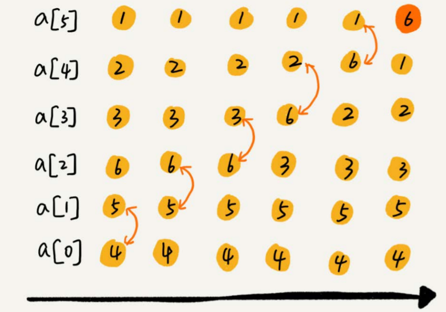

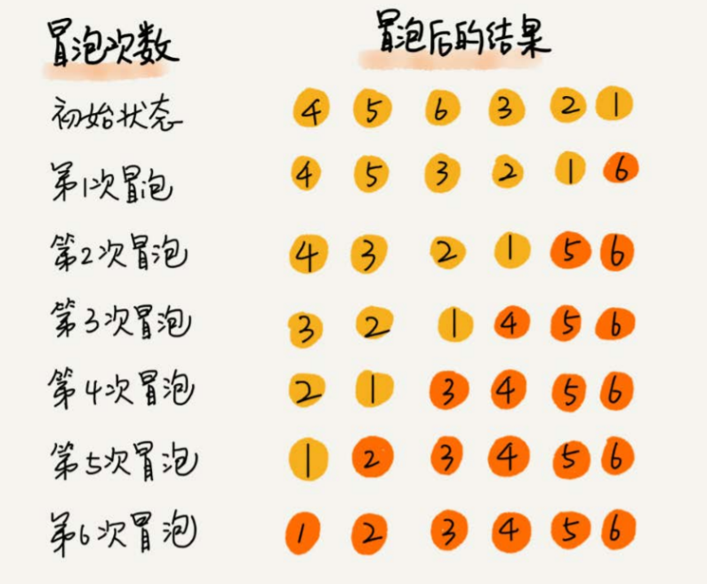

有多少个元素就要多少次冒泡。但是，如果**当某次冒泡操作已经没有数据交换时，说明已经达到完全有序，不用再继续执行后续的冒泡操作**。

下面这个例子，给6个元素排序，只需要4次冒泡操作就可以了。

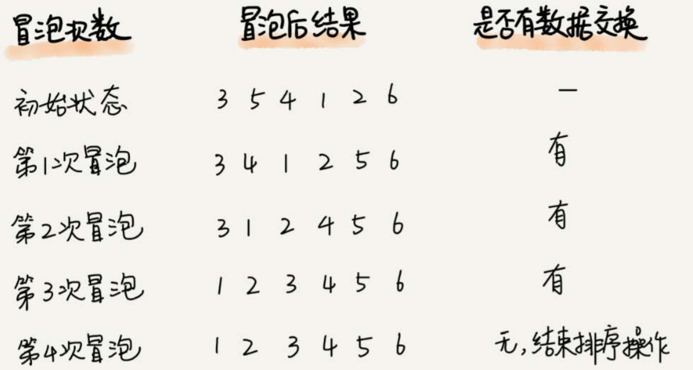

#### 代码实现

```
func bubbleSort(a []int) {
	n := len(a)
	if n <= 1 {
		return
	}
	
	for i := 0; i < n; i++ {
		flag := false	// 提前退出的标志位
		for j := 1; j <= n - i - 1; j++ {
			if a[j - 1] > a[j] {
				flag = true
				a[j], a[j-1] = a[j-1], a[j]
			}
		}
		if !flag {
			return
		}
	}
}
```

通过代码，可以发现**冒泡排序是原地排序，且是稳定排序**。


### 插入排序

将数组中的数据分为两个区间，已排序区间和未排序区间。初始已排序区间只有一个元素，就是数组的第一个元素。

核心思想：取未排序区间中的元素，在已排序区间中找到合适的插入位置将其插入，并保证已排序区间数据一直有序。重复这个过程，直到未排序区间中元素为空，算法结束。

下图左侧为已排序区间，右侧是未排序区间。每次将未排序区间中的第一个元素插入到已排序区间中相应的位置。

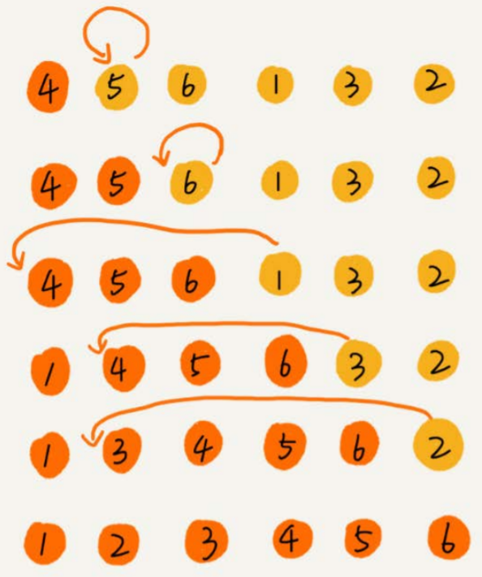


#### 代码实现

```
func insertSort(a []int) {
	n := len(a)
	for i := 1; i < n; i++ {
		val := a[i]
		j := i - 1
		// 查找要插入的位置
		for ; j >= 0; j-- {
			if a[j] > val {
				a[j + 1] = a[j]
			} else {
				break
			}
		}
		a[j + 1] = val
	}
}
```

**插入排序是原地排序，也是稳定排序**（对于值相同的元素，我们可以选择将后面出现的元素，插入到前面出现的元素的后面，这样就可以保持原有的前后顺序不变）。


> 冒泡排序和插入排序的时间复杂度都是$O(n^2)$，都是原地排序算法，但是插入排序要比冒泡排序更受欢迎。
>
> 因为冒泡排序交换数据时需要3个赋值操作，而插入排序只要1个。
>
> 冒泡排序中数据的交换操作：
>
> ```
> if a[j - 1] > a[j] {
>  tmp := a[j-1]
>  a[j-1] = a[j]
>  a[j] = tmp
> }
> ```
>
> 插入排序中数据的移动操作：
>
> ```
> if a[j] > val {
> 	a[j + 1] = a[j]
> } else {
> 	break
> }
> ```


### 选择排序

实现思路类似插入排序，也分已排序区间和未排序区间。但是选择排序**每次会从未排序区间中找到最小的元素，将其放到已排序区间的末尾**。初始排序区为空。

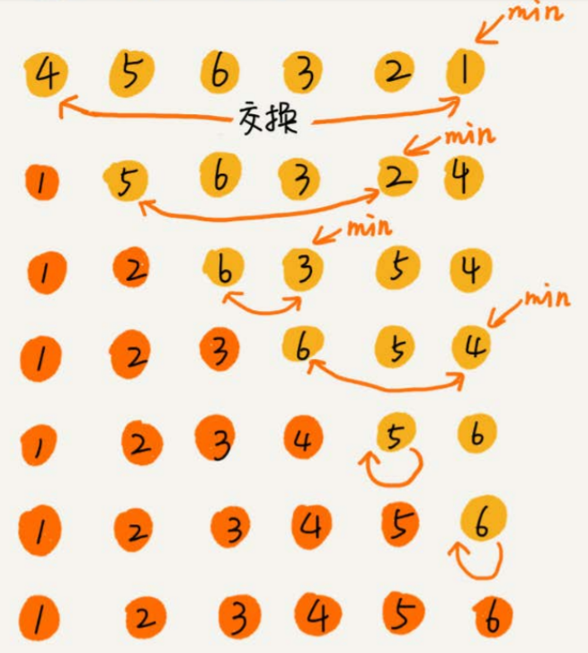


#### 代码实现

```
func selectSort(a []int) {
	n := len(a)
	for i := 0; i < n; i++ {
		minIndex := i
		for j := i + 1; j < n; j++ {
			if a[j] < a[minIndex] {
				minIndex = j
			}
		}
		tmp := a[i]
		a[i] = a[minIndex]
		a[minIndex] = tmp
	}
}
```

**选择排序也是原地排序，但不是稳定排序。**因为选择排序每次都在剩余未排序元素中找最小值，并和前面的元素交换位置，这样破坏了稳定性。

比如`[5，8，5，2，9]`这样一组数据，使用选择排序算法来排序的话，第一次找到最小元素2，与第一个5交换位置，那第一个5和中间的5顺序就变了，所以就不稳定了。


### 归并排序

核心思想：先把数组从中间分成前后两部分，然后对前后两部分分别排序，再将排好序的两部分合并在一起，这样整个数组就都有序了。

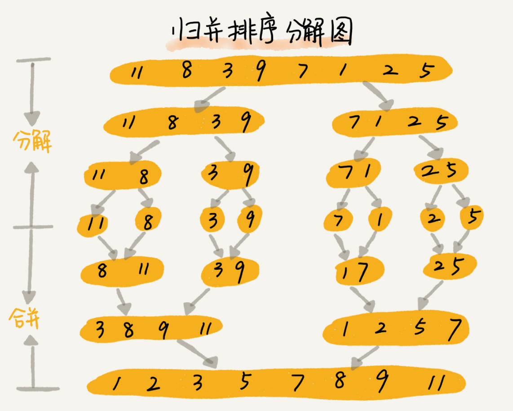


#### 代码实现

```
func mergeSort(a []int, start, end int) {
	if start >= end {
		return
	}
	
	mid := start + ((end - start) >> 2);
	mergeSort(a, start, mid)
	mergeSort(a, mid + 1, end)
	merge(a, start, mid, end) // 将两个子数组有序合并
}

func merge(a []int, start, mid, end int) {
	n := end - start + 1
	tmp := make([]int, n)
	left := start
	right := mid + 1
	i := 0
	for left <= mid && right <= end {
		if a[left] > a[right] { // 保证了稳定性
			tmp[i] = a[right]
			right++
		} else {
			tmp[i] = a[left]
			left++
		}
		i++
	}
	for left <= mid {
		tmp[i] = a[left]
		i++
		left++
	}
	for right <= end {
		tmp[i] = a[right]
		i++
		right++
	}
	
	for i := start; i <= end; i++ {
		a[i] = tmp[i - start]
	}
}

// 调用示例
var a = []int{3, 4, 2, 0, 9, 10, 5, 8}
mergeSort(a, 0, len(a) - 1)
```

**归并排序是稳定的排序，但不是原地排序。**因为在`merge`函数中，合并左右两个子数组时，需要额外申请新的空间放置中间结果，所以空间复杂度为$O(n)$。


### 快速排序

如果要排序数组中下标从p到r之间的一组数据，选择p到r之间的任意一个数据作为pivot（分区点）。

遍历p到r之间的数据，将小于pivot的放到左边，将大于pivot的放到右边，将pivot放到中间。经过这一步骤之后，数组p到r之间的数据就被分成了三个部分，前面p到q-1之间都是小于pivot的，中间是pivot，后面的q+1到r之间是大于pivot的。

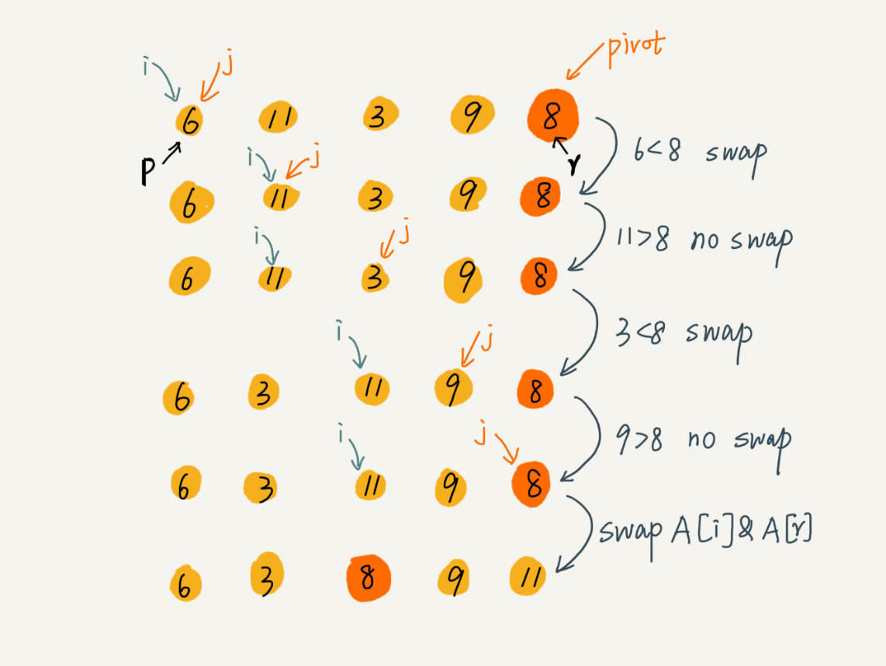


#### 代码实现

```
func quickSort(a []int, start, end int) {
	if start >= end {
		return
	}
	pivot := partition(a, start, end)
	quickSort(a, start, pivot - 1)
	quickSort(a, pivot + 1, end)
}

// 随机选择一个元素作为pivot（一般情况下，可以选择p到r区间的最后一个元素），然后对A[p…r]分区，函数返回pivot的下标
func partition(a []int, start, end int) int {
	pivot := a[end]
	i := start
	for j := start; j <= end; j++ {
		if a[j] < pivot {
			a[i], a[j] = a[j], a[i]
			i++
		}
	}
	a[i], a[end] = pivot, a[i]
	return i
}
```

因为分区的过程涉及交换操作，如果数组中有两个相同的元素，所以在分区操作后，相同元素的相对先后顺序可能会改变。

**快速排序是原地排序，但不是稳定排序。**


#### 与归并排序的异同

两者都是采用分治思想。

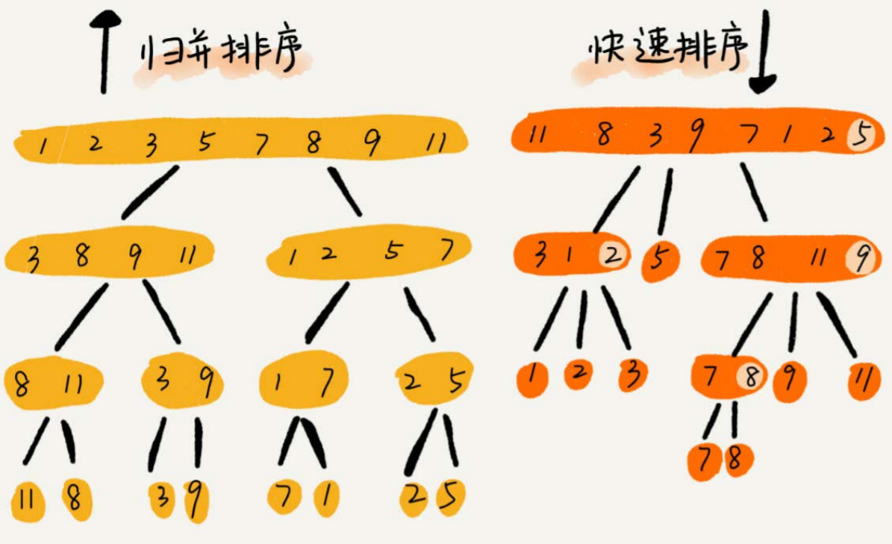

归并排序的处理过程是由下到上的，先处理子问题，然后再合并。而快排正好相反，它的处理过程是由上到下的，先分区，然后再处理子问题。


#### pivot的选择

如果每次分区操作，都能正好把数组分成**大小接近相等的两个小区间**，那快排的时间复杂度递推求解公式跟归并是相同的。但实际上这种情况是很难实现的。

> 如果数组中的数据原来已经是有序的了，比如`[1，3，5，6，8]`。如果我们每次选择最后一个元素作为pivot，那每次分区得到的两个区间都是不均等的。我们需要进行大约n次分区操作，才能完成快排的整个过程。每次分区我们平均要扫描大约n/2个元素，这种情况下，快排的时间复杂度就从$O(nlogn)$退化成了$O(n^2)$。

优化的方法：

- **三数取中**：从区间的首、尾、中间，分别取出一个数，然后对比大小，取这3个数的中间值作为分区点。

  如果要排序的数组比较大，那“三数取中”可能就不够了，可能要“五数取中”或者“十数取中”。

- **随机法**：每次从要排序的区间中，随机选择一个元素作为分区点。这种方法并不能保证每次分区点都选的比较好，但是从概率的角度来看，也不大可能会出现每次分区点都选的很差的情况，所以平均情况下，这样选的分区点是比较好的。


### 线性排序

桶排序、计数排序、基数排序都是**非基于比较的排序算法**，都不涉及元素之间的比较操作，它们的时间复杂度是线性的，但是对要排序的数据要求很苛刻。


#### 基数排序

假设有10万个手机号码，要将这10万个手机号码从小到大排序，有什么比较快速的排序方法呢？

对于桶排序、计数排序，手机号码有11位，范围太大，显然不适合。

但这个问题里有这样的规律：假设要比较两个手机号码a，b的大小，如果在前面几位中，a手机号码已经比b手机号码大了，那后面的几位就不用看了。

借助稳定排序算法，我们先按照最后一位来排序手机号码，然后，再按照倒数第二位重新排序，以此类推，最后按照第一位重新排序。经过11次排序之后，手机号码就都有序了。

以字符串排序为例，思路如下：

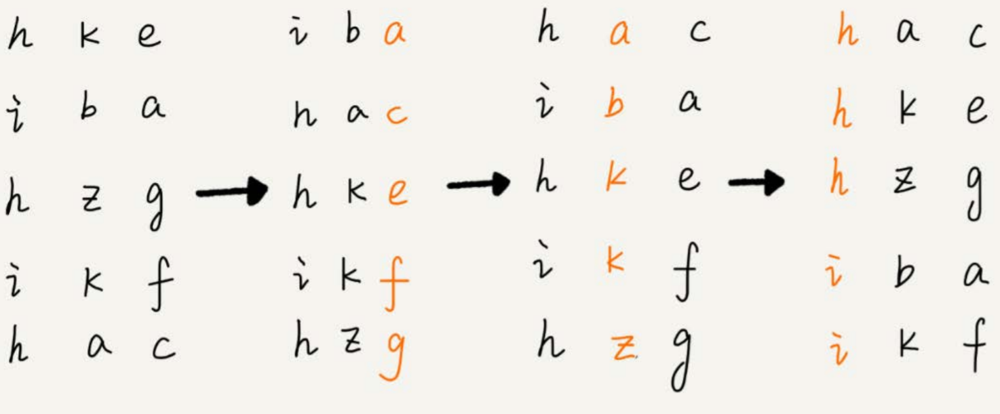

**这里按照每位来排序的排序算法必须是稳定的。**如果是非稳定排序算法，那最后一次排序只会考虑最高位的大小顺序，完全不管其他位的大小关系，那么低位的排序就完全没有意义了。

对于每一位的排序，可以用桶排序或者计数排序，它们的时间复杂度可以做到$O(n)$。

实际上，有时候要排序的数据并不都是等长的，比如所有的英文单词，最长的可能有上百位**。对于这种不等长的数据，可以把所有的单词补齐到相同长度，位数不够的可以在后面补“0”**。因为所有字母都大于0，补0不会影响原有的大小顺序。

基数排序对要排序的数据是有要求的，需要**可以分割出独立的“位”来比较，而且位之间有递进的关系**，如果a数据的高位比b数据大，那剩下的低位就不用比较了。

除此之外，**每一位的数据范围不能太大**，要可以用线性排序算法来排序，否则，基数排序的时间复杂度就无法做到$O(n)$了。


#### 桶排序

核心思想：将要排序的数据分到几个有序的桶里，每个桶里的数据再单独进行排序。桶内排完序之后，再把每个桶里的数据按照顺序依次取出，组成的序列就是有序的了。

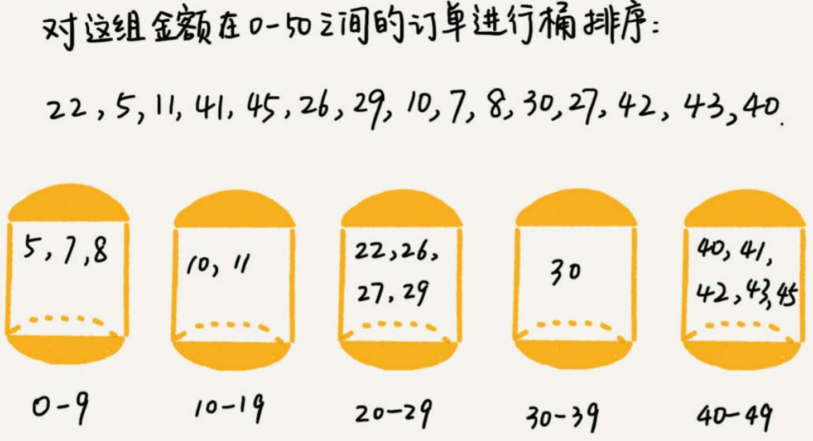

如果要排序的数据有n个，我们把它们均匀地划分到m个桶内，每个桶里就有$k=n/m$个元素。每个桶内部使用快速排序，时间复杂度为$O(k * logk)$。m个桶排序的时间复杂度就是$O(m * k * logk)$，因为$k=n/m$，所以整个桶排序的时间复杂度就是$O(n*log(n/m))$。当桶的个数m接近数据个数n时，$log(n/m)$就是一个非常小的常量，这个时候桶排序的时间复杂度接近$O(n)$。

**要求**：

- 要排序的数据需要很容易就能划分成m个桶，并且，**桶与桶之间有着天然的大小顺序**。这样每个桶内的数据都排序完之后，桶与桶之间的数据不需要再进行排序。
- **数据在各个桶之间的分布是比较均匀的**。如果数据经过桶的划分之后，有些桶里的数据非常多，有些非常少，很不平均，那桶内数据排序的时间复杂度就不是常量级了。在极端情况下，如果数据都被划分到一个桶里，那就退化为$O(nlogn)$的排序算法了。

**桶排序比较适合用在外部排序中。**所谓的外部排序就是数据存储在外部磁盘中，数据量比较大，内存有限，**无法将数据全部加载到内存中**。

> 有10GB的订单数据，要按订单金额（假设金额都是正整数）进行排序，但是内存有限，只有几百MB，没办法一次性把10GB的数据都加载到内存中。这个时候该怎么办呢？
>
> 先扫描一遍文件，看订单金额所处的数据范围。假设经过扫描之后我们得到，订单金额最小是1元，最大是10万元。我们将所有订单根据金额划分到100个桶里，第一个桶存储金额在1元到1000元之内的订单，第二桶存储金额在1001元到2000元之内的订单，以此类推。每一个桶对应一个文件，并且按照金额范围的大小顺序编号命名（00，01，02…99）。
>
> 理想的情况下，如果订单金额在1到10万之间均匀分布，那订单会被均匀划分到100个文件中，每个小文件中存储大约100MB的订单数据，我们就可以将这100个小文件依次放到内存中，用快排来排序。等所有文件都排好序之后，我们只需要按照文件编号，从小到大依次读取每个小文件中的订单数据，并将其写入到一个文件中，那这个文件中存储的就是按照金额从小到大排序的订单数据了。
>
> 订单按照金额在1元到10万元之间**并不一定是均匀分布的** ，所以10GB订单数据是无法均匀地被划分到100个文件中的。**有可能某个金额区间的数据特别多，划分之后对应的文件就会很大，没法一次性读入内存。**这又该怎么办呢？
>
> 针对这些划分之后还是比较大的文件，我们可以继续划分，比如，订单金额在1元到1000元之间的比较多，我们就将这个区间继续划分为10个小区间，1元到100元，101元到200元，201元到300元…901元到1000元。如果划分之后，101元到200元之间的订单还是太多，无法一次性读入内存，那就继续再划分，直到所有的文件都能读入内存为止。


#### 计数排序

桶排序的一种特殊情况，当要排序的n个数据，所处的范围并不大的时候，比如最大值是k，我们就可以把数据划分成k个桶。每个桶内的数据值都是相同的，省掉了桶内排序的时间。

以高考查分数为例，假设满分900分，最低0分，则分为901个桶，对应0~900分。根据考生的成绩，将所有考生划分到这901个桶里。桶内的数据都是分数相同的考生，所以并不需要再进行排序。只需要依次扫描每个桶，将桶内的考生依次输出到一个数组中，就实现了所有考生的排序。因为只涉及扫描遍历操作，所以时间复杂度是$O(n)$。

**“计数”**体现在哪呢？

假设一个数组元素为`[2，5，3，0，2，3，0，3]`，覆盖范围从0到5，所以可以用6个桶存这些数据，即大小为6的数组`C[6]`，其中下标对应取值，遍历数组，得到：

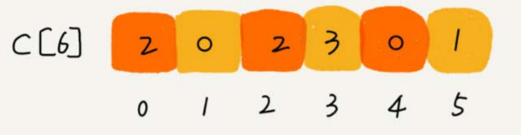

从图中可以看出，值为3的元素有3个，小于3的有4个，因此在排序好的数组中，3将占据第4、5、6三个下标的位置。

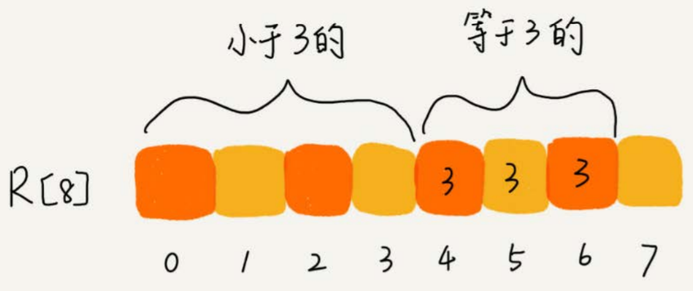

如何计算每个值在有序数组中对应的位置呢？

通过对`C[6]`数组顺序求和，使`C[k]`里存储小于等于分数k的元素个数：

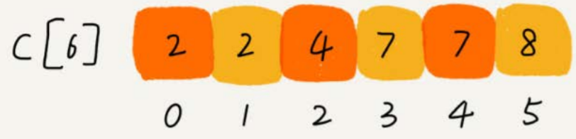

接下来，从后到前依次扫描原数组。比如，当扫描到3时，我们可以从数组C中取出下标为3的值7，也就是说，到目前为止，包括自己在内，分数小于等于3的元素有7个，也就是说3是有序数组R中的第7个元素，当3放入到数组R中后，小于等于3的元素就只剩下了6个了，所以相应的`C[3]`要减1，变成6。

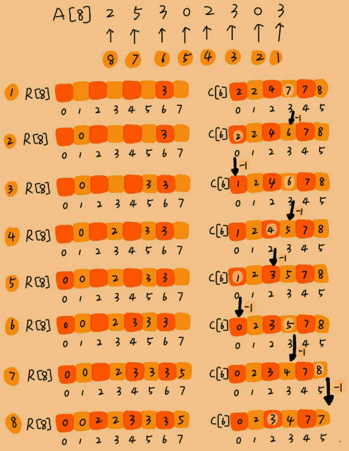

##### 代码实现

```
func countingSort(a []int) {
	n := len(a)
	if n <= 1 {
		return
	}
	// 找最大值
	max := a[0]
	for i := 1; i < n; i++ {
		if a[i] > max {
			max = a[i]
		}
	}
	
	c := make([]int, max + 1) // 下标范围为[0, max]的计数数组
	
	for i := 0; i < n; i++ {
		c[a[i]]++
	}
	for i := 1; i <= max; i++ {
		c[i] += c[i - 1]
	}
	
	tmp := make([]int, n) // 存储排序结果
	for i := n - 1; i >= 0; i-- {
		tmp[c[a[i]] - 1] = a[i]
		c[a[i]]--
	}
	// 复制回原数组
	for i := 0; i < n; i++ {
		a[i] = tmp[i]
	}
}
```

- 计数排序只能用在**数据范围不大的场景中**，如果数据范围k比要排序的数据n大很多，就不适合用计数排序了。
- 计数排序**只能给非负整数排序**，如果要排序的数据是其他类型的，要将其在不改变相对大小的情况下，转化为非负整数。
  - 如果数值精确到小数后一位，可以将所有元素都先乘以10，转化成整数。
  - 如果要排序的数据中有负数，数据的范围是`[-1000, 1000]`，那就需要先对每个数据都加1000，转化成非负整数。


### 总结

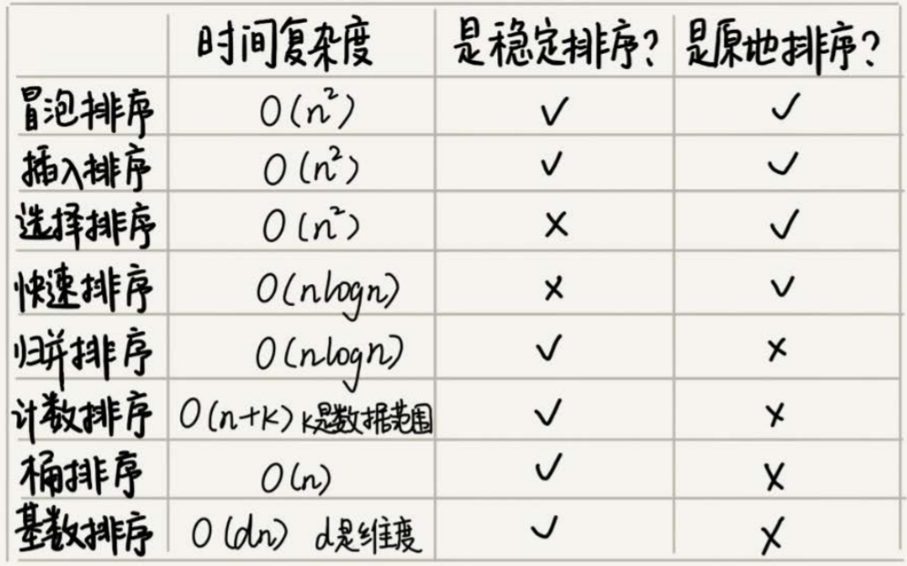


#### 应用

**求第k大元素**

每次对数组a分区得到pivot的下标，如果$pivot+1 == k$，则`a[pivot]`就是第k大元素。

如果$pivot + 1 < k$，说明结果在pivot右边的数组，只需对其进行分区，而不用考虑pivot左边的元素。

$pivot + 1 > k$的情况也类似处理。


**有10个接口访问日志文件，每个日志文件大小约300MB，每个文件里的日志都是按照时间戳从小到大排序的。要将这10个较小的日志文件，合并为1个日志文件，合并之后的日志仍然按照时间戳从小到大排列。如果处理上述排序任务的机器内存只有1GB，有什么好的解决思路，能“快速”地将这10个日志文件合并？**

每次从各个文件中取一条数据，在内存中根据数据时间戳构建一个最小堆，然后每次把最小值写入新文件，同时从最小值来自的那个文件再取出来一个数据，加入到最小堆中。这个空间复杂度为常数，但没能很好利用1g内存，而且磁盘单个读取比较慢，所以考虑每次读取一批数据，没了再从磁盘中取，时间复杂度还是一样O(n)。


**假设需要对`D，a，F，B，c，A，z`这个字符串进行排序，要求将其中所有小写字母都排在大写字母的前面，但小写字母内部和大写字母内部不要求有序。比如经过排序之后为`a，c，z，D，F，B，A`，这个如何来实现呢？**

**如果字符串中存储的不仅有大小写字母，还有数字。要将小写字母的放到前面，大写字母放在最后，数字放在中间，不用排序算法，又该怎么解决呢？**

用两个指针a、b：a指针从头开始往后遍历，遇到大写字母就停下，b从后往前遍历，遇到小写字母就停下，交换a、b指针对应的元素；重复如上过程，直到a、b指针相交。

对于小写字母放前面，数字放中间，大写字母放后面：

- 可以先将数据分为小写字母和非小写字母两大类，进行如上交换后再在非小写字母区间内分为数字和大写字母做同样处理。
- 利用桶排序思想，弄小写、大写、数字三个桶，遍历一遍，都放进去，然后再从桶中取出来就行了。


#### Glibc的qsort函数

`qsort()`会优先使用归并排序来排序输入数据，因为归并排序的空间复杂度是$O(n)$，所以对于小数据量的排序，比如1KB、2KB等，归并排序额外需要1KB、2KB的内存空间

但如果数据量太大，`qsort()`会改为用快速排序算法来排序，`qsort()`选择分区点的方法就是“三数取中法”。为了解决递归太深导致堆栈溢出的问题，`qsort()`是通过自己实现一个堆上的栈，手动模拟递归来解决的。

`qsort()`并不仅仅用到了归并排序和快速排序，它还用到了插入排序。在快速排序的过程中，当要排序的区间中，元素的个数小于等于4时，`qsort()`就退化为插入排序，不再继续用递归来做快速排序，因为在小规模数据面前，$O(n^2)$时间复杂度的算法并不一定比$O(nlogn)$的算法执行时间长。

时间复杂度代表的是一个增长趋势，如果画成增长曲线图，可以发现$O(n^2)$比$O(nlogn)$要陡峭，也就是说增长趋势要更猛一些。但是，在大O复杂度表示法中，我们会省略低阶、系数和常数，也就是说，$O(nlogn)$在没有省略低阶、系数、常数之前可能是$O(knlogn + c)$，而且k和c有可能还是一个比较大的数。

假设k=1000，c=200，当我们对小规模数据（比如n=100）排序时，$n^2$的值实际上比$knlogn+c$还要小

$knlogn+c = 1000 * 100 * log100 + 200 $远大于$n^2 = 100*100=10000$

所以，对于小规模数据的排序，$O(n^2)$的排序算法并不一定比$O(nlogn)$排序算法执行的时间长。对于小数据量的排序，选择比较简单、不需要递归的插入排序算法。

