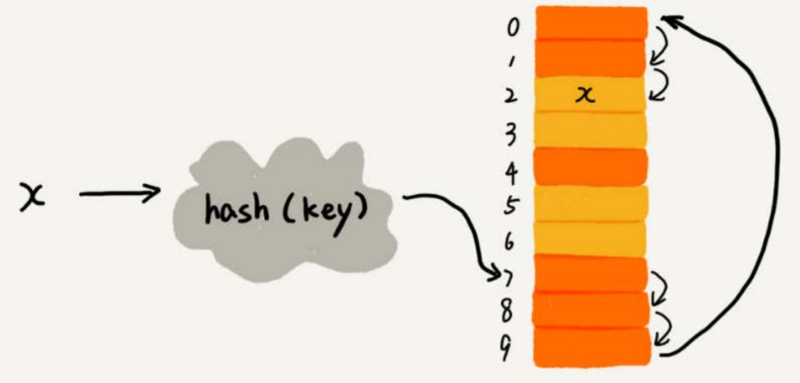
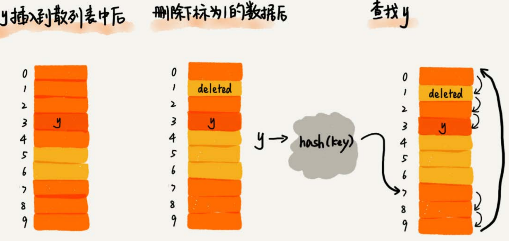
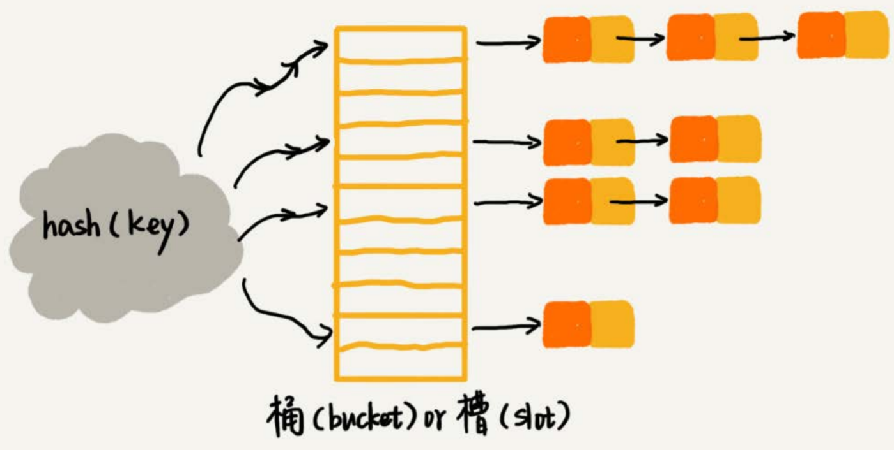
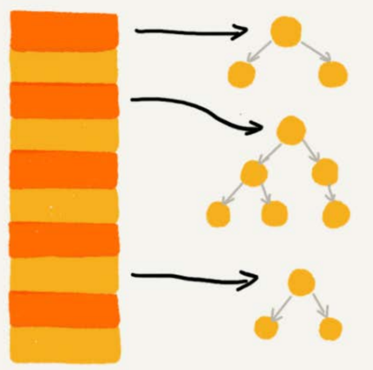
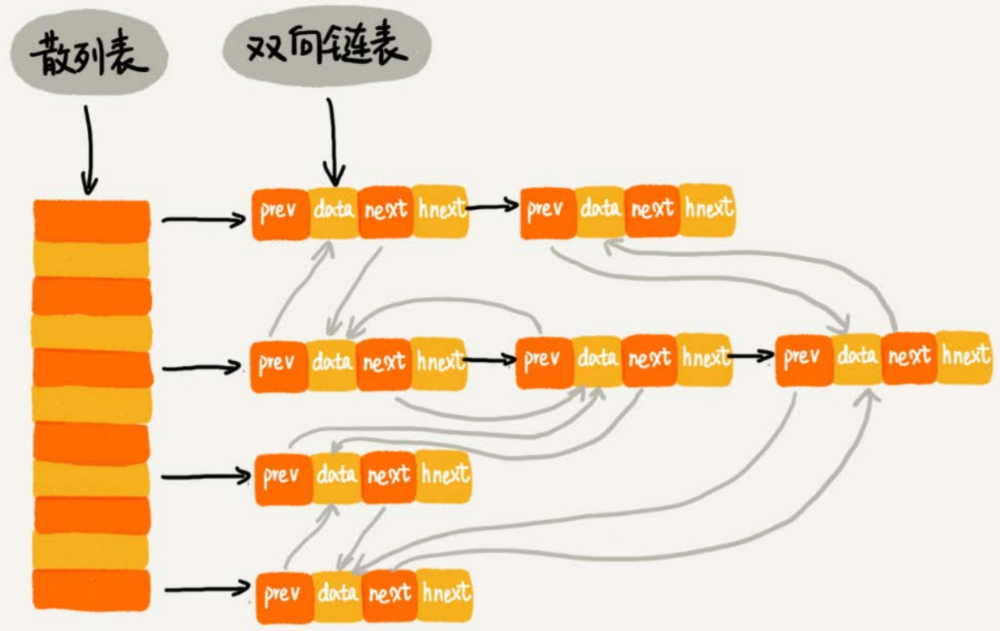
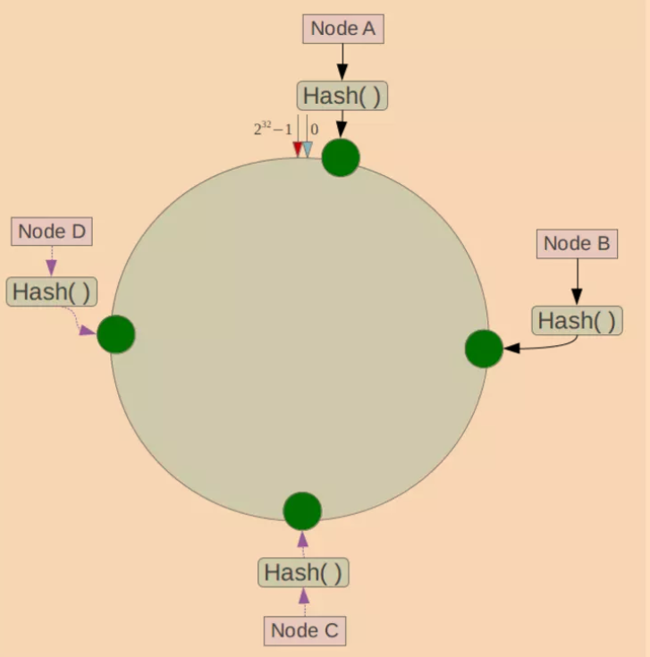
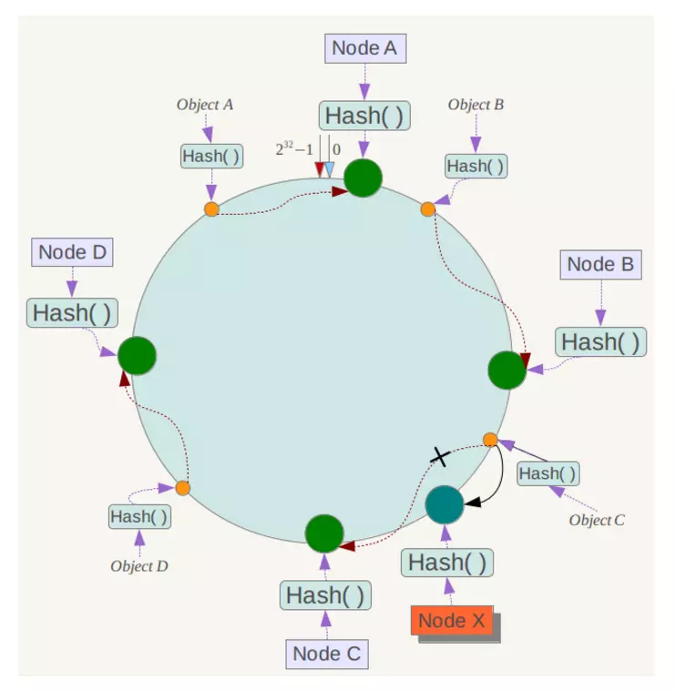
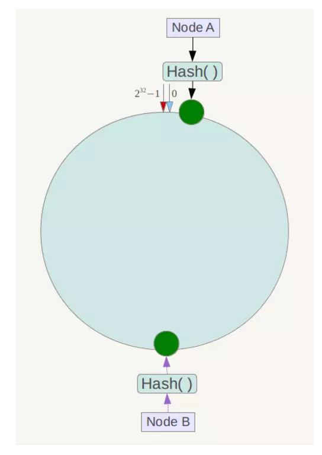
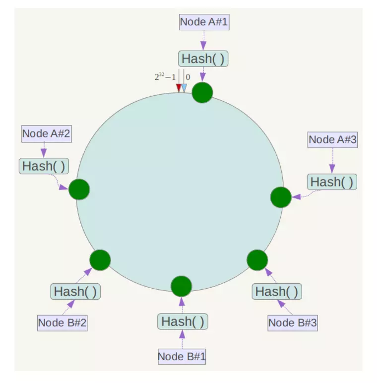

# 散列表与哈希算法

## 散列表

散列表利用数组支持按照下标随机访问，时间复杂度是O(1)的特性。先通过散列函数把元素的键值映射为下标，然后将数据存储在数组中对应下标的位置。

当我们按照键值查询元素时，用同样的散列函数，将键值转化数组下标，从对应的数组下标的位置取数据。


### 散列函数

定义为`hash(key)`，其中key表示元素的键值，`hash(key)`的值表示经过散列函数计算得到的散列值。需要满足下面三点基本要求：

1. 散列函数计算得到的散列值是一个非负整数，因为数组下标是从0开始的
2. 如果$key1 = key2$，那$hash(key1) == hash(key2)$
3. 如果$key1 ≠ key2$，那$hash(key1) ≠ hash(key2)$。在真实的情况下，要想找到一个不同的key对应的散列值都不一样的散列函数，几乎是不可能的。所以存在散列冲突。

除此之外：

- **设计不能太复杂**。过于复杂的散列函数，势必会消耗很多计算时间，也就间接的影响到散列表的性能。
- 散列函数**生成的值要尽可能随机并且均匀分布**，这样才能避免或者最小化散列冲突，而且即便出现冲突，散列到每个槽里的数据也会比较平均，不会出现某个槽内数据特别多的情况。
- **关键字的长度、特点、分布、散列表的大小等**


### 散列冲突

#### 开放寻址法（open addressing）

如果出现了散列冲突，就重新探测一个空闲位置，将其插入。

**线性探测**（Linear Probing）：往散列表中插入数据时，如果某个数据经过散列函数散列之后，存储位置已经被占用了，我们就从当前位置开始，依次往后查找，看是否有空闲位置，直到找到为止。

查找元素的过程有点儿类似插入过程。先通过散列函数求出要查找元素的键值对应的散列值，然后比较数组中下标为散列值的元素和要查找的元素。如果相等，则说明就是我们要找的元素；否则就顺序往后依次查找。如果遍历到数组中的空闲位置，还没有找到，就说明要查找的元素并没有在散列表中。



*黄色的色块表示空闲位置，橙色的色块表示已经存储了数据。*


散列表跟数组一样，不仅支持插入、查找操作，还支持删除操作。对于使用线性探测法解决冲突的散列表，删除操作稍微有些特别。我们不能单纯地把要删除的元素设置为空。

一种方法是将删除的元素，特殊标记为deleted。当线性探测查找的时候，遇到标记为deleted的空间，并不是停下来，而是继续往下探测。



当散列表中插入的数据越来越多时，散列冲突发生的可能性就会越来越大，空闲位置会越来越少，线性探测的时间就会越来越久。极端情况下，我们可能需要探测整个散列表，所以最坏情况下的时间复杂度为$O(n)$。同理，在删除和查找时，也有可能会线性探测整张散列表，才能找到要查找或者删除的数据。


除了线性探测法，还有**二次探测**（Quadratic probing）和**双重散列**（Double hashing）。

- 二次探测，跟线性探测很像。

  线性探测每次探测的步长是1，那它探测的下标序列就是`[hash(key)+0，hash(key)+1，hash(key)+2, ……]`

  而二次探测探测的步长就变成了原来的“二次方”，也就是说，它探测的下标序列就是$[hash(key)+0，hash(key)+1^2，hash(key)+2^2,……]$

- 双重散列，意思就是不仅要使用一个散列函数。

  我们使用一组散列函数`hash1(key)，hash2(key)，hash3(key), ……`。
  先用第一个散列函数，如果计算得到的存储位置已经被占用，再用第二个散列函数，依次类推，直到找到空闲的存储位置。

不管采用哪种探测方法，当散列表中空闲位置不多的时候，散列冲突的概率就会大大提高。为了尽可能保证散列表的操作效率，一般情况下，我们会尽可能保证散列表中有一定比例的空闲槽位。我们用**装载因子**（load factor）来表示空位的多少。

$装载因子 = 填入表中的元素个数 / 散列表长度$


#### 链表法（chaining）



- 插入的时候，只需要通过散列函数计算出对应的散列槽位，将其插入到对应链表中即可。
- 查找、删除一个元素时，同样通过散列函数计算出对应的槽，然后遍历链表查找或者删除。

这些个操作的时间复杂度跟链表的长度k成正比，也就是$O(k)$。对于散列比较均匀的散列函数来说，理论上讲，$k=n/m$，其中n表示散列中数据的个数，m表示散列表中“槽”的个数。


#### 冲突解决方法的选择

**开放寻址法**：数据都存储在数组中，可以有效地利用CPU缓存加快查询速度。序列化比较简单，链表法包含指针，序列化起来就没那么容易。**适用于数据量比较小、装载因子小的时候。**

**链表法**：对内存的利用率更高，对大装载因子（可以大于1）的容忍度更高。有指针的额外开销，且在内存中不是连续存储的，对CPU缓存不友好。**适合存储大对象、大数据量的散列表。**

可以对链表法进行改造，将链表改造为其他高效的动态数据结构，比如跳表、红黑树。即便出现散列冲突，极端情况下，所有的数据都散列到同一个桶内，那最终退化成的散列表的查找时间也只不过是$O(logn)$。




### 动态扩容

对于没有频繁插入和删除的静态数据集合来说，很容易根据数据的特点、分布等，设计出完美的、极少冲突的散列函数，因为毕竟之前数据都是已知的。

对于动态散列表来说，数据集合是频繁变动的，我们事先无法预估将要加入的数据个数，所以我们也无法事先申请一个足够大的散列表。随着数据慢慢加入，装载因子就会慢慢变大。当装载因子大到一定程度之后，散列冲突就会变得不可接受。

> 当散列表的装载因子超过某个阈值时，就需要进行扩容。装载因子阈值需要选择得当。如果太大，会导致冲突过多；如果太小，会导致内存浪费严重。
>
> 装载因子阈值的设置要权衡时间、空间复杂度。
>
> 如果内存空间不紧张，对执行效率要求很高，可以降低负载因子的阈值；
>
> 相反，如果内存空间紧张，对执行效率要求又不高，可以增加负载因子的值，甚至可以大于1。

这时就可以进行动态扩容了，假设每次扩容都申请一个原来散列表大小两倍的空间。如果原来散列表的装载因子是0.8，那经过扩容之后，新散列表的装载因子就下降为原来的一半，变成了0.4。

针对数组的扩容，数据搬移操作比较简单。但是，针对散列表的扩容，数据搬移操作要复杂很多。因为散列表的大小变了，数据的存储位置也变了，所以我们**需要通过散列函数重新计算每个数据的存储位置**。

插入一个数据，最好情况下，不需要扩容，最好时间复杂度是$O(1)$。最坏情况下，散列表装载因子过高，启动扩容，需要重新申请内存空间，重新计算哈希位置，并且搬移数据，所以时间复杂度是$O(n)$。用摊还分析法，均摊情况下，时间复杂度接近最好情况，就是$O(1)$。

实际上，对于动态散列表，随着数据的删除，散列表中的数据会越来越少，空闲空间会越来越多。如果我们对空间消耗非常敏感，我们可以在装载因子小于某个值之后，启动**动态缩容**。当然，如果我们更加在意执行效率，能够容忍多消耗一点内存空间，那就可以不用费劲来缩容了。


**避免低效地扩容**

当装载因子已经到达阈值，需要先进行扩容，再插入数据。这个时候，插入数据就会变得很慢，甚至会无法接受。

例如，如果散列表当前大小为1GB，要想扩容为原来的两倍大小，那就需要对1GB的数据重新计算哈希值，并且从原来的散列表搬移到新的散列表，这个操作就很耗时。这种“一次性”扩容的机制适合面向用户的服务。

可以将扩容操作穿插在插入操作的过程中，分批完成。当装载因子触达阈值之后，我们只申请新空间，但并不将老的数据搬移到新散列表中。

当有新数据要插入时，我们将新数据插入新散列表中，并且从老的散列表中拿出一个数据放入到新散列表。每次插入一个数据到散列表，我们都重复上面的过程。经过多次插入操作之后，老的散列表中的数据就一点一点全部搬移到新散列表中了。这样没有了集中的一次性数据搬移，插入操作就都变得很快了。

对于这期间的查询操作，为了兼容新、老散列表中的数据，先从新散列表中查找，如果没有找到，再去老的散列表中查找。


### 散列表+链表

散列表这种数据结构虽然支持非常高效的数据插入、删除、查找操作，但是散列表中的数据都是通过散列函数打乱之后无规律存储的。也就说，它无法支持按照某种顺序快速地遍历数据。如果希望按照顺序遍历散列表中的数据，那我们需要将散列表中的数据拷贝到数组中，然后排序，再遍历。

因为散列表是动态数据结构，不停地有数据的插入、删除，所以每当我们希望按顺序遍历散列表中的数据的时候，都需要先排序，那效率势必会很低。为了解决这个问题，我们将散列表和链表（或者跳表）结合在一起使用。


#### LRU缓存淘汰算法

仅通过链表实现时，需要维护一个按照访问时间从大到小有序排列的链表结构。因为缓存大小有限，当缓存空间不够，需要淘汰一个数据的时候，我们就直接将链表头部的结点删除。

当要缓存某个数据的时候，先在链表中查找这个数据。如果没有找到，则直接将数据放到链表的尾部；如果找到了，我们就把它移动到链表的尾部。因为查找数据需要遍历链表，所以单纯用链表实现的LRU缓存淘汰算法的时间复杂很高，是$O(n)$。

一个缓存（cache）系统主要包含下面这几个操作：

- 往缓存中添加一个数据
- 从缓存中删除一个数据
- 在缓存中查找一个数据

这三个操作都要涉及“查找”操作，如果单纯地采用链表的话，时间复杂度只能是$O(n)$。如果将散列表和链表两种数据结构组合使用，可以将这三个操作的时间复杂度都降低到$O(1)$。具体的结构就是下面这个样子：



使用**双向链表**存储数据，链表中的每个结点处理存储数据（`data`）、前驱指针（`prev`）、后继指针（`next`）之外，还新增了一个特殊的字段`hnext`，这个字段指向同一个哈希桶（槽）的下一个元素。

不看散列表和`hnext`字段，则只是一个双向链表，将最近访问过的元素放在链尾，很久之前访问的放在链头。

- **查找一个数据**。散列表中查找数据的时间复杂度接近O(1)，所以先通过散列表，定位所在桶，然后遍历该桶的链（通过`hnext`），即可在缓存中找到一个数据。当找到数据之后，还需要将它移动到双向链表的尾部（需要保存链尾元素的指针）。
- **删除一个数据。**找到数据所在的结点，然后将结点删除。借助散列表，可以在O(1)时间复杂度里找到要删除的结点。因为链表是双向链表，双向链表可以通过前驱指针O(1)时间复杂度获取前驱结点，所以在双向链表中，删除结点只需要O(1)的时间复杂度。
- **添加一个数据。**添加数据前需要先看这个数据是否已经在缓存中。如果已经在其中，只需将其移动到双向链表的尾部；如果不在其中，还要看缓存有没有满。如果满了，则将双向链表头部的结点删除，然后再将数据放到链表的尾部；如果没有满，就直接将数据放到链表的尾部。

为了判断缓存已满，需要维护一个计数变量。


#### redis有序集合

redis的有序集合除了用到跳表，有序集合的每个成员对象有两个重要的属性，key（键值）和score（分值）。不仅可以通过score来查找数据，还会通过key来查找数据。

比如用户积分排行榜有这样一个功能：可以通过用户的ID来查找积分信息，也可以通过积分区间来查找用户ID或者姓名信息。这里包含ID、姓名和积分的用户信息，就是成员对象，用户ID就是key，积分就是score。

有序集合的操作：

- 添加一个成员对象
- 按照键值来删除一个成员对象
- 按照键值来查找一个成员对象
- 按照分值区间查找数据，比如查找积分在[100, 356]之间的成员对象
- 按照分值从小到大排序成员变量
- 查找成员对象的排名（Rank）或者根据排名区间查找成员对象 （单纯用这种组合结构无法高效实现）

如果我们仅仅按照分值将成员对象组织成跳表的结构，那按照键值来删除、查询成员对象就会很慢，解决方法与LRU缓存淘汰算法的解决方法类似。我们可以再按照键值构建一个散列表，这样按照key来删除、查找一个成员对象的时间复杂度就变成了O(1)。同时，借助跳表结构，其他操作也非常高效。


#### LinkedHashMap

HashMap底层是通过散列表这种数据结构实现的。而LinkedHashMap前面比HashMap多了一个“Linked”，这里的“Linked”是不是说，LinkedHashMap是一个通过链表法解决散列冲突的散列表呢？

实际上，LinkedHashMap并没有这么简单，其中的“Linked”也并不仅仅代表它是通过链表法解决散列冲突的。

```
HashMap<Integer, Integer> m = new LinkedHashMap<>();
m.put(3, 11);
m.put(1, 12);
m.put(5, 23);
m.put(2, 22);

for (Map.Entry e : m.entrySet()) {
  System.out.println(e.getKey()); // 按顺序打印，即 3、1、5、2
}
```

散列表中数据是经过散列函数打乱之后无规律存储的，这里是如何实现按照数据的插入顺序来遍历打印的呢？

LinkedHashMap也是通过**散列表和双向链表**组合在一起实现的，**它不仅支持按照插入顺序遍历数据，还支持按照访问顺序来遍历数据。**

```
// 10是初始大小，0.75是装载因子，true是表示按照访问时间排序
HashMap<Integer, Integer> m = new LinkedHashMap<>(10, 0.75f, true);
m.put(3, 11);
m.put(1, 12);
m.put(5, 23);
m.put(2, 22);

m.put(3, 26);
m.get(5);

for (Map.Entry e : m.entrySet()) {
  System.out.println(e.getKey()); // 1、2、3、5
}
```

每次调用put()函数，往LinkedHashMap中添加数据的时候，都会将数据添加到链表的尾部。访问数据也是如此。与LRU中的链表+散列表类似，最近访问的在链尾。


### 应用

#### word中的拼写检查

常用的英文单词有20万个左右，假设单词的平均长度是10个字母，平均一个单词占用10个字节的内存空间，那20万英文单词大约占2MB的存储空间，就算放大10倍也就是20MB。对于现在的计算机来说，这个大小完全可以放在内存里面。所以我们可以用散列表来存储整个英文单词词典。

当用户输入某个英文单词时，我们拿用户输入的单词去散列表中查找。如果查到，则说明拼写正确；如果没有查到，则说明拼写可能有误，给予提示。借助散列表这种数据结构，我们就可以轻松实现快速判断是否存在拼写错误。


#### 对10万条URL访问日志，按照访问次数排序

遍历 10 万条数据，以 URL 为 key，访问次数为 value，存入散列表，同时记录下访问次数的最大值 K，时间复杂度 $O(n)$。

如果 K 不是很大，可以使用桶排序，时间复杂度 $O(n)$。如果 K 非常大（比如大于 10 万），就使用快速排序，复杂度 $O(nlogn)$。


#### 假设猎聘网有10万名猎头，每个猎头都可以通过做任务=来积累积分，然后通过积分来下载简历。假设你是猎聘网的一名工程师，如何在内存中存储这10万个猎头ID和积分信息，让它能够支持这样几个操作：

1. 根据猎头的ID快速查找、删除、更新这个猎头的积分信息
2. 查找积分在某个区间的猎头ID列表
3. 查找按照积分从小到大排名在第x位到第y位之间的猎头ID列表

以积分排序构建一个跳表，再以猎头 ID 构建一个散列表。

1. ID 在散列表中所以可以 O(1) 查找到这个猎头
2. 积分以跳表存储，跳表支持区间查询
3. 仅根据当前数据结构暂时无法实现


## 哈希算法

> 不管是“散列”还是“哈希”，这都是中文翻译的差别，英文其实就是“Hash”。

**将任意长度的二进制值串映射为固定长度的二进制值串（哈希值），这个映射的规则就是哈希算法。**

设计哈希算法需要满足的要求：

- 从哈希值不能反向推导出原始数据（单向哈希算法）
- 对输入数据非常敏感，哪怕原始数据只修改了一个Bit，最后得到的哈希值也大不相同
- 散列冲突的概率要很小，对于不同的原始数据，哈希值相同的概率非常小
- 哈希算法的执行效率要尽量高效，针对较长的文本，也能快速地计算出哈希值


### 安全加密

最常用于加密的哈希算法是MD5（MD5 Message-Digest Algorithm，MD5消息摘要算法）和SHA（Secure Hash Algorithm，安全散列算法），除此之外，还有很多其他加密算法，比如DES（Data Encryption Standard，数据加密标准）、AES（Advanced Encryption Standard，高级加密标准）。

对用于加密的哈希算法来说，有两点要求格外重要：

- 很难根据哈希值反向推导出原始数据
- 散列冲突的概率要很小

很难根据哈希值反向推导出原始数据，第二点是散列冲突的概率要很小。

> **鸽巢原理**
>
> 如果有10个鸽巢，有11只鸽子，那肯定有1个鸽巢中的鸽子数量多于1个，换句话说就是，肯定有2只鸽子在1个鸽巢内。
>
> 哈希值的长度是固定的，比如MD5生成128位二进制串，总数为$2^{128}$个，如果有$2^{128} + 1$个数要存，那么肯定会有冲突。一般情况下，哈希值越长的哈希算法，散列冲突的概率越低。


一些安全措施：

- 无论密码长度多少，使用计算字符串hash时间都固定或者足够慢的算法如PBKDF2WithHmacSHA1，来降低硬件计算hash速度，减少不同长度字符串计算hash所需时间不一样而泄漏字符串长度信息，进一步减少风险。
- 加盐


### 唯一标识

如果要在海量的图库中，搜索一张图是否存在，我们不能单纯地用图片的元信息（比如图片名称）来比对，因为有可能存在名称相同但图片内容不同，或者名称不同图片内容相同的情况。

任何文件在计算机中都可以表示成二进制码串，利用哈希的思想，我们可以给每一个图片取一个唯一标识，或者说信息摘要。比如，我们可以从图片的二进制码串开头取100个字节，从中间取100个字节，从最后再取100个字节，然后将这300个字节放到一块，通过哈希算法（比如MD5），得到一个哈希字符串，用它作为图片的唯一标识。通过这个唯一标识来判定图片是否在图库中。

如果还想继续提高效率，我们可以把每个图片的唯一标识，和相应的图片文件在图库中的路径信息，都存储在散列表中。当要查看某个图片是不是在图库中的时候，我们先通过哈希算法对这个图片取唯一标识，然后在散列表中查找是否存在这个唯一标识。

如果不存在，那就说明这个图片不在图库中；如果存在，我们再通过散列表中存储的文件路径，获取到这个已经存在的图片，跟现在要插入的图片做**全量的比对**，看是否完全一样。如果一样，就说明已经存在；如果不一样，说明两张图片尽管唯一标识相同，但是并不是相同的图片。


### 数据校验

BT，会将一个大文件分割为许多小文件。可以对这些小文件做信息摘要，使下载者可以校验下载的内容是否被篡改或者因网络问题出现不同。


### 散列函数

相对哈希算法的其他应用，散列函数对于散列算法冲突的要求要低很多。即便出现个别散列冲突，只要不是过于严重，我们都可以通过开放寻址法或者链表法解决。

散列函数对于散列算法计算得到的值，是否能反向解密也并不关心。散列函数中用到的散列算法，更加关注散列后的值是否能平均分布，也就是，一组数据是否能均匀地散列在各个槽中。除此之外，散列函数执行的快慢，也会影响散列表的性能，所以，散列函数用的散列算法一般都比较简单，比较追求效率。


### 负载均衡

负载均衡算法有很多，比如轮询、随机、加权轮询等。那如何才能实现一个会话粘滞（session sticky）的负载均衡算法呢？也就是说，我们需要在同一个客户端上，在一次会话中的所有请求都路由到同一个服务器上。

最直接的方法就是，维护一张映射关系表，这张表的内容是客户端IP地址或者会话ID与服务器编号的映射关系。客户端发出的每次请求，都要先在映射表中查找应该路由到的服务器编号，然后再请求编号对应的服务器。这种方法简单直观，但也有几个弊端：

- 如果客户端很多，映射表可能会很大，比较浪费内存空间
- 客户端下线、上线，服务器扩容、缩容都会导致映射失效，这样维护映射表的成本就会很大

如果借助哈希算法，这些问题都可以非常完美地解决。我们可以通过哈希算法，对客户端IP地址或者会话ID计算哈希值，将取得的哈希值与服务器列表的大小进行取模运算，最终得到的值就是应该被路由到的服务器编号。 这样，我们就可以把同一个IP过来的所有请求，都路由到同一个后端服务器上。


### 数据分片

假如有1T的日志文件，这里面记录了用户的搜索关键词，想要快速统计出每个关键词被搜索的次数，该怎么做呢？

- 搜索日志很大，没办法放到一台机器的内存中。
- 如果只用一台机器来处理这么巨大的数据，处理时间会很长。

针对这两个难点，我们可以**先对数据进行分片，然后采用多台机器处理的方法**，来提高处理速度。

具体思路：为了提高处理的速度，我们用n台机器并行处理。我们从搜索记录的日志文件中，依次读出每个搜索关键词，并且通过哈希函数计算哈希值，然后再跟n取模，最终得到的值，就是应该被分配到的机器编号。

这样，哈希值相同的搜索关键词就被分配到了同一个机器上。也就是说，同一个搜索关键词会被分配到同一个机器上。每个机器会分别计算关键词出现的次数，最后合并起来就是最终的结果。

实际上，这里的处理过程也是MapReduce的基本设计思想。


假设现在我们的图库中有1亿张图片，如何快速判断图片是否在图库中？

很显然，在单台机器上构建散列表是行不通的。因为单台机器的内存有限，而1亿张图片构建散列表显然远远超过了单台机器的内存上限。

同样可以对数据进行分片，然后采用多机处理。我们准备n台机器，让每台机器只维护某一部分图片对应的散列表。我们每次从图库中读取一个图片，计算唯一标识，然后与机器个数n求余取模，得到的值就对应要分配的机器编号，然后将这个图片的唯一标识和图片路径发往对应的机器构建散列表。

当我们要判断一个图片是否在图库中的时候，我们通过同样的哈希算法，计算这个图片的唯一标识，然后与机器个数n求余取模。假设得到的值是k，那就去编号k的机器构建的散列表中查找。

估算一下给这1亿张图片构建散列表大约需要多少台机器：

散列表中每个数据单元包含两个信息，哈希值和图片文件的路径。假设我们通过MD5来计算哈希值，那长度就是128比特，也就是16字节。文件路径长度的上限是256字节，我们可以假设平均长度是128字节。如果我们用链表法来解决冲突，那还需要存储指针，指针只占用8字节。所以，散列表中每个数据单元就占用152字节（这里只是估算，并不准确）。

假设一台机器的内存大小为2GB，散列表的装载因子为0.75，那一台机器可以给大约1000万（2GB*0.75/152）张图片构建散列表。所以，如果要对1亿张图片构建索引，需要大约十几台机器。在工程中，这种估算还是很重要的，能让我们事先对需要投入的资源、资金有个大概的了解，能更好地评估解决方案的可行性。


### 分布式存储

在分布式存储中，如何决定将哪个数据放到哪个机器上呢？可以借用数据分片的思想，即通过哈希算法对数据取哈希值，然后对机器个数取模，这个最终值就是应该存储的缓存机器编号。

但是如果出现动态扩容或缩容，增加或减少机器数量，原先得到的哈希值会发生改变，因此，所有的数据都要重新计算哈希值，然后重新搬移到正确的机器上。这样就相当于，缓存中的数据一下子就都失效了。所有的数据请求都会穿透缓存，直接去请求数据库。这样就可能发生雪崩效应，压垮数据库。


#### 一致性哈希算法

假设我们有k个机器，数据的哈希值的范围是`[0, MAX]`。我们将整个范围划分成m个小区间（**m远大于k**），每个机器负责$m/k$个小区间。当有新机器加入的时候，我们就将某几个小区间的数据，从原来的机器中搬移到新的机器中。这样，既不用全部重新哈希、搬移数据，也保持了各个机器上数据数量的均衡。


一致性哈希将整个哈希值空间组织成一个虚拟的圆环，如假设某哈希函数H的值空间为$0 ~ 2^{32} - 1$（即哈希值是一个32位无符号整形），整个空间按顺时针方向组织。0和$2^{32}-1$在零点中方向重合。

对每台服务器进行Hash，具体可以选择服务器的ip或主机名作为关键字，以确定每台机器在哈希环上的位置：



当要访问数据时，对数据key使用相同的函数Hash计算出哈希值，并确定此数据在环上的位置，从此位置沿环顺时针“行走”，第一台遇到的服务器就是其应该定位到的服务器。


现假设Node C不幸宕机，可以看到此时对象A、B、D不会受到影响，只有C对象被重定位到Node D。一般的，在一致性哈希算法中，如果一台服务器不可用，则受影响的数据仅仅是此服务器到其环空间中前一台服务器（即沿着逆时针方向行走遇到的第一台服务器）之间数据，其它不会受到影响。

如果在系统中增加一台服务器Node X



此时对象Object A、B、D不受影响，只有对象C需要重定位到新的Node X 。一般的，在一致性哈希算法中，如果增加一台服务器，则受影响的数据仅仅是新服务器到其环空间中前一台服务器（即沿着逆时针方向行走遇到的第一台服务器）之间数据，其它数据也不会受到影响。

综上所述，一致性哈希算法对于节点的增减都只需重定位环空间中的一小部分数据，具有较好的容错性和可扩展性。


另外，当一致性哈希算法在服务节点太少时，容易因为节点分部不均匀而造成数据倾斜问题。例如系统中只有两台服务器，其环分布如下：



此时必然造成大量数据集中到Node A上，而只有极少量会定位到Node B上。为了解决这种数据倾斜问题，一致性哈希算法引入了**虚拟节点机制**，即对每一个服务节点计算多个哈希，每个计算结果位置都放置一个此服务节点，称为虚拟节点。

具体做法可以在服务器ip或主机名的后面增加编号来实现。例如上面的情况，可以为每台服务器计算三个虚拟节点，于是可以分别计算 “Node A#1”、“Node A#2”、“Node A#3”、“Node B#1”、“Node B#2”、“Node B#3”的哈希值，于是形成六个虚拟节点：



同时数据定位算法不变，只是多了一步虚拟节点到实际节点的映射，例如定位到“Node A#1”、“Node A#2”、“Node A#3”三个虚拟节点的数据均定位到Node A上。这样就解决了服务节点少时数据倾斜的问题。在实际应用中，通常将虚拟节点数设置为32甚至更大，因此即使很少的服务节点也能做到相对均匀的数据分布。


