# 基础电路

信息传输经历了人传口信、击鼓鸣金、烽火/灯塔、电报等阶段，在电报阶段，信号的传输距离迅速增加。因为电报本质上是通过电信号来进行传播的，所以从输入信号到输出信号基本上没有延时，并且输入信号的速度加快了很多。

电报机本质上就是一个“**蜂鸣器 + 长长的电线 + 按钮开关**”。蜂鸣器装在接收方手里，开关留在发送方手里。双方用长长的电线连在一起。当按钮开关按下的时候，电线的电路接通了，蜂鸣器就会响。短促地按下，就是一个短促的点信号；按的时间稍微长一些，就是一个稍长的划信号。

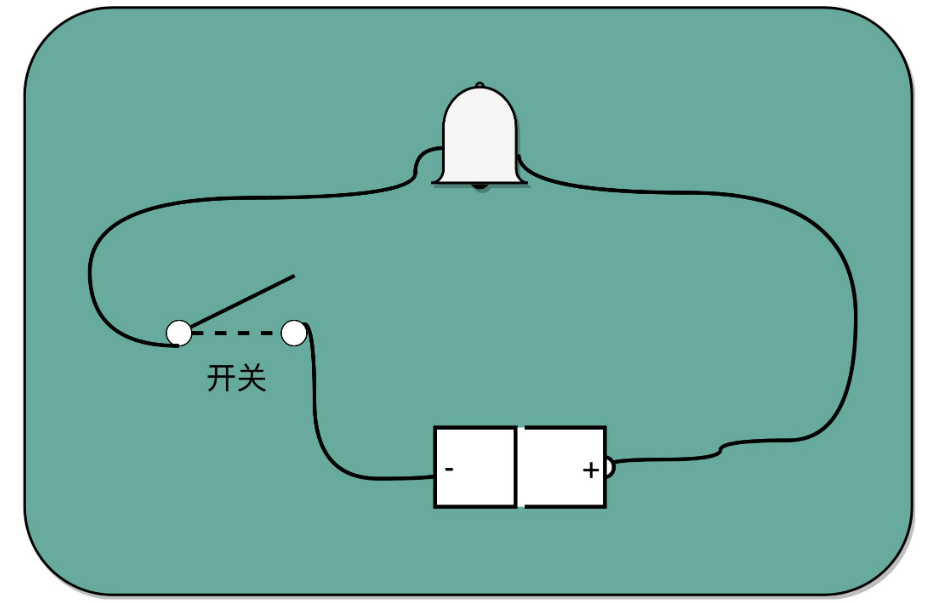

## 继电器

有了电报机，只要铺设好电报线路，就可以传输讯息了。但是这里面又出现了一个新的挑战，就是随着电线的线路越长，电线的电阻就越大。当电阻很大，而电压不够的时候，即使按下开关，蜂鸣器也不会响。

对于电报来说，电线太长了，使得线路接通也没有办法让蜂鸣器响起来。那就不要一次铺太长的线路，而把一小段距离当成一个线路，也和驿站建立一个小电报站。我们在小电报站里面安排一个电报员，他听到上一个小电报站发来的信息，然后原样输入，发到下一个电报站去。这样，我们的信号就可以一段段传输下去，而不会因为距离太长，导致电阻太大，没有办法成功传输信号。为了能够实现这样**接力传输信号**，在电路里面，工程师们造了一个叫作**继电器**（Relay）的设备。

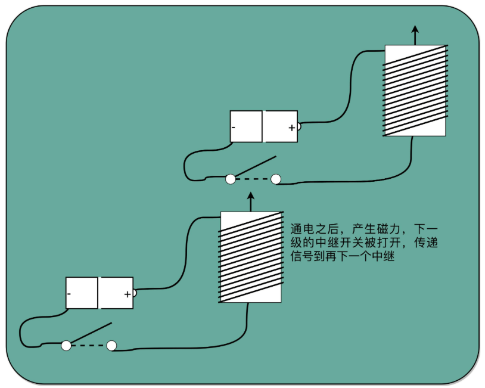

把原先用来输出声音的蜂鸣器，换成一段环形的螺旋线圈，让电路封闭通上电。因为电磁效应，这段螺旋线圈会产生一个带有磁性的电磁场。我们原本需要输入的按钮开关，就可以用一块磁力稍弱的磁铁把它设在“关”的状态。这样，按下上一个电报站的开关，螺旋线圈通电产生了磁场之后，磁力就会把开关“吸”下来，接通到下一个电报站的电路。

如果我们在中间所有小电报站都用这个“**螺旋线圈 + 磁性开关**”的方式，来替代蜂鸣器和普通开关，而只在电报的始发和终点用普通的开关和蜂鸣器，我们就有了一个拆成一段一段的电报线路，接力传输电报信号。这样，我们就不需要中间安排人力来听打电报内容，也不需要解决因为线缆太长导致的电阻太大或者电压不足的问题了。我们只要在终点站安排电报员，听写最终的电报内容就可以了。

事实上，继电器还有一个名字就叫作**电驿**，这个“驿”就是驿站的驿。这个接力的策略不仅可以用在电报中，在通信类的科技产品中其实都可以用到，比如WiFi中继设备。

有了继电器之后，我们不仅有了一个能够接力传输信号的方式，更重要的是，和输入端通过开关的“开”和“关”来表示“1”和“0”一样，我们在输出端也能表示“1”和“0”了。

## 门电路

继电器输出端“0”和“1”这两个状态，还可以作为后续线路的输入信号，作为最简单的电路，可以组合形成我们需要的逻辑电路，例如“与（AND）”“或（OR）”“非（NOT）”这样的逻辑。

在输入端的电路，提供两条独立的线路到输出端，两条线路上各有一个开关，那么任何一个开关打开了，到输出端的电路都是接通的，这其实就是模拟了计算机中的“或”操作。

如果把输出端的“螺旋线圈 + 磁性开关”的组合，从默认关掉，只有通电有了磁场之后打开，换成默认是打开通电的，只有通电之后才关闭，就得到了一个计算机中的“非”操作。输出端开和关正好和输入端相反。这个在数字电路中，也叫作**反向器**（Inverter）。

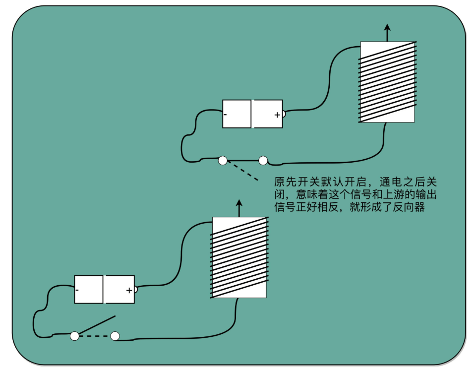

与、或、非的电路都非常简单，要想做稍微复杂一点的工作，需要很多电路的组合。这体现了现代计算机体系中一个重要的思想，就是通过分层和组合，逐步搭建起更加强大的功能。

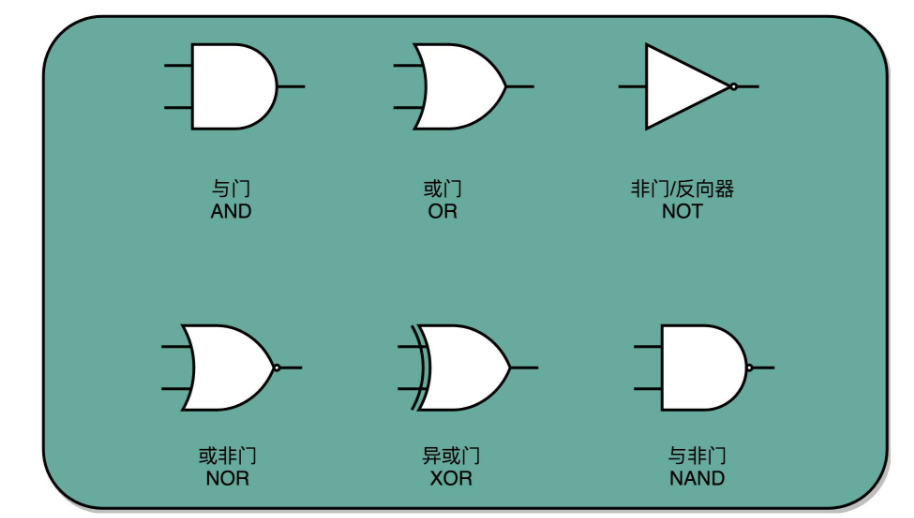

## 加法器

先考虑最简单的 8 位的无符号整数的加法。这里的“无符号”，即不需要使用补码来表示负数。无论高位是“0”还是“1”，这个整数都是一个正数。

要表示一个 8 位数的整数，简单地用 8 个 bit，也就是 8 个电路开关。那 2 个 8 位整数的加法，就是 2 排 8 个开关。加法得到的结果也是一个 8 位的整数，所以又需要 1 排 8 位的开关。要想实现加法，我们就要看一下，通过什么样的门电路，能够连接起加数和被加数，得到最后期望的和。

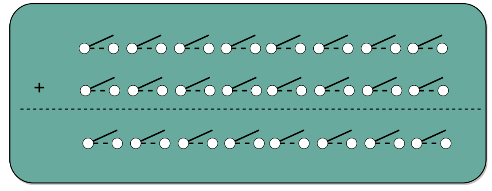

二进制的加法用**列竖式**表示如下：

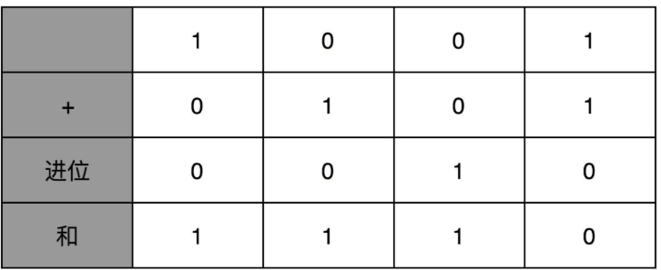

### 半加器

考虑一位的加法，会得到该位的值和进位。当输入是01或10时，该位仍然是1；在输入是11时，进位才为1。前者可以用异或门，后者用与门。

通过一个异或门计算出个位，通过一个与门计算出是否进位，我们就通过电路算出了一个一位数的加法。于是，**把两个门电路打包，称为半加器**（Half Adder）。

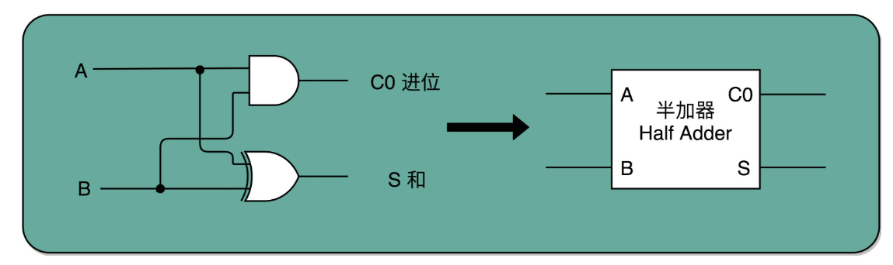

### 全加器

半加器可以解决个位的加法问题，但是如果放到二位上来说，就不够用了。对一个二进制数，如果从右往左数，第二列称为“二位”。对应的再往左，分别是四位、八位。

二位用一个半加器不能计算完成的原因也很简单。因为二位除了一个加数和被加数之外，还需要加上来自个位的进位信号，一共需要三个数进行相加，才能得到结果。但是我们目前用到的，无论是最简单的门电路，还是用两个门电路组合而成的半加器，输入都只能是两个 bit，也就是两个开关。

**用两个半加器和一个或门，就能组合成一个全加器**。第一个半加器，用和个位的加法一样的方式，得到是否进位 X 和对应的二个数加和后的结果 Y，这样两个输出。然后把这个加和后的结果 Y，和个位数相加后输出的进位信息 U，再连接到一个半加器上，就会再拿到一个是否进位的信号 V 和对应的加和后的结果 W。

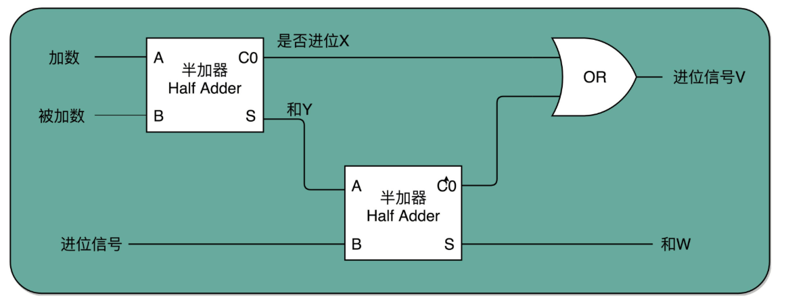

 W 就是在二位上留下的结果。把两个半加器的进位输出，作为一个或门的输入连接起来，只要两次加法中任何一次需要进位，那么在二位上，就会向左侧的四位进一位。因为一共只有三个 bit 相加，即使 3 个 bit 都是 1，也最多会进一位。

通过两个半加器和一个或门，得到了一个能够接受进位信号、加数和被加数，这样三个数组成的加法。这就是全加器。现在进行对应的两个 8 bit 数的加法就很容易了，只要把 8 个全加器串联起来就好了。个位的全加器的进位信号作为二位全加器的输入信号，二位全加器的进位信号再作为四位的全加器的进位信号。这样一层层串接八层，就得到了一个支持 8 位数加法的算术单元。如果要扩展到 16 位、32 位，乃至 64 位，都只需要多串联几个输入位和全加器就好了。

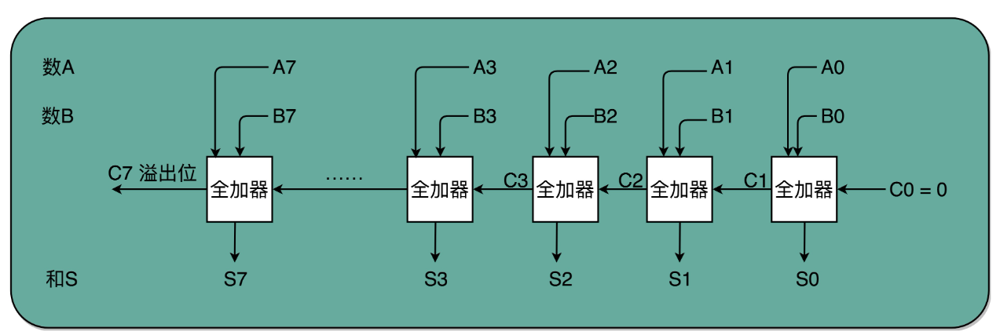

对于这个全加器，在个位只需要用一个半加器，或者让全加器的进位输入始终是 0。因为个位没有来自更右侧的进位。而最左侧的一位输出的进位信号，表示的并不是再进一位，而是**表示加法是否溢出**了。

### 电路并行

这种串联的加法器，高位需要等低位先计算后才能进行计算，性能比较差，因此真实的加法器，使用的是**超前进位加法器**。

每一个全加器，都要等待上一个全加器，把对应的进位结果算出来，才能算下一位的输出。位数越多，越往高位走，等待前面的步骤就越多，这个等待的时间有个专门的名词，叫作**门延迟**（Gate Delay）。

每通过一个门电路，就要等待门电路的计算结果，就是一层的门电路延迟，一般给它取一个“T”作为符号。一个全加器，其实就已经有了 3T 的延迟（进位需要经过 3 个门电路）。而 4 位整数，最高位的计算需要等待前面三个全加器的进位结果，也就是要等 9T 的延迟。如果是 64 位整数，那就要变成 63×3=189T 的延迟。

除了门延迟之外，还有一个问题就是**时钟频率**。在顺序乘法计算里面，如果我们想要用更少的电路，计算的中间结果需要保存在寄存器里面，然后等待下一个时钟周期的到来，控制测试信号才能进行下一次移位和加法，这个延迟比上面的门延迟更可观。

实际上，在进行加法的时候，如果相加的两个数是确定的，那高位是否会进位其实也是确定的。那么就可以让高位不需要等待低位的进位结果，而是把低位的所有输入信号都放进来，直接计算出高位的计算结果和进位结果。这就相当于把进位部分的电路完全展开。

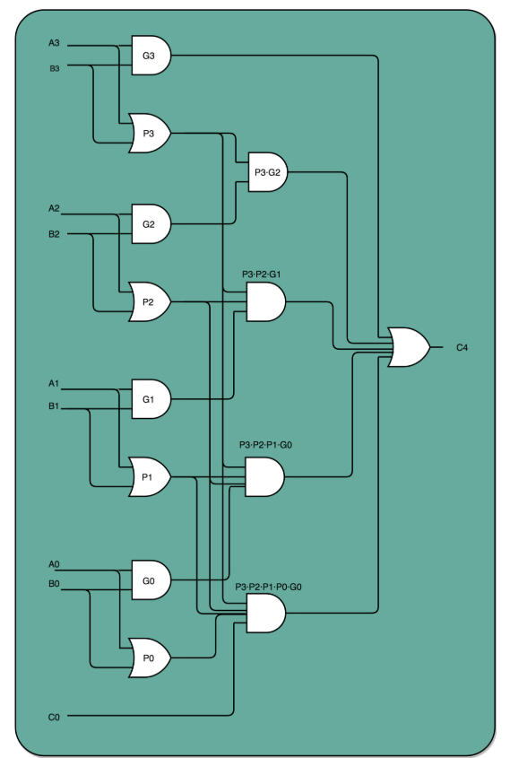

如果一个 4 位整数最高位是否进位，展开门电路图，只需要 3T 的延迟就可以拿到是否进位的计算结果。而对于 64 位的整数，也不会增加门延迟，只是从上往下复制这个电路，接入更多的信号而已。

这个优化，本质上是利用了电路天然的并行性。电路只要接通，输入的信号自动传播到了所有接通的线路里面，这其实也是硬件和软件最大的不同。

## 乘法器

先拿乘数最右侧的个位乘以被乘数，然后把结果写入用来存放计算结果的开关里面，然后，把被乘数左移一位，把乘数右移一位，仍然用乘数的个位去乘以被乘数，然后把结果加到刚才的结果上。反复重复这一步骤，直到不能再左移或右移。这样，乘数和被乘数就像两列相向而驶的列车，仅仅需要简单的加法器、一个可以左移一位的电路和一个右移一位的电路，就能完成整个乘法。

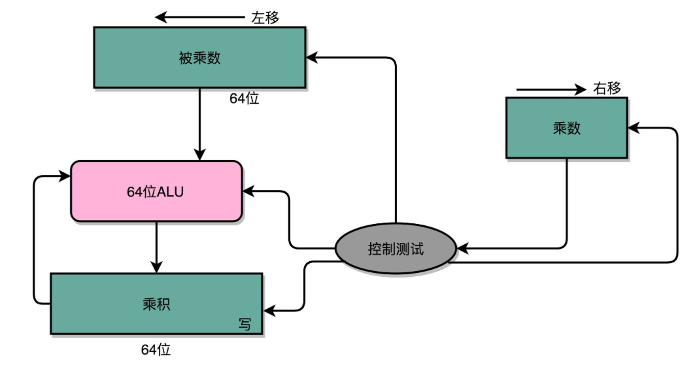

这里的控制测试，其实就是通过一个时钟信号，来控制左移、右移以及重新计算乘法和加法的时机。以计算 13×9，也就是二进制的 1101×1001 为例：

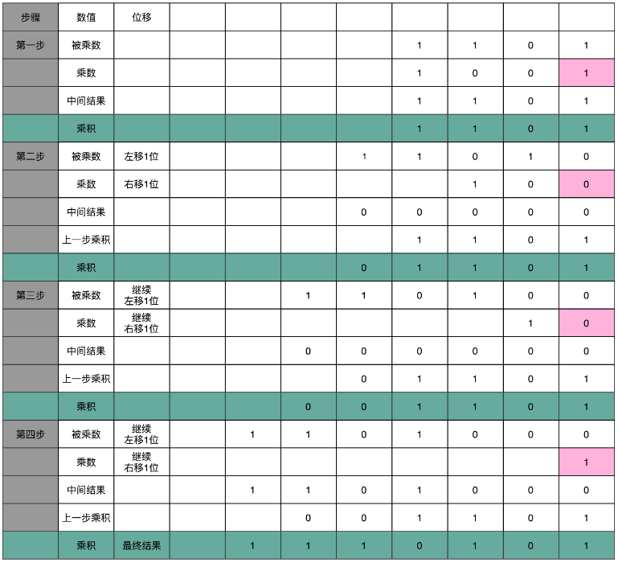

这个计算方式虽然节约电路，但是慢。在这个乘法器的实现过程里，把乘法展开，变成了“**加法 + 位移**”来实现。两个操作数是 4 位数，所以要进行 4 组“位移 + 加法”的操作。而且这 4 组操作还不能同时进行。因为**下一组的加法要依赖上一组的加法后的计算结果，下一组的位移也要依赖上一组的位移的结果。这样，整个算法是“顺序”的，每一组加法或者位移的运算都需要一定的时间**。

这个乘法的计算速度，和要计算的数的位数有关。比如，这里的 4 位，就需要 4 次加法。而现代 CPU 常常要用 32 位或者是 64 位来表示整数，那么对应就需要 32 次或者 64 次加法。比起 4 位数，要多花上 8 倍乃至 16 倍的时间。

### 并行加速

32 位数虽然是 32 次加法，但是可以让很多加法同时进行。顺序乘法器硬件的实现办法，就好像体育比赛里面的**单败淘汰赛**。只有一个擂台会存下最新的计算结果。每一场新的比赛就来一个新的选手，实现一次加法，实现完了剩下的还是原来那个守擂的，直到其余 31 个选手都上来比过一场。如果一场比赛需要一天，那么一共要比 31 场，也就是 31 天。

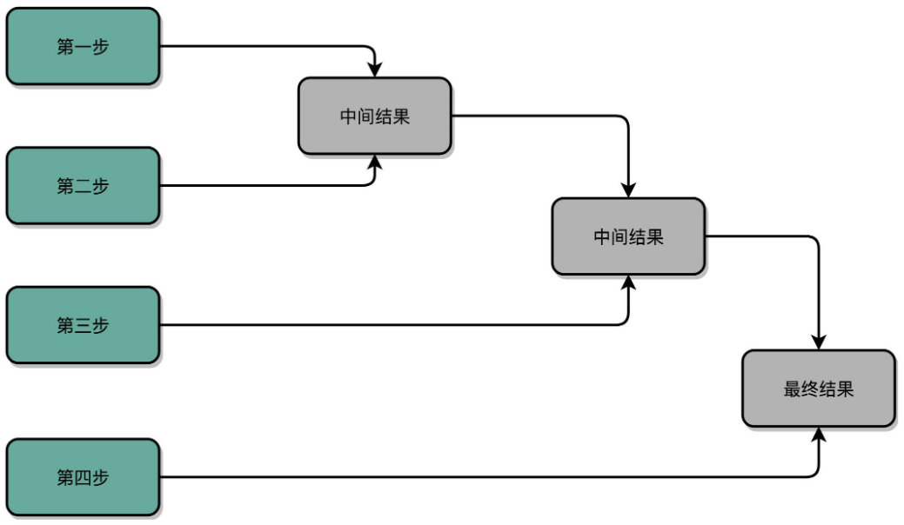

加速的办法，就是把比赛变成像世界杯足球赛那样的淘汰赛，32 个球队捉对厮杀，同时开赛。这样一天一下子就淘汰了 16 支队，也就是说，32 个数两两相加后，可以得到 16 个结果。后面的比赛也是一样同时开赛捉对厮杀。只需要 5 天，也就是 $O(log_2N) $的时间，就能得到计算的结果。但是这种方式要求我们得有 16 个球场。因为在淘汰赛的第一轮，我们需要 16 场比赛同时进行。对应到我们 CPU 的硬件上，就是需要更多的晶体管开关，来放下中间计算结果。

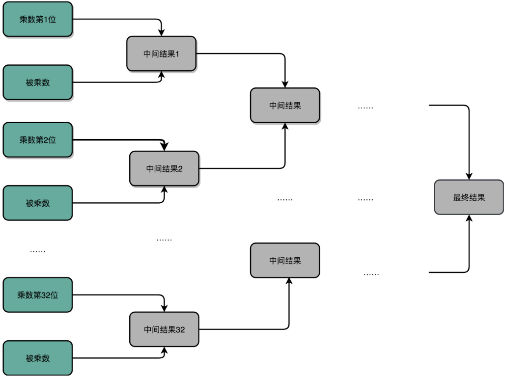

