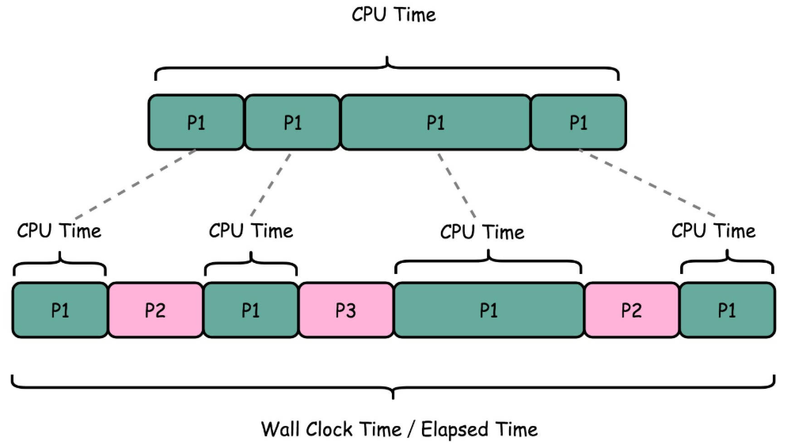
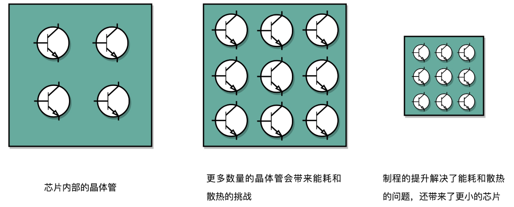
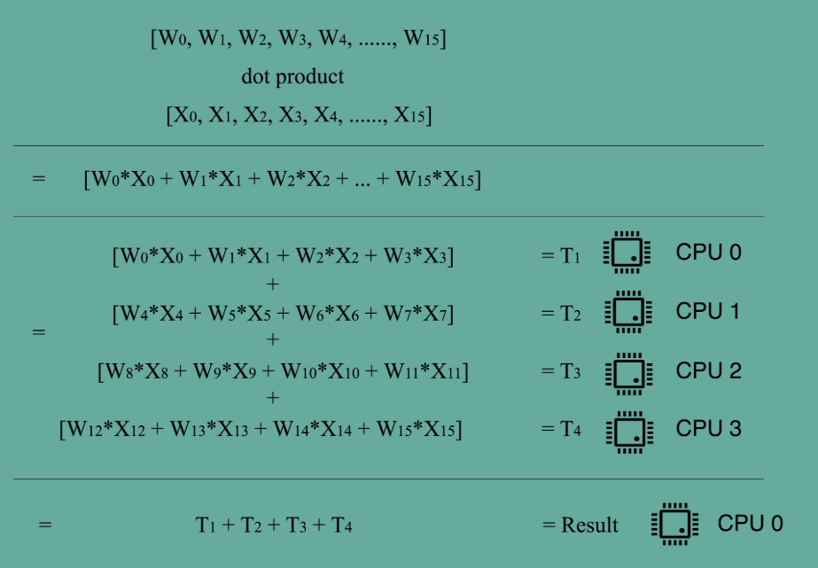

# 性能和功耗

## 性能

### 评估指标

计算机的性能，和干体力劳动很像，好比是我们要搬东西。对于计算机的性能，主要有两个指标来衡量。

- **响应时间**（Response time）：也叫执行时间（Execution time），即执行一个程序，到底需要花多少时间。花的时间越少，自然性能就越好。想要提升响应时间这个性能指标，可以理解为让计算机“跑得更快”。
- **吞吐率**（Throughput）：也叫带宽（Bandwidth），指在一定的时间范围内，到底能处理多少事情。这里的“事情”，在计算机里就是处理的数据或者执行的程序指令。想要提升这个指标，可以理解为让计算机“搬得更多”。

和搬东西来做对比，如果我们的响应时间短，跑得快，我们可以来回多跑几趟多搬几趟。所以说，缩短程序的响应时间，一般来说都会提升吞吐率。

除了缩短响应时间，我们还可以多找几个人一起来搬，这就类似现代的服务器都是 8 核、16 核的。人多力量大，同时处理数据，在单位时间内就可以处理更多数据，吞吐率自然也就上去了。

提升吞吐率的办法有很多。大部分时候，只要多加一些机器，多堆一些硬件就好了，但是响应时间的提升却没有那么容易。

### 性能的计算

我们一般**把性能定义成响应时间的倒数**，也就是：$性能 = 1/ 响应时间$。

> 手机跑分软件，就是把多个预设好的程序在手机上运行，然后根据运行需要的时间，算出一个分数来给出手机的性能评估。
>
> 在业界，各大 CPU 和服务器厂商组织了一个叫作**SPEC**（Standard Performance Evaluation Corporation）的第三方机构，专门用来指定各种“跑分”的规则。
>
> SPEC 提供的 CPU 基准测试程序，就好像 CPU 届的“高考”，通过数十个不同的计算程序，对于 CPU 的性能给出一个最终评分。这些程序丰富多彩，有编译器、解释器、视频压缩、人工智能国际象棋等等，涵盖了方方面面的应用场景。这是2017年发布的[CPU成绩](https://www.spec.org/cpu2017/results/cpu2017.html)。

直接使用时间衡量性能，会有两个问题。第一个问题是**不准**，多次运行同一个程序，得到的运行时间并不会完全一样。因为统计时间类似于“掐秒表”，记录程序运行结束的时间减去程序开始运行的时间。这个时间也叫 Wall Clock Time 或者 Elapsed Time，就是在运行程序期间，挂在墙上的钟走掉的时间。

但是，计算机可能同时运行着好多个程序，CPU 实际上不停地在各个程序之间进行切换。在这些走掉的时间里面，很可能 CPU 切换去运行别的程序了。而且，有些程序在运行的时候，可能要从网络、硬盘去读取数据，要等网络和硬盘把数据读出来，给到内存和 CPU。所以说，**要想准确统计某个程序运行时间，进而去比较两个程序的实际性能，我们得把这些时间给刨除掉**。

实际可以通过`time`命令进行计时，`time `命令会返回三个值：

- 第一个是**real time**，也就是 Wall Clock Time，即运行程序整个过程中流逝掉的时间
- 第二个是**user time**，也就是 CPU 在运行你的程序，在**用户态运行指令的时间**
- 第三个是**sys time**，是 CPU 在运行你的程序，在**操作系统内核里运行指令的时间**。

而**程序实际花费的 CPU 执行时间（CPU Time），就是 user time 加上 sys time**。

```
$ time seq 1000000 | wc -l
1000000
 
real  0m0.101s
user  0m0.031s
sys   0m0.016s
# 实际上程序用了 0.101s，但是 CPU time 只有 0.031+0.016 = 0.047s。运行程序的时间里，只有不到一半是实际花在这个程序上的。
# 如果在多核机器上运行上面的命令，可能得到user time + sys time > real time的结果，这是因为user time 和 sys time单独计算每个核占用的时间。
```




**即使我们已经拿到了 CPU 时间，我们也不一定可以直接“比较”出两个程序的性能差异**。即使在同一台计算机上，CPU 可能满载运行也可能降频运行，降频运行的时候自然花的时间会多一些。

除了 CPU ，时间这个性能指标还会受到主板、内存这些其他相关硬件的影响。所以，我们需要对“时间”这个指标进行拆解，**把程序的 CPU 执行时间变成 CPU 时钟周期数（CPU Cycles）和 时钟周期时间（Clock Cycle）的乘积**。

$程序的 CPU 执行时间 =CPU 时钟周期数×时钟周期时间$

#### 时钟周期时间

如果CPU 的主频是2.8GHz，可以先粗浅地认为，CPU 在 1 秒时间内，可以执行的**简单指令**的数量是 2.8G 条。更准确一点描述，这个 2.8GHz 就代表，CPU 的一个“钟表”能够识别出来的**最小的时间间隔**。

在 CPU 内部，有一个晶体振荡器（Oscillator Crystal），简称为晶振。我们把晶振当成 CPU 内部的电子表来使用。晶振带来的每一次“滴答”，就是时钟周期时间。

在2.8GHz 的 CPU 上，这个时钟周期时间，就是 $1/2.8G$。我们的 CPU，是按照这个“时钟”提示的时间来进行自己的操作。主频越高，意味着这个表走得越快，我们的 CPU 也就“被逼”着走得越快。

**超频**：相当于把CPU 内部的钟给调快了，于是 CPU 的计算跟着这个时钟的节奏，也就自然变快了。当然这个快不是没有代价的，CPU 跑得越快，散热的压力也就越大。就和人一样，超过生理极限，CPU 就会崩溃了。

回到上面程序 CPU 执行时间的公式，最简单的提升性能方案，就是缩短时钟周期时间，也就是提升主频，即换一块好点的 CPU。但这不是软件工程师能控制的事情，因此考虑减少CPU 时钟周期数。


#### CPU 时钟周期数

对于 CPU 时钟周期数，可以再做一个分解，把它变成“指令数×**每条指令的平均时钟周期数**（Cycles Per Instruction，简称 CPI）”。不同的指令需要的 Cycles 是不同的，加法和乘法都对应着一条 CPU 指令，但是乘法需要的 Cycles 就比加法要多，自然也就慢。在这样拆分了之后，程序的 CPU 执行时间就可以变成这样三个部分的乘积：

$程序的 CPU 执行时间 = 指令数×CPI×Clock Cycle Time$

指令数，代表执行我们的程序到底需要多少条指令、用哪些指令。这个很多时候就把挑战交给了编译器。同样的代码，编译成计算机指令时候，就有各种不同的表示方式。

在现代CPU中，通过流水线技术可以降低CPI。


## 功耗

从 1978 年 Intel 发布的 8086 CPU 开始，计算机的主频从 5MHz 开始，不断提升。1980 年代中期的 80386 能够跑到 40MHz，1989 年的 486 能够跑到 100MHz，直到 2000 年的奔腾 4 处理器，主频已经到达了 1.4GHz。

提升主频可以降低时钟周期时间，提升性能，但主频的提升也加大了功耗。

奔腾 4 的 CPU 主频上限是 3.8GHz，即使是当前最高配置的CPU，主频也只有5GHz，主频的提升没有之前那么快了。

> 一个 3.8GHz 的奔腾 4 处理器，满载功率是 130 瓦。机场允许带上飞机的充电宝的容量上限是 100 瓦时。如果把这个 CPU 安在手机里面，不考虑屏幕内存之类的耗电，这个 CPU 满载运行 45 分钟，充电宝里面就没电了。而 iPhone X 使用 ARM 架构的 CPU，功率则只有 4.5 瓦左右。


CPU一般都被叫作**超大规模集成电路**（Very-Large-Scale Integration，VLSI）。这些电路，实际上都是一个个晶体管组合而成的。CPU 在计算，其实就是让晶体管里面的“开关”不断地去“打开”和“关闭”，来组合完成各种运算和功能。

想要计算得快，一方面，我们要在 CPU 里，同样的面积里面，多放一些晶体管，也就是**增加密度**；另一方面，我们要让晶体管“打开”和“关闭”得更快一点，也就是**提升主频**。而这两者，都会增加功耗，带来耗电和散热的问题。

> 可以把计算机 CPU 想象成一个巨大的工厂，里面有很多工人，相当于 CPU 上面的晶体管，互相之间协同工作。
>
> 为了工作得快一点，我们要在工厂里多塞一点人。那为什么不把工厂造得大一点呢？因为人和人之间如果离得远了，互相之间走过去需要花的时间就会变长，这也会导致性能下降。这就好像如果 CPU 的面积大，晶体管之间的距离变大，电信号传输的时间就会变长，运算速度自然就慢了。
>
> 除了多塞一点人，我们还希望每个人的动作都快一点，这样同样的时间里就可以多干一点活儿了。这就相当于提升 CPU 主频，但是动作快，每个人就要出汗散热。要是太热了，对工厂里面的人来说会中暑生病，对 CPU 来说就会崩溃出错。
>
> 我们会在 CPU 上面抹硅脂、装风扇，乃至用上水冷或者其他更好的散热设备，就好像在工厂里面装风扇、空调，发冷饮一样。但是同样的空间下，装上风扇空调能够带来的散热效果也是有极限的。


在 CPU 里面，能够放下的晶体管数量和晶体管的“开关”频率也都是有限的。一个 CPU 的功率，可以用这样一个公式来表示：

$功耗 \approx 1/2 ×负载电容×电压的平方×开关频率×晶体管数量$

为了要提升性能，我们需要不断地增加晶体管数量。同样的面积下，我们想要多放一点晶体管，就要把晶体管造得小一点。这个就是平时我们所说的提升“制程”。从 28nm 到 7nm，相当于晶体管本身变成了原来的 1/4 大小。这个就相当于我们在工厂里，同样的活儿，我们要找瘦小一点的工人，这样一个工厂里面就可以多一些人。我们还要提升主频，让开关的频率变快，也就是要找手脚更快的工人。



但是，功耗增加太多，就会导致 CPU 散热跟不上，这时，我们就需要降低电压。这里有一点非常关键，在整个功耗的公式里面，**功耗和电压的平方是成正比的。**这意味着电压下降到原来的 1/5，整个的功耗会变成原来的 1/25。

> 从 5MHz 主频的 8086 到 5GHz 主频的 Intel i9，CPU 的电压已经从 5V 左右下降到了 1V 左右。这也是为什么我们 CPU 的主频提升了 1000 倍，但是功耗只增长了 40 倍。


### 阿姆达尔定律

随着CPU主频的提升遇到瓶颈，通过提升主频比较“难”去实现性能提升，因此转向通过提升“吞吐率”而不是“响应时间”，来提升性能。提升吞吐率可以通过多核CPU实现，这也是一个最常见的提升性能的方式，**通过并行提高性能**。

做机器学习程序的时候，需要计算向量的点积，比如向量$ W=[W0,W1,W2,…,W15]$和向量 $X=[X0,X1,X2,…,X15]$，$W⋅X=W0∗X0+W1∗X1+
W2∗X2+…+W15∗X15$。这些式子由 16 个乘法和 1 个连加组成。如果你自己一个人用笔来算的话，需要一步一步算 16 次乘法和 15 次加法。如果这个时候我们把这个人物分配给 4 个人，同时去算$ W0～W3, W4～W7, W8～W11, W12～W15$ 这样四个部分的结果，再由一个人进行汇总，需要的时间就会缩短。



并不是所有问题，都可以通过并行提高性能来解决。如果想要使用这种思想，需要满足这样几个条件。

- 需要进行的计算，本身可以分解成几个可以并行的任务。
- 需要能够分解好问题，并确保几个小任务的结果能够汇总到一起。
- 在“汇总”这个阶段，是没有办法并行进行的，还是得顺序执行，一步一步来。

这就引出了在进行性能优化中，常常用到的一个经验定律，**阿姆达尔定律**（Amdahl’s Law）。这个定律说的就是，对于一个程序进行优化之后，处理器并行运算之后效率提升的情况。具体可以用这样一个公式来表示：

$优化后的执行时间 = 受优化影响的执行时间 / 加速倍数 + 不受影响的执行时间$

在刚刚的向量点积例子里，4 个人同时计算向量的一小段点积，就是通过并行提高了这部分的计算性能。但是，这 4 个人的计算结果，最终还是要在一个人那里进行汇总相加。这部分汇总相加的时间，是不能通过并行来优化的，也就是上面的公式里面**不受影响的执行时间**这一部分。

比如上面的各个向量的一小段的点积，需要 100ns，加法需要 20ns，总共需要 120ns。这里通过并行 4 个 CPU 有了 4 倍的加速度。那么最终优化后，就有了 $100/4+20=45ns$。即使我们增加更多的并行度来提供加速倍数，比如有 100 个 CPU，整个时间也需要 $100/100+20=21ns$。

