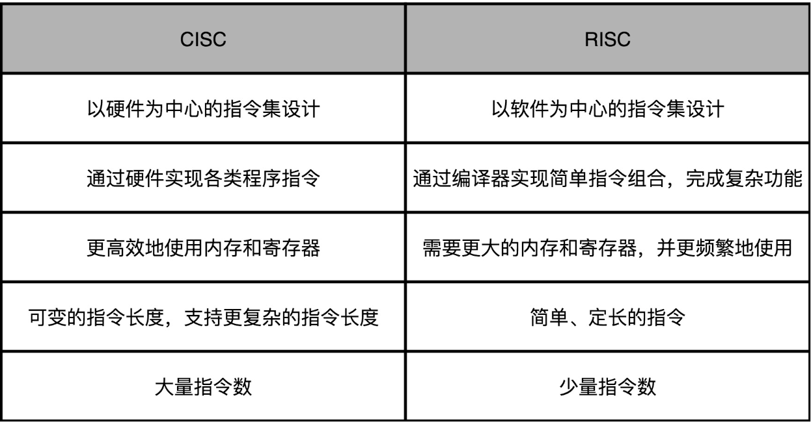
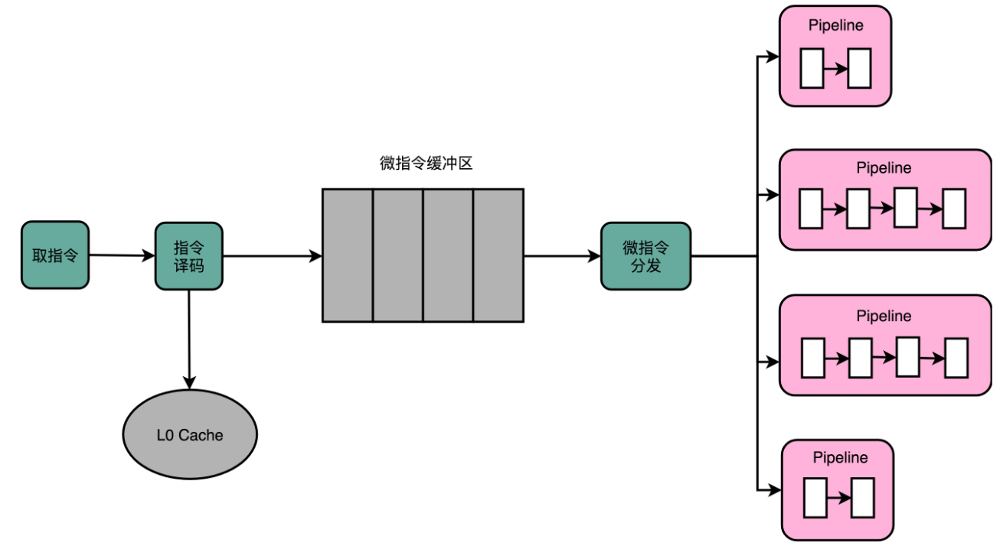

# CISC VS RISC

CPU 的指令集里的机器码是固定长度还是可变长度，可以作为**复杂指令集**（Complex Instruction Set Computing，简CISC）和**精简指令集**（Reduced Instruction Set Computing，RISC）这两种风格的指令集的一个最重要的差别。

## CISC

在早期硬件限制较大的背景下，CPU 指令集的设计，需要仔细考虑硬件限制。为了性能考虑，很多功能都直接通过硬件电路来完成。为了少用内存，指令的长度也是可变的。就像Huffman编码，常用的指令要短一些，不常用的指令可以长一些。那个时候的计算机，想要用尽可能少的内存空间，存储尽量多的指令。

## RISC

随着计算机的性能越来越好，存储的空间也越来越大了。到了 70 年代末，RISC 开始登上了历史的舞台。

实际在 CPU 运行的程序里，80% 的时间都是在使用 20% 的简单指令。那就只保留这20%的指令，因为指令数量多，计算机科学家们在软硬件两方面都受到了很多挑战。

- 在硬件层面，要想支持更多的复杂指令，CPU 里面的电路就要更复杂，设计起来也就更困难。更复杂的电路，在散热和功耗层面，也会带来更大的挑战。
- 在软件层面，支持更多的复杂指令，编译器的优化就变得更困难。毕竟，面向 2000 个指令来优化编译器和面向 500 个指令来优化编译器的困难是完全不同的。

在 RISC 架构里面，CPU 选择把指令“精简”到 20% 的简单指令。而原先的复杂指令，则通过用简单指令组合起来来实现，让软件来实现硬件的功能。这样，CPU 的整个硬件设计就会变得更简单了，在硬件层面提升性能也会变得更容易了。

RISC 的 CPU 里完成指令的电路变得简单了，于是也就腾出了更多的空间。这个空间，常常被拿来放通用寄存器。因为 RISC 完成同样的功能，执行的指令数量要比 CISC 多，所以，如果需要反复从内存里面读取指令或者数据到寄存器里来，那么很多时间就会花在访问内存上。于是，**RISC 架构的 CPU 往往就有更多的通用寄存器**。

除了寄存器这样的存储空间，RISC 的 CPU 也可以把更多的晶体管，用来实现更好的分支预测等相关功能，进一步去提升 CPU 实际的执行效率。

$程序的 CPU 执行时间 = 指令数 × CPI × Clock Cycle Time$

CISC 的架构，其实就是通过优化**指令数**，来减少 CPU 的执行时间。而 RISC 的架构，其实是在优化 CPI。因为指令比较简单，需要的时钟周期就比较少。

## 微指令架构

因为 RISC 降低了 CPU 硬件的设计和开发难度，所以从 80 年代开始，大部分新的 CPU 都开始采用 RISC 架构。从 IBM 的 PowerPC，到 SUN 的 SPARC，都是 RISC 架构。所有人看到仍然采用 CISC 架构的 Intel CPU，都可以批评一句“Complex and messy”。但是，为什么无论是在 PC 上，还是服务器上，仍然是 Intel 成为最后的赢家呢？

面对这么多负面评价的 Intel，自然也不能无动于衷。 x86 架构所面临的种种问题，其实都来自于一个最重要的考量，那就是**指令集的向前兼容性**。

如果 Intel 要放弃 x86 的架构和指令集，开发一个 RISC 架构的 CPU，面临的第一个问题就是所有这些软件都是不兼容的。Intel 想要在 CPU 进入 64 位的时代的时候，丢掉 x86 的历史包袱，所以推出了全新的 IA-64 的架构。但是，却因为不兼容 x86 的指令集，遭遇了重大的失败。

> 反而是 AMD，趁着 Intel 研发安腾的时候，推出了兼容 32 位 x86 指令集的 64 位架构，也就是 AMD64。现在在 Linux 下安装各种软件包，经常会看到像下面这样带有 AMD64 字样的内容。这是因为 x86 下的 64 位的指令集 x86-64，并不是 Intel 发明的，而是 AMD 发明的。

既然核心问题是要始终向前兼容 x86 的指令集，那么能不能不修改指令集，但是让 CISC 风格的指令集，用 RISC 的形式在 CPU 里面运行呢？

于是，从 Pentium Pro 时代开始，Intel 就开始在处理器里引入了**微指令**（Micro-Instructions/Micro-Ops）**架构**。而微指令架构的引入，也让 CISC 和 RISC 的分界变得模糊了。

在微指令架构的 CPU 里面，编译器编译出来的机器码和汇编代码并没有发生什么变化。但在指令译码的阶段，指令译码器“翻译”出来的，不再是某一条 CPU 指令。译码器会把一条机器码，“**翻译**”成好几条“微指令”。这里的一条条微指令，就不再是 CISC 风格的了，而是变成了固定长度的 RISC 风格的了。

这些 RISC 风格的微指令，会被放到一个微指令缓冲区里面，然后再从缓冲区里面，分发给到后面的超标量，并且是乱序执行的流水线架构里面。不过这个流水线架构里面接受的，就不是复杂的指令，而是精简的指令了。在这个架构里，指令译码器相当于变成了设计模式里的一个“适配器”（Adaptor）。这个适配器，填平了 CISC 和 RISC 之间的指令差异。

能够把 CISC 的指令译码成 RISC 指令的指令译码器，比原来的指令译码器要复杂。这也就意味着更复杂的电路和更长的译码时间：本来以为可以通过 RISC 提升的性能，结果又有一部分浪费在了指令译码上。

由于有 80% 运行的代码用着 20% 的常用指令，这意味着CPU 里执行的代码有很强的局部性。而对于有着很强局部性的问题，常见的一个解决方案就是使用缓存。

Intel 在 CPU 里面加了一层 L0 Cache。这个 Cache 保存的就是指令译码器把 CISC 的指令“翻译”成 RISC 的微指令的结果。于是，在大部分情况下，CPU 都可以从 Cache 里面拿到译码结果，而不需要让译码器去进行实际的译码操作。这样不仅优化了性能，因为译码器的晶体管开关动作变少了，还减少了功耗。

## ARM 

ARM 这个名字现在的含义，是“Advanced RISC Machines”。不过，ARM 能够在移动端战胜 Intel，并不是因为 RISC 架构。

- **功耗优先的设计**：一个 4 核的 Intel i7 的 CPU，设计的时候功率是 130W。而一块 ARM A8 的单个核心的 CPU，设计功率只有 2W。两者之间差出了 100 倍。在移动设备上，功耗是一个远比性能更重要的指标，毕竟我们不能随时在身上带个发电机。ARM 的 CPU，主频更低，晶体管更少，高速缓存更小，乱序执行的能力更弱。所有这些，都是为了功耗所做的妥协。
- **低价**：ARM 并没有自己垄断 CPU 的生产和制造，只是进行 CPU 设计，然后把对应的知识产权授权出去，让其他的厂商来生产 ARM 架构的 CPU。它甚至还允许这些厂商可以基于 ARM 的架构和指令集，设计属于自己的 CPU。像苹果、三星、华为，它们都是拿到了基于 ARM 体系架构设计和制造 CPU 的授权。ARM 自己只是收取对应的专利授权费用。多个厂商之间的竞争，使得 ARM 的芯片在市场上价格很便宜。所以，尽管 ARM 的芯片的出货量远大于 Intel，但是收入和利润却比不上 Intel。

