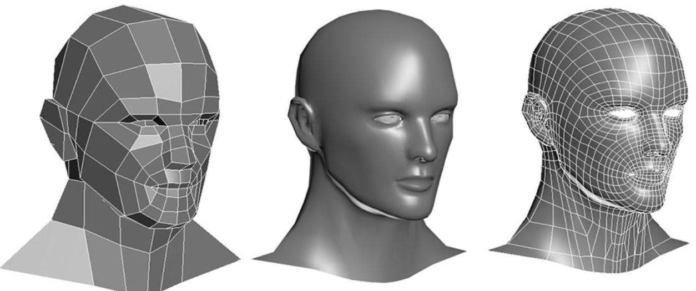

# 其他处理器

## GPU

### 图形渲染的流程

现在电脑里面显示出来的 3D 的画面，其实是通过多边形组合出来的。游戏里面的人物的脸，并不是通过相机或者摄像头拍出来的，而是通过[多边形建模](https://en.wikipedia.org/wiki/Polygonal_modeling)（Polygon Modeling）创建出来的。

实际这些人物在画面里面的移动、动作，乃至根据光线发生的变化，都是通过计算机根据图形学的各种计算，实时渲染出来的。

这个对于图像进行实时渲染的过程，可以被分解成下面这样 5 个步骤：

1. 顶点处理（Vertex Processing）
2. 图元处理（Primitive Processing）
3. 栅格化（Rasterization）
4. 片段处理（Fragment Processing）
5. 像素操作（Pixel Operations）

#### 顶点处理

图形渲染的第一步是顶点处理。构成多边形建模的每一个多边形呢，都有多个顶点（Vertex）。这些顶点都有一个在三维空间里的坐标。但是屏幕是二维的，所以在确定当前视角的时候，我们需要**把这些顶点在三维空间里面的位置，转化到屏幕这个二维空间里面**。这个转换的操作，就叫作顶点处理。

这样的转化都是通过线性代数的计算来进行的。我们的建模越精细，需要转换的顶点数量就越多，计算量就越大。**而且，这里面每一个顶点位置的转换，互相之间没有依赖，是可以并行独立计算的。**

#### 图元处理

图元处理，其实就是要把顶点处理完成之后的各个顶点连起来，变成多边形。其实转化后的顶点，仍然是在一个三维空间里，只是第三维的 Z 轴，是正对屏幕的“深度”。所以针对这些多边形，需要做一个操作，叫**剔除和裁剪**（Cull and Clip），也就是把不在屏幕里面，或者一部分不在屏幕里面的内容给去掉，减少接下来流程的工作量。

#### 栅格化

屏幕分辨率是有限的，一般是通过一个个“像素（Pixel）”来显示出内容的。所以，对于做完图元处理的多边形，要把它们转换成屏幕里面的一个个像素点。**这个栅格化操作，有一个特点和上面的顶点处理是一样的，就是每一个图元都可以并行独立地栅格化。**

#### 片段处理

在栅格化变成了像素点之后，图片还是“黑白”的。现在还需要计算每一个像素的颜色、透明度等信息，给像素点上色。这步操作，就是片段处理。**这步操作，同样也可以每个片段并行、独立进行，和上面的顶点处理和栅格化一样。**

#### 像素操作

把不同的多边形的像素点“混合（Blending）”到一起。可能前面的多边形可能是半透明的，那么前后的颜色就要混合在一起变成一个新的颜色；或者前面的多边形遮挡住了后面的多边形，那么就只要显示前面多边形的颜色就好了。最终，输出到显示设备。

经过这完整的 5 个步骤之后，我们就完成了从三维空间里的数据的渲染，变成屏幕上可以看到的 3D 动画了。这样 5 个步骤的渲染流程呢，一般也被称之为**图形流水线**（Graphic Pipeline）。

### GPU：解放图形渲染

如果用 CPU 来进行这个渲染过程，需要花上多少资源呢？

在上世纪 90 年代的时候，屏幕的分辨率还没有现在那么高。一般的 CRT 显示器也就是 640×480 的分辨率。这意味着屏幕上有 30 万个像素需要渲染。为了让我们的眼睛看到画面不晕眩，我们希望画面能有 60 帧。于是，每秒我们就要重新渲染 60 次这个画面。也就是说，每秒需要完成 1800 万次单个像素的渲染。从栅格化开始，每个像素有 3 个流水线步骤，即使每次步骤只有 1 个指令，那我们也需要 5400 万条指令，也就是 54M 条指令。

90 年代的 CPU 的性能是多少呢？93 年出货的第一代 Pentium 处理器，主频是 60MHz，后续逐步推出了 66MHz、75MHz、100MHz 的处理器。以这个性能来看，用 CPU 来渲染 3D 图形，基本上就要把 CPU 的性能用完了。因为实际的每一个渲染步骤可能不止一个指令，我们的 CPU 可能根本就跑不动这样的三维图形渲染。

在这个时候，Voodoo FX 这样的图形加速卡登上了历史舞台。既然图形渲染的流程是固定的，那我们直接用硬件来处理这部分过程，不用 CPU 来计算是不是就好了？很显然，这样的硬件会比制造有同样计算性能的 CPU 要便宜得多。因为整个计算流程是完全固定的，不需要流水线停顿、乱序执行等等的各类导致 CPU 计算变得复杂的问题。我们也不需要有什么可编程能力，只要让硬件按照写好的逻辑进行运算就好了。

那个时候，整个顶点处理的过程还是都由 CPU 进行的，不过后续所有到图元和像素级别的处理都是通过 Voodoo FX 或者 TNT 这样的显卡去处理的。

### Shader 的诞生和可编程图形处理器

在 Voodoo 和 TNT 显卡的渲染管线里面，没有“顶点处理“这个步骤。在当时，把多边形的顶点进行线性变化，转化到我们的屏幕的坐标系的工作还是由 CPU 完成的。所以，CPU 的性能越好，能够支持的多边形也就越多，对应的多边形建模的效果自然也就越像真人。而 3D 游戏的多边形性能也受限于我们 CPU 的性能。无论你的显卡有多快，如果 CPU 不行，3D 画面一样还是不行。

所以，1999 年 NVidia 推出的 GeForce 256 显卡，就把顶点处理的计算能力，也从 CPU 里挪到了显卡里。不过，这对于想要做好 3D 游戏的程序员们还不够，即使到了 GeForce 256。整个图形渲染过程都是在硬件里面固定的管线来完成的。程序员们在加速卡上能做的事情，只有改配置来实现不同的图形渲染效果。如果通过改配置做不到，我们就没有什么办法了。

这个时候，程序员希望 GPU 也能有一定的可编程能力。这个编程能力不是像 CPU 那样，有非常通用的指令，可以进行任何你希望的操作，而是在整个的**渲染管线**（Graphics Pipeline）的一些特别步骤，能够自己去**定义处理数据的算法或者操作**。于是，从 2001 年的 Direct3D 8.0 开始，微软第一次引入了**可编程管线**（Programable Function Pipeline）的概念。

一开始的可编程管线仅限于顶点处理（Vertex Processing）和片段处理（Fragment Processing）部分。这些可以编程的接口，称之为**Shader**，即**着色器**。之所以叫“着色器”，是因为一开始这些“可编程”的接口，只能修改顶点处理和片段处理部分的程序逻辑。用这些接口来做的，也主要是光照、亮度、颜色等等的处理，所以叫着色器。

这类GPU有两类 Shader，即 Vertex Shader 和 Fragment Shader。在进行顶点处理的时候，我们操作的是多边形的顶点；在片段操作的时候，我们操作的是屏幕上的像素点。对于顶点的操作，通常比片段要复杂一些。所以一开始，这两类 Shader 都是独立的硬件电路，也各自有独立的编程接口。因为这么做，硬件设计起来更加简单，一块 GPU 上也能容纳下更多的 Shader。

不过虽然在顶点处理和片段处理上的具体逻辑不太一样，但是里面用到的指令集可以用同一套。而且，虽然把 Vertex Shader 和 Fragment Shader 分开，可以减少硬件设计的复杂程度，但是也带来了一种浪费，有一半 Shader 始终没有被使用。在整个渲染管线里，Vertext Shader 运行的时候，Fragment Shader 停在那里什么也没干。Fragment Shader 在运行的时候，Vertext Shader 也停在那里发呆。

于是，**统一着色器架构**（Unified Shader Architecture）就应运而生了。既然大家用的指令集是一样的，那不如就在 GPU 里面放很多个一样的 Shader 硬件电路，然后通过统一调度，把顶点处理、图元处理、片段处理这些任务，都交给这些 Shader 去处理，让整个 GPU 尽可能地忙起来。这样的设计，就是现代 GPU 的设计，就是统一着色器架构。

正是因为 Shader 变成一个“通用”的模块，才有了把 GPU 拿来做各种通用计算的用法，也就是**GPGPU**（General-Purpose Computing on Graphics Processing Units，通用图形处理器）。而正是因为 GPU 可以拿来做各种通用的计算，才有了过去 10 年深度学习的火热。

### 现代 GPU 的三个核心创意

#### 芯片瘦身

现代 CPU 里的晶体管变得越来越多，越来越复杂，其实已经不是用来实现“计算”这个核心功能，而是拿来实现处理乱序执行、进行分支预测，以及高速缓存。

而在 GPU 里，这些电路就显得有点多余了，GPU 的整个处理过程是一个[流式处理](https://en.wikipedia.org/wiki/Stream_processing)（Stream Processing）的过程。因为没有那么多分支条件，或者复杂的依赖关系，我们可以把 GPU 里这些对应的电路都可以去掉，做一次小小的瘦身，只留下取指令、指令译码、ALU 以及执行这些计算需要的寄存器和缓存就好了。一般来说，把这些电路抽象成三个部分，就是取指令和指令译码、ALU 和执行上下文。

#### 多核并行和 SIMT

在一个 GPU 里面，塞很多个这样并行的 GPU 电路来实现计算，就好像 CPU 里面的多核 CPU 一样。和 CPU 不同的是，我们不需要单独去实现什么多线程的计算。因为 GPU 的运算是天然并行的。

无论是对多边形里的顶点进行处理，还是屏幕里面的每一个像素进行处理，每个点的计算都是独立的。所以，简单地添加多核的 GPU，就能做到并行加速。不过光这样加速还是不够，GPU 借鉴了 CPU 里面的 SIMD，用了一种叫作[SIMT](https://en.wikipedia.org/wiki/Single_instruction,_multiple_threads)（Single Instruction，Multiple Threads）的技术。SIMT 比 SIMD 更加灵活。在 SIMD 里面，CPU 一次性取出了固定长度的多个数据，放到寄存器里面，用一个指令去执行。而 SIMT，可以把多条数据，交给不同的线程去处理。

各个线程里面执行的指令流程是一样的，但是可能根据数据的不同，走到不同的条件分支。这样，相同的代码和相同的流程，可能执行不同的具体的指令。这个线程走到的是 if 的条件分支，另外一个线程走到的就是 else 的条件分支了。

于是， GPU 设计就可以进一步进化，也就是在取指令和指令译码的阶段，取出的指令可以给到后面多个不同的 ALU 并行进行运算。这样，一个 GPU 的核里，就可以放下更多的 ALU，同时进行更多的并行运算了。

#### GPU 里的“超线程”

虽然 GPU 里面的主要以数值计算为主。不过既然已经是一个“通用计算”的架构了，GPU 里面也避免不了会有 `if…else` 这样的条件分支。但是，在 GPU 里没有 CPU 的分支预测电路。

所以，GPU 里的指令，可能会遇到和 CPU 类似的“流水线停顿”问题。遇到流水线停顿，就可以使用超线程技术。在 GPU 上，遇到停顿的时候，就可以调度一些别的计算任务给当前的 ALU。

和超线程一样，既然要调度一个不同的任务过来，就需要针对这个任务，提供更多的**执行上下文**。所以，一个 Core 里面的**执行上下文**的数量，需要比 ALU 多。

## FPGA

CPU 就是一些简单的门电路像搭积木一样搭出来的。从最简单的门电路，搭建成半加器、全加器，然后再搭建成完整功能的 ALU。这些电路里，有完成各种实际计算功能的组合逻辑电路，也有用来控制数据访问，创建出寄存器和内存的时序逻辑电路。

在现代 CPU 里面，一个四核 i7 的 Intel CPU，上面的晶体管数量差不多有 20 亿个。要想设计一个 CPU，就要想办法连接这 20 亿个晶体管。

连接晶体管不是一次就能完事儿了的。设计更简单一点儿的专用于特定功能的芯片，少不了要几个月。而设计一个 CPU，往往要以“年”来计。在这个过程中，硬件工程师们要设计、验证各种各样的技术方案，可能会遇到各种各样的 Bug。如果每次验证一个方案，都要单独设计生产一块芯片，那这个代价也太高了。

而FPGA使得在设计一个硬件时，通过不同的程序代码，可以操作这个硬件之前的电路连线，通过“编程”让这个硬件变成我们设计的电路连线的芯片。

 FPGA，**现场可编程门阵列**（Field-Programmable Gate Array）。

- P 代表 Programmable，即这是一个可以通过编程来控制的硬件。
- G 代表 Gate ，代表芯片里面的门电路。编程组合的就是这样一个一个门电路。
- A 代表的 Array，说的是在一块 FPGA 上，密密麻麻列了大量 Gate 这样的门电路。
- F 表示，一块 FPGA 这样的板子，可以进行在“现场”多次地进行编程。它不像 PAL（Programmable Array Logic，可编程阵列逻辑）这样更古老的硬件设备，只能“编程”一次，把预先写好的程序一次性烧录到硬件里面，之后就不能再修改了。

FPGA”这样的组合，基本上解决了设计硬件的问题。我们可以像软件一样对硬件编程，可以反复烧录，还有海量的门电路，可以组合实现复杂的芯片功能。

FPGA 具体是怎么对硬件进行编程的，可以总结为三个步骤：

- **第一，用存储换功能实现组合逻辑。**在实现 CPU 的功能的时候，我们需要完成各种各样的电路逻辑。在 FPGA 里，这些基本的电路逻辑，不是采用布线连接的方式进行的，而是预先根据我们在软件里面设计的逻辑电路，算出对应的真值表，然后直接存到一个叫作 LUT（Look-Up Table，查找表）的电路里面。这个 LUT 呢，其实就是一块存储空间，里面存储了“特定的输入信号下，对应输出 0 还是 1”。

  > 假如要实现一个函数，返回斐波那契数列的第 N 项，并且限制这个 N 不会超过 100。
  >
  > 斐波那契数列的通项公式是$ f(N) = f(N-1) + f(N-2) $。我们可以从第 1 项开始算。也可以预先用程序算好斐波那契数量前 100 项，然后把它预先放到一个数组里面。这个数组就像 [1, 1, 2, 3, 5…] 这样。当要计算第 N 项的时候呢，我们不用去计算得到结果，而是直接查找这个数组里面的第 N 项。

- **第二，对于需要实现的时序逻辑电路，可以在 FPGA 里面直接放上 D 触发器，作为寄存器。**这个和 CPU 里的触发器没有什么本质不同。不过，我们会**把很多个 LUT 的电路和寄存器组合在一起，变成一个逻辑簇**（Logic Cluster）。在 FPGA 里，这样组合了多个 LUT 和寄存器的设备，也被叫做 CLB（Configurable Logic Block，可配置逻辑块）。

  我们通过配置 CLB 实现的功能有点儿像我们全加器。它已经在最基础的门电路上做了组合，能够提供更复杂一点的功能。更复杂的芯片功能，我们不用再从门电路搭起，可以通过 CLB 组合搭建出来。
  

- **第三，FPGA 是通过可编程逻辑布线，来连接各个不同的 CLB，最终实现我们想要实现的芯片功能。**这个可编程逻辑布线，可以把它当成铁路网。整个铁路系统已经铺好了，但是整个铁路网里面，设计了很多个道岔。我们可以通过控制道岔，来确定不同的列车线路。在可编程逻辑布线里面，“编程”在做的，就是拨动像道岔一样的各个电路开关，最终实现不同 CLB 之间的连接，完成我们想要的芯片功能。

于是，通过 LUT 和寄存器，我们能够组合出很多 CLB，而通过连接不同的 CLB，最终有了我们想要的芯片功能。最关键的是，这个组合过程是可以“编程”控制的。而且这个编程出来的软件，还可以后续改写，重新写入到硬件里。让同一个硬件实现不同的芯片功能。

## ASIC

**ASIC**（Application-Specific Integrated Circuit），**专用集成电路**，针对专门用途设计的（摄像头里的芯片、录音笔里处理音频的芯片等），所以它的电路更精简，单片的制造成本也比 CPU 更低。而且，因为电路精简，所以通常能耗要比用来做通用计算的 CPU 更低。

当然，我们可以用 FPGA 来做 ASIC 的事情，对 FPGA 进行“编程”，其实就是把 FPGA 的电路变成了一个 ASIC。这样的芯片，往往在成本和功耗上优于需要做通用计算的 CPU 和 GPU。

但是这样做硬件上有点儿“浪费”。每一个 LUT 电路，其实都是一个小小的“浪费”。一个 LUT 电路设计出来之后，既可以实现与门，又可以实现或门，自然用到的晶体管数量，比单纯连死的与门或者或门的要多得多。同时，因为用的晶体管多，它的能耗也比单纯连死的电路要大，单片 FPGA 的生产制造的成本也比 ASIC 要高不少。

不过，FPGA 的优点在于，它没有硬件研发成本。ASIC 的电路设计，需要仿真、验证，还需要经过流片（Tape out），变成一个印刷的电路版，最终变成芯片。这整个从研发到上市的过程，最低花费也要几万美元，高的话，会在几千万乃至数亿美元。更何况，整个设计还有失败的可能。所以，如果我们设计的专用芯片，只是要制造几千片，那买几千片现成的 FPGA，可能远比花上几百万美元，来设计、制造 ASIC 要经济得多。

使用 ASIC 这样的专用芯片，还是采用 FPGA 这样可编程的通用硬件，核心的决策因素还是成本。不过这个成本，不只是单个芯片的生产制造成本，还要考虑**总体拥有成本**（Total Cost of Ownership），也就是说，除了生产成本之外，我们要把研发成本也算进去。如果我们只制造了一片芯片，那么成本就是“这枚芯片的成本 + 为了这枚芯片建的生产线的成本 + 芯片的研发成本”，而不只是“芯片的原材料沙子的成本 + 生产的电费”。

单个 ASIC 的生产制造成本比 FPGA 低，ASIC 的能耗也比能实现同样功能的 FPGA 要低。能耗低，意味着长时间运行这些芯片，所用的电力成本也更低。

但是，ASIC 有一笔很高的 NRE（Non-Recuring Engineering Cost，一次性工程费用）成本。这个成本，就是 ASIC 实际“研发”的成本。只有需要大量生产 ASIC 芯片的时候，才能摊薄这份研发成本。

## TPU

### 解决的问题

TPU是过去几年最知名、最具有实用价值的 ASIC，因为它来自于真实的需求。

在深度学习热起来之后，计算量最大的是什么呢？

并不是进行深度学习的训练，而是深度学习的推断部分。

**推断部分**，是指在完成深度学习训练之后，把训练完成的模型存储下来。这个存储下来的模型，是许许多多个向量组成的参数。然后，根据这些参数去计算输入的数据，最终得到一个计算结果。

这个推断过程，可能是在互联网广告领域，去推测某一个用户是否会点击特定的广告；也可能是我们在经过高铁站的时候，扫一下身份证进行一次人脸识别，判断一下是不是你本人。

虽然训练一个深度学习的模型需要花的时间不少，但是实际在推断上花的时间要更多。因此，第一代的 TPU，首先优化的并不是深度学习的模型训练，而是深度学习的模型推断。

> **模型的 训练 和 推断 之间的不同**
>
> 1. **深度学习的推断工作更简单，对灵活性的要求也就更低。**模型推断的过程，只需要去计算一些矩阵的乘法、加法，调用一些 Sigmoid 或者 RELU 这样的激活函数。这样的过程可能需要反复进行很多层，但是也只是这些计算过程的简单组合。
> 2. **深度学习的推断的性能，首先要保障响应时间的指标。**计算机关注的性能指标，有响应时间（Response Time）和吞吐率（Throughput）。在模型训练的时候，只需要考虑吞吐率问题就行了。因为一个模型训练少则好几分钟，多的话要几个月。而推断过程，像互联网广告的点击预测，我们往往希望能在几十毫秒乃至几毫秒之内就完成，而人脸识别也不希望会超过几秒钟。很显然，模型训练和推断对于性能的要求是截然不同的。
> 3. **深度学习的推断工作，希望在功耗上尽可能少一些**。深度学习的训练，对功耗没有那么敏感，只是希望训练速度能够尽可能快，多费点电就多费点儿了。这是因为，深度学习的推断，要 7×24h 地跑在数据中心里面。而且，对应的芯片，要大规模地部署在数据中心。一块芯片减少 5% 的功耗，就能节省大量的电费。而深度学习的训练工作，大部分情况下只是少部分算法工程师用少量的机器进行。很多时候，只是做小规模的实验，尽快得到结果，节约人力成本。

### 向前兼容，一个 FPU 的设计

**向前兼容**：在计算机产业界里，因为没有考虑向前兼容，惨遭失败的产品数不胜数，典型的有安腾处理器。所以，TPU 并没有设计成一个独立的“CPU“，而是设计成一块像显卡一样，插在主板 PCI-E 接口上的板卡。更进一步地，TPU 甚至没有现代 GPU 一样，设计成自己有对应的取指令的电路，而是通过 CPU，向 TPU 发送需要执行的指令。

这两个设计，使得 TPU 的硬件设计变得简单了，只需要专心完成一个专用的“计算芯片”就好了。所以，TPU 整个芯片的设计上线时间也就缩短到了 15 个月。不过，这样一个 TPU，性质类似 387 浮点数计算芯片，即一个像 FPU（浮点数处理器）的协处理器（Coprocessor），而不是像 CPU 和 GPU 这样可以独立工作的 Processor Unit。

### 专用电路和大量缓存

整个 TPU 的硬件，完全是按照深度学习一个层（Layer）的计算流程来设计的。有单独的矩阵乘法单元（Matrix Multiply Unit）、累加器（Accumulators）模块、激活函数（Activation）模块和归一化 / 池化（Normalization/Pool）模块。而且，这些模块是顺序串联在一起的。

这是因为，一个深度学习的推断过程，是由很多层的计算组成的。而每一个层（Layer）的计算过程，就是先进行矩阵乘法，再进行累加，接着调用激活函数，最后进行归一化和池化。这里的硬件设计，就是把整个流程变成一套固定的硬件电路。这也是一个 ASIC 的典型设计思路，即把确定的程序指令流程，变成固定的硬件电路。

控制电路（Control）只占了 2%，这是因为，TPU 的计算过程基本上是一个固定的流程。不像 CPU 那样，有各种复杂的控制功能，比如冒险、分支预测等等。

超过一半的 TPU 的面积，都被用来作为 Local Unified Buffer（本地统一缓冲区）和矩阵乘法单元（Matrix Mutliply Unit）了。相比于矩阵乘法单元，累加器、实现激活函数和后续的归一 / 池化功能的激活管线（Activation Pipeline）也用得不多。这是因为，在深度学习推断的过程中，矩阵乘法的计算量是最大的，计算也更复杂，所以比简单的累加器和激活函数要占用更多的晶体管。

而统一缓冲区（Unified Buffer），则由 SRAM 这样高速的存储设备组成。SRAM 一般被直接拿来作为 CPU 的寄存器或者高速缓存。SRAM 比起内存使用的 DRAM 速度要快上很多，但是因为电路密度小，所以占用的空间要大很多。统一缓冲区之所以使用 SRAM，是因为在整个的推断过程中，它会高频反复地被矩阵乘法单元读写，来完成计算。

### 使用 8 Bits 数据

矩阵乘法单元，没有用 32 Bits 来存放一个浮点数，而是只用了一个 8 Bits 来存放浮点数。这是因为，在实际的机器学习应用中，会对数据做[归一化](https://en.wikipedia.org/wiki/Normalization)（Normalization）和[正则化](https://en.wikipedia.org/wiki/Regularization_(mathematics))（Regularization）的处理。这两个操作，会使得深度学习里面操作的数据都不会变得太大。通常来说呢，都能控制在 -3 到 3 这样一定的范围之内。

因为这个数值上的特征，我们需要的浮点数的精度也不需要太高了。32 位浮点数的精度，差不多可以到 1/1600 万。如果用 8 位或者 16 位表示浮点数，也能把精度放到 $2^6 $或者$ 2^{12}$，也就是 1/64 或者 1/4096。在深度学习里，常常够用了。特别是在模型推断的时候，要求的计算精度，往往可以比模型训练低。所以，8 Bits 的矩阵乘法器，就可以放下更多的计算量，使得 TPU 的推断速度更快。

