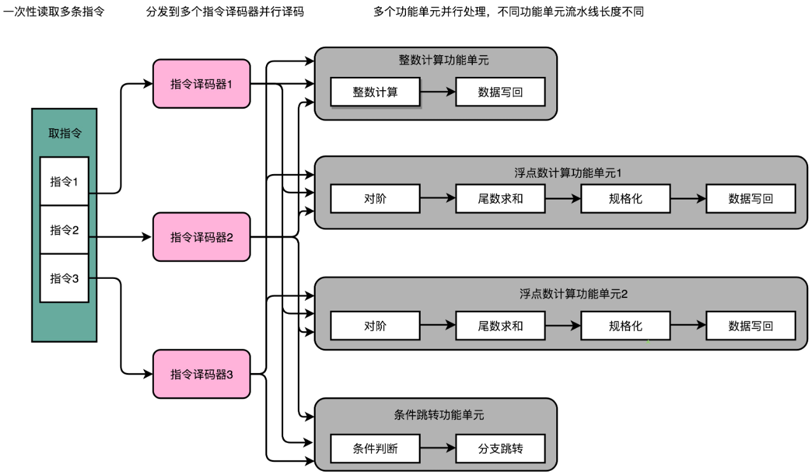
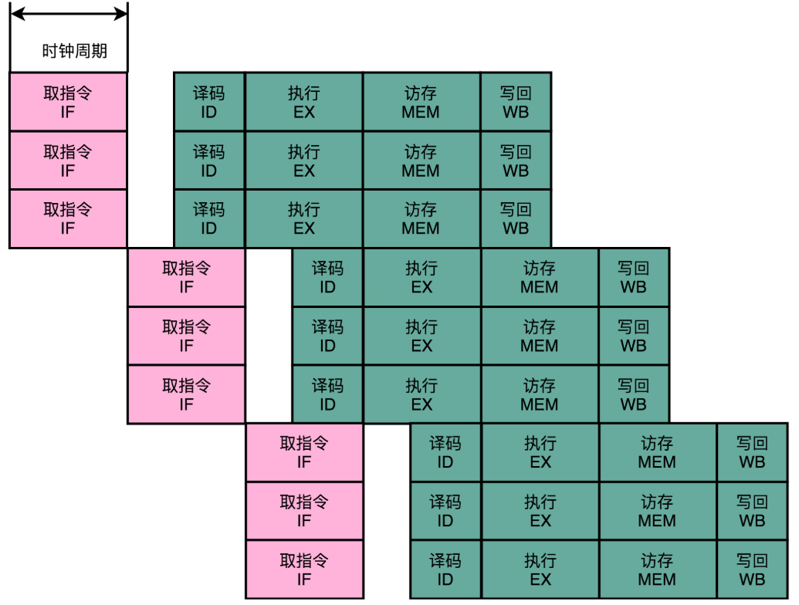
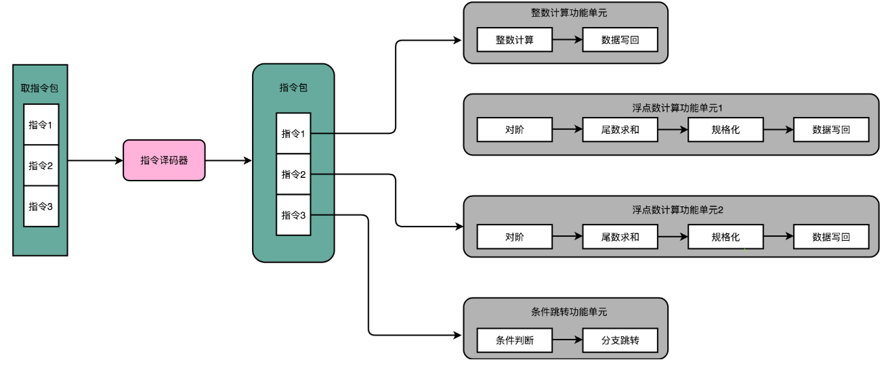
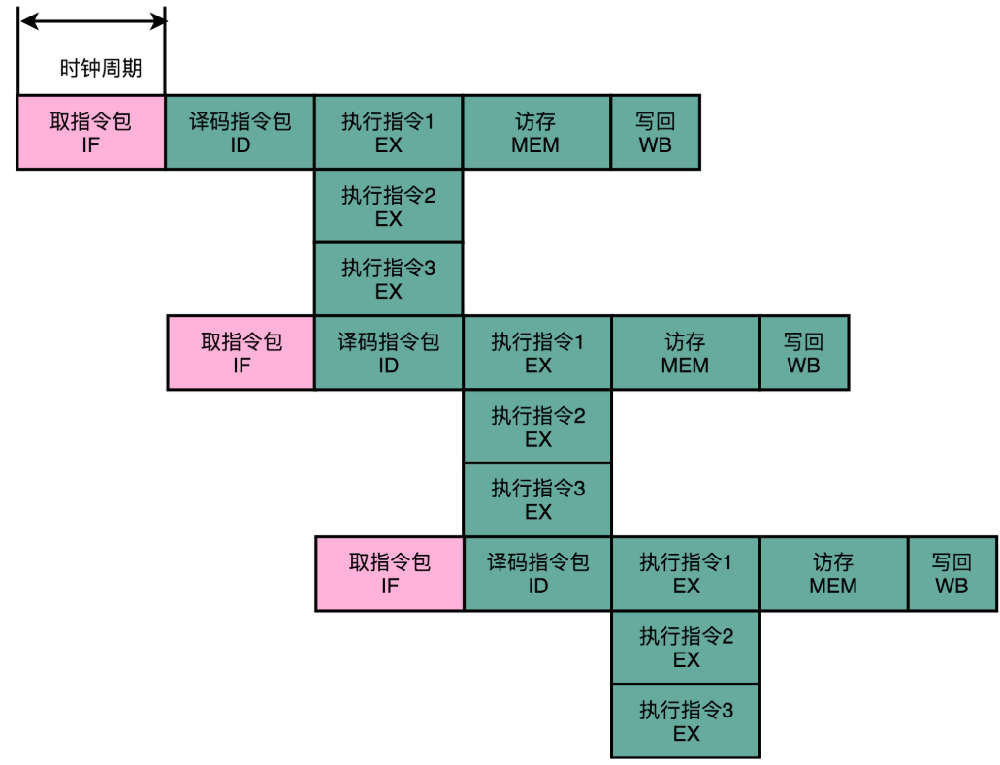
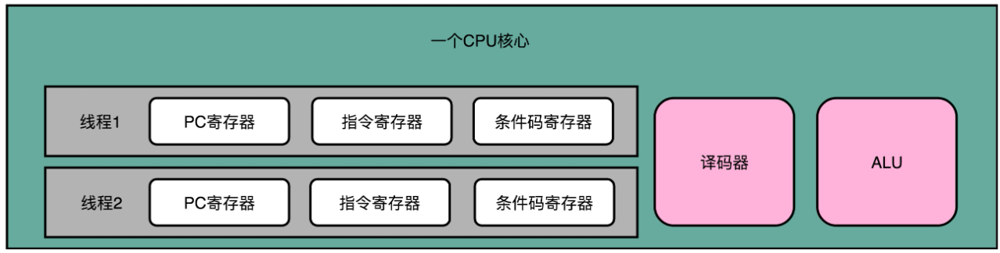
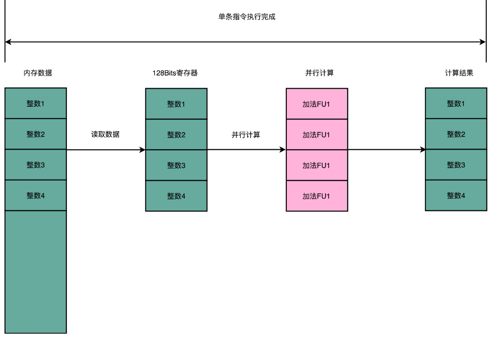

# 并行

## 多发射与超标量

指令的执行层面可以并行进行，那么取指令和指令译码能不能也实现并行呢？

只要把取指令和指令译码，也一样通过增加硬件的方式，并行进行就好了。一次性从内存里面取出多条指令，然后分发给**多个并行的指令译码器**，进行译码，然后对应交给不同的功能单元去处理。这样，在一个时钟周期里，能够完成的指令就不只一条了。IPC 也就能做到大于 1 了。

这种 CPU 设计，叫作**多发射**（Mulitple Issue）和**超标量**（Superscalar）。



多发射就是，同一个时间，可能会同时把多条指令发射（Issue）到不同的译码器或者后续处理的流水线中去。

在超标量的 CPU 里面，有很多条并行的流水线，而不是只有一条流水线。“超标量“这个词是说，本来在一个时钟周期里面，只能执行一个标量（Scalar）的运算。在多发射的情况下，我们就能够超越这个限制，同时进行多次计算。




## VLIW

**超长指令字设计**（Very Long Instruction Word）是通过编译器的优化，把可以同时运行的几条指令合并到一起。这比乱序执行、超标量技术都更有效，因为后者们在实际的硬件层面，实施起来比较麻烦。在乱序执行和超标量的体系里面，CPU 要解决依赖冲突的问题。而在VLIW中，这个问题已经由编译器解决了。

编译器在编译时能够知道前后数据的依赖，于是，可以让编译器把没有依赖关系的代码位置进行交换。然后，再把多条连续的指令打包成一个指令包。安腾的 CPU 就是把 3 条指令变成一个指令包。





CPU 在运行的时候，不再是取一条指令，而是取出一个指令包。然后，译码解析整个指令包，解析出 3 条指令直接并行运行。可以看到，使用**超长指令字**架构的 CPU，同样是采用流水线架构的。也就是说，一组（Group）指令，仍然要经历多个时钟周期。同样的，下一组指令并不是等上一组指令执行完成之后再执行，而是在上一组指令的指令译码阶段，就开始取指令了。

值得注意的一点是，流水线停顿这件事情在**超长指令字**里面，很多时候也是由编译器来做的。除了停下整个处理器流水线，**超长指令字**的 CPU 不能在某个时钟周期停顿一下，等待前面依赖的操作执行完成。编译器需要在适当的位置插入 NOP 操作，直接在编译出来的机器码里面，就把流水线停顿这个事情在软件层面就安排妥当。

但是，安腾是一个既不容易向前兼容，又不容易向后兼容的 CPU。

- 安腾处理器的指令集和 x86 是不同的。这就意味着，原来 x86 上的所有程序是没有办法在安腾上运行的，需要通过编译器重新编译才行。
- 安腾处理器的 VLIW 架构决定了，如果安腾需要提升并行度，就需要增加一个指令包里包含的指令数量，比方说从 3 个变成 6 个。一旦这么做了，虽然同样是 VLIW 架构，同样指令集的安腾 CPU，程序也需要重新编译。因为原来编译器判断的依赖关系是在 3 个指令以及由 3 个指令组成的指令包之间，现在要变成 6 个指令和 6 个指令组成的指令包。编译器需要重新编译，交换指令顺序以及 NOP 操作，才能满足条件。甚至需要重新来写编译器，才能让程序在新的 CPU 上跑起来。


## 超线程

既然 CPU 同时运行那些在代码层面有前后依赖关系的指令，会遇到各种冒险问题，不如去找一些和这些指令完全独立，没有依赖关系的指令来运行。这样的指令来自同时运行的另外一个程序。

计算机在同一个时间可以运行很多个程序。比如，一边运行浏览器上网，后台同样运行一个 Python 脚本程序。而这两个程序，是完全相互独立的。它们两个的指令完全并行运行，而不会产生依赖问题带来的“冒险”。

这不是简单的 线程/进程 切换，也不是多核CPU同时运行多个程序，因为在同一时间点上，一个物理的 CPU 核心只会运行一个线程的指令。

**超线程的 CPU，把一个物理层面上的 CPU 核心，“伪装”成两个逻辑层面的 CPU 核心**。这个 CPU，会在硬件层面增加很多电路，使得我们可以在一个 CPU 核心内部，维护两个不同线程的指令的状态信息。



比如，在一个物理 CPU 核心内部，会有双份的 PC 寄存器、指令寄存器乃至条件码寄存器。这样，这个 CPU 核心就可以维护两条并行的指令的状态。在外面看起来，似乎有两个逻辑层面的 CPU 在同时运行。所以，超线程技术一般也被叫作**同时多线程**（Simultaneous Multi-Threading，简称 SMT）技术**。**

不过，在 CPU 的其他功能组件上，Intel 可不会提供双份。无论是指令译码器还是 ALU，一个 CPU 核心仍然只有一份。因为超线程并不是真的去同时运行两个指令，那就真的变成物理多核了。**超线程的目的，是在一个线程 A 的指令，在流水线里停顿的时候，让另外一个线程去执行指令。**因为这个时候，CPU 的译码器和 ALU 就空出来了，那么另外一个线程 B，就可以拿来干自己需要的事情。这个线程 B 没有对于线程 A 里面指令的关联和依赖。

由于并没有增加功能单元，所以超线程只在特定的应用场景下效果比较好。一般是在那些各个线程“等待”时间比较长的应用场景下。比如，应对很多请求的数据库应用，就很适合使用超线程。各个指令都要等待访问内存数据，但是并不需要做太多计算。

于是，我们就可以利用好超线程。我们的 CPU 计算并没有跑满，但是往往当前的指令要停顿在流水线上，等待内存里面的数据返回。这个时候，让 CPU 里的各个功能单元，去处理另外一个数据库连接的查询请求就是一个很好的应用案例。


## SIMD

**单指令多数据流**（Single Instruction Multiple Data）

在python中，通过循环的方式，给一个 list 里面的每一个数加 1。和为了实现相同的功能，直接调用 NumPy 这个库的 add 方法。通过Python 里面的 timeit 库统计这两种做法的性能。

```
$ python
>>> import numpy as np
>>> import timeit
>>> a = list(range(1000))
>>> b = np.array(range(1000))
>>> timeit.timeit("[i + 1 for i in a]", setup="from __main__ import a", number=1000000)
32.82800309999993
>>> timeit.timeit("np.add(1, b)", setup="from __main__ import np, b", number=1000000)
0.9787889999997788
```

从两段程序的输出结果来看，两个功能相同的代码性能有着巨大的差异，足足差出了 30 多倍。这是因为NumPy 直接用到了 SIMD 指令，能够并行进行向量的操作。

而前面使用循环一步一步计算的算法，一般被称为**SISD**，也就是**单指令单数据**（Single Instruction Single Data）的处理方式。如果使用多核 CPU ，那么它同时处理多个指令的方式可以叫作**MIMD**，也就是**多指令多数据**（Multiple Instruction Multiple Dataa）。

**SIMD 在获取数据和执行指令的时候，都做到了并行。**一方面，在从内存里面读取数据的时候，SIMD 是一次性读取多个数据。

以上面的程序为例，数组里面的每一项都是一个 integer，也就是需要 4 字节的内存空间。Intel 在引入 SSE 指令集的时候，在 CPU 里面添上了 8 个 128 Bits 的寄存器。128 Bits 也就是 16 字节，也就是说，一个寄存器一次性可以加载 4 个整数。比起循环分别读取 4 次对应的数据，时间就省下来了。



在数据读取到了之后，在指令的执行层面，SIMD 也是可以并行进行的。4 个整数各自加 1，互相之前完全没有依赖，也就没有冒险问题需要处理。只要 CPU 里有足够多的功能单元，能够同时进行这些计算，这个加法就是 4 路同时并行的，自然也省下了时间。

对于那些在计算层面存在大量“数据并行”（Data Parallelism）的计算中，使用 SIMD 是一个很划算的办法。这个大量的“数据并行”，通常就是实践当中的向量运算或者矩阵运算。在实际的程序开发过程中，过去通常是在进行图片、视频、音频的处理。最近几年则通常是在进行各种机器学习算法的计算。

基于 SIMD 的向量计算指令，是在 Intel 发布 Pentium 处理器的时候，被引入的指令集。当时的指令集叫作**MMX**，也就是 **矩阵数学扩展**Matrix Math eXtensions 的缩写。而 Pentium 处理器，也是 CPU 第一次有能力进行多媒体处理。这也正是拜 SIMD 和 MMX 所赐。

