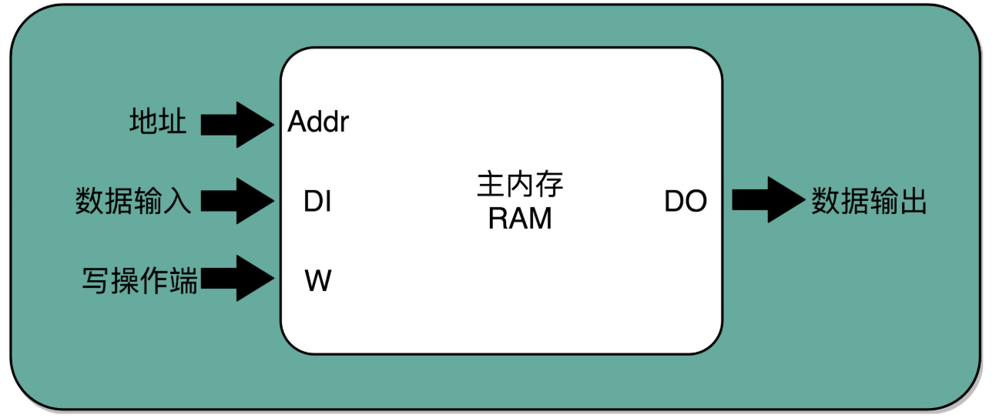

# 数据通路

## 指令周期

计算机每执行一条指令的过程，可以分解成这样几个步骤：

1. **Fetch**（**取得指令**）：从 PC 寄存器里找到对应的指令地址，根据指令地址从内存里把具体的指令，加载到指令寄存器中，然后把 PC 寄存器自增，好在未来执行下一条指令。

2. **Decode**（**指令译码**）：根据指令寄存器里面的指令，解析成要进行什么样的操作，是 R、I、J 中的哪一种指令，具体要操作哪些寄存器、数据或者内存地址。

3. **Execute**（**执行指令**）：实际运行对应的 R、I、J 这些特定的指令，进行算术逻辑操作、数据传输或者直接的地址跳转。

4. 重复进行 1～3 的步骤。

这样的步骤，其实就是一个永不停歇的“**Fetch - Decode - Execute**”的循环，把这个循环称之为**指令周期**（Instruction Cycle）。

在这个循环过程中，不同部分其实是由计算机中的不同组件完成的。在取指令的阶段，指令是放在**存储器**里的，实际上，通过 PC 寄存器和指令寄存器取出指令的过程，是由**控制器**（Control Unit）操作的。指令的解码过程，也是由**控制器**进行的。一旦到了执行指令阶段，无论是进行算术操作、逻辑操作的 R 型指令，还是进行数据传输、条件分支的 I 型指令，都是由**算术逻辑单元**（ALU）操作的，也就是由**运算器**处理的。不过，如果是一个简单的无条件地址跳转，那么就可以直接在**控制器**里面完成，不需要用到运算器。

除了指令周期，在 CPU 里面还有两个常见的 Cycle

- **Machine Cycle**：**机器周期**或者**CPU 周期**。CPU 内部的操作速度很快，但是访问内存的速度却要慢很多。每一条指令都需要从内存里面加载而来，所以**一般把从内存里面读取一条指令的最短时间，称为 CPU 周期**。
- **Clock Cycle**： **时钟周期**我们机器的主频。一个 CPU 周期，通常会由几个时钟周期累积起来。一个 CPU 周期的时间，就是这几个 Clock Cycle 的总和。

对于一个指令周期来说，取出一条指令，然后执行它，至少需要两个 CPU 周期。取出指令至少需要一个 CPU 周期，执行至少也需要一个 CPU 周期，复杂的指令则需要更多的 CPU 周期。

所以，一个指令周期，包含多个 CPU 周期，而一个 CPU 周期包含多个时钟周期。

## 数据通路

一般来说，可以认为数据通路就是处理器单元，它通常由两类原件组成：

- **操作元件**，也叫组合逻辑元件（Combinational Element），其实就是 ALU，它们的功能就是在特定的输入下，根据组合电路的逻辑，生成特定的输出。
- **存储元件**，也叫状态元件（State Element）的。比如在计算过程中需要用到的寄存器，无论是通用寄存器还是状态寄存器，其实都是存储元件。

通过数据总线的方式，把它们连接起来，就可以完成数据的存储、处理和传输了，这就是**建立数据通路**。

**控制器**的逻辑只是机械地重复“Fetch - Decode - Execute“循环中的前两个步骤，然后把最后一个步骤，通过控制器产生的控制信号，交给 ALU 去处理。但实际上，控制器的电路特别复杂。

所有 CPU 支持的指令，都会在控制器里面，被解析成不同的输出信号。 Intel CPU 支持 2000 个以上的指令，这意味着，控制器输出的控制信号，至少有 2000 种不同的组合。

运算器里的 ALU 和各种组合逻辑电路，可以认为是一个固定功能的电路。控制器“翻译”出来的，就是不同的控制信号。这些控制信号，告诉 ALU 去做不同的计算。正是控制器的存在，让我们可以“编程”来实现功能，能让“存储程序型计算机”名副其实。

## CPU 所需要的硬件电路

要想搭建出来整个 CPU，需要在数字电路层面，实现这样一些功能。

-  ALU ，它实际是一个没有状态的，根据输入计算输出结果的电路
- 一个能够进行状态读写的电路元件，也就是寄存器。需要有一个电路，能够存储到上一次的计算结果。这个计算结果并不一定要立刻拿到电路的下游去使用，但是可以在需要的时候拿出来用。常见的能够进行状态读写的电路，有锁存器（Latch）、 D 触发器（Data/Delay Flip-flop）。
- 一个“自动”的电路，按照固定的周期，不停地实现 PC 寄存器自增，自动地去执行“Fetch - Decode - Execute“的步骤。程序的执行，并不是靠人去拨动开关来执行指令的。而是一个“自动”的电路，不停地去一条条执行指令。
- 一个“译码”的电路。无论是对于指令进行 decode，还是对于拿到的内存地址去获取对应的数据或者指令，我们都需要通过一个电路找到对应的数据。这个对应的就是“译码器”的电路了。

要能够实现一个完整的 CPU 功能，除了加法器这样的电路之外，还需要实现其他功能的电路。其中有一些电路，和加法器性质相同，只需要给定输入，就能得到固定的输出。这样的电路，称之为**组合逻辑电路**(Combinational Logic Circuit)。

光有组合逻辑电路，电路输入是确定的，对应的输出自然也就确定了。那么，我们要进行不同的计算，就要去手动拨动各种开关，来改变电路的开闭状态。因此，引入了**时序逻辑电路**（Sequential Logic Circuit），它可以解决这几个问题：

- **自动运行**的问题。时序电路接通之后可以不停地开启和关闭开关，进入一个自动运行的状态。这使得控制器不停地让 PC 寄存器自增读取下一条指令成为可能。
- **存储**的问题。通过时序电路实现的触发器，能把计算结果存储在特定的电路里面，而不是像组合逻辑电路那样，一旦输入有任何改变，对应的输出也会改变。
- 本质上解决了各个功能按照**时序协调**的问题。无论是程序实现的软件指令，还是到硬件层面，各种指令的操作都有先后的顺序要求。时序电路使得不同的事件按照时间顺序发生。

## 时钟信号的硬件实现

CPU 的主频是由一个晶体振荡器来实现的，而这个晶体振荡器生成的电路信号，就是时钟信号。实现这样一个电路，和通过电的磁效应产生开关信号的方法是一样的。只不过，这里的磁性开关，打开的不再是后续的线路，而是当前的线路。

在下面的电路中，在原先一般只放一个开关的信号输入端，放上了两个开关。一个开关 A，一开始是断开的，由我们手工控制；另外一个开关 B，一开始是合上的，磁性线圈对准一开始就合上的开关 B。

一旦合上开关 A，磁性线圈就会通电，产生磁性，开关 B 就会从合上变成断开。一旦这个开关断开了，电路就中断了，磁性线圈就失去了磁性。于是，开关 B 又会弹回到合上的状态。这样一来，电路接通，线圈又有了磁性。这个电路就会来回不断地在开启、关闭这两个状态中切换。

这个不断切换的过程，对于下游电路来说，就是不断地产生新的 0 和 1 这样的信号。这个按照固定的周期不断在 0 和 1 之间切换的信号，就是**时钟信号**（Clock Signal）。

这种电路，相当于把电路的输出信号作为输入信号，再回到当前电路。这样的电路构造方式，叫作**反馈电路**（Feedback Circuit）。

上面的反馈电路一般可以用下面这个示意图来表示，其实就是一个输出结果接回输入的**反相器**（Inverter），也就是**非门**。

## 通过 D 触发器实现存储功能

构造一个有“记忆”功能的电路，这个电路可以实现在 CPU 中用来存储计算结果的寄存器，也可以用来实现计算机五大组成部分之一的存储器。

这个电路由 A 和 B 两个或非门电路组成。

1. 在这个电路一开始，输入开关都是关闭的，所以或非门（NOR）A 的输入是 0 和 0，输出就是 1。而或非门 B 的输入是 0 和 A 的输出 1，对应输出就是 0。B 的输出 0 反馈到 A，和之前的输入没有变化，A 的输出仍然是 1。而整个电路的**输出 Q**，也就是 0。
2. 把 A 前面的开关 R 合上的时候，A 的输入变成了 1 和 0，输出就变成了 0，对应 B 的输入变成 0 和 0，输出就变成了 1。B 的输出 1 反馈给到了 A，A 的输入变成了 1 和 1，输出仍然是 0。所以把 A 的开关合上之后，电路仍然是稳定的，不会像晶振那样振荡，但是整个电路的**输出 Q**变成了 1。
3. 这个时候，如果再把 A 前面的开关 R 打开，A 的输入变成和 1 和 0，输出还是 0，对应的 B 的输入没有变化，输出也还是 1。B 的输出 1 反馈给到了 A，A 的输入变成了 1 和 0，输出仍然是 0。这个时候，电路仍然稳定。**开关 R 和 S 的状态和上面的第一步是一样的，但是最终的输出 Q 仍然是 1，**和第 1 步里 Q 状态是相反的。我们的输入和刚才第二步的开关状态不一样，但是输出结果仍然保留在了第 2 步时的输出没有发生变化。
4. 这个时候，只有我们再去关闭下面的开关 S，才可以看到，这个时候，B 有一个输入必然是 1，所以 B 的输出必然是 0，也就是电路的最终**输出 Q**必然是 0。

这样一个电路，称之为触发器（Flip-Flop）。接通开关 R，输出变为 1，即使断开开关，输出还是 1 不变。接通开关 S，输出变为 0，即使断开开关，输出也还是 0。也就是，**当两个开关都断开的时候，最终的输出结果，取决于之前动作的输出结果，这个也就是记忆功能**。

这个电路是最简单的 RS 触发器，即复位置位触发器（Reset-Set Flip Flop) 。下面是对应的输出结果的真值表，可以看到，当两个开关都是 0 的时候，对应的输出不是 1 或者 0，而是和 Q 的上一个状态一致。

再往这个电路里加两个与门和一个小小的时钟信号，就可以实现一个利用时钟信号来操作一个电路了。这个电路可以帮我们实现什么时候可以往 Q 里写入数据。

当时钟信号 CLK 在低电平的时候，与门的输入里有一个 0，两个实际的 R 和 S 后的与门的输出必然是 0。也就是说，无论R 和 S 的开关处于什么状态，根据 R-S 触发器的真值表，对应的 Q 的输出都不会发生变化。

只有当时钟信号 CLK 在高电平的时候，与门的一个输入是 1，输出结果完全取决于 R 和 S 的开关。可以在这个时候，通过开关 R 和 S，来决定对应 Q 的输出。

如果让 R 和 S 的开关，也用一个反相器连起来，也就是通过同一个开关控制 R 和 S。只要 CLK 信号是 1，R 和 S 就可以设置输出 Q。而当 CLK 信号是 0 的时候，无论 R 和 S 怎么设置，输出信号 Q 是不变的。这样，这个电路就成了 D 型触发器。用来控制 R 和 S 这两个开关的信号视作一个输入的数据信号 D，也就是 Data，这就是 D 型触发器的由来。

一个 D 型触发器，只能控制 1 个比特的读写，同时拿出多个 D 型触发器并列在一起，并且把用同一个 CLK 信号控制作为所有 D 型触发器的开关，就变成了一个 N 位的 D 型触发器，也就可以同时控制 N 位的读写。

CPU 里面的寄存器可以直接通过 D 型触发器来构造。在 D 型触发器的基础上，可以加上更多的开关，来实现清 0 或者全部置为 1 这样的快捷操作。

## PC 寄存器所需要的计数器

时钟信号可以提供定时的输入；有D 型触发器可以在时钟信号控制的时间点写入数据。把这两个功能组合起来，就可以实现一个自动的计数器了。

加法器的两个输入，一个始终设置成 1，另外一个来自于一个 D 型触发器 A。把加法器的输出结果，写到这个 D 型触发器 A 里面。于是，D 型触发器里面的数据就会在固定的时钟信号为 1 的时候更新一次。

在最简单的情况下，我们需要让每一条指令，从程序计数，到获取指令、执行指令，都在一个时钟周期内完成。如果 PC 寄存器自增地太快，程序就会出错。因为前一次的运算结果还没有写回到对应的寄存器里面的时候，后面一条指令已经开始读取里面的数据来做下一次计算了。这个时候，如果指令使用同样的寄存器，前一条指令的计算就会没有效果，计算结果就错了。

在这种设计下，需要在一个时钟周期里，确保执行完一条最复杂的 CPU 指令，也就是耗时最长的一条 CPU 指令。这样的 CPU 设计，称之为**单指令周期处理器**（Single Cycle Processor）。这样的设计有点儿浪费，即便只调用一条非常简单的指令，也需要等待整个时钟周期的时间走完，才能执行下一条指令。

## 读写数据所需要的译码器

如果把很多个 D 型触发器放在一起，就可以形成一块很大的存储空间，甚至可以当成一块内存来用。那我们怎么才能知道，写入和读取的数据，是在这么大的内存的哪几个比特呢？

这就需要一个完成“寻址”工作的译码器。

> 在现在实际使用的计算机里面，内存所使用的 DRAM，并不是通过上面的 D 型触发器来实现的，而是使用了一种 CMOS 芯片来实现的。不过，这并不影响我们从基础原理方面来理解译码器。
>
> 我们还是可以把内存芯片，当成是很多个连在一起的 D 型触发器来实现的。

如果把“寻址”这件事情退化到最简单的情况，就是在两个地址中，去选择一个地址。这样的电路是**2-1 选择器**。

通过控制反相器的输入是 0 还是 1，能够决定对应的输出信号，是和地址 A，还是地址 B 的输入信号一致。

一个反向器只能有 0 和 1 这样两个状态，所以只能从两个地址中选择一个。如果输入的信号有三个不同的开关，我们就能从 $2^3=8$ 个地址中选择一个了。这样的电路，就叫**3-8 译码器**。现代的计算机，如果 CPU 是 64 位的，就意味着寻址空间也是 $2^{64}$，那么就需要一个有 64 个开关的译码器。

译码器的本质，就是从输入的多个位的信号中，根据一定的开关和电路组合，选择出自己想要的信号。除了能够进行“寻址”，我们还可以把需要运行的指令码opcode，同样通过译码器，找出我们期望执行的指令，以及后面对应的操作数或者寄存器地址。只是，这样的“译码器”，比起 2-1 选择器和 3-8 译码器，要复杂的多。

## 建立数据通路

1. 首先，我们有一个自动计数器。这个自动计数器会随着时钟主频不断地自增，来作为 PC 寄存器。
2. 在这个自动计数器的后面，连上一个译码器。译码器还要同时连着通过大量 D触发器组成的内存。
3. 自动计数器会随着时钟主频不断自增，从译码器当中，找到对应的计数器所表示的内存地址，然后读取出里面的 CPU 指令。
4. 读取出来的 CPU 指令会通过 CPU 时钟的控制，写入到由 D 触发器组成的指令寄存器。
5. 在指令寄存器后面，再跟一个译码器。这个译码器不是用来寻址的，而是把拿到的指令，解析成 opcode 和对应的操作数。
6. 把拿到的 opcode 和操作数的输出线路连接 ALU，开始进行各种算术和逻辑运算。对应的计算结果，则会再写回到 D 触发器组成的寄存器或者内存当中。

这样的一个完整的通路，也就完成了CPU 的一条指令的执行过程。在这个过程中，你会发现这样几个有意思的问题。

