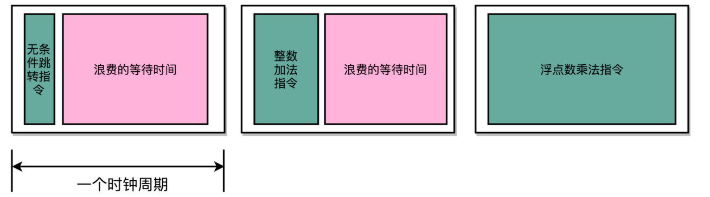
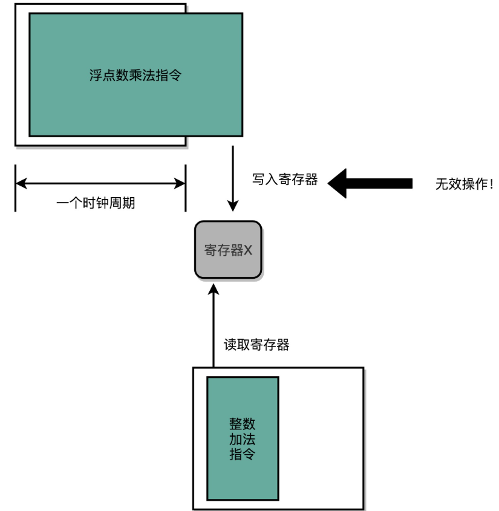
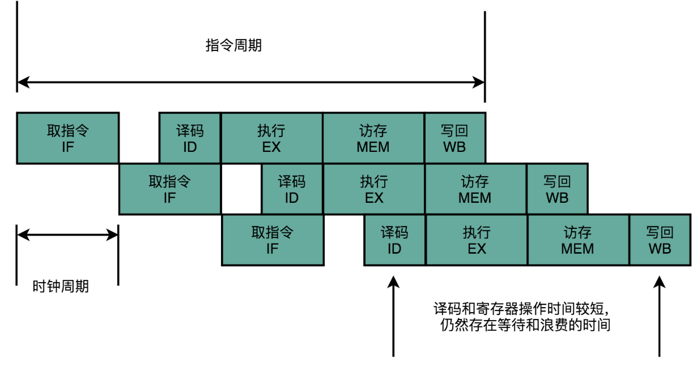
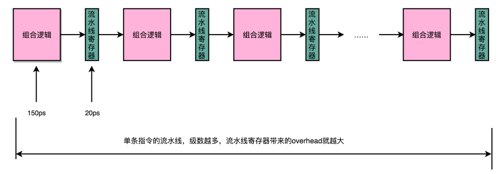

# 流水线

## 单指令周期处理器

一条 CPU 指令的执行，是由“取得指令（Fetch）- 指令译码（Decode）- 执行指令（Execute） ”这样三个步骤组成的。这个执行过程，至少需要花费一个时钟周期。因为在取指令的时候，我们需要通过时钟周期的信号，来决定计数器的自增。

单指令周期处理器（Single Cycle Processor）的CPI是1，即在一个时钟周期内，处理器正好能处理一条指令。虽然时钟周期是固定的，但是指令的电路复杂程度是不同的，所以实际一条指令执行的时间是不同的。以加法器和乘法器电路为对比，随着门电路层数的增加，由于门延迟的存在，位数多、计算复杂的指令需要的执行时间会更长。

不同指令的执行时间不同，让所有指令都在一个时钟周期内完成，那就只好把时钟周期和**执行时间最长的那个指令**设成一样。



在单指令周期处理器里面，无论是执行一条用不到 ALU 的无条件跳转指令，还是一条计算起来电路特别复杂的浮点数乘法运算，都等要等满一个时钟周期。在这个情况下，虽然 CPI 能够保持在 1，但是时钟频率却没法太高。因为太高的话，有些复杂指令没有办法在一个时钟周期内运行完成。那么在下一个时钟周期到来，开始执行下一条指令的时候，前一条指令的执行结果可能还没有写入到寄存器里面。那下一条指令读取的数据就是不准确的，就会出现错误。




## 流水线设计

无论是 PC 上使用的 Intel CPU，还是手机上使用的 ARM CPU，都不是单指令周期处理器，而是采用了一种叫作**指令流水线**（Instruction Pipeline）的技术。

CPU 的指令执行过程，其实是由各个电路模块组成的。在取指令的时候，需要一个译码器把数据从内存里面取出来，写入到寄存器中；在指令译码的时候，需要另外一个译码器，把指令解析成对应的控制信号、内存地址和数据；到了指令执行的时候，需要的则是一个完成计算工作的 ALU。这些都是一个一个**独立的**组合逻辑电路。



这样一来，我们就不用把时钟周期设置成整条指令执行的时间，而是拆分成完成这样的一个一个小步骤需要的最长时间。同时，每一个阶段的电路在完成对应的任务之后，也不需要等待整个指令执行完成，而是可以直接执行下一条指令的对应阶段。这就是**指令流水线**，这里面每一个独立的步骤，称之为**流水线阶段**或者流水线级（Pipeline Stage）。

如果把一个指令拆分成“取指令 - 指令译码 - 执行指令”三个部分，那这就是一个三级的流水线。如果进一步把“执行指令”拆分成“ALU 计算（指令执行）- 内存访问 - 数据写回”，那么它就会变成一个五级的流水线。

五级的流水线，就表示在同一个时钟周期里面，同时运行五条指令的不同阶段。这个时候，虽然执行一条指令的时钟周期变成了 5，但是 CPU 的主频提得更高了。**我们不需要确保最复杂的那条指令在时钟周期里面执行完成，而只要保障一个最复杂的流水线级的操作，在一个时钟周期内完成就好了。**

如果某一个操作步骤的时间太长，就可以考虑把这个步骤，拆分成更多的步骤，让所有步骤需要执行的时间尽量都差不多长。这样，也就可以解决在单指令周期处理器中遇到的，性能瓶颈来自于最复杂的指令的问题。现代的 ARM 或者 Intel 的 CPU，流水线级数都已经到了 14 级。


## 超长流水线的性能瓶颈

增加流水线深度，是有性能成本的。用来同步时钟周期的，不再是指令级别的，而是流水线阶段级别的。**每一级流水线对应的输出，都要放到流水线寄存器（Pipeline Register）里面，然后在下一个时钟周期，交给下一个流水线级去处理。**所以，每增加一级的流水线，就要多一次写入到流水线寄存器的操作。虽然流水线寄存器非常快，比如只有 20 皮秒（ps，$10^{−12}$ 秒）。



如果不断加深流水线，这些操作占整个指令的执行时间的比例就会不断增加。最后，性能瓶颈就会出现在这些 overhead 上。如果指令的执行有 3 纳秒，也就是 3000 皮秒。使用 20 级的流水线，那流水线寄存器的写入就需要花费 400 皮秒，占了超过 10%。如果使用 50 级流水线，就要多花费 1 纳秒在流水线寄存器上，占到 25%。这也就意味着，单纯地增加流水线级数，不仅不能提升性能，反而会有更多的 overhead 的开销。所以，设计合理的流水线级数也是现代 CPU 中非常重要的一点。


### 奔腾4的失败

Pentium 4 之前的 Pentium III CPU，流水线的深度是 11 级，也就是一条指令最多会拆分成 11 个更小的步骤来操作，而 CPU 同时也最多会执行 11 条指令的不同 Stage。随着技术发展到今天，日常用的手机 ARM 的 CPU 或者 Intel i7 服务器的 CPU，流水线的深度是 14 级。

2000 年发布的 Pentium 4 的流水线深度是是 20 级，比 Pentium III 差不多多了一倍，而到了代号为 Prescott 的 90 纳米工艺处理器 Pentium 4，Intel 更是把流水线深度增加到了 31 级。

增加流水线深度，在同主频下，其实是降低了 CPU 的性能。因为一个 Pipeline Stage，就需要一个时钟周期。

- 把指令拆分成 31 个阶段，就需要 31 个时钟周期才能完成一个任务
- 把指令拆分成 11 个阶段，就只需要 11 个时钟周期就能完成任务

在这种情况下，31 个 Stage 的 3GHz 主频的 CPU，其实和 11 个 Stage 的 1GHz 主频的 CPU，性能是差不多的。事实上，因为每个 Stage 都需要有对应的 Pipeline 寄存器的开销，这个时候，更深的流水线性能可能还会更差一些。

流水线技术并不能缩短单条指令的**响应时间**这个性能指标，但是可以通过同时运行很多条指令增加**吞吐率**。因为不同的指令，实际执行需要的时间是不同的。但同时运行很多条指令并不容易，以下面的代码为例：

```
int a = 10 + 5; // 指令 1
int b = a * 2; // 指令 2
float c = b * 1.0f; // 指令 3
```

指令 2 不能在指令 1 的第一个 Stage 执行完成之后进行，因为指令 2 依赖指令 1 的计算结果。同样的，指令 3 也要依赖指令 2 的计算结果。

这时候，可以展望后面的代码，把与这些数据没有冲突的代码先执行了。

```
int a = 10 + 5; // 指令 1
int b = a * 2; // 指令 2
float c = b * 1.0f; // 指令 3
int x = 10 + 5; // 指令 4
int y = a * 2; // 指令 5
float z = b * 1.0f; // 指令 6
int o = 10 + 5; // 指令 7
int p = a * 2; // 指令 8
float q = b * 1.0f; // 指令 9
```

这时候，可以在流水线里先执行 1、4、7 三条指令。这三条指令之间是没有依赖关系的。然后再执行 2、5、8 以及 3、6、9。这样，又能够充分利用 CPU 的计算能力了。

但是，如果我们有 20 级流水线，意味着要确保这 20 条指令之间没有依赖关系。这个挑战一下子就变大了很多。毕竟我们平时撰写程序，通常前后的代码都是有一定的依赖关系的，几十条没有依赖关系的指令可不好找。


除了难以同时并发大量指令，**功耗问题**也是一个严重的问题。提升流水线深度，必须要和提升 CPU 主频同时进行。因为在单个 Pipeline Stage 能够执行的功能变简单了，也就意味着单个时钟周期内能够完成的事情变少了。所以，只有提升时钟周期，CPU 在指令的响应时间这个指标上才能保持和原来相同的性能。

由于流水线深度的增加，我们需要的电路数量变多了，也就是所使用的晶体管也就变多了。

主频的提升和晶体管数量的增加都使得 CPU 的功耗变大了。这个问题导致了 Pentium 4 在整个生命周期里，都成为了耗电和散热的大户。而 Pentium 4 是在 2000～2004 年作为 Intel 的主打 CPU 出现在市场上的。这个时间段，正是笔记本电脑市场快速发展的时间。在笔记本电脑上，功耗和散热比起台式机是一个更严重的问题了。

