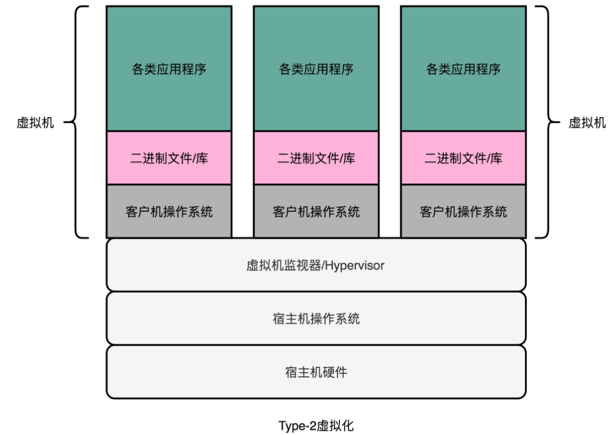
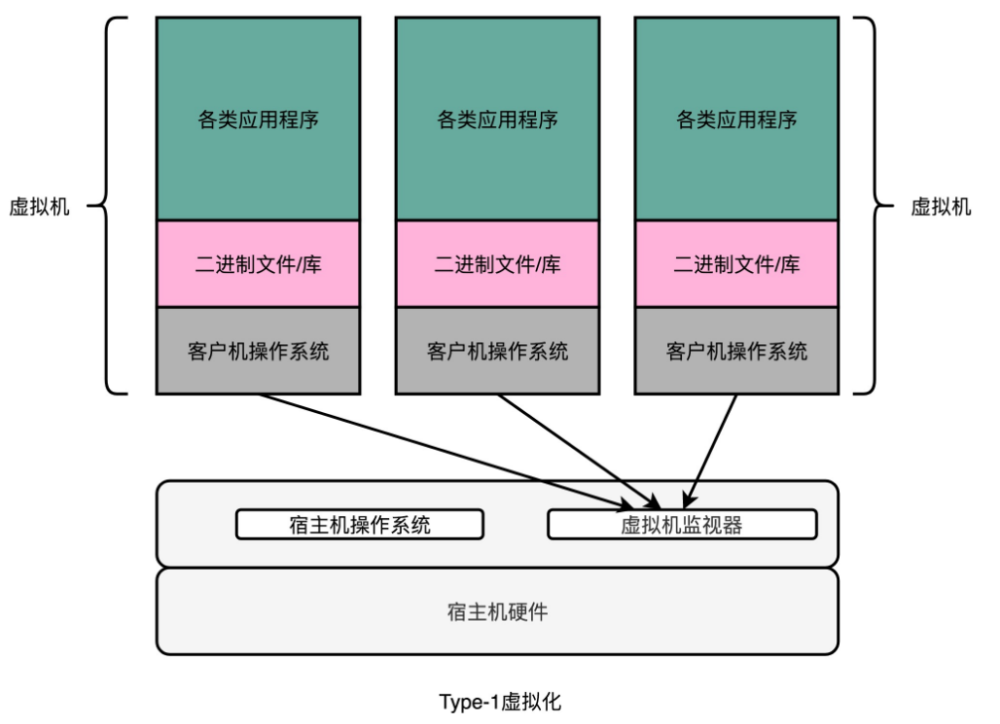
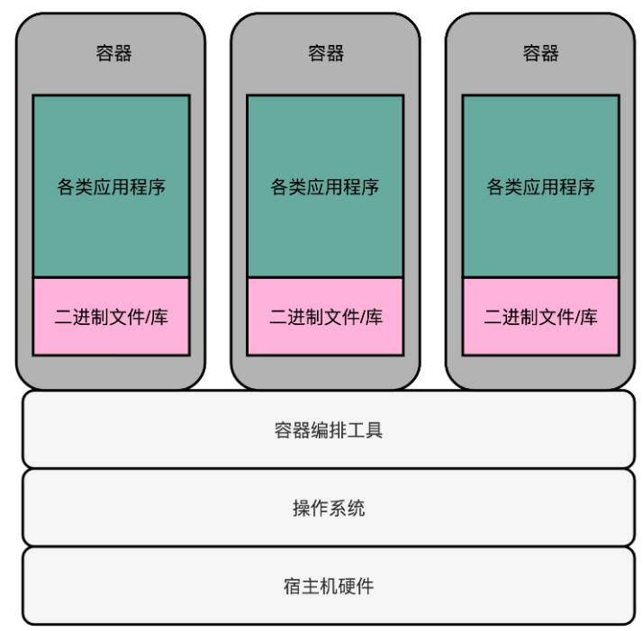

# 虚拟化技术

## 虚拟机

**虚拟机**（Virtual Machine）技术，就是指在现有硬件的操作系统上，能够**模拟**一个计算机系统的技术。而模拟一个计算机系统，最简单的办法，其实不能算是虚拟机技术，而是一个模拟器（Emulator）。

### 解释型虚拟机

要模拟一个计算机系统，最简单的办法，就是兼容这个计算机系统的指令集。我们可以开发一个应用程序，跑在我们的操作系统上。这个应用程序可以识别我们想要模拟的、计算机系统的程序格式和指令，然后一条条去解释执行。

在这个过程中，把原先的操作系统叫作**宿主机**（Host），把能够有能力去模拟指令执行的软件，叫作**模拟器**（Emulator），而实际运行在模拟器上被“虚拟”出来的系统呢，叫**客户机**（Guest VM）。

Android 模拟器就是典型的例子。

**这种解释执行方式的最大的优势就是，模拟的系统可以跨硬件。**比如，Android 手机用的 CPU 是 ARM 的，而我们的开发机是 Intel X86 的，两边的 CPU 指令集都不一样，但是一样可以正常运行。

不过这个方式也有两个明显的缺陷：

- **做不到精确的“模拟”**。很多的老旧的硬件的程序运行，要依赖特定的电路乃至电路特有的时钟频率，想要通过软件达到 100% 模拟是很难做到的。
- 这种解释执行的方式，**性能实在太差**了。因为我们并不是直接把指令交给 CPU 去执行的，而是要经过各种解释和翻译工作。

所以，虽然模拟器这样的形式有它的实际用途。甚至为了解决性能问题，也有类似于 Java 当中的 JIT 这样的“编译优化”的办法，把本来解释执行的指令，编译成 Host 可以直接运行的指令。但是，这个性能还是不能让人满意。

### Type-1 和 Type-2

在现有的物理服务器的硬件和操作系统上，跑一个完整的、不需要做任何修改的客户机操作系统（Guest OS）。然后在这个操作系统上，再去跑多个完整的操作系统。这可以通过加入一个中间层实现。在虚拟机技术里面，这个中间层就叫作**虚拟机监视器**，英文叫 VMM（Virtual Machine Manager）或者 Hypervisor。

机器上运行的虚拟机，都不是直接和宿主机OS打交道，而是要和VMM打交道。虚拟机会把整个的硬件特征都映射到虚拟机环境里，包括整个完整的 CPU 指令集、I/O 操作、中断等。

虚拟机里实际的指令是怎么落到硬件上去实际执行的呢？这里有两种办法，也就是 Type-1 和 Type-2 这两种类型的虚拟机。

在 Type-2 虚拟机里，VMM好像一个运行在操作系统上的软件。客户机的 OS 把最终到硬件的所有指令，都发送给虚拟机监视器。而虚拟机监视器，又会把这些指令再交给宿主机的操作系统去执行。这个过程只是把在模拟器里的指令翻译工作，挪到了VMM里。因此，Type-2 型的虚拟机，更多是用在我们日常的个人电脑里，而不是用在数据中心里。

在数据中心里面用的虚拟机，通常叫作 Type-1 型的虚拟机。这个时候，客户机的指令交给VMM之后，不再需要通过宿主机的操作系统，才能调用硬件，而是可以**直接由VMM去调用硬件**。

在数据中心里面，我们并不需要在 Intel x86 上面去跑一个 ARM 的程序，而是直接在 x86 上虚拟一个 x86 硬件的计算机和操作系统。所以，指令不需要做什么翻译工作，可以直接往下传递执行就好了，所以指令的执行效率也会很高。

所以，在 Type-1 型的虚拟机里，VMM其实并不是一个操作系统之上的应用层程序，而是一个嵌入在操作系统内核里面的一部分。无论是 KVM、XEN 还是微软自家的 Hyper-V，其实都是系统级的程序。

## Docker

虽然 Type-1 型的虚拟机看起来已经没有什么硬件损耗。但是，这里面还是有一个浪费的资源。实际的物理机上可能同时运行了多个的虚拟机，而每一个虚拟机，都运行了一个属于自己的单独的操作系统。

多运行一个操作系统，意味着我们要多消耗一些资源在 CPU、内存乃至磁盘空间上。能不能不要多运行的这个操作系统呢？

因为我们想要的未必是一个完整的、独立的、全虚拟化的虚拟机。很多时候想要租用的不是“独立服务器”，而是独立的计算资源。在服务器领域，我们开发的程序都是跑在 Linux 上的。其实我们并不需要一个独立的操作系统，只要一个能够进行**资源和环境隔离的“独立空间”**就好了。 Docker 技术就能够满足这个需求。

在实际的服务器端的开发中，应用环境需要各种各样不同的依赖，可能是不同的 PHP 或者 Python 的版本，可能是操作系统里面不同的系统库，但是通常来说，这些应用程序都是跑在 Linux 内核上的。通过 Docker，我们不再需要在操作系统上再跑一个操作系统，而只需要通过容器编排工具，比如 Kubernetes 或者 Docker Swarm，能够进行各个应用之间的环境和资源隔离就好了。

这种隔离资源的方式，也有人称之为“操作系统级虚拟机”，和上面的全虚拟化虚拟机对应起来。不过严格来说，Docker 并不能算是一种虚拟机技术，而只能算是一种资源隔离的技术。

