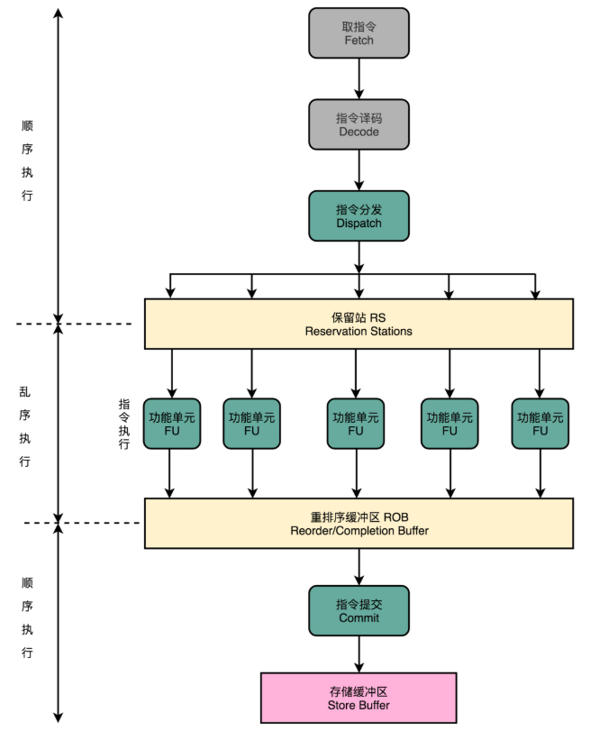

# 预测

## 冒险

### 结构冒险

结构冒险，本质上是一个**硬件层面的资源竞争问题**，也就是一个硬件电路层面的问题。

CPU 在同一个时钟周期，同时在运行两条计算机指令的不同阶段。但是这两个不同的阶段，可能会用到同样的硬件电路。最典型的例子就是内存的数据访问。


在第 1 条指令执行到访存（MEM）阶段的时候，流水线里的第 4 条指令，在执行取指令（Fetch）的操作。访存和取指令，都要进行内存数据的读取。而内存只有一个地址译码器作为地址输入，那就只能在一个时钟周期里面读取一条数据，没办法同时执行第 1 条指令的读取内存数据和第 4 条指令的读取指令代码。

类似的资源冲突，还有薄膜键盘的“锁键”问题。常用的最廉价的薄膜键盘，并不是每一个按键的背后都有一根独立的线路，而是多个键共用一个线路。如果在同一时间，按下两个共用一个线路的按键，这两个按键的信号就没办法都传输出去。而那些“全键无冲”的机械键盘或者电容键盘，每个按键都有独立的传输线路。

“全键无冲”这样的资源冲突解决方案，其实本质就是**增加资源**。同样的方案，一样可以用在 CPU 的结构冒险里面。对于访问内存数据和取指令的冲突，一个直观的解决方案就是把内存分成两部分，让它们各有各的地址译码器。这两部分分别是**存放指令的程序内存**和**存放数据的数据内存**。

> 这样把内存拆成两部分的解决方案，在计算机体系结构里叫作[哈佛架构](https://en.wikipedia.org/wiki/Harvard_architecture)（Harvard Architecture），来自哈佛大学设计[Mark I 型计算机](https://en.wikipedia.org/wiki/Harvard_Mark_I)时候的设计。
>
> 对应的，冯·诺依曼体系结构，又叫作普林斯顿架构（Princeton Architecture）。

不过，现在使用的 CPU，仍然是冯·诺依曼体系结构的，并没有把内存拆成程序内存和数据内存这两部分。因为如果那样拆的话，对程序指令和数据需要的内存空间，就没有办法根据实际的应用去动态分配了。虽然解决了资源冲突的问题，但是也失去了灵活性。


借鉴了哈佛结构的思路，现代的 CPU 虽然没有在内存层面进行对应的拆分，却在 CPU 内部的高速缓存部分进行了区分，把高速缓存分成了**指令缓存**（Instruction Cache）和**数据缓存**（Data Cache）两部分。

内存的访问速度远比 CPU 的速度要慢，所以现代的 CPU 并不会直接读取主内存。它会从主内存把指令和数据加载到高速缓存中，这样后续的访问都是访问高速缓存。而指令缓存和数据缓存的拆分，使得 CPU 在进行数据访问和取指令的时候，不会再发生资源冲突的问题了。


### 数据冒险

数据冒险是程序逻辑层面的事，即同时在执行的多个指令之间，有数据依赖的情况。这些数据依赖，可以分成三大类，分别是**先写后读**（Read After Write，RAW）、**先读后写**（Write After Read，WAR）和**写后再写**（Write After Write，WAW）。

#### 写后读

```
int main() {
  int a = 1;
  int b = 2;
  a = a + 2;
  b = a + 3;
}

int main() {
   0:   55                      push   rbp
   1:   48 89 e5                mov    rbp,rsp
  int a = 1;
   4:   c7 45 fc 01 00 00 00    mov    DWORD PTR [rbp-0x4],0x1
  int b = 2;
   b:   c7 45 f8 02 00 00 00    mov    DWORD PTR [rbp-0x8],0x2
  a = a + 2;
  12:   83 45 fc 02             add    DWORD PTR [rbp-0x4],0x2
  b = a + 3;
  16:   8b 45 fc                mov    eax,DWORD PTR [rbp-0x4]
  19:   83 c0 03                add    eax,0x3
  1c:   89 45 f8                mov    DWORD PTR [rbp-0x8],eax
}
  1f:   5d                      pop    rbp
  20:   c3                      ret  
```

内存地址为 12 的机器码，把 0x2 添加到 rbp-0x4 对应的内存地址里面。然后，在紧接着的内存地址为 16 的机器码，又要从 rbp-0x4 这个内存地址里面，把数据写入到 eax 这个寄存器里面。

所以需要保证，在内存地址为 16 的指令读取 rbp-0x4 里面的值之前，内存地址 12 的指令写入到 rbp-0x4 的操作必须完成。这就是写后读所面临的数据依赖。如果这个顺序保证不了，程序就会出错。

这个先写后读的依赖关系，一般被称之为**数据依赖**，也就是 Data Dependency。


#### 读后写

```
int main() {
  int a = 1;
  int b = 2;
  a = b + a;
  b = a + b;
}

int main() {
   0:   55                      push   rbp
   1:   48 89 e5                mov    rbp,rsp
   int a = 1;
   4:   c7 45 fc 01 00 00 00    mov    DWORD PTR [rbp-0x4],0x1
   int b = 2;
   b:   c7 45 f8 02 00 00 00    mov    DWORD PTR [rbp-0x8],0x2
   a = b + a;
  12:   8b 45 f8                mov    eax,DWORD PTR [rbp-0x8]
  15:   01 45 fc                add    DWORD PTR [rbp-0x4],eax
   b = a + b;
  18:   8b 45 fc                mov    eax,DWORD PTR [rbp-0x4]
  1b:   01 45 f8                add    DWORD PTR [rbp-0x8],eax
}
  1e:   5d                      pop    rbp
  1f:   c3                      ret      
```

内存地址为 15 的汇编指令里，要把 eax 寄存器里面的值读出来，再加到 rbp-0x4 的内存地址里。接着在内存地址为 18 的汇编指令里，要将更新后的 rbp-0x4 内存地址的值写入 eax 寄存器里面。

如果在内存地址 18 的 eax 的写入先完成了，在内存地址为 15 的代码里面取出 eax 才发生，程序计算就会出错。这里，我们同样要保障对于 eax 的先读后写的操作顺序。

这个先读后写的依赖，一般被叫作**反依赖**，也就是 Anti-Dependency。


#### 写后写

```
int main() {
  int a = 1;
  a = 2;
}

int main() {
   0:   55                      push   rbp
   1:   48 89 e5                mov    rbp,rsp
  int a = 1;
   4:   c7 45 fc 01 00 00 00    mov    DWORD PTR [rbp-0x4],0x1
  a = 2;
   b:   c7 45 fc 02 00 00 00    mov    DWORD PTR [rbp-0x4],0x2
}
```

内存地址 4 所在的指令和内存地址 b 所在的指令，都是将对应的数据写入到 rbp-0x4 的内存地址里面。如果内存地址 b 的指令在内存地址 4 的指令之前写入。那么这些指令完成之后，rbp-0x4 里的数据就是错误的。这就会导致后续需要使用这个内存地址里的数据指令，没有办法拿到正确的值。所以，需要保障内存地址 4 的指令的写入，在内存地址 b 的指令的写入之前完成。

这个写后再写的依赖，一般被叫作**输出依赖**，也就是 Output Dependency。


#### 流水线停顿

除了读后读，对于同一个寄存器或者内存地址的操作，都有明确强制的顺序要求。而这个顺序操作的要求，为使用流水线带来了很大的挑战。因为流水线架构的核心，就是在前一个指令还没有结束的时候，后面的指令就要开始执行。

解决数据冒险的最简单也是最笨的一个办法，就是[流水线停顿](https://en.wikipedia.org/wiki/Pipeline_stall)（Pipeline Stall），或者叫流水线冒泡（Pipeline Bubbling）。即如果发现后面执行的指令，会对前面执行的指令有数据层面的依赖关系，那最简单的办法就是“**再等等**”。在进行指令译码的时候，会拿到对应指令所需要访问的寄存器和内存地址。所以，在这个时候就能够判断出来，这个指令是否会触发数据冒险。如果会触发数据冒险，就可以决定，让整个流水线停顿一个或者多个周期。


时钟信号会不停地在 0 和 1 之前自动切换。实际上，并没有办法真的停顿下来。流水线的每一个操作步骤必须要干点儿事情。所以，在实践过程中，并不是让流水线停下来，而是在执行后面的操作步骤前面，插入一个 NOP 操作，即执行一个什么都不干的操作。这个插入 NOP 的操作，不仅要在当前指令里面执行，所有后续指令也要执行。


#### 操作数前推


在 MIPS 的体系结构下，不同类型的指令，会在流水线的不同阶段进行不同的操作。

以 MIPS 的 `LOAD`，从内存里读取数据到寄存器的指令为例，它需要经历5 个完整的流水线。`STORE `这个从寄存器往内存里写数据的指令，不需要有写回寄存器的操作，也就是没有数据写回的流水线阶段。 `ADD `和 `SUB `这样的加减法指令，所有操作都在寄存器完成，没有实际的内存访问（MEM）操作。


有些指令没有对应的流水线阶段，但是并不能跳过对应的阶段直接执行下一阶段。不然，如果我们先后执行一条 LOAD 指令和一条 ADD 指令，就会发生 LOAD 指令的 WB 阶段和 ADD 指令的 WB 阶段，在同一个时钟周期发生。这样，相当于触发了一个结构冒险事件，产生了资源竞争。


所以，在实践当中，各个指令不需要的阶段，并不会直接跳过，而是会运行一次 NOP 操作。通过插入一个 NOP 操作，可以使后一条指令的每一个 Stage，一定不和前一条指令的同 Stage 在一个时钟周期执行。这样，就不会发生先后两个指令，在同一时钟周期竞争相同的资源，产生结构冒险了。

```
add $t0, $s2,$s1
add $s2, $s1,$t0
```

第一条指令，把 s1 和 s2 寄存器里面的数据相加，存入到 t0 这个寄存器里面。第二条指令，把 s1 和 t0 寄存器里面的数据相加，存入到 s2 这个寄存器里面。

因为后一条的 add 指令，依赖寄存器 t0 里的值。而 t0 里面的值，又来自于前一条指令的计算结果。所以后一条指令，需要等待前一条指令的数据写回阶段完成之后，才能执行。于是，我们就不得不通过流水线停顿来解决这个冒险问题。在第二条指令的译码阶段之后，插入对应的 NOP 指令，直到前一天指令的数据写回完成之后，才能继续执行。


虽然解决了数据冒险的问题，但是也浪费了两个时钟周期。第 2 条指令多花了 2 个时钟周期，运行了两次空转的 NOP 操作。但是第二条指令的执行，未必要等待第一条指令写回完成，才能进行。如果第一条指令的执行结果，能够直接传输给第二条指令的执行阶段，作为输入，第二条指令就不用再从寄存器里面，把数据再单独读出来一次，才来执行代码。

完全可以在第一条指令的执行阶段完成之后，直接将结果数据传输给到下一条指令的 ALU。然后，下一条指令不需要再插入两个 NOP 阶段，就可以继续正常走到执行阶段。


**操作数前推**（Operand Forwarding），也叫操作数旁路（Operand Bypassing），旁路是这个技术的**硬件含义**。为了能够实现这里的“转发”，在 CPU 的硬件里面，需要再单独拉一根信号传输的线路出来，使得 ALU 的计算结果，能够重新回到 ALU 的输入里来。这样的一条线路，就是“旁路”。它越过（Bypass）了写入寄存器，再从寄存器读出的过程，节省了 2 个时钟周期。

流水线停顿的方案，类似游泳比赛的接力方式：下一名运动员，需要在前一个运动员游玩了全程之后，触碰到了游泳池壁才能出发。而操作数前推，就好像短跑接力赛：后一个运动员可以提前抢跑，而前一个运动员会多跑一段主动把交接棒传递给他。


#### 乱序执行

```
a = b + c
d = a * e
x = y * z
```


因为第三条指令并不依赖于前两条指令的计算结果，所以在第二条指令等待第一条指令的访存和写回阶段的时候，第三条指令就已经执行完成了。

乱序执行好像是在指令的执行阶段，引入了一个“线程池”。使用乱序执行技术后，CPU 里的流水线就和 5 级流水线不太一样了。



1. 在取指令和指令译码的时候，乱序执行的 CPU 和其他使用流水线架构的 CPU 是一样的。它会一级一级顺序地进行取指令和指令译码的工作。

2. 在指令译码完成之后，就不一样了。CPU 不会直接进行指令执行，而是进行一次指令分发，把指令发到一个叫作保留站（Reservation Stations）的地方。顾名思义，这个保留站，就像一个火车站一样。发送到车站的指令，就像是一列列的火车。

3. 这些指令不会立刻执行，而要等待它们所依赖的数据，传递给它们之后才会执行。这就好像一列列的火车都要等到乘客来齐了才能出发。

4. 一旦指令依赖的数据来齐了，指令就可以交到后面的功能单元（Function Unit，FU），其实就是 ALU，去执行了。有很多功能单元可以并行运行，但是不同的功能单元能够支持执行的指令并不相同。就和铁轨一样，有些从上海北上，可以到北京和哈尔滨；有些是南下的，可以到广州和深圳。

5. 指令执行的阶段完成之后，并不能立刻把结果写回到寄存器里面去，而是把结果存放到一个叫作重排序缓冲区（Re-Order Buffer，ROB）的地方。

6. 在重排序缓冲区里，CPU 会按照取指令的顺序，对指令的计算结果重新排序。只有排在前面的指令都已经完成了，才会提交指令，完成整个指令的运算结果。

7. 实际的指令的计算结果数据，并不是直接写到内存或者高速缓存里，而是先写入存储缓冲区（Store Buffer 面，最终才会写入到高速缓存和内存里。

在乱序执行的情况下，只有 CPU 内部指令的执行层面，可能是“乱序”的。只要能在指令的译码阶段正确地分析出指令之间的数据依赖关系，这个“乱序”就只会在互相没有影响的指令之间发生。

即便指令的执行过程中是乱序的，在最终指令的计算结果写入到寄存器和内存之前，依然会进行一次排序，以确保所有指令在外部看来仍然是有序完成的。

乱序执行，极大地提高了 CPU 的运行效率。核心原因是，现代 CPU 的运行速度比访问主内存的速度要快很多。如果完全采用顺序执行的方式，很多时间都会浪费在前面指令等待获取内存数据的时间里。CPU 不得不加入 NOP 操作进行空转。而现代 CPU 的流水线级数也已经相对比较深了，到达了 14 级。这也意味着，同一个时钟周期内并行执行的指令数是很多的。

只有指令的执行阶段是乱序的，后面的内存访问和数据写回阶段都仍然是顺序的。这种保障内存数据访问顺序的模型，叫作**强内存模型**（Strong Memory Model）。


### 控制冒险

前面假设流水线的前两个阶段，取指令（IF）和指令译码（ID）的阶段，是不需要停顿的，CPU 会在流水线里面直接去取下一条指令，然后进行译码。

这个假设就是，所有的指令代码都是顺序加载执行的。不过这个假设，在执行的代码中，一旦遇到` if…else` 这样的条件分支，或者 `for/while `循环，就会不成立。

cmp 比较指令、jmp 和 jle 这样的条件跳转指令，在 jmp 指令发生的时候，CPU 可能会跳转去执行其他指令。紧跟在 jmp / jne 后的那一条指令是否应该顺序加载执行，在流水线里面取指令的时候没法知道。要等 jmp / jne 指令执行完成，更新了 PC 寄存器之后，才能知道是否执行下一条指令，还是跳转到另外一个内存地址，去取别的指令。

这种为了确保能取到正确的指令，而不得不进行等待延迟的情况，就是**控制冒险**（Control Harzard）。

#### 缩短分支延迟

条件跳转指令，条件跳转指令其实进行了两种电路操作：

- 第一种，是进行条件比较。这个条件比较需要的输入是，根据指令的 opcode，就能确认的条件码寄存器。
- 第二种，是进行实际的跳转，也就是把要跳转的地址信息写入到 PC 寄存器。无论是 opcode，还是对应的条件码寄存器，还是我们跳转的地址，都是在指令译码（ID）的阶段就能获得的。而对应的条件码比较的电路，只要是简单的逻辑门电路就可以了，并不需要一个完整而复杂的 ALU。

所以，可以将条件判断、地址跳转，都提前到指令译码阶段进行，而不需要放在指令执行阶段。对应的，要在 CPU 里面设计对应的旁路，在指令译码阶段，就提供对应的判断比较的电路。

这种方式，本质上和数据冒险的操作数前推的解决方案类似，就是在硬件电路层面，把一些计算结果更早地反馈到流水线中。这样反馈变得更快了，后面的指令需要等待的时间就变短了。

不过只是改造硬件，并不能彻底解决问题。跳转指令的比较结果，仍然要在指令执行的时候才能知道。在流水线里，第一条指令进行指令译码的时钟周期里，就要去取下一条指令了。这个时候，其实还没有开始指令执行阶段，自然也就不知道比较的结果。


#### 分支预测

分支预测就是让CPU 来猜一猜，条件跳转后执行的指令，应该是哪一条。

最简单的分支预测技术，叫作“**假装分支不发生**”，即仍然按照顺序，把指令往下执行。其实就是 CPU 预测，条件跳转一定不发生。这样的预测方法，其实也是一种**静态预测**技术。就好像猜硬币的时候，你一直猜正面，会有 50% 的正确率。

- 如果分支预测是正确的，自然赚到了。这意味着节省了本来需要停顿下来等待的时间。
- 如果分支预测失败了呢？那就把后面已经取出指令已经执行的部分，给丢弃掉。这个丢弃的操作，在流水线里面，叫作 Zap 或者 Flush。CPU 不仅要执行后面的指令，对于这些已经在流水线里面执行到一半的指令，还需要做对应的清除操作。比如，清空已经使用的寄存器里面的数据等等，这些清除操作，也有一定的开销。

所以，CPU 需要提供对应的丢弃指令的功能，通过控制信号清除掉已经在流水线中执行的指令。只要对应的清除开销不要太大，就划得来。


但是静态分支预测的准确率较低，因此发明了基于历史数据的动态分支预测。以天气预报为例，最简单的策略，就是完全根据今天的天气来猜：

- 如果今天下雨，就预测明天下雨。
- 如果今天天晴，就预测明天也不会下雨。

这是一个很符合日常生活经验的预测。因为一般下雨天，都是连着下几天，不断地间隔地发生“天晴 - 下雨 - 天晴 - 下雨”的情况并不多见。

同样的策略，一样可以用在分支预测上。这种策略，叫**一级分支预测**（One Level Branch Prediction），或者叫**1 比特饱和计数**（1-bit saturating counter）。这个方法其实就是**用一个比特，去记录当前分支的比较情况，直接用当前分支的比较情况，来预测下一次分支时候的比较情况**。

只用一天下雨，就预测第二天下雨，这个方法还是有些“草率”。可以用更多的信息，而不只是一次的分支信息来进行预测。这可以通过引入一个**状态机**（State Machine）实现。

如果连续发生下雨的情况，则认为更有可能下雨。之后如果只有一天放晴了，仍然认为会下雨。在连续下雨之后，要连续两天放晴，才会认为之后会放晴。


这个状态机里，一共有 4 个状态，所以需要 2 个比特来记录对应的状态。这个策略就可以叫作**2 比特饱和计数**，或者叫**双模态预测器**（Bimodal Predictor）。


#### 循环嵌套对分支预测的影响

```
func BenchmarkFor1(b *testing.B){
	b.ResetTimer()
	for i:=0;i<b.N;i++{
		for i := 0; i < 100; i++ {
			for j := 0; j < 1000; j++ {
				for k := 0; k < 10000; k++ {
				}
			}
		}
	}
}

func BenchmarkFor2(b *testing.B){
	b.ResetTimer()
	for i:=0;i<b.N;i++{
		for i := 0; i < 10000; i++ {
			for j := 0; j < 1000; j++ {
				for k := 0; k < 100; k++ {
				}
			}
		}
	}
}
```

上面展示了两个简单的三重循环，里面没有任何逻辑代码。第一次，最外重循环循环了 100 次，第二重循环 1000 次，最内层的循环了 10000 次。第二次，我们把顺序倒过来，最外重循环 10000 次，第二重还是 1000 次，最内层 100 次。

运行benchmark：

```
$ go test -bench=. -benchtime=3s for_test.go
...
BenchmarkFor1-8               10         313101550 ns/op
BenchmarkFor2-8                9         368777278 ns/op
```

可以发现`BenchmarkFor1`中的`for`循环执行得更快，这个差异就来自分支预测。循环是利用 cmp 和 jle 这样先比较后跳转的指令来实现的。

每一次循环都有一个 cmp 和 jle 指令。每一个 jle 就意味着，要比较条件码寄存器的状态，决定是顺序执行代码，还是要跳转到另外一个地址。也就是说，在每一次循环发生的时候，都会有一次“分支”。

如果分支预测策略是最简单的方式，即“**假定分支不发生**”。对应到上面的循环代码，就是循环始终会进行下去。在这样的情况下，`BenchmarkFor1`中的循环，也就是内层 k 循环 10000 次的代码。每隔 10000 次，才会发生一次预测上的错误。而这样的错误，在第二层 j 的循环发生的次数，是 1000 次。

最外层的 i 的循环是 100 次。每个外层循环一次里面，都会发生 1000 次最内层 k 的循环的预测错误，所以一共会发生 100 × 1000 = 10 万次预测错误。

`BenchmarkFor2`中的循环，也就是内层 k 的循环 100 次的代码，则是每 100 次循环，就会发生一次预测错误。这样的错误，在第二层 j 的循环发生的次数，还是 1000 次。最外层 i 的循环是 10000 次，所以一共会发生 1000 × 10000 = 1000 万次预测错误。


因为`BenchmarkFor1`代码发生“分支预测”错误的情况比较少，更多的计算机指令，在流水线里顺序运行下去了，而不需要把运行到一半的指令丢弃掉，再去重新加载新的指令执行。因此其执行耗时较短。


