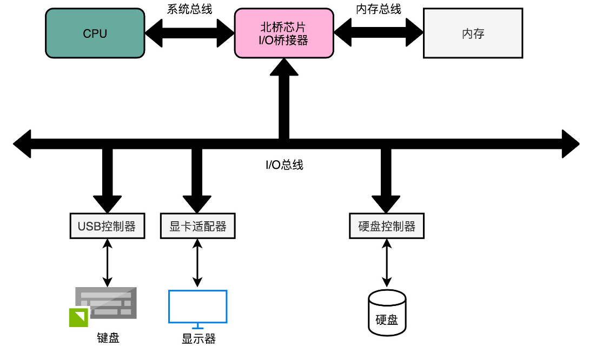
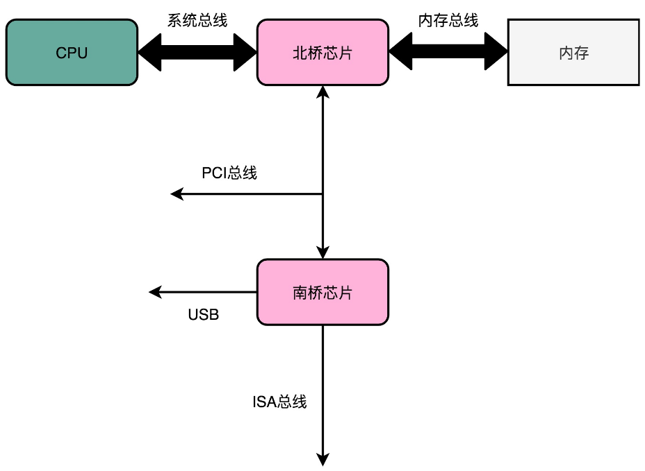
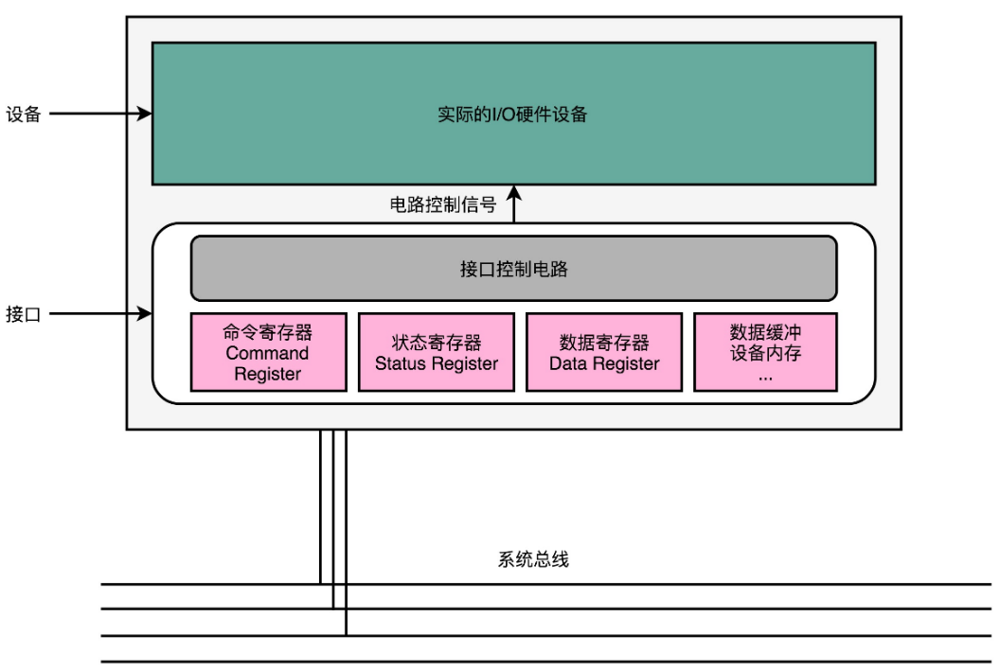
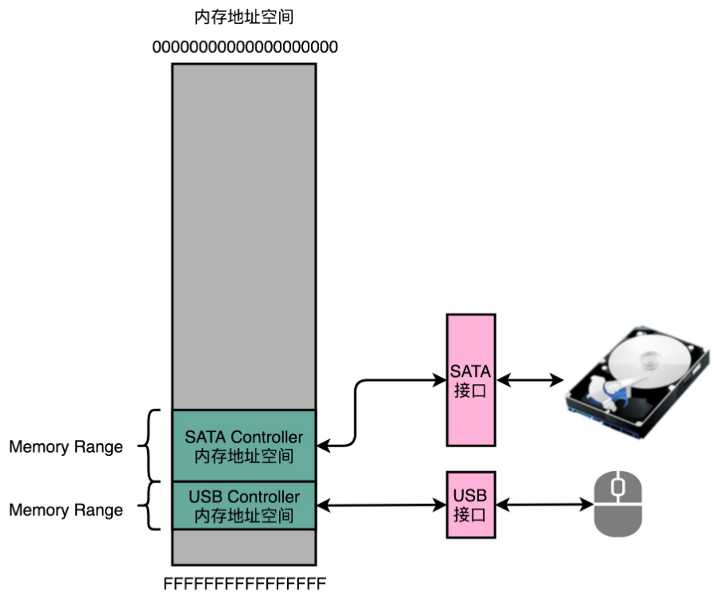
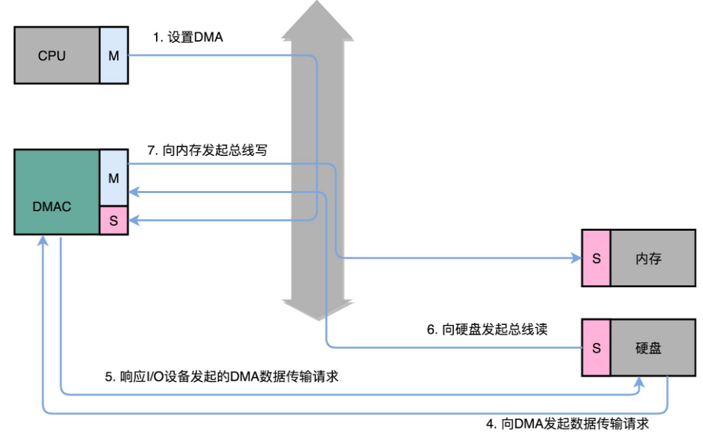
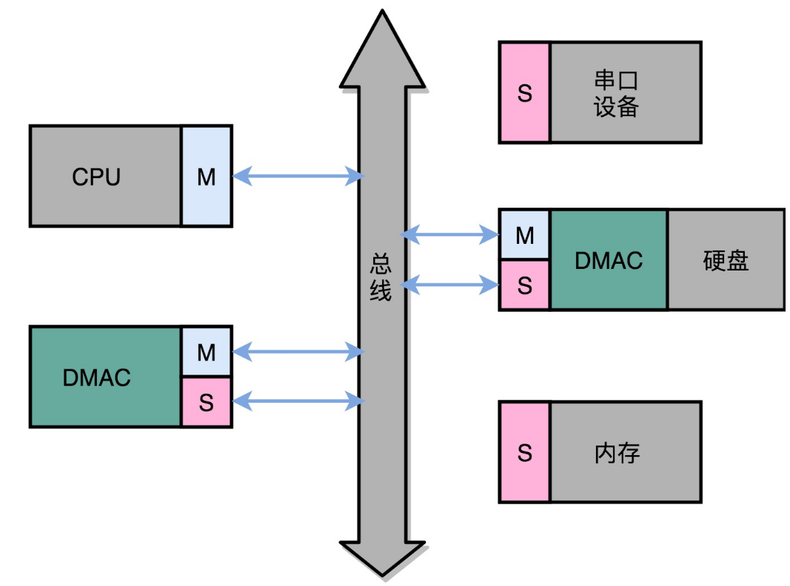
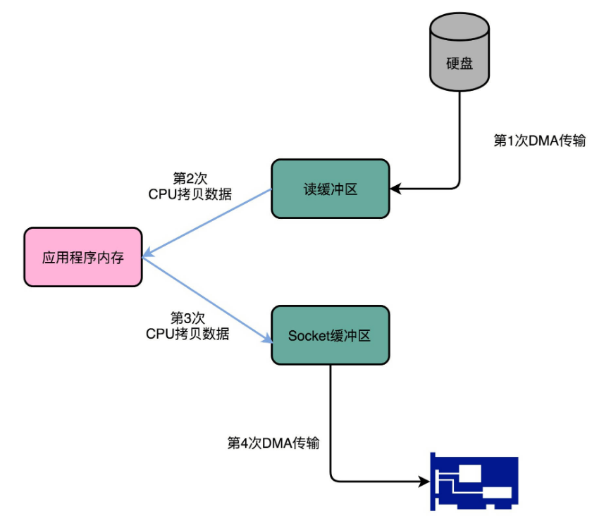
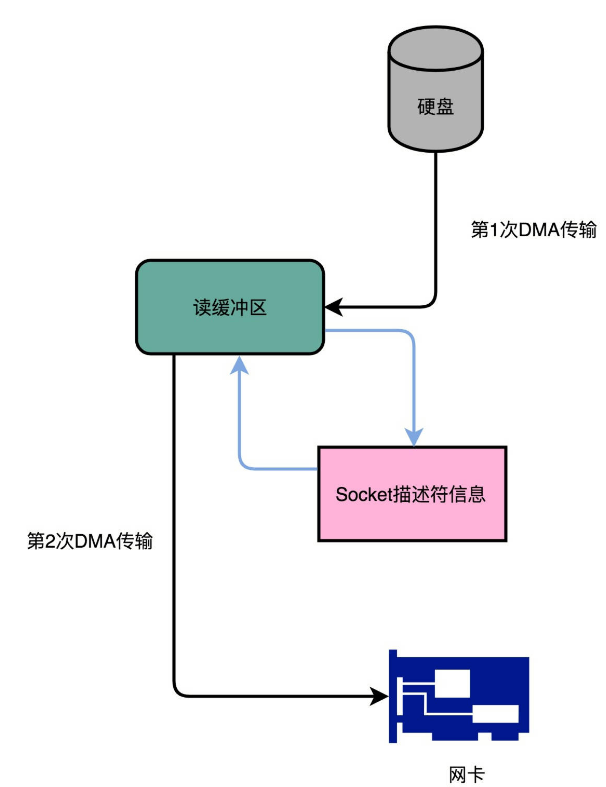

# IO

## 总线

计算机里有很多不同的硬件设备，除了 CPU 和内存之外，还有大量的输入输出设备。计算机上的每一个接口，键盘、鼠标、显示器、硬盘，乃至通过 USB 接口连接的各种外部设备，都对应了一个设备或者模块。

如果各个设备间的通信，都是互相之间单独进行的。如果有 N 个不同的设备，它们之间需要各自单独连接，那么系统复杂度就会变成 $N^2$。每一个设备或者功能电路模块，都要和其他 N−1 个设备去通信。为了简化系统的复杂度，就引入了总线，把这个 $N^2$ 的复杂度，变成一个 N 的复杂度。

总线就是一组线路，CPU、内存以及输入和输出设备，都是通过这组线路，进行相互间通信的。总线的英文叫作 Bus，就是一辆公交车。这个名字很好地描述了总线的含义。“公交车”的各个站点，就是各个接入设备。要想向一个设备传输数据，只要把数据放上公交车，在对应的车站下车就可以了。


### 三种线路和多总线架构

现代的 Intel CPU 的体系结构里面，通常有好几条总线。

CPU 和内存以及高速缓存通信的总线，这里面通常有两种总线。这种方式，称之为**双独立总线**（Dual Independent Bus，缩写为 DIB）。CPU 里，有一个快速的**本地总线**（Local Bus）连接高速缓存，以及一个速度相对较慢的**前端总线**（Front-side Bus）与 主内存以及输入输出设备通信。

本地总线也被称为后端总线，和前端总线相对应。前端总线也有很多其他名字，比如处理器总线（Processor Bus）、内存总线（Memory Bus）。



CPU 里面的北桥芯片，把前端总线一分为二，变成了三个总线。前端总线，其实就是**系统总线**。CPU 里面的内存接口，直接和系统总线通信，然后系统总线再接入一个 I/O 桥接器（I/O Bridge）。这个 I/O 桥接器，一边接入了内存总线，使得CPU 和内存通信；另一边接入 I/O 总线，用来连接 I/O 设备。

I/O总线根据不同的设备，还会分成独立的 PCI 总线、ISA 总线等等。



根据总线的分工，可以分成三类线路：

1. **数据线**（Data Bus）：传输实际的数据信息，也就是实际上了公交车的“人”。
2. **地址线**（Address Bus）：用来确定到底把数据传输到哪里去，是内存的某个位置，还是某一个 I/O 设备。这个其实就相当于拿了个纸条，写下了上面的人要下车的站点。
3. **控制线**（Control Bus）：用来控制对于总线的访问。既然把总线比喻成了一辆公交车，那么有人想要上车的时候，就需要告诉公交车司机，这个就是控制信号。

尽管总线减少了设备之间的耦合，也降低了系统设计的复杂度，但同时也带来了一个新问题：总线不能**同时**给多个设备提供通信功能。

总线是很多个设备公用的，当多个设备都想要用总线时，就由**总线裁决**（Bus Arbitraction）机制，去决定这种情况下，到底把总线给哪一个设备用。


## 接口和设备——适配器模式

输入输出设备，并不只是一个设备。大部分的输入输出设备，都有两个组成部分。第一个是它的**接口**（Interface），第二个才是**实际的 I/O 设备**（Actual I/O Device）。硬件设备并不是直接接入到总线上和 CPU 通信的，而是通过接口，用接口连接到总线上，再通过总线和 CPU 通信。

接口本身就是一块电路板。CPU 其实不是和实际的硬件设备打交道，而是和这个接口电路板打交道。

设备里面有三类寄存器，其实都在这个设备的接口电路上，而不在实际的设备上。这三类寄存器分别是**状态寄存器**（Status Register）、 **命令寄存器**（Command Register）以及**数据寄存器**（Data Register）。

除了内置在主板上的接口之外，有些接口可以集成在设备上，例如**IDE 硬盘**（Integrated Device Electronics，集成设备电路）。

这种把接口和实际设备分离的做法，使得在对计算机升级时，只需要替换相应的硬件设备，只要这个设备实现了相应的接口控制协议。类似软件设计模式中的面向接口编程。


## CPU如何控制I/O设备

无论是内置在主板上的接口，还是集成在设备上的接口，除了三类寄存器之外，还有对应的控制电路。正是通过这个控制电路，CPU 才能通过向这个接口电路板传输信号，来控制实际的硬件。

以打印机为例，看看硬件设备上的寄存器的作用。



1. 数据寄存器（Data Register）：CPU 向 I/O 设备写入需要传输的数据，比如要打印的内容是“ABC”，我们就要先发送一个“A”给到对应的 I/O 设备。
2. 命令寄存器（Command Register）：CPU 发送一个命令，告诉打印机，要进行打印工作。这个时候，打印机里面的控制电路会做两个动作。第一个，是去设置状态寄存器里面的状态，把状态设置成 not-ready。第二个，就是实际操作打印机进行打印。
3. 状态寄存器（Status Register）：告诉CPU，现在设备已经在工作了，所以这个时候，CPU 再发送数据或者命令过来，都是没有用的。直到前面的动作已经完成，状态寄存器重新变成了 ready 状态，CPU 才能发送下一个字符和命令。

当然，实际情况中，打印机里通常不只有数据寄存器，还会有数据缓冲区。CPU 也不是真的一个字符一个字符这样交给打印机去打印，而是一次性把整个文档传输到打印机的内存或者数据缓冲区里面一起打印的。


## 信号和地址

CPU与I/O设备的通信，是通过 CPU 支持的机器指令来执行的。MIPS 的机器指令的分类中没有一种专门的和 I/O 设备通信的指令类型。那么，MIPS 的 CPU 是怎样和 I/O 设备通信的？

为了让已经足够复杂的 CPU 尽可能简单，CPU将I/O设备看作内存的一部分。计算机会把 I/O 设备的各个寄存器，以及 I/O 设备内部的内存地址，都映射到主内存地址空间里来。主内存的地址空间里，会给不同的 I/O 设备预留一段一段的内存地址。CPU 想要和这些 I/O 设备通信的时候，就往这些地址发送数据。这些地址信息，就是通过地址线来发送的，而对应的数据信息，则是通过数据线来发送的了。

 I/O 设备会监控地址线，并且在 CPU 往自己地址发送数据的时候，把对应的数据线里面传输过来的数据，接入到对应的设备里面的寄存器和内存里面来。CPU 无论是向 I/O 设备发送命令、查询状态还是传输数据，都可以通过这样的方式。这种方式叫作**内存映射**IO（Memory-Mapped I/O，简称 MMIO）。



精简指令集 MIPS 的 CPU 特别简单，所以只有 MMIO。而有 2000 多个指令的 Intel X86 架构的计算机，不仅支持 MMIO，还可以通过特定的指令（in、out），来支持**端口映射 I/O**（Port-Mapped I/O，简称 PMIO），也叫独立输入输出（Isolated I/O）。

PMIO 的通信方式和 MMIO 差不多，核心的区别在于，PMIO 里面访问的设备地址，不再是在内存地址空间里面，而是一个专门的端口（Port）。这个端口并不是指一个硬件上的插口，而是和 CPU 通信的一个抽象概念。

无论是 PMIO 还是 MMIO，CPU 都会传送一条二进制的数据，给到 I/O 设备的对应地址。设备自己本身的接口电路，再去解码这个数据。解码之后的数据，就会变成设备支持的一条指令，再去通过控制电路去操作实际的硬件设备。对于 CPU 来说，它并不需要关心设备本身能够支持哪些操作。它要做的，只是在总线上传输一条条数据就好了。

这个有点像设计模式里面的 Command 模式。我们在总线上传输的，是一个个数据对象，然后各个接受这些对象的设备，再去根据对象内容，进行实际的解码和命令执行。


## 性能

现在常用的硬盘有两种：

- HDD 硬盘，即机械硬盘，使用 SATA 3.0 的接口
- SSD 硬盘，即固态硬盘，通常会用两种接口，一部分用 SATA 3.0 的接口；另一部分用 PCI Express 的接口。使用PCI Express 接口，数据传输会更快。

硬盘的两个性能指标是**响应时间**（Response Time）和**数据传输率**（Data Transfer Rate）。

常用的 SATA 3.0 的接口，带宽是 6Gb/s，相当于每秒可以传输 768MB 的数据。而 HDD 硬盘的数据传输率，差不多在 200MB/s 左右。

从程序发起一个硬盘的写入请求，直到这个请求返回的时间。在 SSD 硬盘上，大概时间都是在几十微秒这个级别。在 HDD 硬盘上，通常会在几毫秒到十几毫秒这个级别。

在**顺序读写**和**随机读写**的情况下，硬盘的性能是完全不同的。在顺序读写下，使用的接口类型会有比较大的影响；而在随机读写下，接口类型对于数据传输率的影响就不大了。

即使使用 PCI Express 的接口，在随机读写4KB数据的时候，数据传输率也只能到 40MB/s 左右，是顺序读写情况下的几十分之一。

$40MB / 4KB=10,000$， 这是每秒读写的次数，称之为[IOPS](https://en.wikipedia.org/wiki/IOPS)，也就是每秒输入输出操作的次数。事实上，比起响应时间，我们更关注 IOPS 这个性能指标。**IOPS 和 DTR（Data Transfer Rate，数据传输率）才是输入输出性能的核心指标。**

因为在实际的应用开发当中，对于数据的访问，更多的是随机读写，而不是顺序读写。我们平时所说的服务器承受的“并发”，其实是在说，会有很多个不同的进程和请求来访问服务器。自然，它们在硬盘上访问的数据，是很难顺序放在一起的。这种情况下，随机读写的 IOPS 才是服务器性能的核心指标。


## 定位 IO_WAIT

即使是用上了 PCI Express 接口的 SSD 硬盘，IOPS 也就是在 2 万左右。而 CPU 的主频通常在 2GHz 以上，也就是每秒可以做 20 亿次操作。

即使 CPU 向硬盘发起一条读写指令，需要很多个时钟周期，一秒钟 CPU 能够执行的指令数，和硬盘能够进行的操作数，也有好几个数量级的差异。这就导致很多时候，CPU 指令发出去之后，不得不去“等” I/O 操作完成，才能进行下一步的操作。

在实际遇到服务端程序的性能问题的时候，怎么知道这个问题是不是来自于 CPU 等待 I/O ？

可以先执行 top 命令，查看服务器的负载情况：`

```
$ top
top - 21:02:22 up 0 min,  0 users,  load average: 0.52, 0.58, 0.59
Tasks:   4 total,   1 running,   3 sleeping,   0 stopped,   0 zombie
%Cpu(s): 17.4 us,  6.6 sy,  0.0 ni, 75.9 id,  0.0 wa,  0.1 hi,  0.0 si,  0.0 st
KiB Mem : 16613464 total,  6743720 free,  9640392 used,   229352 buff/cache
KiB Swap: 70674124+total, 18014397+free, 18428729+used.  6839340 avail Mem
...
```

`top`的输出中，第三行显示了当前各个状态CPU的使用率，其中wa这个指标就代表着 iowait，即 CPU 等待 IO 完成操作花费的时间占 CPU 的百分比。

如果iowait 很大，就可以通过`iostat`命令，查看实际的硬盘读写情况。

```
$ iostat
avg-cpu:  %user   %nice %system %iowait  %steal   %idle
           0.10    0.00    0.10    0.00    0.00   99.81

Device:            tps    kB_read/s    kB_wrtn/s    kB_read    kB_wrtn
vda               0.39         0.23         2.96    2370327   29950656
```

`iostat`的输出，不仅有 iowait 这个 CPU 等待时间的百分比，还有一些更加具体的指标了，并且还是按照机器上安装的多块不同的硬盘划分的。

这里的 tps 指标，就是硬盘的 IOPS 性能。而 kB_read/s 和 kB_wrtn/s 指标，就是数据传输率的指标。知道实际硬盘读写的 tps、kB_read/s 和 kb_wrtn/s 的指标，基本上可以判断出，机器的性能是不是卡在 I/O 上了。那么，接下来，就要找出到底是哪一个进程是这些 I/O 读写的来源了。这用的是`iotop`命令。

```
$ iotop
Total DISK READ :       0.00 B/s | Total DISK WRITE :      15.75 K/s
Actual DISK READ:       0.00 B/s | Actual DISK WRITE:      35.44 K/s
  TID  PRIO  USER     DISK READ  DISK WRITE  SWAPIN     IO>    COMMAND                                             
  104 be/3 root        0.00 B/s    7.88 K/s  0.00 %  0.18 % [jbd2/sda1-8]
  383 be/4 root        0.00 B/s    3.94 K/s  0.00 %  0.00 % rsyslogd -n [rs:main Q:Reg]
 1514 be/4 www-data    0.00 B/s    3.94 K/s  0.00 %  0.00 % nginx: worker process
```


## DMA

如果我们对于 I/O 的操作，都是由 CPU 发出对应的指令，然后等待 I/O 设备完成操作之后返回，那 CPU 就有大量的时间其实都是在等待 I/O 设备完成操作。

但是，这个 CPU 的等待，在很多时候，其实并没有太多的实际意义。我们对于 I/O 设备的大量操作，其实都只是把内存里面的数据，传输到 I/O 设备而已。在这种情况下，其实 CPU 只是在傻等而已。特别是当传输的数据量比较大的时候，比如进行大文件复制，如果所有数据都要经过 CPU，实在是有点儿太浪费时间了。

因此，就有了**直接内存访问**（Direct Memory Access）技术，来减少 CPU 等待的时间。

本质上，DMA 技术就是在主板上放一块独立的芯片。在进行内存和 I/O 设备的数据传输的时候，不再通过 CPU 来控制数据传输，而直接通过**DMA 控制器**（DMA Controller，简称 DMAC）。因此这块芯片可以认为是一个**协处理器**（Co-Processor）。

**DMAC 最有价值的地方体现在，当要传输的数据特别大、速度特别快，或者传输的数据特别小、速度特别慢的时候。**

比如用千兆网卡或者硬盘传输大量数据的时候，如果都用 CPU 来搬运的话，肯定忙不过来，所以可以选择 DMAC。而当数据传输很慢的时候，DMAC 可以等数据到齐了，再发送信号，给到 CPU 去处理，而不是让 CPU 在那里忙等待。

DMAC 是一个协处理器，它可以“协助”CPU，完成对应的数据传输工作。因此，在 DMAC 控制数据传输的过程中，还是需要 CPU 的。除此之外，DMAC 其实也是一个特殊的 I/O 设备，它和 CPU 以及其他 I/O 设备一样，通过连接到总线来进行实际的数据传输。总线上的设备，其实有两种类型：**主设备**（Master）和**从设备**（Slave）。

想要主动发起数据传输，必须要是一个主设备才可以，CPU 就是主设备。而从设备（比如硬盘）只能接受数据传输。所以，如果通过 CPU 来传输数据，要么是 CPU 从 I/O 设备读数据，要么是 CPU 向 I/O 设备写数据。

那么 I/O 设备不能向主设备发起请求么？I/O 设备可以主动发送**控制信号**，但不是数据内容。I/O 设备可以告诉 CPU，有数据要传输给你，但是实际数据是 CPU 去拉走的，而不是 I/O 设备推给 CPU 的。

DMAC 既是一个主设备，又是一个从设备。对于 CPU 来说，它是一个从设备；对于硬盘这样的 IO 设备来说，它又变成了一个主设备。DMA数据传输流程如下：

1. CPU 作为一个主设备，向 DMAC 设备发起请求。这个过程就是修改 DMAC 里面的配置寄存器。

2. CPU 修改 DMAC 的配置的时候，会告诉 DMAC 这样几个信息：

- **源地址的初始值以及传输时候的地址增减方式**。

  源地址就是数据要从哪里传输过来。如果我们要从内存里面写入数据到硬盘上，那么就是要读取的数据在内存里面的地址。如果是从硬盘读取数据到内存里，那就是硬盘的 I/O 接口的地址。I/O 的地址可以是一个内存地址，也可以是一个端口地址。

  地址的增减方式就是指，数据读取时的方向是从大的地址向小的地址，还是从小的地址往大的地址。

- **目标地址初始值和传输时候的地址增减方式**。目标地址就是和源地址对应的设备，即数据传输的目的地。

- **要传输的数据长度**

3. 设置完这些信息之后，DMAC 就会变成一个空闲的状态（Idle）。

4. 如果要从硬盘上往内存里面加载数据，这个时候，硬盘就会向 DMAC 发起一个数据传输请求。**这个请求并不是通过总线，而是通过一个额外的连线。**

5. DMAC 需要再通过一个额外的连线响应这个申请。

6. DMAC 芯片向硬盘的接口发起要总线读的传输请求。数据就从硬盘里面，读到了 DMAC 的控制器里面。

7. DMAC 再向内存发起总线写的数据传输请求，把数据写入到内存里面。

8. DMAC 会反复进行第 6、7 步的操作，直到 DMAC 的寄存器里面设置的数据长度传输完成。

9. 数据传输完成之后，DMAC 重新回到第 3 步的空闲状态。



整个数据传输的过程中，不是通过 CPU 来搬运数据，而是由 DMAC 这个芯片来搬运数据。但是 CPU 在这个过程中也是必不可少的。因为传输什么数据，从哪里传输到哪里，还是由 CPU 来设置的。这也是为什么，DMAC 被叫作“协处理器”。




### Kafka

[Kafka ](http://notes.stephenholiday.com/Kafka.pdf)是一个用来处理实时数据的管道，我们常常用它来做一个消息队列，或者用来收集和落地海量的日志。作为一个处理实时数据和日志的管道，瓶颈自然也在 I/O 层面。

Kafka 里面有两种常见的海量数据传输的情况：

- 从网络中接收上游的数据，然后落地到本地的磁盘上，确保数据不丢失。
- 从本地磁盘上读取出来，通过网络发送出去。

在后一种情况中，从磁盘读数据发送到网络上去。如果我们写一个简单的程序，最直观的办法，自然是用一个文件读操作，从磁盘上把数据读到内存里面来，然后再用一个 Socket，把这些数据发送到网络上去。

```
File.read(fileDesc, buf, len);
Socket.send(socket, buf, len);
```

在这个过程中，数据一共发生了四次传输的过程。其中两次是 DMA 的传输，另外两次，则是通过 CPU 控制的传输。

- 第一次传输，是从硬盘上，读到操作系统内核的缓冲区里。这个传输是通过 DMA 搬运的。
- 第二次传输，需要从内核缓冲区里面的数据，复制到应用分配的内存里面。这个传输是通过 CPU 搬运的。
- 第三次传输，要从我们应用的内存里面，再写到操作系统的 Socket 的缓冲区里面去。这个传输，还是由 CPU 搬运的。
- 最后一次传输，需要再从 Socket 的缓冲区里面，写到网卡的缓冲区里面去。这个传输又是通过 DMA 搬运的。



这个过程中，我们只是要“搬运”一份数据，结果却整整搬运了四次。而且这里面，从内核的读缓冲区传输到应用的内存里，再从应用的内存里传输到 Socket 的缓冲区里，其实都是把同一份数据在内存里面搬运来搬运去，特别没有效率。

像 Kafka 这样的应用场景，大部分最终利用到的硬件资源，又都是在做这个搬运数据。所以，我们就需要尽可能地减少数据搬运的次数。

Kafka 做的事情就是，把这个数据搬运的次数，从上面的四次，变成了两次，并且只有 DMA 来进行数据搬运，而不需要 CPU。

Kafka 的代码调用了 Java NIO 库，具体是 FileChannel 里面的 `transferTo `方法。数据并没有读到中间的应用内存里面，而是直接通过 Channel，写入到对应的网络设备里。并且，对于 Socket 的操作，也不是写入到 Socket 的 Buffer 里面，而是直接根据描述符（Descriptor）写入到网卡的缓冲区里面。于是，在这个过程之中，我们只进行了两次数据传输。

```
@Override
public long transferFrom(FileChannel fileChannel, long position, long count) throws IOException {
    return fileChannel.transferTo(position, count, socketChannel);
}
```



第一次，是通过 DMA，从硬盘直接读到操作系统内核的读缓冲区里面。第二次，则是根据 Socket 的描述符信息，直接从读缓冲区里面，写入到网卡的缓冲区里面。

这种没有在内存层面去“复制（Copy）”数据的方法，也被称之为**零拷贝**（Zero-Copy）。[这篇文章](https://developer.ibm.com/articles/j-zerocopy/)介绍了零拷贝的效果，无论传输数据量的大小，传输同样的数据，使用了零拷贝能够缩短 65% 的时间，大幅度提升了机器传输数据的吞吐量。