# 层次架构

## CPU cache

### SRAM

CPU Cache 用的是叫作**SRAM**（Static Random-Access Memory，静态随机存取存储器）的芯片，之所以称之为“静态”存储器，是因为只要处在通电状态，里面的数据就可以保持存在。而一旦断电，里面的数据就会丢失了。在 SRAM 里面，一个比特的数据，需要 6～8 个晶体管。所以 **SRAM 的存储密度不高**。同样的物理空间下，能够存储的数据有限。不过，因为 SRAM 的电路简单，所以**访问速度非常快**。

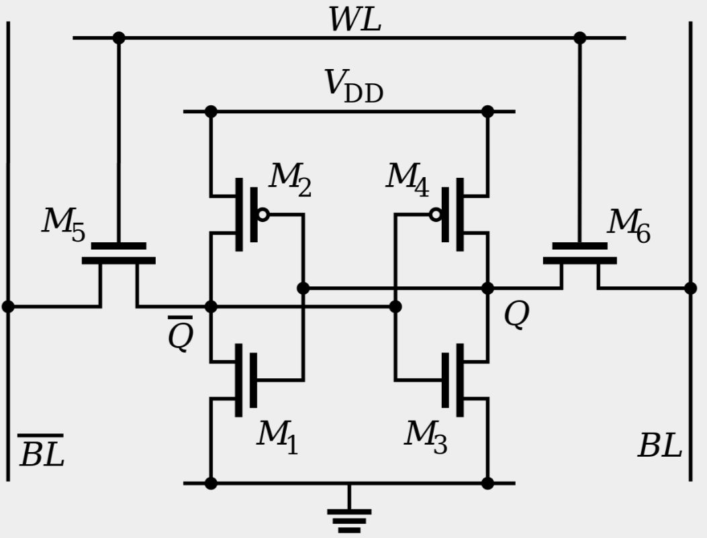

在 CPU 里，通常会有 L1、L2、L3 这样三层高速缓存。每个 CPU 核心都有一块属于自己的 L1 高速缓存，这个高搜缓存往往就嵌在 CPU 核心的内部，通常分成**指令缓存**和**数据缓存**，分开存放 CPU 使用的指令和数据。

L2 的 Cache 同样是每个 CPU 核心都有的，不过它往往不在 CPU 核心的内部。所以，L2 Cache 的访问速度会比 L1 稍微慢一些。而 L3 Cache，则通常是**多个 CPU 核心共用的**，尺寸会更大一些，访问速度自然也就更慢一些。


### 高速缓存

```
func BenchmarkFor1(b *testing.B){
	arrLen := 64 * 1024 * 1024
	nums := make([]int, arrLen)
	b.ResetTimer()
	for i:=0;i<b.N;i++{
		for j := 0; j < arrLen; j++ {
			nums[j]++
		}
	}
}

func BenchmarkFor2(b *testing.B){
	arrLen := 64 * 1024 * 1024
	nums := make([]int, arrLen)
	b.ResetTimer()
	for i:=0;i<b.N;i++{
		for j := 0; j < arrLen; j += 16 {
			nums[j]++
		}
	}
}
```

```
$ go test -bench=. cache_test.go
...
BenchmarkFor1-8               19          63947326 ns/op
BenchmarkFor2-8               30          40799857 ns/op
...
```

在上面的基准测试中，我们先申请一个相同大小的切片，然后在`BenchmarkFor1` 中依次访问每一个元素并加一，而在`BenchmarkFor2` 中只访问`BenchmarkFor1` 中 1/16 的数组元素，只进行了`BenchmarkFor1` 中 1/16 的加法计算，那`BenchmarkForW` 花费的时间应该是`BenchmarkFor1` 的 1/16 左右。但是实际上，`BenchmarkFor1` 执行时间大概只是`BenchmarkFor2`的 1.5倍。

之所以差异没有我们想象中的大，与CPU cache的大小有关。

从 CPU Cache 被加入到现有的 CPU 里开始，内存中的指令、数据，会被加载到 L1-L3 Cache 中，而不是直接由 CPU 访问内存去拿。在 95% 的情况下，CPU 都只需要访问 L1-L3 Cache，从里面读取指令和数据，而无需访问内存。

在上面的程序中，运行的时间主要花在了将对应的数据从内存中读取出来，加载到 CPU Cache 里。CPU 从内存中读取数据到 CPU Cache 的过程中，是一小块一小块来读取数据的，而不是按照单个数组元素来读取数据的。这样一小块一小块的数据，在 CPU Cache 里面，把它叫作 **Cache Line**（缓存块）。

在日常使用的 Intel 服务器或者 PC 里，Cache Line 的大小通常是 64 字节。而在上面的`BenchmarkFor2`  里面，我们每隔 16 个整型数计算一次，16 个整型数正好是 64 个字节。于是，循环 1 和循环 2，**需要把同样数量的 Cache Line 数据从内存中读取到 CPU Cache 中**，最终两个程序花费的时间就差别不大了。


### Cache 的数据结构和读取过程

现代 CPU 进行数据读取的时候，无论数据是否已经存储在 Cache 中，CPU 始终会首先访问 Cache。只有当 CPU 在 Cache 中找不到数据的时候，才会去访问内存，并将读取到的数据写入 Cache 之中。当时间局部性原理起作用后，这个最近刚刚被访问的数据，会很快再次被访问。而 Cache 的访问速度远远快于内存，这样，CPU 花在等待内存访问上的时间就大大变短了。

这样的访问机制，和在开发应用系统的时候，“使用内存作为硬盘的缓存”的逻辑是一样的。在各类基准测试（Benchmark）和实际应用场景中，CPU Cache 的命中率通常能达到 95% 以上。

CPU 如何知道要访问的内存数据，存储在 Cache 的哪个位置呢？

最基本的策略：**直接映射 Cache**（Direct Mapped Cache），确保任何一个内存块的地址，始终映射到一个固定的 CPU Cache 地址（Cache Line）。这个映射关系，通常用 mod 运算（求余运算）来实现。CPU 访问内存数据，是一小块一小块数据来读取的。对于读取内存中的数据，首先拿到的是数据所在的**内存块**（Block）的地址。然后对这个地址取模，得到它在Cache中应该存放的地址。

假设主内存被分成 0～31 号这样 32 个块。一共有 8 个缓存块。用户想要访问第 21 号内存块。如果 21 号内存块内容在缓存块中的话，它一定在 5 号缓存块（$21 \% 8 = 5$）中。

实际应用中，通常会**把缓存块的数量设置成 2 的 N 次方**。这样在计算取模的时候，可以直接取地址的低 N 位，也就是二进制里面的后几位。比如这里的 8 个缓存块，就是 2 的 3 次方。那么，在对 21 取模的时候，可以对 21 的 2 进制表示 10101 取地址的低三位，也就是 101，对应的 5，就是对应的缓存块地址。

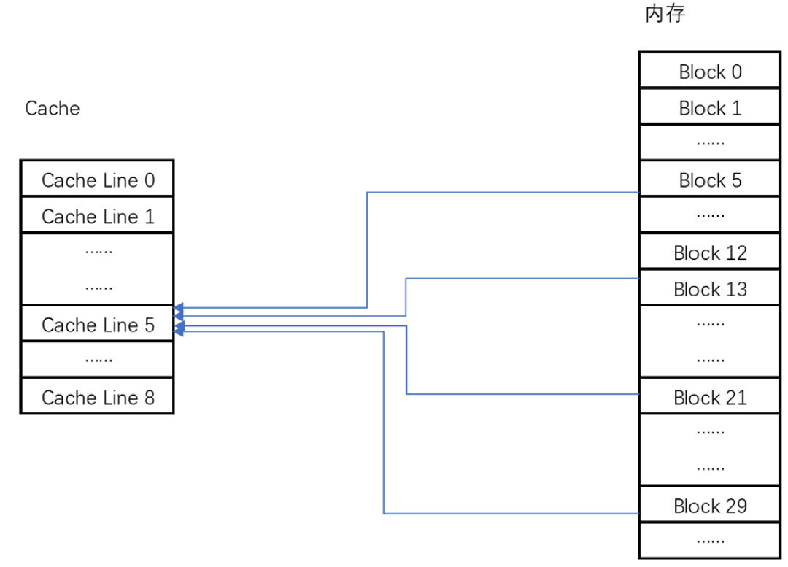

取 Block 地址的低位，就能得到对应的 Cache Line 地址，除了 21 号内存块外，13 号、5 号等很多内存块的数据，都对应着 5 号缓存块中。既然如此，假如现在 CPU 想要读取 21 号内存块，在读取到 5 号缓存块的时候，怎么知道里面的数据，究竟是不是 21 号对应的数据呢？

在对应的缓存块中，会存储一个**组标记**（Tag）。这个组标记会记录，当前缓存块内存储的数据对应的内存块，而缓存块本身的地址表示访问地址的低 N 位。因此只需要记录内存块除去最低N位后的高位的信息。

除了组标记，还有**有效位**（valid bit），它用来标记，对应的缓存块中的数据是否是有效的，确保不是机器刚刚启动时候的空数据。如果有效位是 0，无论其中的组标记和 Cache Line 里的数据内容是什么，CPU 都不会管这些数据，而要直接访问内存，重新加载数据。

CPU 在读取数据的时候，并不是要读取一整个 Block，而是读取一个字。具体是哪个字，就用这个字在整个 Block 里面的偏移量（Offset）来决定。

**一个内存的访问地址，最终包括高位代表的组标记、低位代表的索引，以及在对应的 Data Block 中定位对应字的位置偏移量。**

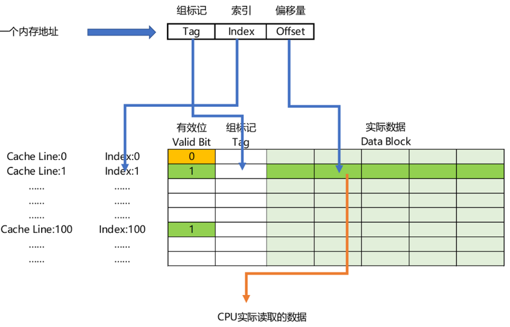

如果内存中的数据已经在 CPU Cache 里了，那一个内存地址的访问，就会经历这样 4 个步骤：

1. 根据内存地址的低位，计算在 Cache 中的索引；
2. 判断有效位，确认 Cache 中的数据是有效的；
3. 对比内存访问地址的高位，和 Cache 中的组标记，确认 Cache 中的数据就是我们要访问的内存数据，从 Cache Line 中读取到对应的数据块（Data Block）；
4. 根据内存地址的 Offset 位，从 Data Block 中，读取希望读取到的字。

如果在 2、3 这两个步骤中，CPU 发现，Cache 中的数据并不是要访问的内存地址的数据，那 CPU 就会访问内存，并把对应的 Block Data 更新到 Cache Line 中，同时更新对应的有效位和组标记的数据。


### volatile

```
public class VolatileTest {
    private static volatile int COUNTER = 0;
 
    public static void main(String[] args) {
        new ChangeListener().start();
        new ChangeMaker().start();
    }
 
    static class ChangeListener extends Thread {
        @Override
        public void run() {
            int threadValue = COUNTER;
            while ( threadValue < 5){
                if( threadValue!= COUNTER){
                    System.out.println("Got Change for COUNTER : " + COUNTER + "");
                    threadValue= COUNTER;
                }
            }
        }
    }
 
    static class ChangeMaker extends Thread{
        @Override
        public void run() {
            int threadValue = COUNTER;
            while (COUNTER <5){
                System.out.println("Incrementing COUNTER to : " + (threadValue+1) + "");
                COUNTER = ++threadValue;
                try {
                    Thread.sleep(500);
                } catch (InterruptedException e) { e.printStackTrace(); }
            }
        }
    }
}
```

在这个程序里，先定义了一个 `volatile `的 int 类型的变量`COUNTER`。然后分别启动了两个单独的线程，ChangeListener线程先取到 COUNTER 当前的值，然后一直监听着这个 `COUNTER `的值。一旦 `COUNTER `的值发生了变化，就把新的值通过 `println `打印出来。直到 `COUNTER `的值达到 5 为止。ChangeMaker线程取到 `COUNTER `的值，在 `COUNTER `小于 5 的时候，每隔 500 毫秒，就让 `COUNTER `自增 1。

程序的输出结果符合我们的预期。ChangeMaker 函数会一次一次将 `COUNTER `从 0 增加到 5。因为这个自增是每 500 毫秒一次，而 ChangeListener 去监听 `COUNTER `是忙等待的，所以每一次自增都会被 ChangeListener 监听到，然后对应的结果就会被打印出来。

```
Incrementing COUNTER to : 1
Got Change for COUNTER : 1
Incrementing COUNTER to : 2
Got Change for COUNTER : 2
Incrementing COUNTER to : 3
Got Change for COUNTER : 3
Incrementing COUNTER to : 4
Got Change for COUNTER : 4
Incrementing COUNTER to : 5
Got Change for COUNTER : 5
```

这时，把`COUNTER `变量的`volatile`修饰去掉，变成了 `private static int COUNTER = 0;`。再运行程序，ChangeMaker 还是能正常工作的，每隔 500ms 仍然能够对 `COUNTER `自增 1。但是，ChangeListener 却没有监听到`COUNTER`的变化。

```
Incrementing COUNTER to : 1
Incrementing COUNTER to : 2
Incrementing COUNTER to : 3
Incrementing COUNTER to : 4
Incrementing COUNTER to : 5
```

如果不再让 ChangeListener 进行完全的忙等待，而是在 while 循环里面，小小地等待上 5 毫秒，看看会发生什么情况。

```
static class ChangeListener extends Thread {
    @Override
    public void run() {
        int threadValue = COUNTER;
        while (threadValue < 5){
            if( threadValue!= COUNTER){
                System.out.println("Sleep 5ms, Got Change for COUNTER : " + COUNTER + "");
                threadValue= COUNTER;
            }
            try {
                Thread.sleep(5);
            } catch (InterruptedException e) { e.printStackTrace(); }
        }
    }
}
```

虽然 `COUNTER `变量，仍然没有设置 `volatile `这个关键字，但是 ChangeListener 在通过 `Thread.sleep(5) `在每个循环里“睡上“5 毫秒之后，又能够正常取到 `COUNTER `的值了。

**volatile 关键字会确保我们对于这个变量的读取和写入，都一定会同步到主内存里，而不是从 Cache 里面读取。**

一开使用了`volatile `关键字的例子里，因为所有数据的读和写都来自主内存。那么 ChangeMaker 和 ChangeListener 之间，看到的 `COUNTER `值就是一样的。

在第二个实验中，由于不使用`volatile`，并且ChangeListener 一直处于忙等待，它尝试不停地获取 `COUNTER `的值，这样就会从当前线程的“Cache”里面获取。导致这个线程没有时间从主内存里面同步更新后的 `COUNTER `值。这样，它就一直卡死在 `COUNTER=0` 的死循环上了。

在最后一个实验中，虽然还是没有使用 `volatile `关键字，但是短短 5ms 的` Thead.Sleep` 给了这个线程喘息之机。既然这个线程没有这么忙了，它也就有机会把最新的数据从主内存同步到自己的高速缓存里面了。于是，ChangeListener 在下一次查看 `COUNTER `值的时候，就能看到 ChangeMaker 造成的变化了。


## 内存

### DRAM

内存用的芯片和 Cache 有所不同，它用的是**DRAM**（Dynamic Random Access Memory，动态随机存取存储器）芯片，比起 SRAM 来说，它的密度更高，有更大的容量，而且它也比 SRAM 芯片便宜不少。

DRAM 被称为“动态”存储器，是因为 DRAM 需要靠不断地“刷新”，才能保持数据被存储起来。DRAM 的一个比特，只需要一个晶体管和一个电容就能存储。所以，DRAM 在同样的物理空间下，能够存储的数据也就更多，也就是存储的“密度”更大。但是，因为数据是存储在电容里的，电容会不断漏电，所以**需要定时刷新充电，才能保持数据不丢失**。DRAM 的数据访问电路和刷新电路都比 SRAM 更复杂，所以**访问延时也就更长**。


### 内存映射

#### 简单页表

把虚拟内存地址，映射到物理内存地址，最直观的办法，就是建一张映射表。这个映射表叫作**页表**（Page Table），能够实现虚拟内存里面的页，到物理内存里面的页的一一映射。

页表这个地址转换的办法，把一个内存地址分成**页号**（Directory）和**偏移量**（Offset）两个部分。虚拟内存地址的高位，就可以当作页表里的key，剩余的低位则是该地址在页中的偏移量。地址转换步骤如下：

1. 把虚拟内存地址，切分成页号和偏移量的组合；
2. 从页表里面，查询出虚拟页号对应的物理页号；
3. 直接拿物理页号，加上前面的偏移量，就得到了物理内存地址。

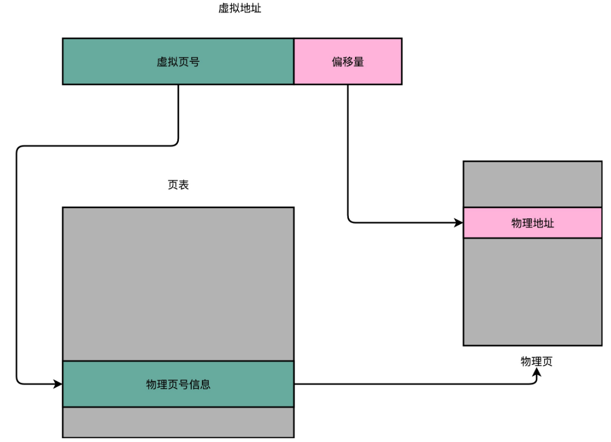

虽然这个方法很简单，但很费空间。以 32 位的内存地址空间为例，每个物理页大小为4KB，页表一共需要记录$ 2^{20}$ 个到物理页号的映射关系。这个存储关系，就好比一个$ 2^{20}$  大小的数组。一个页号是完整的 32 位的 4 字节（Byte），这样一个页表就需要 4MB 的空间。而每一个进程，都有属于自己独立的虚拟内存地址空间。这也就意味着，每一个进程都需要这样一个页表。不管这个进程本身只有几 KB 大小，还是需要几 GB 的内存空间，都需要这样一个页表。


#### 多级页表

大部分进程所占用的内存是有限的，需要的页也自然是很有限的，因此只需要去存那些用到的页之间的映射关系就好了。

一个进程的内存地址空间，通常是“两头实、中间空”。在程序运行的时候，内存地址从顶部往下，不断分配占用的栈的空间。而堆的空间，内存地址则是从底部往上，是不断分配占用的。

所以，在一个实际的程序进程里面，虚拟内存占用的地址空间，通常是两段连续的空间。而不是完全散落的随机的内存地址。而多级页表，就特别适合这样的内存地址分布。

以一个 4 级的多级页表为例，同样一个虚拟内存地址，偏移量的部分和上面简单页表一样不变，但是把页号部分拆成四段，从高到低，分成 4 级到 1 级这样 4 个页表索引。

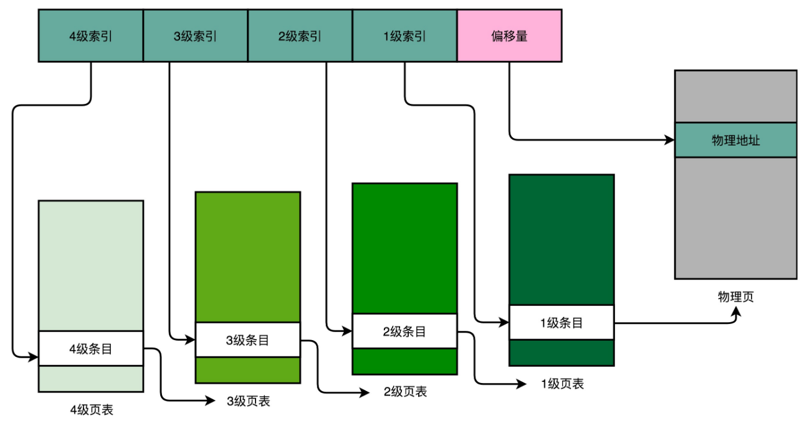

一个进程会有一个 4 级页表。我们先通过 4 级页表索引，找到 4 级页表里面对应的条目（Entry）。这个条目里存放的是一张 3 级页表所在的位置。4 级页面里面的每一个条目，都对应着一张 3 级页表，所以我们可能有多张 3 级页表。

找到对应这张 3 级页表之后，用 3 级索引去找到对应的 3 级索引的条目。3 级索引的条目再会指向一个 2 级页表。同样的，2 级页表里再用 2 级索引指向一个 1 级页表。最后一层的 1 级页表里面的条目，对应的数据内容就是物理页号了。在拿到了物理页号之后，我们同样可以用“页号 + 偏移量”的方式，来获取最终的物理内存地址。

我们可能有很多张 1 级页表、2 级页表，乃至 3 级页表。但是，因为实际的虚拟内存空间通常是连续的，我们很可能只需要很少的 2 级页表，甚至只需要 1 张 3 级页表就够了。

事实上，多级页表就像一个多叉树的数据结构，所以常常称它为**页表树**（Page Table Tree）。因为虚拟内存地址分布的连续性，树的第一层节点的指针，很多就是空的，也就不需要有对应的子树了。所谓不需要子树，就是不需要对应的 2 级、3 级的页表，节省了大量的空间。找到最终的物理页号，就好像通过一个特定的访问路径，走到树最底层的叶子节点。

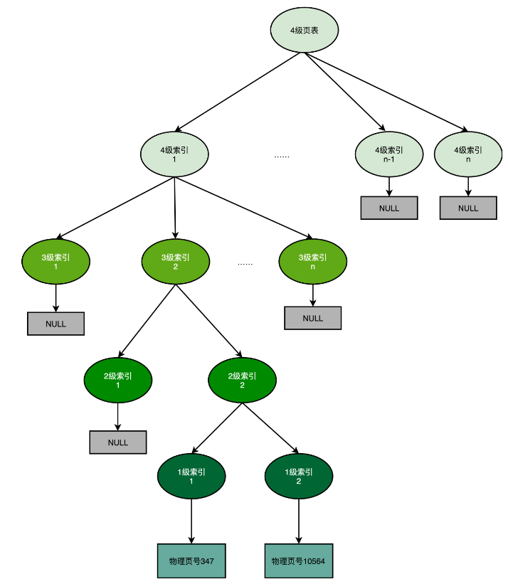

空间开销计算：假如32位地址，12位偏移量，分成 4 级的多级页表来看，每一级如果都用 5 个比特表示。那么每一张页表，只需要 $2^5=32$ 个条目。如果每个条目还是 4 个字节，那么一张页表一共需要 128 个字节。一个 1 级索引表可以映射 32 个页，即 128KB 的大小内存。一个填满的 2 级索引表，对应的就是 32 个 1 级索引表，也就是 4MB 的大小内存空间。

如果一个进程如果占用了 8MB 的内存空间，分成了 2 个 4MB 的连续空间。那么，它只需要 2 个独立的、填满的 2 级索引表，也就意味着 64 个 1 级索引表，2 个独立的 2 级索引表，1 个 3、4 级索引表。一共需要 68 个索引表，每个 128 字节，大概就是 9KB 的空间。比起 4MB 来说，只有差不多 1/500。

多级页表是一个“以时间换空间”的策略，原本进行一次地址转换，只需要访问一次内存就能找到物理页号，算出物理内存地址。但是，用 4 级页表就需要访问 4 次内存，才能找到物理页号了。


#### TLB

“地址转换”是一个非常高频的动作，“地址转换”的性能就变得至关重要了，考虑用加缓存的方法提升性能。

程序所需要使用的指令，都顺序存放在虚拟内存里面。执行指令的时候，也是一条条顺序执行下去的。对于指令地址的访问，存在“空间局部性”和“时间局部性”，而需要访问的数据也是一样的。连续执行 5 条指令，因为内存地址都是连续的，所以这 5 条指令通常都在同一个“虚拟页”里。

因此，这连续 5 次的内存地址转换，其实都来自于同一个虚拟页号，转换的结果自然也就是同一个物理页号。因此使用缓存理论上是可以加速地址转换的。因为“缓存”的访问速度要比内存还快，因此缓存芯片放在了 CPU 里。这块缓存芯片就是**TLB**，即**地址变换高速缓冲**（Translation-Lookaside Buffer）。这块缓存存放了之前已经进行过地址转换的查询结果。这样，当同样的虚拟地址需要进行地址转换的时候，可以直接在 TLB 里面查询结果，而不需要多次访问页表来完成一次转换。

TLB可以分成指令的 TLB 和数据的 TLB，也就是**ITLB**和**DTLB**。也可以根据大小对它进行分级，变成 L1、L2 这样多层的 TLB。

对于TLB，还需要用脏标记的标记位，来实现“写回”这样缓存管理策略。

为了性能，整个内存转换过程要由硬件来执行。在 CPU 芯片里面封装了内存管理单元（MMU，Memory Management Unit）芯片，用来完成地址转换。和 TLB 的访问和交互，都是由这个 MMU 控制的。

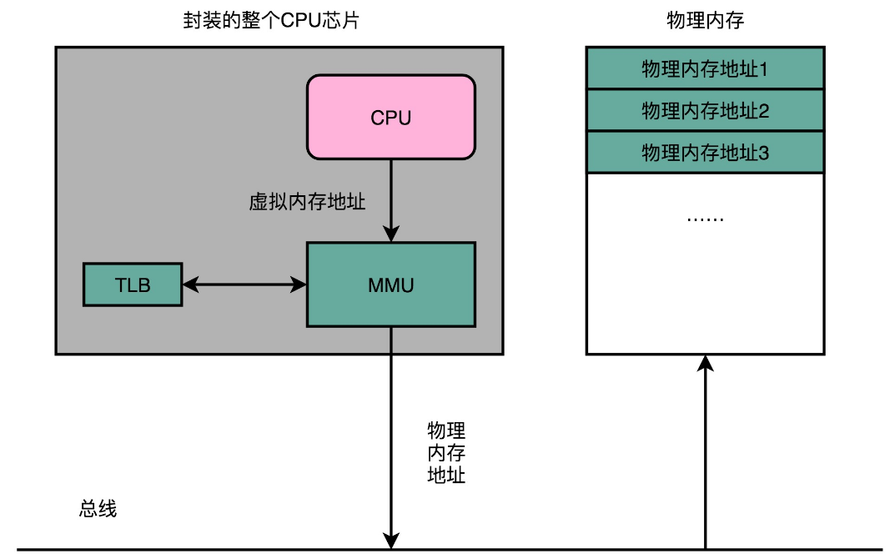


#### 内存保护

**可执行空间保护**（Executable Space Protection）：对于一个进程使用的内存，只把其中的指令部分设置成“可执行”的，对于其他部分，比如数据部分，不给予“可执行”的权限。因为无论是指令，还是数据，在我们的 CPU 看来，都是二进制的数据。我们直接把数据部分拿给 CPU，如果这些数据解码后，也能变成一条合理的指令，其实就是可执行的。

这是为了防止 黑客在程序的数据区里，放入一些要执行的指令编码后的数据，然后找到一个办法，让 CPU 去把它们当成指令去加载，那 CPU 就能执行黑客想要执行的指令了。对进程里内存空间的执行权限进行控制，可以使得 CPU 只能执行指令区域的代码。对于数据区域的内容，即使找到了其他漏洞想要加载成指令来执行，也会因为没有权限而被阻挡掉。

**地址空间布局随机化**（Address Space Layout Randomization）：原先一个进程的内存布局空间是固定的，所以任何第三方很容易就能知道指令在哪里，程序栈在哪里，数据在哪里，堆又在哪里。因此可以很容易去修改特定进程的指令、数据，然后让当前进程去执行这些指令和数据，造成破坏。地址空间布局随机化这个机制，就是让这些区域的位置不再固定，在内存空间随机去分配这些进程里不同部分所在的内存空间地址，让破坏者猜不出来。这时候如果只是随便做点修改，程序只会 crash 掉，而不会去执行计划之外的代码。

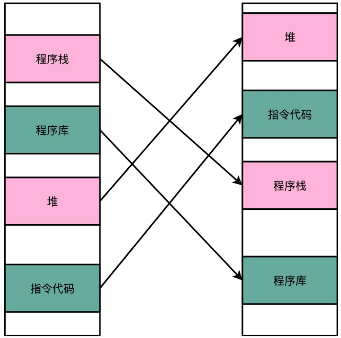


## 层次架构

我们常常把 CPU 比喻成高速运转的大脑，那么和大脑同步的寄存器（Register），就存放着我们当下正在思考和处理的数据。而 L1-L3 的 CPU Cache，好比存放在我们大脑中的短期到长期的记忆。我们需要小小花费一点时间，就能调取并进行处理。

我们自己的书桌书架就好比计算机的内存，能放下更多的书也就是数据，但是找起来和看起来就要慢上不少。而图书馆更像硬盘这个外存，能够放下更多的数据，找起来也更费时间。从寄存器、CPU Cache，到内存、硬盘，这样一层层下来的存储器，速度越来越慢，空间越来越大，价格也越来越便宜。

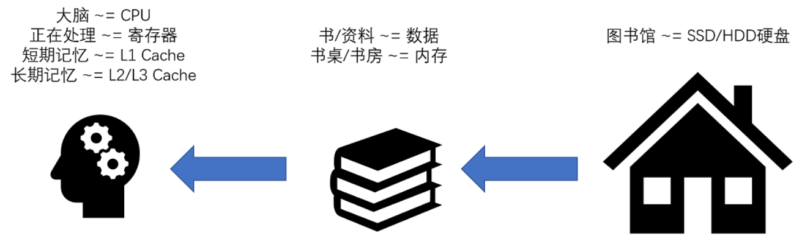

大脑（CPU）中的记忆（L1 Cache），不仅受成本层面的限制，更受物理层面的限制。这就好比 L1 Cache 不仅昂贵，其访问速度和它到 CPU 的物理距离有关。芯片造得越大，总有部分离 CPU 的距离会变远。电信号的传输速度又受物理原理的限制，没法超过光速。所以想要快，并不是靠多花钱就能解决的。

书房和书桌（也就是内存）空间一般是有限的，没有办法放下所有书（也就是数据）。如果想要扩大空间的话，就相当于要多买几平方米的房子，成本就会很高。于是，想要放下更多的书，我们就要寻找更加廉价的解决方案。

要存放更多的书，可以考虑公共图书馆。对于内存来说，**SSD**（Solid-state drive 或 Solid-state disk，固态硬盘）、**HDD**（Hard Disk Drive，硬盘）这些被称为**硬盘**的外部存储设备，就是公共图书馆。于是，我们就可以去家附近的图书馆借书了。图书馆有更多的空间（存储空间）和更多的书（数据）。


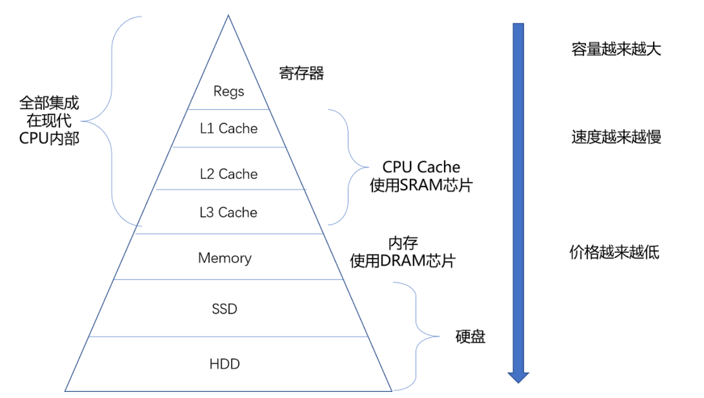

从 Cache、内存，到 SSD 和 HDD 硬盘，一台现代计算机中，就用上了所有这些存储器设备。其中，容量越小的设备速度越快，而且，**CPU 并不是直接和每一种存储器设备打交道，而是每一种存储器设备，只和它相邻的存储设备打交道。**比如，CPU Cache 是从内存里加载而来的，或者需要写回内存，并不会直接写回数据到硬盘，也不会直接从硬盘加载数据到 CPU Cache 中，而是先加载到内存，再从内存加载到 Cache 中。

**这样，各个存储器只和相邻的一层存储器打交道，并且随着一层层向下，存储器的容量逐层增大，访问速度逐层变慢，而单位存储成本也逐层下降，也就构成了存储器层次结构。**


### 推荐阅读

 Jeff Dean 的[*Build Software Systems at Google and Lessons Learned*](https://research.google.com/people/jeff/Stanford-DL-Nov-2010.pdf)。这份 PPT 中介绍了大量的硬件故障、高可用和系统架构的血泪经验。


## 局部性原理

在web应用中，在数据库前添加缓存层可以缓解数据库面临的压力，提升服务端的程序性能。这种策略在什么情况下是有效的呢？

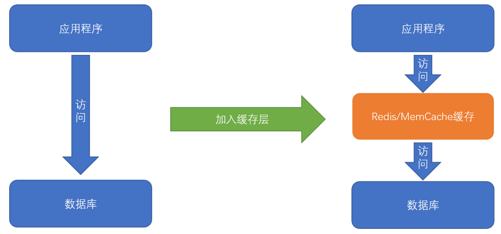

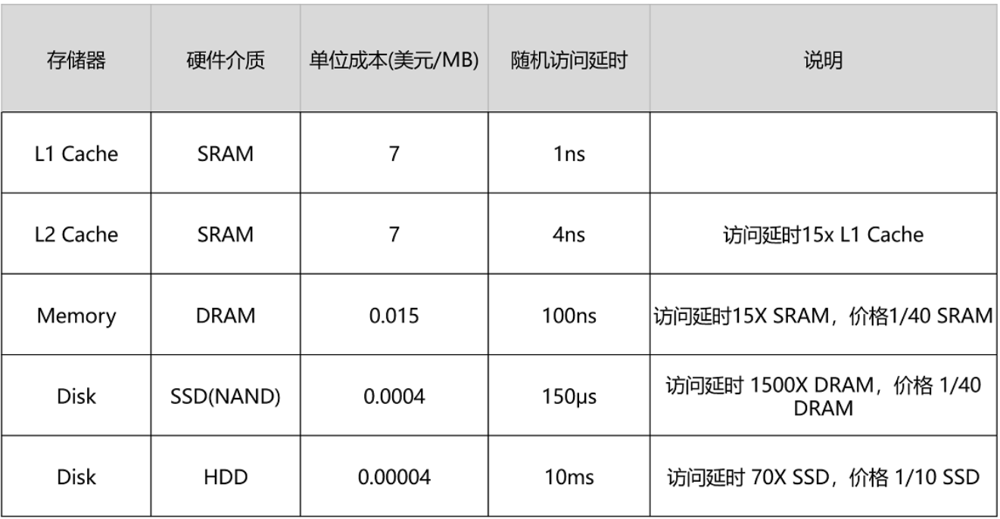

以  Intel 8265U 的 CPU 为例，它的 L1 Cache 只有 256K，L2 Cache 有个 1MB，L3 Cache 有 12MB。一共 13MB 的存储空间，如果按照 7 美元 /1MB 的价格计算，就要 91 美元。

内存有 8GB，容量是 CPU Cache 的 600 多倍，按照表上的价格差不多就是 120 美元。128G 的 SSD 和 1T 的 HDD，现在的价格加起来也不会超过 100 美元。虽然容量是内存的 16 倍乃至 128 倍，但是它们的访问速度却不到内存的 1/1000。

性能和价格的巨大差异带来了一个挑战：**能不能既享受 CPU Cache 的速度，又享受内存、硬盘巨大的容量和低廉的价格呢？**

解决方法是：利用**局部性原理**（Principle of Locality），来制定管理和访问数据的策略。这个局部性原理包括**时间局部性**（temporal locality）和**空间局部性**（spatial locality）这两种策略。

**时间局部性**：如果一个数据被访问了，那么它在短时间内还会被再次访问。

> 在一个电子商务型系统中，如果一个用户打开了 App，看到了首屏。我们推断他应该很快还会再次访问网站的其他内容或者页面，我们就将这个用户的个人信息，从存储在硬盘的数据库读取到内存的缓存中来。这利用的就是时间局部性。

**空间局部性**：如果一个数据被访问了，那么和它相邻的数据也很快会被访问。

> 在访问了数组的首项之后，多半会循环访问它的下一项。因为，在存储数据的时候，数组内的多项数据会存储在相邻的位置。

有了时间局部性和空间局部性，我们不用再把所有数据都放在内存里，也不用都放在 HDD 硬盘上，而是把访问次数多的数据，放在贵但是快一点的存储器里，把访问次数少的数据，放在慢但是大一点的存储器里。这样组合使用内存、SSD 硬盘以及 HDD 硬盘，使得我们可以用最低的成本提供实际所需要的数据存储、管理和访问的需求。


### 应用

假设在维护一个亚马逊这样的电商网站，里面有 6 亿件商品，如果每件商品需要 4MB 的存储空间（考虑到商品图片的话，4MB 已经是一个相对较小的估计了），那么一共需要 $6 亿 × 4MB = 2400TB$ 的数据存储。

如果把数据都放在内存里面，那就需要 $2400TB/1MB × 0.015 美元 = 3600 万$美元。但是，这 6 亿件商品中，不是每一件商品都会被经常访问。比如说，有 Kindle 电子书这样的热销商品，也一定有基本无人问津的商品，比如偏门的缅甸语词典。

如果只在内存里放前 1% 的热门商品，也就是 600 万件热门商品，而把剩下的商品，放在机械式的 HDD 硬盘上，那么，存储成本就下降到$3600 万美元 × 1\% + 2400TB / 1MB × 0.00004 = 45.6$ 万美元，是原来成本的 1.3% 左右。

这里用的就是时间局部性。我们把有用户访问过的数据，加载到内存中，一旦内存里面放不下了，就把最长时间没有在内存中被访问过的数据，从内存中移走，这个就是**LRU**（Least Recently Used）**缓存算法**。热门商品被访问得多，就会始终被保留在内存里，而冷门商品被访问得少，就只存放在 HDD 硬盘上，数据的读取也都是直接访问硬盘。即使加载到内存中，也会很快被移除。越是热门的商品，越容易在内存中找到，也就更好地利用了内存的随机访问性能。

内存的随机访问请求需要 100ns。这也就意味着，在极限情况下，内存可以支持 1000 万次随机访问。我们用了 24TB 内存，如果内存条大小为 8G ，意味着有 3000 条内存，可以支持每秒 $24TB/8GB × 1s/100ns = 300 亿$ 次访问。以亚马逊 2017 年 3 亿的用户数来看，估算每天的活跃用户为 1 亿，这 1 亿用户每人平均会访问 100 个商品，那么平均每秒访问的商品数量，就是 12 万次。

但是如果数据没有命中内存，那么对应的数据请求就要访问到 HDD 磁盘了。一块 HDD 硬盘只能支撑每秒 100 次的随机访问，2400TB 的数据，以 4TB 一块磁盘来计算，有 600 块磁盘，也就是能支撑每秒 $ 2400TB/4TB × 1s/10ms = 6 万$ 次的随机访问。

这就意味着，所有的商品访问请求，都直接到了 HDD 磁盘，HDD 磁盘支撑不了这样的压力。至少要 50% 的缓存命中率，HDD 磁盘才能支撑对应的访问次数。不然的话，要么选择添加更多数量的 HDD 硬盘，做到每秒 12 万次的随机访问，或者将 HDD 替换成 SSD 硬盘，让单个硬盘可以支持更多的随机访问请求。

这里只是一个简单的估算。在实际的应用程序中，查看一个商品的数据可能意味着不止一次的随机内存或者随机磁盘的访问。对应的数据存储空间也不止要考虑数据，还需要考虑维护数据结构的空间，而缓存的命中率和访问请求也要考虑均值和峰值的问题。


