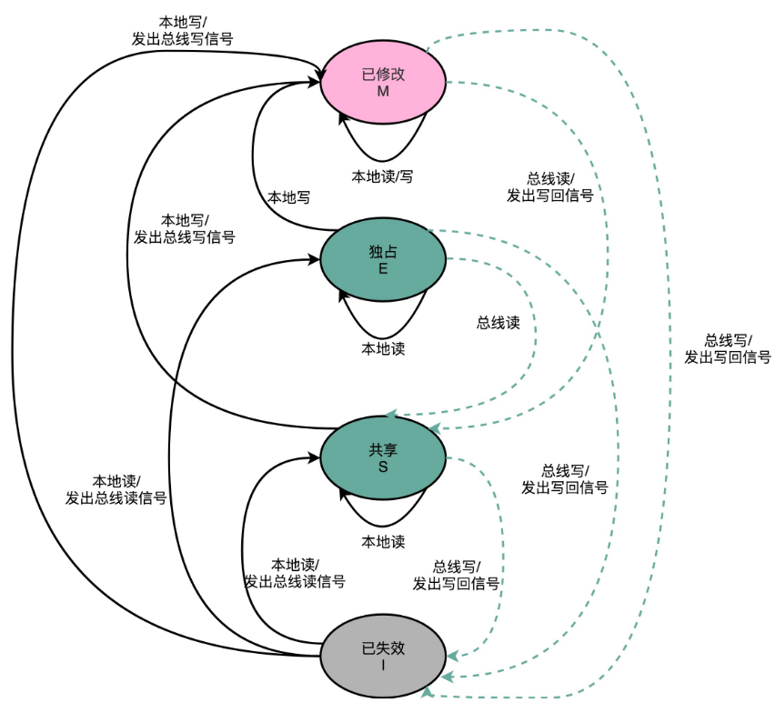

# 数据一致性

## CPU高速缓存

如果我们的数据，在不同的线程或者 CPU 核里面去更新，因为不同的线程或 CPU 核有着自己各自的缓存，很有可能在 A 线程的更新，到 B 线程里面是看不见的。

现在的Intel CPU，通常都是多核的的。每一个 CPU 核里面，都有独立属于自己的 L1、L2 的 Cache，然后再有多个 CPU 核共用的 L3 的 Cache、主内存。

因为 CPU Cache 的访问速度要比主内存快很多，而在 CPU Cache 里面，L1/L2 的 Cache 也要比 L3 的 Cache 快。所以，CPU 始终都是尽可能地从 CPU Cache 中去获取数据，而不是每一次都要从主内存里面去读取数据。

对于数据，我们不光要读，还要去写入修改。**写入 Cache 的性能也比写入主内存要快，写入的数据，到底应该写到 Cache 里还是主内存呢？如果直接写入到主内存里，Cache 里的数据是否会失效呢？**

### 写直达（Write-Through）

写直达是最简单的一种写入策略，在这个策略里，每一次数据都要写入到主内存里面。写入前，会先去判断数据是否已经在 Cache 里面了。如果数据已经在 Cache 里面了，就先把数据写入更新到 Cache 里面，再写入到主内存里面；如果数据不在 Cache 里，就只更新主内存。

写直达的这个策略很直观，但是也很慢。无论数据是不是在 Cache 里面，都需要把数据写到主内存里面。这个方式就有点儿像 `volatile `关键字，始终都要把数据同步到主内存里面。

### 写回（Write-Back）

在写回策略中，不再是每次都把数据写入到主内存，而是只写到 CPU Cache 里。只有当 CPU Cache 里面的数据要被“替换”的时候，才把数据写入到主内存里面去。

写回策略的过程是这样的：如果发现要写入的数据，就在 CPU Cache 里面，那么就只是更新 CPU Cache 里面的数据。同时，会标记 CPU Cache 里的这个 Block 是脏（Dirty）的，即 CPU Cache 里面的这个 Block 的数据，和主内存是不一致的。

如果要写入的数据所对应的 Cache Block 里，放的是别的内存地址的数据，那么就要看一看，那个 Cache Block 里面的数据有没有被标记成脏的。如果是脏的话，要先把这个 Cache Block 里面的数据，写入到主内存里面。然后，再把当前要写入的数据，写入到 Cache 里，同时把 Cache Block 标记成脏的。如果 Block 里面的数据没有被标记成脏的，那么就可以直接把数据写入到 Cache 里面，然后再把 Cache Block 标记成脏的就好了。

写回策略里，如果大量的操作，都能够命中缓存。那么大部分时间里，都不需要读写主内存，性能自然会比写直达好很多。

但是，无论是写回还是写直达，其实都没有解决 **多个线程，或者是多个 CPU 核的缓存一致性的问题。**

### 缓存一致性

因为 CPU 的每个核各有各的缓存，互相之间的操作又是各自独立的，就会带来[**缓存一致性**](https://en.wikipedia.org/wiki/Cache_coherence)（Cache Coherence）的问题。

在这两个 CPU 核心里，1 号核心要写一个数据到内存里。采用写回策略时，先把数据写入到 L2 Cache 里面，然后把 Cache Block 标记成脏的。这个时候，数据其实并没有被同步到 L3 Cache 或者主内存里。1 号核心希望在这个 Cache Block 要被交换出去的时候，数据才写入到主内存里。

如果CPU 只有 1 号核心这一个 CPU 核，那就没有问题。不过，旁边还有一个 2 号核心，这个时候，2 号核心尝试从内存里面去读取 iPhone 的价格，结果读到的是一个错误的价格。这是因为，iPhone 的价格刚刚被 1 号核心更新过。但是这个更新的信息，只出现在 1 号核心的 L2 Cache 里，而没有出现在 2 号核心的 L2 Cache 或者主内存里面。**这个问题，就是所谓的缓存一致性问题，1 号核心和 2 号核心的缓存，在这个时候是不一致的。**

这时就需要一种来同步两个不同核心里面的缓存数据的机制。这个机制要满足以下两点条件：

- **写传播**（Write Propagation）：在一个 CPU 核心里，Cache 数据更新，必须能够传播到其他的对应节点的 Cache Line 里。

- **事务的串行化**（Transaction Serialization）：在一个 CPU 核心里面的读取和写入，在其他的节点看起来，顺序是一样的。

  

  假设同时有多个核心更新同一个数据，3 号核心先收到了 2 号核心的写传播，再收到 1 号核心的写传播。所以 3 号核心看到的 iPhone 价格是先变成了 5000 块，再变成了 6000 块。而 4 号核心是反过来的，先看到变成了 6000 块，再变成 5000 块。虽然写传播是做到了，但是各个 Cache 里面的数据，是不一致的。

  我们需要的是，从 1 号到 4 号核心，都能看到**相同顺序的数据变化**。比如说，都是先变成了 5000 块，再变成了 6000 块。这样，才能称之为实现了事务的串行化。

在 CPU Cache 里做到事务串行化，需要做到两点：

- 一个 CPU 核心对于数据的操作，需要同步通信给到其他 CPU 核心。

  通过**总线嗅探**（Bus Snooping），可以解决多个 CPU 核心之间的数据传播问题。所有的读写请求都通过总线（Bus）广播给所有的 CPU 核心，然后让各个核心去“嗅探”这些请求，再根据本地的情况进行响应。

- 如果两个 CPU 核心里有同一个数据的 Cache，那么对于这个 Cache 数据的更新，需要有一个“锁”的概念。只有拿到了对应 Cache Block 的“锁”之后，才能进行对应的数据更新。

### MESI协议

MESI 协议，是一种叫作**写失效**（Write Invalidate）的协议。在写失效协议里，只有一个 CPU 核心负责写入数据，其他的核心，只是同步读取到这个写入。在这个 CPU 核心写入 Cache 之后，它会去广播一个“失效”请求告诉所有其他的 CPU 核心。其他的 CPU 核心，只是去判断自己是否也有一个“失效”版本的 Cache Block，然后把这个也标记成失效的就好了。

相对于写失效协议，还有一种叫作**写广播**（Write Broadcast）的协议。在写广播协议中，一个写入请求广播到所有的 CPU 核心，同时更新各个核心里的 Cache。写广播在实现上很简单，但是需要占用更多的总线带宽。写失效只需要告诉其他的 CPU 核心，哪一个内存地址的缓存失效了，但是写广播还需要把对应的数据传输给其他 CPU 核心。

MESI 协议的由来，是对 Cache Line 的四个不同的标记：

- M：代表已修改（Modified），即“脏”的 Cache Block，里面的内容已经被更新过了，但是还没有写回到主内存里面。
- E：代表独占（Exclusive）
- S：代表共享（Shared）
- I：代表已失效（Invalidated），数据已经失效了，不可以相信这个 Cache Block 里面的数据。

独占和共享状态下，Cache Block 里面的数据和主内存里面的数据是一致的。它们的区别是：在独占状态下，对应的 Cache Line 只加载到了当前 CPU 核所拥有的 Cache 里。其他的 CPU 核，并没有加载对应的数据到自己的 Cache 里。如果要向独占的 Cache Block 写入数据，可以自由地写入数据，而不需要告知其他 CPU 核。

在独占状态下的数据，如果收到了一个来自于总线的读取对应缓存的请求，它就会变成共享状态。因为另外一个 CPU 核心，也把对应的 Cache Block，从内存里面加载到了自己的 Cache 里来。

在共享状态下，因为同样的数据在多个 CPU 核心的 Cache 里都有。所以，当我们想要更新 Cache 里面的数据的时候，不能直接修改，而是要先向所有的其他 CPU 核心广播一个请求，要求先把其他 CPU 核心里面的 Cache，都变成无效的状态，然后再更新当前 Cache 里面的数据。这个广播操作，一般叫作 **RFO**（Request For Ownership），也就是获取当前对应 Cache Block 数据的所有权。

类似于读写锁，在共享状态下，大家都可以并行去读对应的数据。但是如果要写，就需要通过一个锁，获取当前写入位置的所有权。

整个 MESI 的状态，可以用一个有限状态机来表示它的状态流转。需要注意的是，对于不同状态触发的事件操作，可能来自于当前 CPU 核心，也可能来自总线里其他 CPU 核心广播出来的信号。

