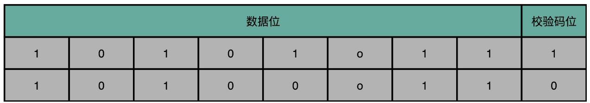
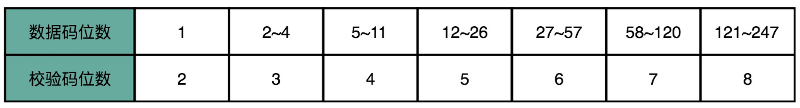
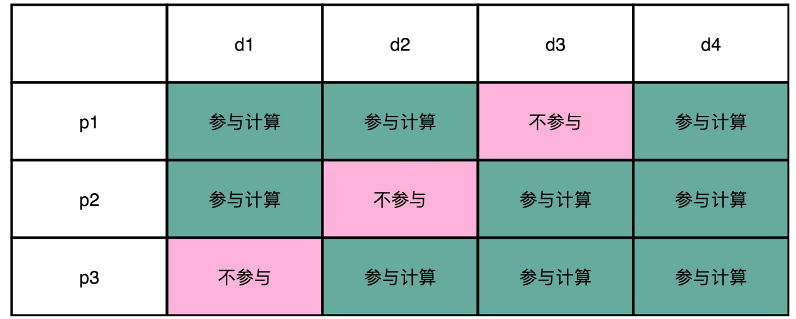
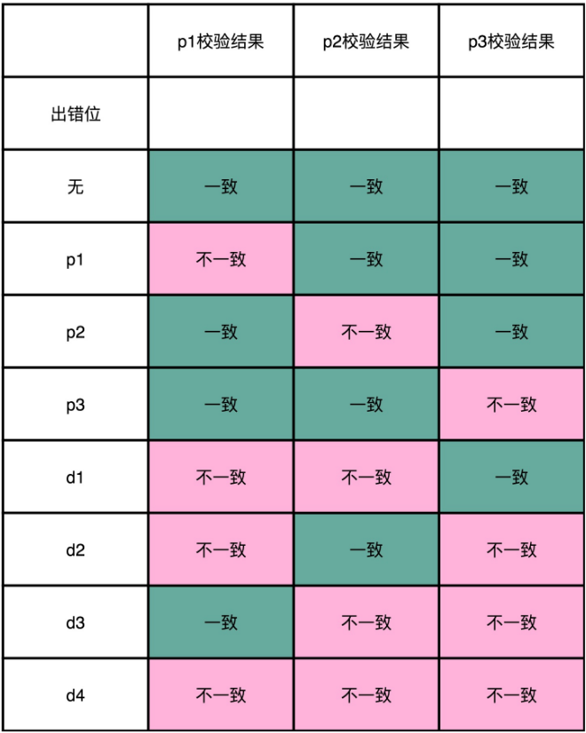
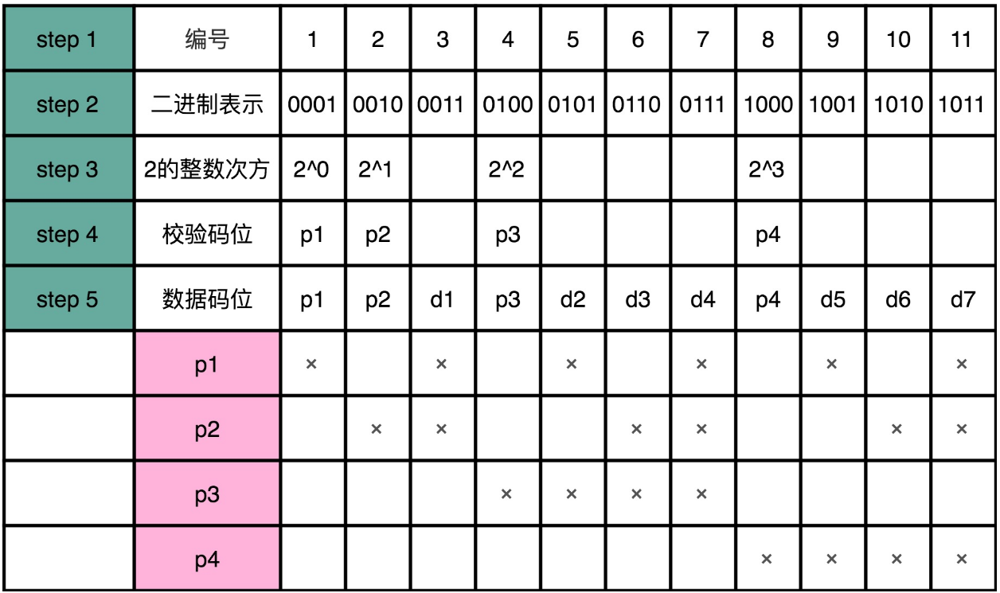

# 数据完整性

使用不带 ECC 纠错的内存条时，可能发生**单比特翻转**这种软件解决不了的硬件错误。假设有个整数字符4，它的ASCII码是`0010 0100`，如果从右往左算第5位发生了翻转，就变成了`0011 0100`，也就是$的ASCII码。

**ECC 内存**的全称是 Error-Correcting Code memory，即**纠错内存**。

内存里面的单比特翻转或者错误，并不是一个特别罕见的现象。无论是因为内存的制造质量造成的漏电，还是外部的射线，都有一定的概率会造成单比特错误。而内存层面的数据出错，软件工程师并不知道，而且这个出错很有可能是随机的。因此必须有方法解决这个问题。

## 奇偶校验

在 ECC 内存发明之前，是通过**奇偶校验**的方式，来发现这些错误的。

奇偶校验的思路很简单：把内存里面的 N 位比特当成是一组，常见的，比如 8 位就是一个字节。然后，用额外的一位去记录，这 8 个比特里面有奇数个 1 还是偶数个 1。如果是奇数个 1，那额外的一位就记录为 1；如果是偶数个 1，那额外的一位就记录成 0。额外的这一位，就称之为**校验码位**。

如果在这个字节里面，不幸发生了单比特翻转，那么数据位计算得到的校验码，就和实际校验位里面的数据不一样。内存就知道出错了。

校验位的计算非常快，往往只需要遍历一遍需要校验的数据，通过一个$ O(N)$ 的时间复杂度的算法，就能把校验结果计算出来。

但是奇偶校验有两个比较大的缺陷：

- 只能解决遇到奇数个位的错误。如果出现 2 个位进行了翻转，那么这个字节的校验位计算结果其实没有变，校验位自然也就不能发现这个错误。
- 只能发现错误，但是不能纠正错误。所以，即使在内存里面发现数据错误了，我们也只能中止程序，而不能让程序继续正常地运行下去。

我们需要一个能够发现更多位的错误，并且能够把这些错误纠正过来的解决方案，这就是 ECC 内存所使用的解决方案。

**纠错码**（Error Correcting Code）：不仅能捕捉到错误，还要能够纠正发生的错误。

**纠删码**（Erasure Code）：纠错码的升级版本，不仅能够纠正错误，还能够在错误不能纠正的时候，直接把数据删除。

无论是 ECC 内存，还是网络传输，乃至硬盘的 RAID，都利用了纠错码和纠删码的相关技术。

## 海明码

海明码是一种纠错码，最基础的海明码叫**7-4 海明码**，这里的“7”指的是实际有效的数据，一共是 7 位（Bit）。而这里的“4”，指的是额外存储了 4 位数据，用来纠错。

> 纠错码的纠错能力是有限的。不是说不管错了多少位，都能纠正过来。不然就不需要那 7 个数据位，只需要那 4 个校验位就好了，这意味着我们可以不用数据位就能传输信息了。这就不科学了。

在 7-4 海明码里面，只能纠正某 1 位的错误。4 位的校验码，一共可以表示 $2^4 = 16$ 个不同的数。根据数据位计算出来的校验值，一定是确定的。所以，如果数据位出错了，计算出来的校验码，一定和确定的那个校验码不同。那可能的值，就是在  那剩下的 $2^4 - 1 = 15$个可能的校验值当中。

15 个可能的校验值，可以对应 15 个可能出错的位。既然我们的数据位只有 7 位，为什么不用 3 位的校验码，$2^3 - 1 = 7$，正好能够对上 7 个不同的数据位。因为单比特翻转的错误，不仅可能出现在数据位，也有可能出现在校验位。校验位本身也是可能出错的。所以，7 位数据位和 3 位校验位，如果只有单比特出错，可能出错的位数就是 10 位，$2^3 - 1 = 7$ 种情况是不能找到具体是哪一位出错的。

> 如果数据位有 K 位，校验位有 N 位。那么只有满足了下面这个不等式，才能确保对单比特翻转的数据纠错。
>
> $K + N + 1 <= 2^N$
>
> 

### 纠错原理

通过**4-3 海明码**（也就是 4 位数据位，3 位校验位）看看海明码的编码方式。把 4 位数据位，分别记作 d1、d2、d3、d4（d: data bits)。把 3 位校验位，分别记作 p1、p2、p3（p:  parity bits）。

从 4 位的数据位里面，拿走 1 位，对剩下的3位 通过奇偶校验的方式 计算出一个对应的校验位。比如，用 d1、d2、d3 来计算出一个校验位 p1；用 d1、d3、d4 计算出一个校验位 p2；用 d2、d3、d4 计算出一个校验位 p3。

如果 d1 这一位的数据出错了，那么 p1 和 p2 的值就和校验的计算结果不一样。d2 出错了，则 p1 和 p3 和 校验的计算结果不一样；d3 出错了，则是因为 p2 和 p3；如果 d4 出错了，则是 p1、p2、p3 都不一样。**当数据码出错的时候，至少会有 2 位校验码的计算是不一致的。**

如果是 p1 的校验码出错了，则只有 p1 的校验结果出错。p2 和 p3 的出错的结果也是一样的。**当校验码出错时，只有一个校验码的计算是不一致的。**

所以校验码不一致，一共有 $2^3-1=7 $种情况，正好对应了 7 个不同的位数的错误。

### 生成方法

1. 先确定编码后，要传输的数据是多少位。比如 7-4 海明码，就是一共 11 位。

2. 给这 11 位数据从左到右进行编号，并且也把它们的二进制表示写出来。

3. 把这 11 个数据中的二进制的整数次幂找出来。在这个 7-4 海明码里面，就是 1、2、4、8。这些数，就是校验码位，把它们记录做 p1～p4。

   从二进制的角度看，它们是这 11 个数当中，唯四的，在 4 个比特里面只有一个比特是 1 的数值。

   剩下的 7 个数，就是 d1-d7 的数据码位了。

4. 计算校验码位的值。p1 用 3、5、7、9、11 来计算。也就是，在二进制表示下，从右往左数的第一位比特是 1 的情况下，用 p1 作为校验码。

   p2，用 3、6、7、10、11 来计算校验码，也就是在二进制表示下，从右往左数的第二位比特是 1 的情况下，用 p2。p3 就是从右往左数，第三位比特是 1 的情况下的数字校验码。而 p4 则是第四位比特是 1 的情况下的校验码。

任何一个数据码出错了，就至少会有对应的两个或者三个校验码对不上，这样就能反过来找到是哪一个数据码出错了。如果校验码出错了，那么只有校验码这一位对不上。

### 海明距离

对于两个二进制表示的数据，它们之间有差异的位数，就称为海明距离。比如 1001 和 0001 的海明距离是 1，因为它们只有最左侧的第一位是不同的。而 1001 和 0000 的海明距离是 2，因为它们最左侧和最右侧有两位是不同的。

所谓的进行一位纠错，也就是所有和我们要传输的数据的海明距离为 1 的数，都能被纠正回来。

而任何两个实际我们想要传输的数据，海明距离都至少要是 3。如果是 2 的话，那么就会有一个出错的数，到两个正确的数据的海明距离都是 1。当我们看到这个出错的数的时候，我们就不知道究竟应该纠正到那一个数了。

