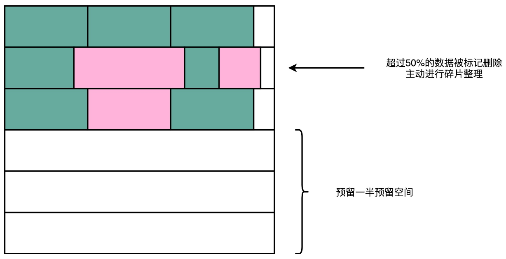

# 磁盘

## 机械硬盘HDD

### 硬件构造

一块机械硬盘是由盘面、磁头和悬臂三个部件组成的。

盘面是实际存储数据的盘片。盘面本身通常是用的铝、玻璃或者陶瓷这样的材质做成的光滑盘片。然后，盘面上有一层磁性的涂层。数据就存储在这个磁性的涂层上。盘面中间有一个受电机控制的转轴，这个转轴会控制盘面旋转。

机械硬盘有一个叫做**转速**的指标，常见的有 5400 转的、7200 转的，乃至 10000 转。这个转速，指的就是盘面中间电机控制的转轴的旋转速度，英文单位叫**RPM**，也就是**每分钟的旋转圈数**（Rotations Per Minute）。所谓 7200 转，其实更准确地说是 7200RPM，指的就是一旦电脑开机供电之后，硬盘就可以一直做到每分钟转上 7200 圈。如果折算到每一秒钟，就是 120 圈。

数据并不能直接从盘面传输到总线上，而是通过**磁头**，从盘面上读取到，然后再通过电路信号传输给控制电路、接口，再到总线上的。

通常，一个盘面上会有两个磁头，分别在盘面的正反面。盘面在正反两面都有对应的磁性涂层来存储数据，而且一块硬盘也不是只有一个盘面，而是上下堆叠了很多个盘面，各个盘面之间是平行的。每个盘面的正反两面都有对应的磁头。

**悬臂**链接在磁头上，并且在一定范围内会去把磁头定位到盘面的某个特定的**磁道**（Track）上。

> 一个盘面通常是圆形的，由很多个同心圆组成，就好像是一个个大小不一样的“甜甜圈”嵌套在一起。每一个“甜甜圈”都是一个磁道。每个磁道都有自己的一个编号。悬臂其实只是控制，到底是读最里面那个“甜甜圈”的数据，还是最外面“甜甜圈”的数据。

### 数据读取

一个磁道会分成多个**扇区**（Sector）。上下平行的一个个盘面的相同扇区，叫作一个**柱面**（Cylinder）。

读取数据，其实就是两个步骤：

- 第一步，把盘面旋转到某一个位置。在这个位置上，悬臂可以定位到整个盘面的某一个子区间。这个子区间的形状有点儿像一块披萨饼，我们一般把这个区间叫作**几何扇区**（Geometrical Sector），意思是，在“几何位置上”，所有这些扇区都可以被悬臂访问到。
- 第二步，把悬臂移动到特定磁道的特定扇区，也就在这个“几何扇区”里面，找到实际的扇区。找到之后，磁头就会落下，就可以读取到正对着扇区的数据。

所以，进行一次硬盘上的随机访问，需要的时间由两个部分组成：

- **平均延时**（Average Latency）：盘面旋转，把几何扇区对准悬臂位置的时间。这个时间很容易计算，它其实就和机械硬盘的转速相关。随机情况下，平均找到一个几何扇区，我们需要旋转半圈盘面。对于 7200 转的硬盘，一秒内可以旋转 240 个半圈。那么，这个平均延时就是$1s / 240 = 4.17ms$。
- **平均寻道时间**（Average Seek Time）：在盘面旋转后，悬臂定位到扇区的的时间。现在用的 HDD 硬盘的平均寻道时间一般在 4-10ms。

这样，如果随机在整个硬盘上找一个数据，需要 8-14 ms。机械硬盘只有一个电机转轴，也只有一个悬臂，所以没有办法并行地去定位或者读取数据。对于一块 7200 转的硬盘，一秒钟随机的 IO 访问次数，也就是 $1s / 14ms = 70 IOPS$到$1s / 8 ms = 125 IOPS$ 。

> 如果不是进行随机的数据访问，而是进行顺序的数据读写，应该怎么最大化读取效率？
>
> 我们可以选择把顺序存放的数据，尽可能地存放在同一个柱面上。这样，我们只需要旋转一次盘面，进行一次寻道，就可以去写入或者读取，同一个垂直空间上的多个盘面的数据。如果一个柱面上的数据不够，尽量不动悬臂，而是通过电机转动盘面，这样就可以顺序读完一个磁道上的所有数据。所以，对于 HDD 硬盘的顺序数据读写，吞吐率还是很不错的，可以达到 200MB/s 左右。

### Partial Stroking

只有 100 的 IOPS，很难满足现在互联网海量高并发的请求。但是在20年前，SSD的成本还很高，数据库里面的数据，只能存放在 HDD 硬盘上。

既然访问一次数据的时间，是“平均延时 + 寻道时间”，那么只要能缩短这两个之一，就可以提升 IOPS 了。一般情况下，硬盘的寻道时间都比平均延时要长。那么有什么办法可以缩短平均的寻道时间。最极端的办法就是不需要寻道，也就是把所有数据都放在一个磁道上。比如，我们始终把磁头放在最外道的磁道上。这样，寻道时间就基本为 0，访问时间就只有平均延时了。那样， IOPS就变成了$1s / 4ms = 250 IOPS$。

但是只用一个磁道，我们能存的数据就比较有限了。这个时候，可能还不如把这些数据直接都放到内存里面。所以，实践当中，可以只用 1/2 或者 1/4 的磁道，也就是最外面 1/4 或者 1/2 的磁道。这样，硬盘可以使用的容量可能变成了 1/2 或者 1/4。但是寻道时间，也变成了 1/4 或者 1/2，因为悬臂需要移动的“行程”也变成了原来的 1/2 或者 1/4，IOPS 就能够大幅度提升了。

这就是**Partial Stroking**或者**Short Stroking**，即“**缩短行程**”技术。

一块 7200 转的硬盘，正常情况下，平均延时是 4.17ms，而寻道时间是 9ms。那么，它原本的 IOPS 就是$1s / (4.17ms + 9ms) = 75.9 IOPS$。

如果只用其中 1/4 的磁道，那么，它的 IOPS 就变成了$1s / (4.17ms + 9ms/4) = 155.8 IOPS$。

IOPS 提升了一倍，和一块 15000 转的硬盘的性能差不多了。虽然硬盘能用的空间也只有原来的 1/4 了，但是在当时，同样容量的 15000 转的硬盘的价格不止是 7200 转硬盘的 4 倍啊。所以，这样通过软件去格式化硬盘，只保留部分磁道让系统可用的情况，可以大大提升硬件的性价比。

## 固态硬盘SSD

SSD 没有像HDD那样的寻道过程，所以它的随机读写都更快。但是耐用性不如HDD，如果需要频繁地重复写入删除数据，那么HDD要比 SSD 性价比高很多。

### 读写原理

CPU Cache 用的 SRAM 是用一个电容来存放一个比特的数据。对于 SSD 硬盘，可以先简单地认为，它是由一个电容加上一个电压计组合在一起，记录了一个或者多个比特。

#### SLC、MLC、TLC 和 QLC

能够记录一个比特很容易理解，给电容里面充上电有电压的时候就是 1，给电容放电里面没有电就是 0。采用这样方式存储数据的 SSD 硬盘，一般称之为**使用了 SLC 的颗粒**，全称是 Single-Level Cell，也就是一个存储单元中只有一位数据。

但是，这样的方式会遇到和 CPU Cache 类似的问题，即同样的面积下，能够存放下的元器件是有限的。如果只用 SLC，我们就会遇到，存储容量上不去，并且价格下不来的问题。于是，硬件工程师们就陆续发明了**MLC**（Multi-Level Cell）、**TLC**（Triple-Level Cell）以及**QLC**（Quad-Level Cell），也就是能在一个电容里面存下 2 个、3 个乃至 4 个比特。

4 个比特一共可以从 0000-1111 表示 16 个不同的数。那么，如果往电容里面充电的时候，能充上 15 个不同的电压，并且电压计能够区分出这 15 个不同的电压。加上电容被放空代表的 0，就能够代表从 0000-1111 这样 4 个比特了。

不过，要想表示 15 个不同的电压，充电和读取的时候，对于精度的要求就会更高。这会导致充电和读取的时候都更慢，所以 QLC 的 SSD 的读写速度，要比 SLC 的慢上好几倍。

#### P/E 擦写问题

和其他的 I/O 设备一样，SSD 有对应的**接口和控制电路**。现在的 SSD 硬盘用的是 SATA 或者 PCI Express 接口。在控制电路里，有一个很重要的模块，叫作**FTL**（Flash-Translation Layer），也就是**闪存转换层**。这是 SSD 硬盘的一个核心模块，SSD 硬盘性能的好坏，很大程度上也取决于 FTL 的算法好不好。

SSD的**实际 I/O 设备**，和机械硬盘很像。现在大容量 SSD 硬盘都是 3D 封装的，即是由很多个裸片（Die）叠在一起的，就好像机械硬盘把很多个盘面（Platter）叠放在一起一样，这样可以在同样的空间下放下更多的容量。

一张裸片上可以放多个**平面**（Plane），一般一个平面上的存储容量大概在 GB 级别。一个平面上面，会划分成很多个块（Block），一般一个块（Block）的存储大小， 通常几百 KB 到几 MB 大小。一个块里面，还会区分很多个页（Page），和内存里面的页一样，一个页的大小通常是 4KB。

在这一层一层的结构里面，处在最下面的两层块和页非常重要。

对于 SSD 硬盘来说，数据的**写入**叫作 Program。写入不能像机械硬盘一样，通过**覆写**（Overwrite）来进行的，而是要先去**擦除**（Erase），然后再写入。

SSD 的读取和写入的基本单位，不是一个比特（bit）或者一个字节（byte），而是一个**页**（Page）。SSD 的擦除单位就更夸张了，我们不仅不能按照比特或者字节来擦除，连按照**页**来擦除都不行，**必须按照块来擦除**。

而且，SSD 的使用寿命，是每一个块（Block）的擦除的次数。

> 把 SSD 硬盘的一个平面看成是一张白纸。我们在上面写入数据，就好像用铅笔在白纸上写字。如果想要把已经写过字的地方写入新的数据，我们先要用橡皮把已经写好的字擦掉。但是，如果频繁擦同一个地方，那这个地方就会破掉，之后就没有办法再写字了。

SLC 的芯片，可以擦除的次数大概在 10 万次，MLC 就在 1 万次左右，而 TLC 和 QLC 就只在几千次了。这也是为什么同样容量的SSD 硬盘的价格差别很大，因为它们的芯片颗粒和寿命完全不一样。

#### 读写的生命周期

接下来用三种颜色分别来表示 SSD 硬盘里面的页的不同状态：

- 白色代表这个页从来没有写入过数据
- 绿色代表里面写入的是有效的数据
- 红色代表里面的数据，在操作系统看来已经是删除的

一开始，所有块的每一个页都是白色的。开始往里面写数据后，里面的有些页就变成了绿色。

然后，因为我们删除了硬盘上的一些文件，所以有些页变成了红色。但是这些红色的页，并不能再次写入数据。因为 SSD 硬盘不能单独擦除一个页，必须一次性擦除整个块，所以新的数据，只能往后面的白色页里面写。这些散落在各个绿色空间里面的红色空洞，就好像硬盘碎片。

如果有哪一个块的数据页全被标红了，那就可以把整个块进行擦除。它就又会变成白色，可以重新一页一页往里面写数据。这种情况其实也会经常发生。毕竟一个块不大，也就在几百 KB 到几 MB。删除一个几 MB 的文件，数据又是连续存储的，自然会导致整个块可以被擦除。

随着硬盘里面的数据越来越多，红色空洞占的地方也会越来越多。于是，我们就要没有白色的空页去写入数据了。这个时候，就要做一次类似于 Windows 里面“磁盘碎片整理”的工作。找一个红色空洞最多的块，把里面的绿色数据，挪到另一个块里面去，然后把整个块擦除，变成白色，可以重新写入数据。

不过，这个“磁盘碎片整理”的工作，不能太主动、太频繁地去做，因为 SSD 的擦除次数是有限的。如果动不动就搞个磁盘碎片整理，那么 SSD 硬盘很快就会报废了。

由于总是有红色空洞的存在，一块 SSD 硬盘容量，是没办法完全用满的。但这不代表可用空间达不到 厂商卖给消费者时标明的容量。因为生产 SSD 硬盘的厂商，会预留一部分空间，专门用来做“磁盘碎片整理”工作的。一块标成 240G 的 SSD 硬盘，往往实际有 256G 的硬盘空间。SSD 硬盘通过控制芯片电路，把多出来的硬盘空间，用来进行各种数据的闪转腾挪，让消费者能够写满那 240G 的空间。这个多出来的 16G 空间，叫作**预留空间**（Over Provisioning），一般 SSD 的硬盘的预留空间都在 7%-15% 左右。

### 磨损均衡、TRIM 和写入放大效应

我们日常使用 PC 进行软件开发的时候，会先在硬盘上装上操作系统和常用软件，比如 Office 和 VS Code、Goland这样的集成开发环境。这些软件所在的块，写入一次之后，就不太会擦除了，所以就只有读的需求。

而在开发过程中，我们会不断添加新的代码文件，还会不断修改已经有的代码文件。因为 SSD 硬盘没有覆写（Override）的功能，所以，这个过程中，一直是在反复地写入新的文件，然后再把原来的文件标记成逻辑上删除的状态。等 SSD 里面空的块少了，用“垃圾回收”的方式，进行擦除。这样，对块的擦除会反复发生在这些用来存放数据的地方。

有一天，这些块的擦除次数到了，变成了坏块。但是，安装操作系统和软件的地方还没有坏，而这块硬盘的可以用的容量却变小了。

#### FTL 和磨损均衡

为了不让这些坏块太早就出现，考虑匀出一些存放操作系统的块的擦写次数，给存放数据的块。这种 让 SSD 硬盘各个块的擦除次数，均匀分摊到各个块上 的策略，就叫作**磨损均衡**（Wear-Leveling）。实现这个技术的核心办法，就是添加一个间接层FTL，即**闪存转换层**。

就像管理内存的时候，通过一个页表映射虚拟内存页和物理页一样，在 FTL 里面，存放了**逻辑块地址**（Logical Block Address，简称 LBA）到**物理块地址**（Physical Block Address，简称 PBA）的映射。

操作系统访问的硬盘地址，其实都是逻辑地址。只有通过 FTL 转换之后，才会变成实际的物理地址，找到对应的块进行访问。操作系统本身，不需要去考虑块的磨损程度，只要和操作机械硬盘一样来读写数据就好了。

操作系统所有对于 SSD 硬盘的读写请求，都要经过 FTL。FTL 里面又有逻辑块对应的物理块，所以 FTL 能够记录下来，每个物理块被擦写的次数。如果一个物理块被擦写的次数多了，FTL 就可以将这个物理块，挪到一个擦写次数少的物理块上。但是，逻辑块不用变，操作系统也不需要知道这个变化。

> 这也是设计大型系统中的一个典型思路：各层之间是隔离的，操作系统不需要考虑底层的硬件是什么，完全交由硬件的控制电路里面的 FTL，来管理对于实际物理硬件的写入。

#### TRIM 指令的支持

在删除文件的时候，操作系统只是将文件对应的inode里面的元信息清理掉，这代表这个 inode 还可以继续使用，可以写入新的数据。这个时候，实际物理层面的对应的存储空间，在操作系统里面被标记成可以写入了。

这个删除的逻辑在机械硬盘层面没有问题，因为文件被标记成可以写入，后续的写入可以直接覆写这个位置。但是，在 SSD 硬盘上就不一样了。

一开始，操作系统里面有好几个文件，不同的文件用不同的颜色标记。在SSD 的逻辑块视图中，也用同样的颜色标记文件占用的对应页。

当我们在操作系统里面，删除掉一个刚刚下载的文件，比如标记成黄色 openjdk.exe，在操作系统里面，对应的 inode 里面，就没有文件的元信息。

但是，这个时候，SSD 的逻辑块层面，其实并不知道这个事情。所以在逻辑块层面，openjdk.exe 仍然是占用了对应的空间。对应的物理页，也仍然被认为是被占用了的。

这个时候，如果对 SSD 进行垃圾回收操作，openjdk.exe 对应的物理页，仍然要在这个过程中，被搬运到其他的 Block 里面去。只有当操作系统，再在刚才的 inode 里面写入数据的时候，才会知道原来这些黄色的页，其实都已经没有用了，才会把它标记成废弃掉。

所以，在使用 SSD 的硬盘情况下，操作系统对于文件的删除，SSD 硬盘其实并不知道。这就导致为了磨损均衡，很多时候在都在搬运很多已经删除了的数据，产生很多不必要的数据读写和擦除，既消耗了 SSD 的性能，也缩短了 SSD 的使用寿命。

为了解决这个问题，现在的操作系统和 SSD 的主控芯片，都支持**TRIM 命令。**这个命令可以在文件被删除的时候，让操作系统去通知 SSD 硬盘，对应的逻辑块已经标记成已删除了。

#### 写入放大

TRIM 命令的发明，也反应了一个使用 SSD 硬盘的问题：SSD 硬盘容易越用越慢。

当 SSD 硬盘的存储空间被占用得越来越多，每一次写入新数据，我们都可能没有足够的空白，可能不得不去进行垃圾回收，合并一些块里面的页，然后再擦除掉一些块，才能匀出一些空间来。

这个时候，从应用层或者操作系统层面来看，我们可能只是写入了一个 4KB 或者 4MB 的数据。但是，实际通过 FTL 之后，可能要去搬运 8MB、16MB 甚至更多的数据。

“**实际的闪存写入的数据量 / 系统通过 FTL 写入的数据量 = 写入放大**”，写入放大的倍数越多，意味着实际的 SSD 性能也就越差，会远远比不上实际 SSD 硬盘标称的指标。

解决写入放大，需要在后台定时进行垃圾回收，在硬盘比较空闲的时候，就把搬运数据、擦除数据、留出空白的块的工作做完，而不是等实际数据写入的时候，再进行这样的操作。

### AeroSpike 

如果我们只是简单地拿一块 SSD 硬盘替换掉原来的 HDD 硬盘，而不是从应用层面考虑任何 SSD 硬盘特性的话，我们多半没法获得想要的性能提升。

AeroSpike 是一个专门针对 SSD 硬盘特性设计的 Key-Value 数据库（键值对数据库），它通过以下技巧利用SSD 的物理特性：

- AeroSpike 操作 SSD 硬盘，并没有通过操作系统的文件系统，而是直接操作 SSD 里面的块和页。因为操作系统里面的文件系统，对于 KV 数据库来说，只是多了一层间接层，只会降低性能。

- AeroSpike 在读写数据的时候，做了两个优化。

  在写入数据的时候，AeroSpike 尽可能去写一个较大的数据块，而不是频繁地去写很多小的数据块。这样，硬盘就不太容易频繁出现磁盘碎片。并且，一次性写入一个大的数据块，也更容易利用好顺序写入的性能优势。AeroSpike 写入的一个数据块，是 128KB，远比一个页的 4KB 要大得多。

  在读取数据的时候，AeroSpike 可以读取 512 字节（Bytes）这样的小数据。因为 SSD 的随机读取性能很好，也不像写入数据那样有擦除寿命问题。而且，很多时候我们读取的数据是键值对里面的值的数据，这些数据要在网络上传输。如果一次性必须读出比较大的数据，就会导致网络带宽不够用。

- 持续地进行磁盘碎片整理。AeroSpike 用了高水位（High Watermark）算法，一旦一个物理块里面的数据碎片超过 50%，就把这个物理块搬运压缩，然后进行数据擦除，确保磁盘始终有足够的空间可以写入。
- 为了保障数据库的性能，建议只用到 SSD 硬盘标定容量的一半。即人为地给 SSD 硬盘预留了 50% 的预留空间，以确保 SSD 硬盘的写放大效应尽可能小，不会影响数据库的访问性能。

因为 AeroSpike 是一个对于响应时间要求很高的实时 KV 数据库，如果出现了严重的写放大效应，会导致写入数据的响应时间大幅度变长。而上面的后两点优化有效地解决了这个问题。

