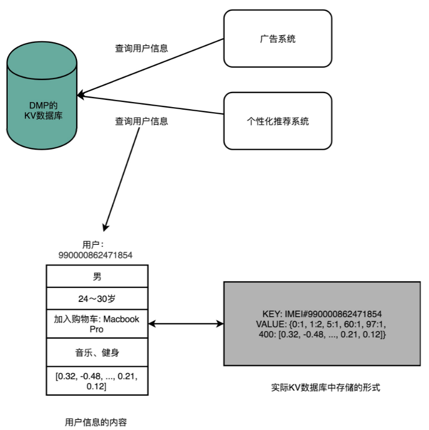
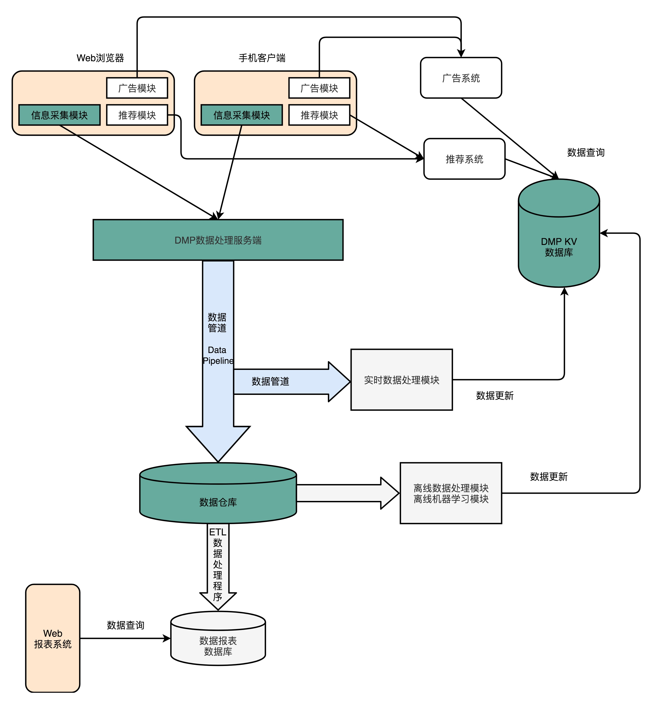
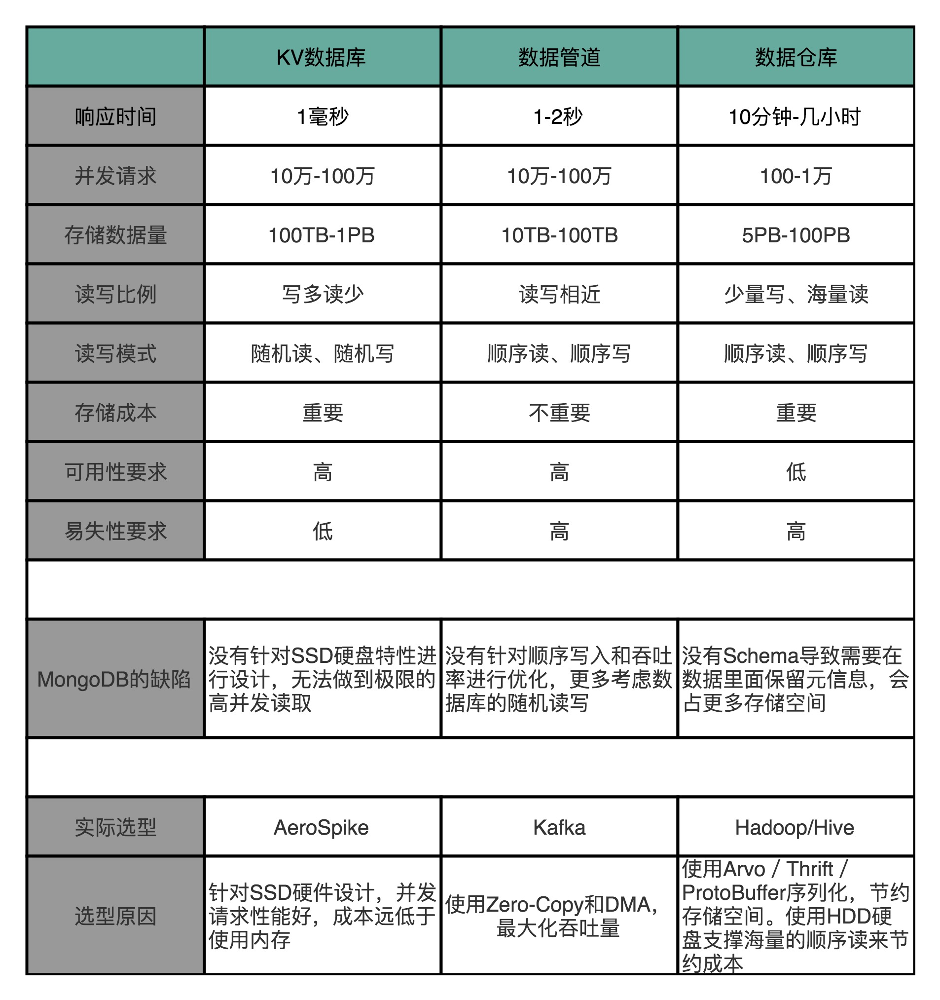
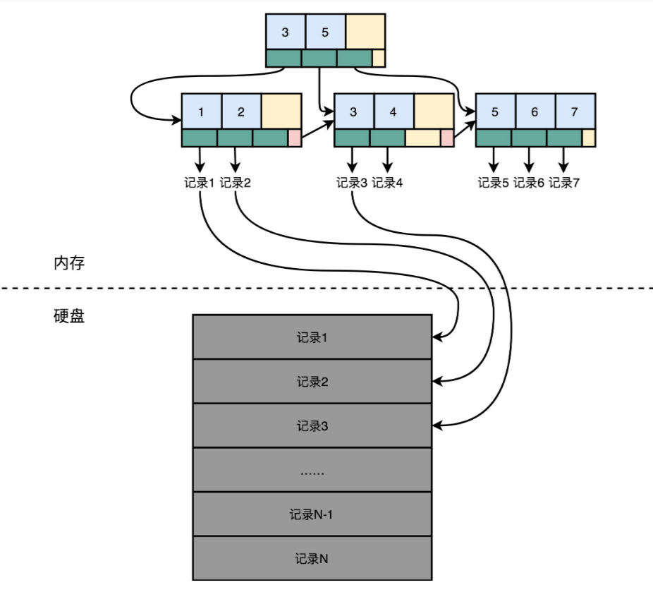
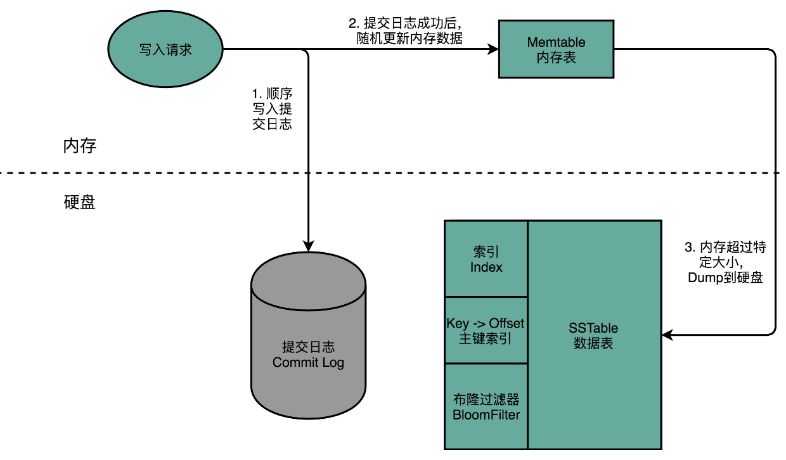
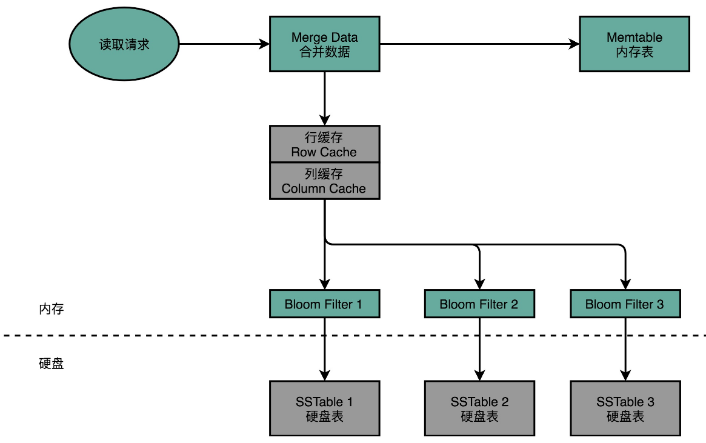

# DMP系统

DMP 系统全称是数据管理平台（Data Management Platform），目前广泛应用在互联网的广告定向（Ad Targeting）、个性化推荐（Recommendation）这些领域。

通常来说，DMP 系统会通过处理海量的互联网访问数据以及机器学习算法，给一个用户标注上各种各样的标签。然后，在我们做个性化推荐和广告投放的时候，再利用这些这些标签，去做实际的广告排序、推荐等工作。无论是 Google 的搜索广告、淘宝里千人千面的商品信息，还是抖音里面的信息流推荐，背后都会有一个 DMP 系统。

## 设计要求

对于外部使用 DMP 的系统或者用户来说，可以简单地把 DMP 看成是一个键 - 值对（Key-Value）数据库。广告系统或者推荐系统，可以通过一个客户端输入用户的唯一标识（ID），然后拿到这个用户的各种信息。

这些信息中，有些是用户的人口属性信息（Demographic），比如性别、年龄；有些是非常具体的行为（Behavior），比如用户最近看过的商品是什么，用户的手机型号是什么；有一些是通过算法系统计算出来的兴趣（Interests），比如用户喜欢健身、听音乐；还有一些则是完全通过机器学习算法得出的用户向量，给后面的推荐算法或者广告算法作为数据输入。

因此，对DMP系统有以下要求：

- **低响应时间**（Low Response Time）：一般的广告系统留给整个广告投放决策的时间也就是 10ms 左右，所以对于访问 DMP 获取用户数据，预期的响应时间都在 1ms 之内。
- **高可用性**（High Availability）：DMP 常常用在广告系统里面，DMP 系统出问题，往往就意味着整个的广告收入在不可用的时间就没了，所以对于可用性的追求可谓是没有上限的。
- **高并发**（High Concurrency）：以广告系统为例，如果每天需要响应 100 亿次的广告请求，那么每秒的并发请求数就在 $100 亿 / (86400) \approx 12K $次左右，所以 DMP 需要支持高并发。
- **海量数据**（Big Data）：如果产品针对中国市场，那么需要有 10 亿个 Key，对应的假设每个用户有 500 个标签，标签有对应的分数。标签和分数都用一个 4 字节（Bytes）的整数来表示，那么一共需要 $10 亿 x 500 x (4 + 4) Bytes = 400 TB$ 的数据。
- **低成本**（Affordable Cost）：从广告系统的角度来考虑。广告系统的收入通常用 CPM（Cost Per Mille），也就是千次曝光来统计。如果千次曝光的利润是 \$0.1，那么每天 100 亿次的曝光就是 100 万美元的利润。那么DMP 每 1000 次的请求的成本不能超过 \$0.10。最好只有 ​\$0.01，甚至更低，这样才能尽可能多赚到一点广告利润。

虽然从外部看起来，DMP 特别简单，就是一个 KV 数据库，但是实际上这个数据库需要做的事情更多。

主要关心蓝色的数据管道、绿色的数据仓库和 KV 数据库。为了能够生成这个 KV 数据库，我们需要有一个在客户端或者 Web 端的数据采集模块，不断采集用户的行为，向后端的服务器发送数据。服务器端接收到数据，就要把这份数据放到一个**数据管道**（Data Pipeline）里面。数据管道的下游，需要实际将数据落地到**数据仓库**（Data Warehouse），把所有的这些数据结构化地存储起来。后续可以通过程序去分析这部分日志，生成报表或者或者利用数据运行各种机器学习算法。

除了这个数据仓库之外，还会有一个实时数据处理模块（Realtime Data Processing），也放在数据管道的下游。它同样会读取数据管道里面的数据，去进行各种实时计算，然后把需要的结果写入到 DMP 的 KV 数据库里面去。

## MongoDB?

MongoDB 的设计听起来特别厉害，不需要预先数据 Schema，访问速度很快，还能够无限水平扩展。作为 KV 数据库，我们可以把 MongoDB 当作 DMP 里面的 KV 数据库；除此之外，MongoDB 还能水平扩展、跑 MQL，我们可以把它当作数据仓库来用。至于数据管道，只要我们能够不断往 MongoDB 里面，插入新的数据就好了。从运维的角度来说，只需要维护一种数据库，技术栈也变得简单了。

所有的软件系统，都有它的适用场景，想通过一种解决方案适用三个差异非常大的应用场景，显然既不合理，又不现实。

接下来看看**数据管道**和**数据仓库**的性能取舍。

对于数据管道来说，我们需要的是高吞吐量，它的并发量虽然和 KV 数据库差不多，但是在响应时间上，要求就没有那么严格了，1-2 秒甚至再多几秒的延时都是可以接受的。而且，和 KV 数据库不太一样，数据管道的数据读写都是顺序读写，没有大量的随机读写的需求。

**数据仓库**就更不一样了，数据仓库的数据读取的量要比管道大得多。管道的数据读取就是我们当时写入的数据，如果一天有 10TB 日志数据，管道只会写入 10TB。下游的数据仓库存放数据和实时数据模块读取的数据，再加上个 2 倍的 10TB，也就是 20TB 也就够了。

但是，数据仓库的数据分析任务要读取的数据量就大多了。一方面，我们可能要分析一周、一个月乃至一个季度的数据。这一次分析要读取的数据可不是 10TB，而是 100TB 乃至 1PB。而且我们一天在数据仓库上跑的分析任务也不是 1 个，而是成千上万个，所以数据的读取量是巨大的。另一方面，我们存储在数据仓库里面的数据，也不像数据管道一样，存放几个小时、最多一天的数据，而是往往要存上 3 个月甚至是 1 年的数据。所以，我们需要的是 1PB 乃至 5PB 这样的存储空间。

下表展示了不同应用场景的需求及为什么 MongoDB 在这三个应用场景都不合适。

在 KV 数据库的场景下，需要支持高并发。那么 MongoDB 需要把更多的数据放在内存里面，但是这样存储成本就会特别高了。

在数据管道的场景下，需要的是大量的顺序读写，而 MongoDB 则是一个文档数据库系统，并没有为顺序写入和吞吐量做过优化，看起来也不太适用。

在数据仓库的场景下，主要的数据读取时是顺序读取，并且需要海量的存储。MongoDB 这样的文档式数据库也没有为海量的顺序读做过优化，仍然不是一个最佳的解决方案。而且文档数据库里总是会有很多冗余的字段的元数据，还会浪费更多的存储空间。

## 关系型数据库？

如果要实现一个最简单的关系型数据库，最简单最直观的想法就是，用一个 CSV 文件格式。一个文件就是一个数据表，文件里面的每一行就是这个表里面的一条记录。如果要修改数据库里面的某一条记录，那么要先找到这一行，然后直接去修改这一行的数据。读取数据也是一样的。

要找到这样数据，最笨的办法自然是一行一行读，也就是遍历整个 CSV 文件。相当于随便读取任何一条数据都要扫描全表，太浪费硬盘的吞吐量了。可以加一个索引提升查找速度。

索引里面没有一整行的数据，只有一个映射关系，这个映射关系可以让行号直接从硬盘的某个位置去读。所以，索引比起数据小很多。可以把索引加载到内存里面。即使不在内存里面，要找数据的时候快速遍历一下整个索引，也不需要读太多的数据。

加了索引之后，要读取特定的数据，就不用去扫描整个数据表文件了。直接从特定的硬盘位置，就可以读到想要的行。索引不仅可以索引行号，还可以索引某个字段。我们可以创建很多个不同的独立的索引。写 SQL 的时候，where 子句后面的查询条件可以用到这些索引。

不过，这样会使写入数据的时候麻烦一些。我们不仅要在数据表里面写入数据，对于所有的索引也都需要进行更新。这个时候，写入一条数据就要触发好几个随机写入的更新。

在这样一个数据模型下，查询操作很灵活。无论是根据哪个字段查询，只要有索引，就可以通过一次随机读，很快地读到对应的数据。但是，这个灵活性也带来了一个很大的问题，那就是无论干点什么，都有大量的随机读写请求。而随机读写请求，如果请求最终是要落到硬盘上，特别是 HDD 硬盘的话，就很难做到高并发了。毕竟 HDD 硬盘只有 100 左右的 QPS。

而这个随时添加索引，可以根据任意字段进行查询，这样表现出的灵活性，又是 DMP 系统里面不太需要的。DMP 的 KV 数据库主要的应用场景，是根据主键的随机查询，不需要根据其他字段进行筛选查询。数据管道的需求，则只需要不断追加写入和顺序读取就好了。即使进行数据分析的数据仓库，通常也不是根据字段进行数据筛选，而是全量扫描数据进行分析汇总。

后面的两个场景还好说，大不了让程序去扫描全表或者追加写入。但是，在 KV 数据库这个需求上，这个最简单的关系型数据库的设计，就会面临大量的随机写入和随机读取的挑战。

## Cassandra：顺序写和随机读

作为一个分布式的 KV 数据库，[Cassandra](https://research.cs.cornell.edu/ladis2009/papers/lakshman-ladis2009.pdf)的键是一个 16 到 36 个字节的字符串，一般被称为 Row Key。每一个 Row Key 对应的值其实是一个哈希表，里面可以用键值对，再存入很多数据。

Cassandra 本身不像关系型数据库那样，有严格的 Schema，在数据库创建的一开始就定义好了有哪些列（Column）。但是，它设计了一个叫作**列族**（Column Family）的概念，我们需要把经常放在一起使用的字段，放在同一个列族里面。比如，DMP 里面的人口属性信息，可以把它当成是一个列族。用户的兴趣信息，可以是另外一个列族。这样，既保持了不需要严格的 Schema 这样的灵活性，也保留了可以把常常一起使用的数据存放在一起的空间局部性。

往 Cassandra 的里面读写数据，就好像是在一个巨大的分布式的哈希表里面写数据。指定一个 Row Key，然后插入或者更新这个 Row Key 的数据就好了。

### 写操作

Cassandra 解决随机写入数据的解决方案，就叫作“不随机写，只顺序写”。对于 Cassandra 数据库的写操作，通常包含两个动作。第一个是往磁盘上写入一条提交日志（Commit Log）。另一个操作，则是直接在内存的数据结构上去更新数据。后面这个往内存的数据结构里面的数据更新，只有在提交日志写成功之后才会进行。每台机器上，都有一个可靠的硬盘可以让我们去写入提交日志。写入提交日志都是顺序写（Sequential Write），而不是随机写（Random Write），这使得我们最大化了写入的吞吐量。

内存的空间比较有限，一旦内存里面的数据量或者条目超过一定的限额，Cassandra 就会把内存里面的数据结构 dump 到硬盘上。这个 Dump 的操作，也是顺序写而不是随机写，所以性能也不会是一个问题。除了 Dump 的数据结构文件，Cassandra 还会根据 row key 来生成一个索引文件，方便后续基于索引来进行快速查询。

随着硬盘上的 Dump 出来的文件越来越多，Cassandra 会在后台进行文件的对比合并。在很多别的 KV 数据库系统里面，也有类似这种的合并动作，比如 AeroSpike 或者 Google 的 BigTable。这些操作一般称之为 Compaction。合并动作同样是顺序读取多个文件，在内存里面合并完成，再 Dump 出来一个新的文件。整个操作过程中，在硬盘层面仍然是顺序读写。

### 读操作

要从 Cassandra 读数据的时候，会从内存里面找数据，再从硬盘读数据，然后把两部分的数据合并成最终结果。这些硬盘上的文件，在内存里面会有对应的 Cache，只有在 Cache 里面找不到，才会去请求硬盘里面的数据。

如果不得不访问硬盘，因为硬盘里面可能 Dump 了很多个不同时间点的内存数据的快照。所以，找数据的时候，是按照时间从新的往旧的里面找。

这也就带来另外一个问题，我们可能要查询很多个 Dump 文件，才能找到我们想要的数据。所以，Cassandra 在这一点上又做了一个优化。那就是，它会**为每一个 Dump 的文件里面所有 Row Key 生成一个 BloomFilter**，然后把这个 BloomFilter 放在内存里面。这样，如果想要查询的 Row Key 在数据文件里面不存在，那么 99% 以上的情况下，它会被 BloomFilter 过滤掉，而不需要访问硬盘。

这样，只有当数据在内存里面没有，并且在硬盘的某个特定文件上的时候，才会触发一次对于硬盘的读请求。