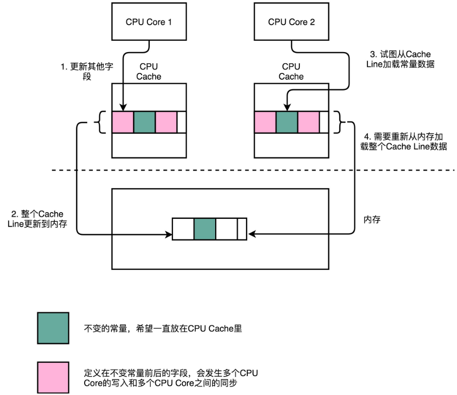
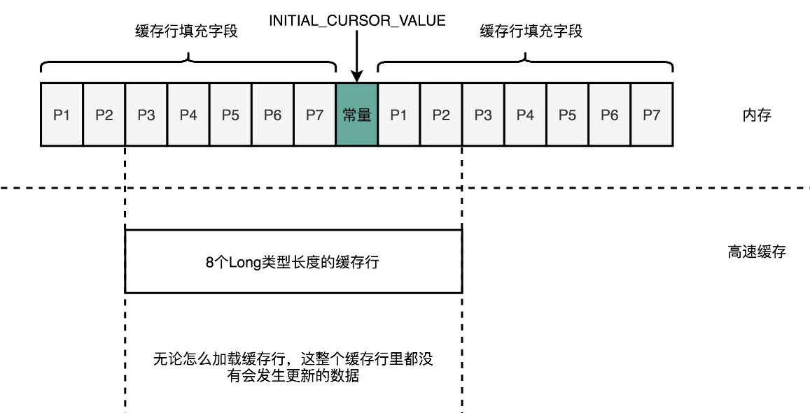
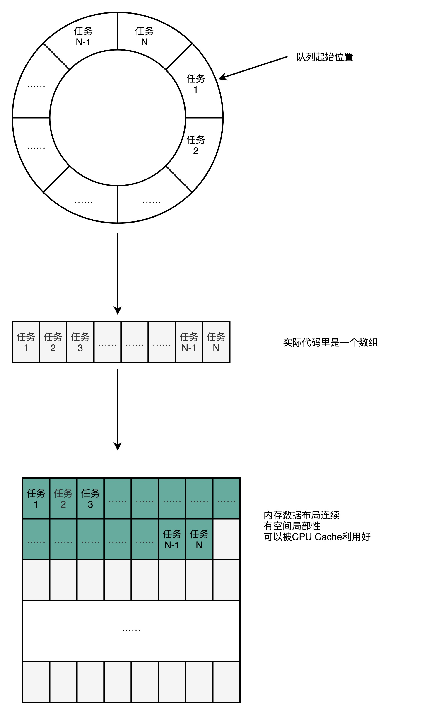
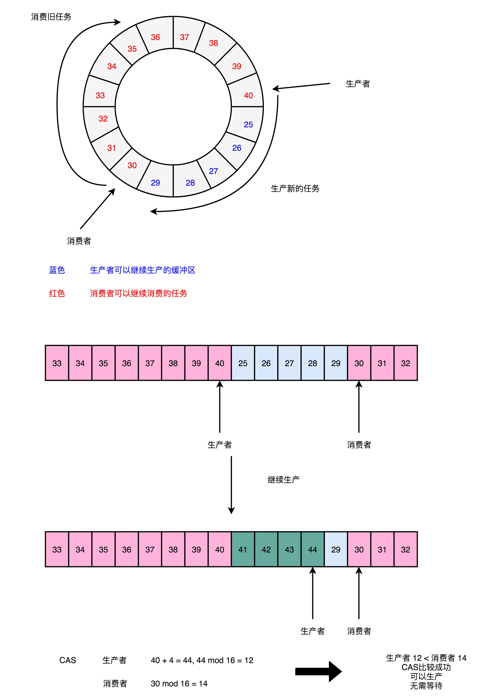

# Disruptor

Disruptor 是一个对性能有极限追求的队列，充分利用 CPU 和高速缓存的硬件特性。而它的开发语言并不是C/C++，而是性能受限于 JVM 的 Java。

## Padding Cache Line

```
abstract class RingBufferPad {
    protected long p1, p2, p3, p4, p5, p6, p7;
}
```

这是 Disruptor 里面一段神奇的代码，在 RingBufferPad 这个类里面定义了 p1，p2 一直到 p7 这样 7 个 long 类型的变量。这些变量没有实际意义，只是帮助我们进行**缓存行填充**（Padding Cache Line），使得我们能够尽可能地用上 CPU 高速缓存（CPU Cache）。

> 访问内置在 CPU 里的 L1 Cache 或者 L2 Cache，访问延时是内存的 1/15 乃至 1/100。而内存的访问速度，其实是远远慢于 CPU 的。想要追求极限性能，需要尽可能地多从 CPU Cache 里面拿数据，而不是从内存里面拿数据。

CPU Cache 装载内存里面的数据，不是一个一个字段加载的，而是加载一整个缓存行。我们现在的 64 位 Intel CPU 的计算机，缓存行通常是 64 个字节（Bytes）。如果我们定义一个长度为 64 的 long 类型的数组，一个 long 类型的数据需要 8 个字节，所以一下子会加载 8 个 long 类型的数据，即一次加载数组里面连续的 8 个数值。这样的加载方式使得遍历数组元素的时候会很快，因为后面连续 7 次的数据访问都会命中缓存，不需要重新从内存里面去读取数据。

但是，在不是使用数组，而是使用单独的变量的场景下，这里就会出现问题了。在 Disruptor 的 RingBuffer（环形缓冲区）的代码里面，定义了一个单独的 long 类型的变量。这个变量叫作 `INITIAL_CURSOR_VALUE `，用来存放 RingBuffer 起始的元素位置。



CPU 在加载数据的时候，自然也会把这个数据从内存加载到高速缓存里面来。不过，高速缓存里面除了这个数据，还会加载这个数据前后定义的其他变量。由于Disruptor 是一个多线程的服务器框架，在这个数据前后定义的其他变量，可能会被多个不同的线程去更新数据、读取数据。这些写入以及读取的请求，会来自于不同的 CPU Core。于是，为了保证数据的同步更新，我们不得不把 CPU Cache 里面的数据，重新写回到内存里面去或者重新从内存里面加载数据。

而 CPU Cache 的写回和加载，都不是以一个变量作为单位的，而是以整个 Cache Line 作为单位的。所以，当 `INITIAL_CURSOR_VALUE `前后的那些变量被写回到内存的时候，这个字段自己也写回到了内存，这个常量的缓存也就失效了。当我们要再次读取这个值的时候，要再重新从内存读取。这也就意味着，读取速度大大变慢了。

为了解决这个问题， Disruptor 里发明了缓存行填充。Disruptor 在 `INITIAL_CURSOR_VALUE `的前后，分别定义了 7 个 long 类型的变量。前面的 7 个来自继承的 RingBufferPad 类，后面的 7 个则是直接定义在 RingBuffer 类里面。这 14 个变量没有任何实际的用途。既不会去读他们，也不会去写他们。

而 `INITIAL_CURSOR_VALUE `又是一个常量，也不会进行修改。所以，一旦它被加载到 CPU Cache 之后，只要被频繁地读取访问，就不会再被换出 Cache 了。这也就意味着，对于这个值的读取速度，会是一直是 CPU Cache 的访问速度，而不是内存的访问速度。

```
......
 
 
abstract class RingBufferPad {
    protected long p1, p2, p3, p4, p5, p6, p7;
}
 
abstract class RingBufferFields<E> extends RingBufferPad {
    ......
}
 
public final class RingBuffer<E> extends RingBufferFields<E> implements Cursored, EventSequencer<E>, EventSink<E> {
    public static final long INITIAL_CURSOR_VALUE = Sequence.INITIAL_VALUE;
    protected long p1, p2, p3, p4, p5, p6, p7;
    ......
```




## RingBuffer

Disruptor 整个框架，其实就是一个高速的[生产者 - 消费者模型](https://en.wikipedia.org/wiki/Producer–consumer_problem)（Producer-Consumer）下的队列。生产者不停地往队列里面生产新的需要处理的任务，而消费者不停地从队列里面处理掉这些任务。

要实现一个队列，最合适的数据结构应该是链表。只要维护好链表的头和尾，就能很容易实现一个队列。生产者只要不断地往链表的尾部不断插入新的节点，而消费者只需要不断从头部取出最老的节点进行处理就好了。

不过，Disruptor 不是这样实现的，而是使用了一个 RingBuffer 这样的数据结构，这个 RingBuffer 的底层实现则是一个**固定长度的数组**。比起链表形式的实现，数组的数据在内存里面会存在**空间局部性**。

数组的连续多个元素会一并加载到 CPU Cache 里，所以访问遍历的速度会更快。而链表里面各个节点的数据，多半不会出现在相邻的内存空间，自然也就享受不到整个 Cache Line 加载后数据连续从高速缓存里面被访问到的优势。

除此之外，数据的遍历访问还有一个很大的优势： CPU 层面的分支预测会很准确。这可以使得我们更有效地利用了 CPU 里面的多级流水线，我们的程序就会跑得更快。




## 无锁设计

一般队列会使用锁保证并发安全，但是使用锁会涉及到上下文切换、锁竞争的裁决、线程挂起，导致性能差。

Disruptor 的“无锁”指的是没有操作系统层面的锁。实际上，Disruptor 利用了一个 CPU 硬件支持的CAS（Compare And Swap，比较和交换）指令 。在 Intel CPU 里面，这个对应的指令就是 `cmpxchg`。

Disruptor 的 RingBuffer 是这么设计的，它和直接在链表的头和尾加锁不同。Disruptor 的 RingBuffer 创建了一个 Sequence 对象，用来指向当前的 RingBuffer 的头和尾。这个头和尾的标识，不是通过一个指针来实现的，而是通过一个**序号**。这也是为什么对应源码里面的类名叫 Sequence。



在这个 RingBuffer 当中，进行生产者和消费者之间的资源协调，采用的是对比序号的方式。当生产者想要往队列里加入新数据的时候，它会把当前的生产者的 Sequence 的序号，加上需要加入的新数据的数量，然后和实际的消费者所在的位置进行对比，看看队列里是不是有足够的空间加入这些数据，而不会覆盖掉消费者还没有处理完的数据。

在 Sequence 的代码里面，是通过 `compareAndSet `这个方法，最终调用到了 `UNSAFE.compareAndSwapLong`，也就是直接使用了 CAS 指令。

```
public boolean compareAndSet(final long expectedValue, final long newValue) {
  return UNSAFE.compareAndSwapLong(this, VALUE_OFFSET, expectedValue, newValue);
}
 
public long addAndGet(final long increment) {
  long currentValue;
  long newValue;
 
  do {
    currentValue = get();
    newValue = currentValue + increment;
  } while (!compareAndSet(currentValue, newValue));

  return newValue;
}
```

这个 CAS 指令，就是比较和交换的操作，并不是基础库里的一个函数。它也不是操作系统里面实现的一个系统调用，而是**一个 CPU 硬件支持的机器指令**。在 Intel CPU 上，就是 `cmpxchg `这个指令：

```
compxchg [ax] (隐式参数，EAX 累加器), [bx] (源操作数地址), [cx] (目标操作数地址)
```

`cmpxchg `指令，一共有三个操作数，第一个操作数不在指令里面出现，是一个隐式的操作数，也就是 EAX 累加寄存器里面的值。第二个操作数就是源操作数，并且指令会对比这个操作数和上面的累加寄存器里面的值。

如果值是相同的，那么 CPU 会把 ZF（也就是条件码寄存器里面零标志位的值）设置为 1，然后再把第三个操作数（也就是目标操作数），设置到源操作数的地址上。如果不相等的话，就会把源操作数里面的值，设置到累加器寄存器里面。伪代码如下：

```
IF [ax] == [bx] THEN [ZF] = 1, [bx] = [cx]
                 ELSE [ZF] = 0, [ax] = [bx] 
```

单个指令是原子的，这也就意味着在使用 CAS 操作的时候，不再需要单独进行加锁，直接调用就可以了。


参考资料：[Implement Lock-Free Queues](http://citeseerx.ist.psu.edu/viewdoc/download?doi=10.1.1.53.8674&rep=rep1&type=pdf)

