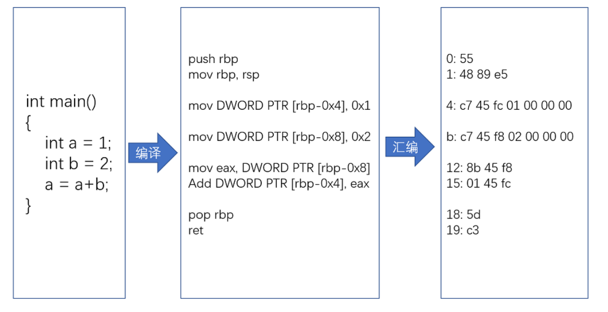
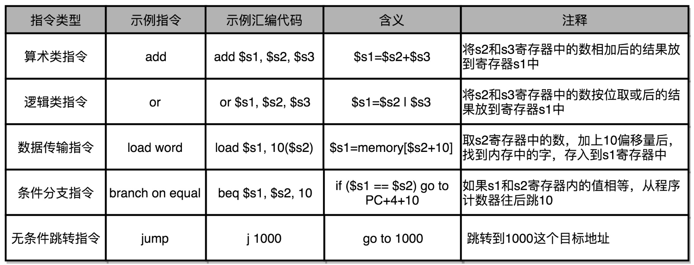
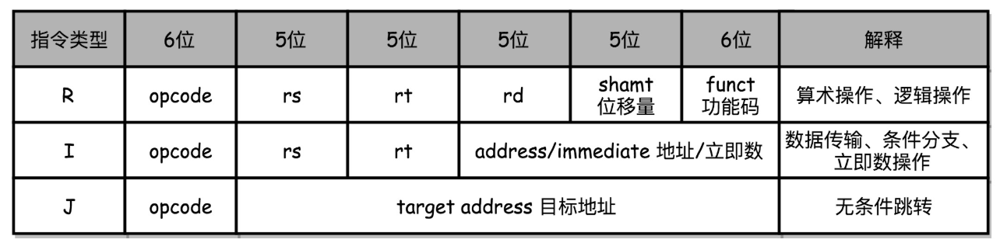
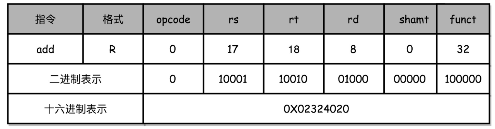
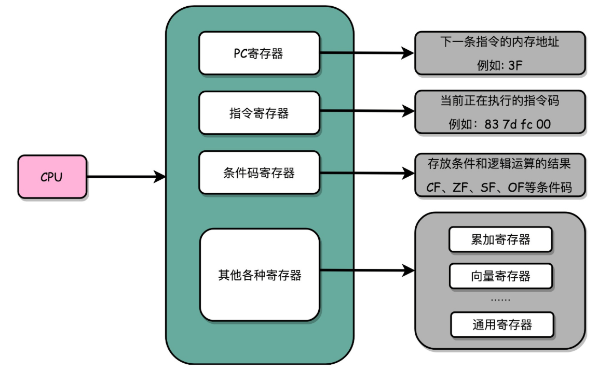
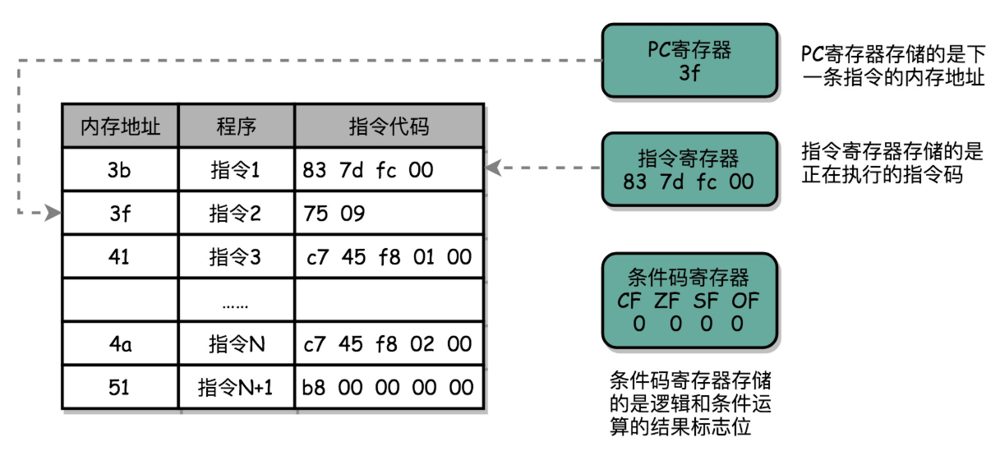
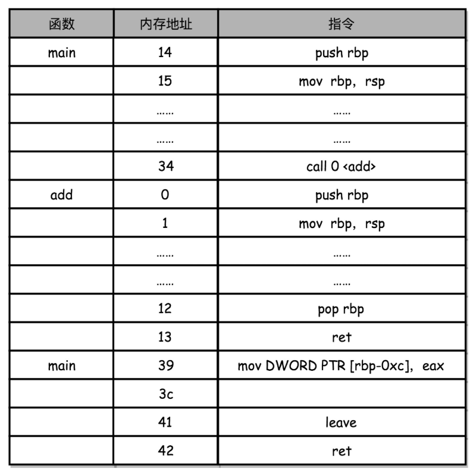

# 指令

从**硬件**的角度来看，CPU 就是一个超大规模集成电路，通过电路实现了加法、乘法乃至各种各样的处理逻辑。

从**软件**工程师的角度来看，CPU 就是一个执行各种**计算机指令**（Instruction Code）的逻辑机器。这里的计算机指令，就好比一门 CPU 能够听得懂的语言，即**机器语言**（Machine Language）。CPU所能支持的机器语言，也被称为**指令集**（Instruction Set）。

不同的CPU的指令集也不同，例如个人电脑用的是 Intel 的 CPU，苹果手机用的是 ARM 的 CPU。所以，如果在电脑上写一个程序，然后把这个程序复制一下，装到手机上，肯定是没办法正常运行的，因为这两者语言不通。而一台电脑上的程序，简单复制一下到另外一台电脑上，通常就能正常运行，因为这两台 CPU 有着相同的指令集，也就是说，它们的语言相通的。

一个计算机程序是由成千上万条指令组成的，但是 CPU 里放不下所有指令，所以计算机程序平时是存储在存储器中的。这种程序指令存储在存储器里面的计算机，就叫作**存储程序型计算机**（Stored-program Computer）。


## 从高级语言代码到机器码

高级语言代码不能直接在机器上运行，需要先转换为机器码。这个转换的过程包括编译、汇编、链接、等步骤。

在编译阶段，高级语言代码会被编译为汇编代码，以下面的C语言代码为例：

```
int main()
{
  int a = 1; 
  int b = 2;
  a = a + b;
}
```

```
$ gcc -g -c test.c
$ objdump -d -M intel -S test.o
test.o:     file format elf64-x86-64
Disassembly of section .text:
0000000000000000 <main>:
int main()
{
   0:   55                      push   rbp
   1:   48 89 e5                mov    rbp,rsp
          int a = 1;
   4:   c7 45 f8 01 00 00 00    mov    DWORD PTR [rbp-0x8],0x1
            int b = 2;
   b:   c7 45 fc 02 00 00 00    mov    DWORD PTR [rbp-0x4],0x2
              a = a + b;
  12:   8b 45 fc                mov    eax,DWORD PTR [rbp-0x4]
  15:   01 45 f8                add    DWORD PTR [rbp-0x8],eax
  18:   b8 00 00 00 00          mov    eax,0x0
}
  1d:   5d                      pop    rbp
  1e:   c3                      ret
```

左侧的数字就是一条条的机器码，它们长短不一；右边的是这些机器码对应的汇编代码，汇编代码和机器码之间是一一对应的。一行 C 语言代码，有时候只对应一条机器码和汇编代码，有时候则是对应两条机器码和汇编代码。




## 解析指令和机器码

常见的指令可以分成五大类：

- **算术类指令**：加减乘除
- **数据传输类指令**：给变量赋值、在内存里读写数据
- **逻辑类指令**：逻辑上的与或非
- **条件分支类指令**：“if/else”、“switch”等
- **无条件跳转指令**：在调用函数的时候，其实就是发起了一个无条件跳转指令




不同的 CPU 有不同的指令集，也就对应着不同的汇编语言和不同的机器码。以MIPS指令集为例，看看汇编器是怎么把对应的汇编代码，翻译成为机器码的。

MIPS 的指令是一个 32 位的整数，高 6 位叫**操作码**（Opcode），也就是代表这条指令具体是一条什么样的指令，剩下的 26 位有三种格式，分别是 R、I 和 J。



**R 指令**是一般用来做算术和逻辑操作，里面有读取和写入数据的寄存器的地址。如果是逻辑位移操作，后面还有位移操作的位移量，而最后的功能码，则是在前面的操作码不够的时候，扩展操作码表示对应的具体指令的。

**I 指令**，则通常是用在数据传输、条件分支，以及在运算的时候使用的并非变量还是常数的时候。这个时候，没有了位移量和操作码，也没有了第三个寄存器，而是把这三部分直接合并成了一个地址值或者一个常数。

**J 指令**就是一个跳转指令，高 6 位之外的 26 位都是一个跳转后的地址。

```
add $t0,$s2,$s1
```

以`add`指令为例，对应的 MIPS 指令里 opcode 是 0，rs 代表第一个寄存器 s1 的地址是 17，rt 代表第二个寄存器 s2 的地址是 18，rd 代表目标的临时寄存器 t0 的地址，是 8。因为不是位移操作，所以位移量是 0。把这些数字拼在一起，就变成了一个 MIPS 的加法指令。




## 指令的执行

拿我们用的 Intel CPU 来说，里面差不多有几百亿个晶体管。实际上，一条条计算机指令执行起来非常复杂。好在 CPU 在软件层面已经为我们做好了封装，我们只要知道，写好的代码变成了指令之后，是一条一条**顺序**执行的就可以了。

### 寄存器

我们先不管几百亿的晶体管的背后是怎么通过电路运转起来的，逻辑上，我们可以认为，CPU 其实就是由一堆寄存器组成的。而寄存器就是 CPU 内部，由多个触发器（Flip-Flop）或者锁存器（Latches）组成的简单电路。

N 个触发器或者锁存器，就可以组成一个 N 位的寄存器，能够保存 N 位的数据。



- **PC 寄存器**（Program Counter Register），也叫**指令地址寄存器**（Instruction Address Register），它是用来存放下一条需要执行的计算机指令的内存地址。
- **指令寄存器**（Instruction Register），用来存放当前正在执行的指令。
- **条件码寄存器**（Status Register），用里面的一个一个标记位（Flag），存放 CPU 进行算术或者逻辑计算的结果。
- 存储数据的寄存器：**整数寄存器**、**浮点数寄存器**、**向量寄存器**和**地址寄存器**等等。有些寄存器既可以存放数据，又能存放地址，称为**通用寄存器**。



一个程序执行的时候，CPU 会根据 PC 寄存器里的地址，从内存里面把需要执行的指令读取到指令寄存器里面执行，然后根据指令长度自增，开始顺序读取下一条指令。可以看到，一个程序的一条条指令，在内存里面是连续保存的，也会一条条顺序加载。

而有些特殊指令，比如 J 类指令，也就是跳转指令，会修改 PC 寄存器里面的地址值。这样，下一条要执行的指令就不是从内存里面顺序加载的了，这就是 `if…else` 条件语句和` while/for `循环语句的原理。


### 从 if…else 来看程序的执行和跳转

```
#include <time.h>
#include <stdlib.h>
 
int main() {
  srand(time(NULL));
  int r = rand() % 2, a = 10;
  if (r == 0) {
    a = 1;
  } else {
    a = 2;
  } 
}
```

```
$ gcc -g -c test.c
$ objdump -d -M intel -S test.o 
......
  if (r == 0) {
  3b:   83 7d fc 00             cmp    DWORD PTR [rbp-0x4],0x0
  3f:   75 09                   jne    4a <main+0x4a>
      a = 1;
  41:   c7 45 f8 01 00 00 00    mov    DWORD PTR [rbp-0x8],0x1
  48:   eb 07                   jmp    51 <main+0x51>
  } else {
      a = 2;
  4a:   c7 45 f8 02 00 00 00    mov    DWORD PTR [rbp-0x8],0x2
  51:   b8 00 00 00 00          mov    eax,0x0
  }
......
```

这里对于` r == 0` 的条件判断，被编译成了 `cmp `和 `jne `这两条指令。

`cmp `指令比较了前后两个操作数的值，这里的 `DWORD PTR` 代表操作的数据类型是 32 位的整数，而 `[rbp-0x4] `则是一个寄存器的地址。所以，第一个操作数就是从寄存器里拿到的变量 r 的值。第二个操作数 0x0 就是我们设定的常量 0 的 16 进制表示。`cmp `指令的比较结果，会存入到**条件码寄存器**当中去。

在这里，如果比较的结果是 True，也就是 `r == 0`，就把**零标志条件码**（对应的条件码是 ZF，Zero Flag）设置为 1。除了零标志之外，Intel 的 CPU 下还有**进位标志**（CF，Carry Flag）、**符号标志**（SF，Sign Flag）以及**溢出标志**（OF，Overflow Flag），用在不同的判断条件下。

`cmp `指令执行完成之后，PC 寄存器会自动自增，开始执行下一条 `jne `的指令。`jne `指令，是 jump if not equal 的意思，它会查看对应的零标志位。如果为 0，说明not equal，会跳转到后面跟着的操作数 4a 的位置。这个 4a，对应这里汇编代码的行号，也就是 else 条件里的第一条指令。当跳转发生的时候，PC 寄存器就不再是自增变成下一条指令的地址，而是被直接设置成这里的 4a 这个地址。这个时候，CPU 再把 4a 地址里的指令加载到指令寄存器中来执行。

如果前面的条件判断满足的话，在执行完`mov`指令后会跳转到地址51的指令（if 条件里面的内容执行完成之后也会跳转到这里，和 else 里的内容结束之后的位置是一样的）。该指令是将累加寄存器eax赋值为0，因为main 函数没有设定返回值，而该指令其实就是给 main 函数生成了一个默认的为 0 的返回值到累加器里面。


### for循环的实现

```
// test.c
int main() {
    int a = 0;
    for (int i = 0; i < 3; i++) {
        a += i;
    }
}
```

```
$ gcc -g -c test.c
$ objdump -d -M intel -S test.o    
	for (int i = 0; i < 3; i++)
   b:   c7 45 fc 00 00 00 00    mov    DWORD PTR [rbp-0x4],0x0
  12:   eb 0a                   jmp    1e <main+0x1e>
    {
        a += i;
  14:   8b 45 fc                mov    eax,DWORD PTR [rbp-0x4]
  17:   01 45 f8                add    DWORD PTR [rbp-0x8],eax
    for (int i = 0; i < 3; i++)
  1a:   83 45 fc 01             add    DWORD PTR [rbp-0x4],0x1
  1e:   83 7d fc 02             cmp    DWORD PTR [rbp-0x4],0x2
  22:   7e f0                   jle    14 <main+0x14>
  24:   b8 00 00 00 00          mov    eax,0x0
    }
```

循环的判断是用1e地址开始的`cmp`和`jle`指令，`for`循环的判断条件是`i < 3`，在汇编代码里，用的是`jle`指令，即less or equal，`cmp`的操作数就变成`i`和2了。条件满足后会往前面跳转，条件不满足则继续往下执行。

`jle `和 `jmp `指令，有点像程序语言里面的 `goto `命令，直接指定了一个特定条件下的跳转位置。虽然在用高级语言开发程序的时候反对使用 goto，但是实际在机器指令层面，无论是` if…else…`也好，还是 `for/while` 也好，都是用和 `goto `相同的跳转到特定指令位置的方式来实现的。


## 函数调用

```
// test.c
#include <stdio.h>
int static add(int a, int b) {
    return a+b;
}
 
int main() {
    int x = 5;
    int y = 10;
    int u = add(x, y);
}
```

```
$ gcc -g -c test.c
$ objdump -d -M intel -S test.o
int static add(int a, int b) {
   0:   55                      push   rbp
   1:   48 89 e5                mov    rbp,rsp
   4:   89 7d fc                mov    DWORD PTR [rbp-0x4],edi
   7:   89 75 f8                mov    DWORD PTR [rbp-0x8],esi
    return a+b;
   a:   8b 55 fc                mov    edx,DWORD PTR [rbp-0x4]
   d:   8b 45 f8                mov    eax,DWORD PTR [rbp-0x8]
  10:   01 d0                   add    eax,edx
}
  12:   5d                      pop    rbp
  13:   c3                      ret

0000000000000014 <main>:
int main() {
  14:   55                      push   rbp
  15:   48 89 e5                mov    rbp,rsp
  18:   48 83 ec 10             sub    rsp,0x10
    int x = 5;
  1c:   c7 45 f4 05 00 00 00    mov    DWORD PTR [rbp-0xc],0x5
    int y = 10;
  23:   c7 45 f8 0a 00 00 00    mov    DWORD PTR [rbp-0x8],0xa
    int u = add(x, y);
  2a:   8b 55 f8                mov    edx,DWORD PTR [rbp-0x8]
  2d:   8b 45 f4                mov    eax,DWORD PTR [rbp-0xc]
  30:   89 d6                   mov    esi,edx
  32:   89 c7                   mov    edi,eax
  34:   e8 c7 ff ff ff          call   0 <add>
  39:   89 45 fc                mov    DWORD PTR [rbp-0x4],eax
  3c:   b8 00 00 00 00          mov    eax,0x0
  41:   c9                      leave
  42:   c3                      ret
```

`add `函数编译之后，代码先执行了一条 `push `指令和一条 `mov `指令；在函数执行结束的时候，又执行了一条 `pop `和一条 `ret `指令。这四条指令的执行，就是函数调用的**压栈**（Push）和**出栈**（Pop）操作。

函数调用和`if/else  for/while`之类的条件跳转类似，但条件跳转是跳转走了就不再回来了，而函数调用的跳转，在对应函数的指令执行完了之后，还要再回到函数调用的地方，继续执行 call 之后的指令。

在刚开始执行函数时，就需要在寄存器中记录下函数调用的地方的地址，等到函数调用结束，从这个寄存器里取出地址，再跳转到这个记录的地址，继续执行。这个寄存器就是汇编代码中的`rbp`寄存器。

但是在多层函数调用里，简单只记录一个地址也是不够的，所以使用栈这种后进先出的数据结构存储每个函数的**栈帧**（Stack Frame），栈帧不仅存储函数调用完成后的返回地址，还存储调用参数等信息。

程序栈在内存中的布局，是底在最上面，顶在最下面，这样的布局是因为栈底的内存地址是在一开始就固定的。一层层压栈之后，栈顶的内存地址是在逐渐变小而不是变大。`rsp`寄存器永远指向当前执行函数的栈顶。



在调用第 34 行的 `call `指令时，会做`push eip`的操作，把当前的 PC 寄存器里的下一条指令的地址压栈，保留函数调用结束后要执行的指令地址。而 `add `函数的第 0 行，`push rbp` 这个指令，就是在进行压栈。 rbp（register base pointer）， 又叫栈帧指针（Frame Pointer），是一个存放当前栈帧位置的寄存器。`push rbp` 就把之前调用函数，也就是 main 函数的栈帧的栈底地址，压到栈顶。

接着，第 1 行的命令 `mov rbp, rsp` 里，则是把 rsp （register stack pointer）这个栈指针的值复制到 rbp 里，而 rsp 始终会指向栈顶。这个命令意味着，rbp 这个栈帧指针指向的地址，变成当前最新的栈顶，也就是 add 函数的栈帧的栈底地址了。

而在函数 add 执行完成之后，又会分别调用第 12 行的 `pop rbp` 来将当前的栈顶出栈，这部分操作维护好了我们整个栈帧。然后调用第 13 行的 ret 指令，会做`pop eip`的操作，把 call 调用的时候压入的 PC 寄存器里的下一条指令出栈，更新到 PC 寄存器中，将程序的控制权返回到出栈后的栈顶。


### STACKOVERFLOW

通过引入栈，无论有多少层的函数调用，都只需要通过维持 rbp 和 rsp，这两个维护栈顶所在地址的寄存器，就能管理好不同函数之间的跳转。不过，栈的大小也是有限的。如果函数调用层数太多，往栈里压入它存不下的内容，程序在执行的过程中就会遇到栈溢出的错误，这就是“stack overflow”。

除了无限递归，递归层数过深，在栈空间里面创建非常占内存的变量（比如一个巨大的数组），这些情况都很可能带来 stack overflow。


### 函数内联

把一个实际调用的函数产生的指令，直接插入到调用的位置，来替换对应的函数调用指令。这种操作是编译器的一种优化，只要在编译时给gcc加上`-O`参数就可以启用优化。

```
// test.c
#include <stdio.h>
#include <time.h>
#include <stdlib.h>
 
int static add(int a, int b) {
    return a+b;
}
 
int main() {
    srand(time(NULL));
    int x = rand() % 5;
    int y = rand() % 10;
    int u = add(x, y)
    printf("u = %d\n", u)
}
```

```
$ gcc -g -c -O test.c
$ objdump -d -M intel -S test.o
......
    return a+b;
  4c:   01 de                   add    esi,ebx
```

汇编代码里没有把 add 函数单独编译成一段指令顺序，而是在调用` u = add(x, y)` 的时候，直接替换成了一个 add 指令。

除了依靠编译器的自动优化，还可以在定义函数的地方，加上 `inline `的关键字，来提示编译器对函数进行内联。

内联带来的优化是，CPU 需要执行的指令数变少了，根据地址跳转的过程不需要了，压栈和出栈的过程也不用了。但如果一个函数在很多地方都被调用了，那么就会展开很多次，整个程序占用的空间就会变大了。


