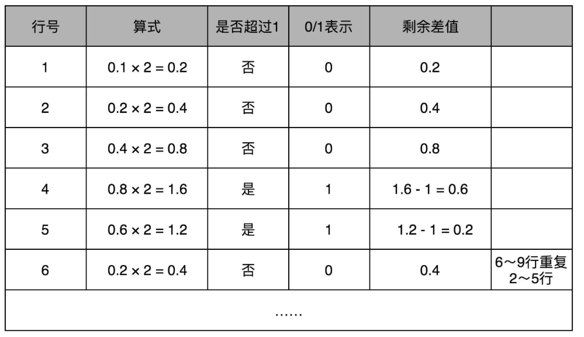
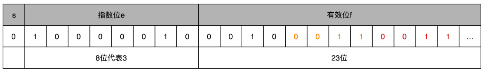

# 数据表示

现代计算机都是用 0 和 1 组成的二进制，来表示所有的信息。程序指令用到的机器码、存储在内存里面的字符串、整数、浮点数都是用二进制表示的。万事万物在计算机里都是 0 和 1。


## 字符串编码

### ASCII

最早计算机只需要使用英文字符，加上数字和一些特殊符号，然后用 8 位的二进制，就能表示日常需要的所有字符了，这个就是**ASCII 码**（American Standard Code for Information Interchange，美国信息交换标准代码）。


### 字符集

ASCII 码只表示了 128 个字符，随着越来越多的不同国家的人都用上了计算机，想要表示譬如中文这样的文字，128 个字符显然是不太够用的。于是，**字符集**（Charset）和**字符编码**（Character Encoding）产生了。

字符集，表示的可以是字符的一个集合。例如Unicode，包含了 150 种语言的 14 万个不同的字符。

字符编码则是对于字符集里的这些字符，怎么一一用二进制表示出来的一个字典。 Unicode，就可以用 UTF-8、UTF-16，乃至 UTF-32 来进行编码，存储成二进制。所以，有了 Unicode，其实我们可以用不止 UTF-8 一种编码形式，只要别人知道编码规则，就可以正常传输、显示这段代码。


同样的文本，采用不同的编码存储下来。如果另外一个程序，用一种不同的编码方式来进行解码和展示，就会出现乱码。

**“锟斤拷”的来源**：用 Unicode 编码记录一些文本，特别是一些遗留的老字符集内的文本，但是这些字符在 Unicode 中可能并不存在。于是，Unicode 会统一把这些字符记录为 `U+FFFD` 这个编码。如果用 UTF-8 的格式存储下来，就是`\xef\xbf\xbd`。如果连续两个这样的字符放在一起，`\xef\xbf\xbd\xef\xbf\xbd`，这个时候，如果程序把这个字符，用 GB2312 的方式进行 decode，就会变成“锟斤拷”。这就好比我们用 GB2312 这本密码本，去解密别人用 UTF-8 加密的信息，自然没办法读出有用的信息。

**“”烫烫烫”的来源**：使用 Visual Studio 的调试器，默认使用 MBCS 字符集。“烫”在里面是由 `0xCCCC` 来表示的，而 `0xCC` 又恰好是未初始化的内存的赋值。于是，在读到没有赋值的内存地址或者变量的时候，电脑就开始大叫“烫烫烫”了。


## 整数

### 二进制 To 十进制

把一个二进制数，对应到十进制，非常简单，就是把从右到左的第 N 位，乘上一个 2 的 N 次方，然后加起来，就变成了一个十进制数。当然，既然二进制是一个面向程序员的“语言”，这个从右到左的位置，自然是从 0 开始的。

比如 0011 这个二进制数，对应的十进制表示，就是 $0×2^3+0×2^2+1×2^1+1×2^0=3$，代表十进制的 3。

### 十进制 To 二进制

如果想要把一个十进制的数，转化成二进制，使用**短除法**就可以了：把十进制数除以 2 的余数，作为最右边的一位。然后用商继续除以 2，把对应的余数紧靠着刚才余数的右侧，这样递归迭代，直到商为 0 就可以了。

比如，把 13 这个十进制数，用短除法转化成二进制，需要经历以下几个步骤：


对应的二进制数，就是 1101。


### 原码 补码

**原码表示法**：数的最左侧的那一位是符号位，该位为0表示是正数，为-1表示是负数。一个 4 位的二进制数， 0011 就表示为 +3。而 1011 最左侧的第一位是 1，所以它就表示 -3。

原码表示带来的问题是，0有两种表示：`0000`和`1000`。因此补码表示法产生了，仍然通过最左侧第一位的 0 和 1，来判断这个数的正负。但是，这一位不是单独的符号位，仅在剩下几位计算出的十进制前加上正负号，而是在计算整个二进制值的时候，在左侧最高位前面加个负号。

一个 4 位的二进制补码数值 1011，转换成十进制，就是 $−1×2^3+0×2^2+1×2^1+1×2^0=−5$。如果最高位是 1，这个数必然是负数；最高位是 0，必然是正数。并且，只有 0000 表示 0，1000 在这样的情况下表示 -8。一个 4 位的二进制数，可以表示从 -8 到 7 这 16 个整数，不会白白浪费一位。

用补码来表示负数，使得整数相加变得很容易，不需要做任何特殊处理，只是把它当成普通的二进制相加，就能得到正确的结果。


## 定点数

用 4 个比特表示 0～9 的整数，那么 32 个比特就可以表示 8 个这样的整数。把最右边的 2 个 0～9 的整数，当成小数部分；把左边 6 个 0～9 的整数，当成整数部分。这样，就实现了使用 32 个比特，来表示从 0 到 999999.99 这样 1 亿个实数了。

这种用二进制来表示十进制的编码方式，叫作[**BCD 编码**](https://zh.wikipedia.org/wiki/二進碼十進數)（Binary-Coded Decimal）。它的运用非常广泛，最常用的是在超市、银行这样需要用小数记录金额的情况里。在超市里面，小数最多也就到分。这样的表示方式，比较直观清楚，也满足了小数部分的计算。

但它也有几个缺点：

- **浪费**：本来 32 个比特我们可以表示 40 亿个不同的数，但是在 BCD 编码下，只能表示 1 亿个数，如果我们要精确到分的话，那么能够表示的最大金额也就是到 100 万。
- **没办法同时表示很大的数字和很小的数字**：写程序的时候，实数的用途可能是多种多样的。有时候我们想要表示商品的金额，关心的是 9.99 这样小的数字；有时候，我们又要进行物理学的运算，需要表示光速，也就是$ 3×10^8$ 这样很大的数字。


## 浮点数

**IEEE 754**的标准，定义了用 32 比特表示单精度的浮点数（float 或者 float32） 和 用 64 比特表示双精度的浮点数（double 或者 float64 ）。


单精度的 32 个比特可以分成三部分：

- 第一部分是一个**符号位**，用来表示是正数还是负数。一般用**s**来表示。在浮点数里，不像正数分符号数还是无符号数，**所有的浮点数都是有符号的**。

- 接下来是一个 8 个比特组成的**指数位**。一般用**e**来表示。8 个比特能够表示的整数空间，就是 0～255。用 1～254 映射到 -126～127 这 254 个有正有负的数上。这样不仅可以表示很大的数，也能够表示很小的数。

   0 和 255 这两个数用来表示特殊的数:

  

- 最后是一个 23 个比特组成的**有效数位**。用**f**来表示。

综合科学计数法，浮点数就可以表示成：$(−1)^s × 1.f × 2^e$

以 0.5 为例子。0.5 的符号为 s 应该是 0，f 应该是 0，而 e 应该是 -1，也就是$0.5=(−1)^0 × 1.0 × 2^{−1}$，对应的浮点数表示，就是 32 个比特:


e 表示从 -126 到 127 个，-1 是其中的第 126 个数，所以e是`0111 1110`。

在这样的浮点数表示下，不考虑符号的话，浮点数能够表示的最小的数和最大的数，差不多是 $1.17×10^{−38} $和 $3.40×10^{38}$。


### 十进制 To 浮点数

以9.1为例，需要把它变成一个“**符号位 s+ 指数位 e+ 有效位数 f**”的组合。整数部分用二进制表示是1001。

小数点后的每一位，都表示对应的 2 的 -N 次方，0.1001，转化成十进制就是：

$1×2^{−1}+0×2^{−2}+0×2^{−3}+1×2^{−4}=0.5625$


小数部分换成二进制采用“**乘以 2，然后看看是否超过 1**”的方式，如果超过 1，就记下 1，并把结果减去 1，进一步循环操作。在这里，0.1 其实变成了一个无限循环的二进制小数，0.000110011。这里的“0011”会无限循环下去。



把整数部分和小数部分拼接在一起，9.1 这个十进制数就变成了 `1001.000110011…`这样一个二进制表示。浮点数是用二进制的科学计数法来表示的，所以把小数点左移三位，这个数就变成了：$1.0010 0011 0011…×2^3$。

这个二进制的科学计数法表示，就可以对应到了浮点数的格式里了。这里的符号位 s = 0，对应的有效位 f=0010**0011**0011…。因为 f 最长只有 23 位，那这里“0011”无限循环，最多到 23 位就截止了。于是，f=0010**0011001100110011** **001**。最后的一个“0011”循环中的最后一个“1”会被截断掉。对应的指数为 e，代表的应该是 3。因为指数位有正又有负，所以指数位在 127 之前代表负数，之后代表正数，那 3 其实对应的是加上 127 的偏移量 130，转化成二进制，就是 130，对应的就是指数位的二进制，表示出来就是 1000**0010**。



如果再把这个浮点数表示换算成十进制， 实际准确的值是 9.09999942779541015625。


### 浮点数加法

**先对齐、再计算**。

两个浮点数的指数位可能是不一样的，所以要把两个的指数位，变成一样的，然后只去计算有效位的加法就好了。

比如 0.5，表示成浮点数，对应的指数位是 -1，有效位是 00…（后面全是 0，记住 f 前默认有一个 1）。0.125 表示成浮点数，对应的指数位是 -3，有效位也还是 00…（后面全是 0，记住 f 前默认有一个 1）。

在计算 `0.5 + 0.125` 的浮点数运算的时候，首先要把两个的指数位对齐，也就是把指数位都统一成两个其中较大的 -1。对应的有效位 1.00…也要对应右移两位，因为 f 前面有一个默认的 1，所以就会变成 0.01。然后我们计算两者相加的有效位 1.f，就变成了有效位 1.01，而指数位是 -1，这样就得到了我们想要的加法后的结果。


实现这样一个加法，也只需要位移。和整数加法类似的半加器和全加器的方法就能够实现，在电路层面，也并没有引入太多新的复杂性。


### 误差

在python或其他语言中计算0.3和0.6两个浮点数相加的结果，是0.8999999999999999，而不是0.9。这是因为浮点数的有效位是有限长度的，而某些小数的有效位可能是无限循环的，因此浮点数无法精确地表示。

在浮点数运算中，因为有对齐的操作，指数位较小的数，在有效位右移的过程中，最右侧的有效位就被丢弃掉了。这会导致对应的指数位较小的数，在加法发生之前，就**丢失精度**。两个相加数的指数位差的越大，位移的位数越大，可能丢失的精度也就越大。

32 位浮点数的有效位长度一共只有 23 位，如果两个数的指数位差出 23 位，较小的数右移 24 位之后，所有的有效位就都丢失了。这也就意味着，虽然浮点数可以表示上到 $3.40×10^{38}$，下到 $1.17×10^{−38}$ 这样的数值范围。但是在实际计算的时候，只要两个数，差出 $2^{24}$，也就是差不多 1600 万倍，那这两个数相加之后，结果完全不会变化。

让一个值为 2000 万的 32 位浮点数和 1 相加，+1 这个过程因为精度损失，被“完全抛弃”了。

```
var a, b float32 = 20000000.0, 1.0
var c float32 = a + b
fmt.Print(c - a) // 0 如果换成float64，结果就是1，因为有效位变长了
```


### Kahan Summation 算法

用一个循环相加 2000 万个 值为1.0的浮点数，最终的结果会是 1600 万左右，而不是 2000 万。这是因为，加到 1600 万之后的加法因为精度丢失都没有了。

```
var sum float32 = 0.0
for i := 0; i < 2e7; i++ {
	sum += 1.0
}
fmt.Print(sum)// 1.6777216e+07
```

这类问题在机器学习中很容易出现，例如样本计算的loss的累加，会出现“大数吃小数”的情况。为了解决积少成多的误差问题，Kahan算法诞生了：

```
func KahanSum(nums []float64) float64 {
	var sum, c float64 // c是累计误差
	for _, num := range nums {
		num += c
		t := sum + num
		c = num - (t - sum)  // 先让t和sum两个大数相减，如果差值小于这次的加数num，更新累计误差
		sum = t
	}
	return sum
}
```


