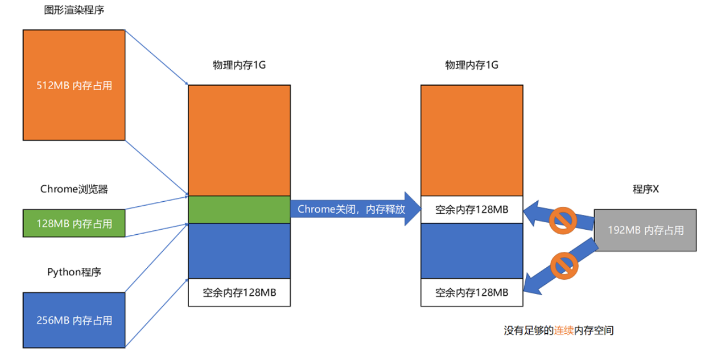

# 链接和装载

既然我们的程序经过编译和汇编后变成了一条条机器码去执行，那为什么同一个程序，在同一台计算机上，在 Linux 下可以运行，而在 Windows 下却不行呢？反过来也同样不行。仅通过编译和汇编还得不到可执行程序，因为还有链接和装载步骤。


## 静态链接

```
// add_lib.c
int add(int a, int b) {
    return a+b;
}
```

```
// link_example.c
#include <stdio.h>
int main() {
    int a = 10;
    int b = 5;
    int c = add(a, b);
    printf("c = %d\n", c);
}
```

使用`-c`参数编译但不链接：

```
$ gcc -g -c add_lib.c link_example.c
$ objdump -d -M intel -S add_lib.o
add_lib.o:     file format elf64-x86-64
Disassembly of section .text:
0000000000000000 <add>:
int add(int a, int b) {
   0:   55                      push   rbp
   1:   48 89 e5                mov    rbp,rsp
   4:   89 7d fc                mov    DWORD PTR [rbp-0x4],edi
   7:   89 75 f8                mov    DWORD PTR [rbp-0x8],esi
    return a+b;
   a:   8b 55 fc                mov    edx,DWORD PTR [rbp-0x4]
   d:   8b 45 f8                mov    eax,DWORD PTR [rbp-0x8]
  10:   01 d0                   add    eax,edx
  12:   5d                      pop    rbp
  13:   c3                      ret

$ objdump -d -M intel -S link_example.o
link_example.o:     file format elf64-x86-64
Disassembly of section .text:
0000000000000000 <main>:
#include <stdio.h>
int main() {
   0:   55                      push   rbp
   1:   48 89 e5                mov    rbp,rsp
   4:   48 83 ec 10             sub    rsp,0x10
    int a = 10;
   8:   c7 45 f4 0a 00 00 00    mov    DWORD PTR [rbp-0xc],0xa
    int b = 5;
   f:   c7 45 f8 05 00 00 00    mov    DWORD PTR [rbp-0x8],0x5
    int c = add(a, b);
  16:   8b 55 f8                mov    edx,DWORD PTR [rbp-0x8]
  19:   8b 45 f4                mov    eax,DWORD PTR [rbp-0xc]
  1c:   89 d6                   mov    esi,edx
  1e:   89 c7                   mov    edi,eax
  20:   b8 00 00 00 00          mov    eax,0x0
  25:   e8 00 00 00 00          call   2a <main+0x2a>
  2a:   89 45 fc                mov    DWORD PTR [rbp-0x4],eax
    printf("c = %d\n", c);
  2d:   8b 45 fc                mov    eax,DWORD PTR [rbp-0x4]
  30:   89 c6                   mov    esi,eax
  32:   48 8d 3d 00 00 00 00    lea    rdi,[rip+0x0]        # 39 <main+0x39>
  39:   b8 00 00 00 00          mov    eax,0x0
  3e:   e8 00 00 00 00          call   43 <main+0x43>
  43:   b8 00 00 00 00          mov    eax,0x0
  48:   c9                      leave
  49:   c3                      ret
```

可以发现，objdump 出来的两个文件的代码，两个程序的地址都是从 0 开始的。如果地址是一样的，程序如果需要通过 call 指令调用函数的话，它怎么知道应该跳转到哪一个文件里呢？

这两个.o文件都是**目标文件**（Object File），不是可执行文件。只有通过链接器（Linker）把多个目标文件以及调用的各种函数库链接起来，才能得到一个可执行文件。通过 gcc 的 `-o `参数，可以生成对应的可执行文件：

```
$ gcc -o link-example add_lib.o link_example.o
$ ./link_example
c = 15
```

实际上，从高级语言代码到可执行文件再到运行，可以分为两个部分：

- 第一部分由编译（Compile）、汇编（Assemble）以及链接（Link）三个阶段组成，生成了一个可执行文件
- 第二部分，通过装载器（Loader）把可执行文件装载（Load）到内存中。CPU 从内存中读取指令和数据，来开始真正执行程序。


### ELF 格式和链接：理解链接过程

程序最终是通过装载器变成指令和数据的，所以其实我们生成的可执行代码也并不仅仅是一条条的指令。通过 objdump 指令，把可执行文件的内容拿出来看看。

```
$ objdump -d -M intel -S link-example
link-example:     file format elf64-x86-64
Disassembly of section .init:
...

Disassembly of section .plt:
...

Disassembly of section .plt.got:
...

Disassembly of section .text:
...
000000000000064a <add>:
int add(int a, int b) {
 64a:   55                      push   rbp
 64b:   48 89 e5                mov    rbp,rsp
 64e:   89 7d fc                mov    DWORD PTR [rbp-0x4],edi
 651:   89 75 f8                mov    DWORD PTR [rbp-0x8],esi
    return a+b;
 654:   8b 55 fc                mov    edx,DWORD PTR [rbp-0x4]
 657:   8b 45 f8                mov    eax,DWORD PTR [rbp-0x8]
 65a:   01 d0                   add    eax,edx
 65c:   5d                      pop    rbp
 65d:   c3                      ret

000000000000065e <main>:
#include <stdio.h>
int main() {
 65e:   55                      push   rbp
 65f:   48 89 e5                mov    rbp,rsp
 662:   48 83 ec 10             sub    rsp,0x10
    int a = 10;
 666:   c7 45 f4 0a 00 00 00    mov    DWORD PTR [rbp-0xc],0xa
    int b = 5;
 66d:   c7 45 f8 05 00 00 00    mov    DWORD PTR [rbp-0x8],0x5
    int c = add(a, b);
 674:   8b 55 f8                mov    edx,DWORD PTR [rbp-0x8]
 677:   8b 45 f4                mov    eax,DWORD PTR [rbp-0xc]
 67a:   89 d6                   mov    esi,edx
 67c:   89 c7                   mov    edi,eax
 67e:   b8 00 00 00 00          mov    eax,0x0
 683:   e8 c2 ff ff ff          call   64a <add>
 688:   89 45 fc                mov    DWORD PTR [rbp-0x4],eax
    printf("c = %d\n", c);
 68b:   8b 45 fc                mov    eax,DWORD PTR [rbp-0x4]
 68e:   89 c6                   mov    esi,eax
 690:   48 8d 3d 9d 00 00 00    lea    rdi,[rip+0x9d]        # 734 <_IO_stdin_used+0x4>
 697:   b8 00 00 00 00          mov    eax,0x0
 69c:   e8 7f fe ff ff          call   520 <printf@plt>
 6a1:   b8 00 00 00 00          mov    eax,0x0
 6a6:   c9                      leave
 6a7:   c3                      ret
 6a8:   0f 1f 84 00 00 00 00    nop    DWORD PTR [rax+rax*1+0x0]
 6af:   00
...

Disassembly of section .fini:
...
```

可执行文件 dump 出来的内容，和之前的目标代码长得差不多，但是长了很多。因为在 Linux 下，可执行文件和目标文件所使用的都是一种叫**ELF**（Execuatable and Linkable File Format）的文件格式，中文名字叫**可执行与可链接文件格式**，这里面不仅存放了编译成的汇编指令，还保留了很多别的数据。

函数、全局变量等数据都存放在这个ELF格式的文件中，这些名字和它们对应的地址，在 ELF 文件里面，存储在一个叫作**符号表**（Symbols Table）的位置里。符号表相当于一个地址簿，把名字和地址关联了起来。


ELF 文件格式把各种信息，分成一个一个的 Section 保存起来。ELF 有一个基本的文件头（File Header），用来表示这个文件的基本属性，比如是否是可执行文件（可重定向文件 或 共享目标文件），对应的 CPU、操作系统等等。除了这些基本属性之外，大部分程序还有这么一些 Section：

1. `.text` Section：**代码段**或者指令段（Code Section），用来保存程序的代码和指令；
2. `.data` Section：**数据段**（Data Section），用来保存程序里面设置好的初始化数据信息；
3. `.rel.text` Secion：**重定位表**（Relocation Table）。重定位表里，保留的是当前的文件里面，哪些跳转地址其实是我们不知道的。比如上面的 link_example.o 里面，在 main 函数里面调用了 add 和 printf 这两个函数，但是在链接发生之前，并不知道该跳转到哪里，这些信息就会存储在重定位表里；
4. `.symtab` Section：**符号表**（Symbol Table）。符号表保留了当前文件里面定义的函数名称和对应地址的地址簿。

链接器会扫描所有输入的目标文件，然后把所有符号表里的信息收集起来，构成一个全局的符号表。然后再根据重定位表，把所有不确定要跳转地址的代码，根据符号表里面存储的地址，进行一次修正。最后，把所有的目标文件的对应段进行一次合并，变成了最终的可执行代码。这也是为什么，可执行文件里面的函数调用的地址都是正确的。


现在，main 函数里调用 add 的跳转地址，就是 add 函数的真正入口地址了，这就是 EFL 格式和链接器的功劳。


在Linux中，使用的是ELF格式，在Windows中，使用的是PE格式（Portable Executable Format）。而不同操作系统的装载器只能装载它们支持的文件格式的文件。不过，Linux 下著名的开源项目 Wine，通过兼容 PE 格式的装载器，使得我们能直接在 Linux 下运行 Windows 程序； Windows 里面的 WSL，可以解析和加载 ELF 格式的文件。但这种兼容并不完美，因为很多程序还需要OS本身提供的动态链接库。


## 动态链接

使用静态链接的时候，如果我们有很多个程序都要通过装载器装载到内存里面，那里面链接好的同样的功能代码，也都需要再装载一遍，再占一遍内存空间。这就好比，假设每个人都有骑自行车的需要，那我们给每个人都生产一辆自行车带在身边，固然大家都有自行车用了，但是马路上肯定会特别拥挤。

`/usr/bin`下面有上千个命令，如果使用静态链接，就会有上千份磁盘和内存空间占用。

动态链接可以让同样功能的代码，在不同的程序里面，不需要各占一份内存空间。就好比，现在马路上的共享单车。

在动态链接的过程中，我们想要“链接”的，不是存储在硬盘上的目标文件代码，而是加载到内存中的**共享库**（Shared Libraries）。这个加载到内存中的共享库会被很多个程序的指令调用到。

- 在 Windows 下，这些共享库文件就是.dll 文件，也就是 Dynamic-Link Libary（DLL，动态链接库）。
- 在 Linux 下，这些共享库文件就是.so 文件，也就是 Shared Object。

- 这两大操作系统下的文件名后缀，一个用了“动态链接”的意思，另一个用了“共享”的意思，正好覆盖了两方面的含义。

这两大操作系统下的文件名后缀，一个用了“动态链接”的意思，另一个用了“共享”的意思，正好覆盖了两方面的含义。


### 共享库

共享库的机器码必须是“**地址无关**”的，即编译出来的共享库文件的指令代码，是地址无关码（Position-Independent Code）。这段代码，无论加载在哪个内存地址，都能够正常执行。如果不是这样的代码，就是地址相关的代码。

大部分函数库其实都可以做到地址无关，因为它们都接受特定的输入，进行确定的操作，然后给出返回结果就好了。无论是实现一个向量加法，还是实现一个打印的函数，这些代码逻辑和输入的数据在内存里面的位置并不重要。

常见的地址相关的代码，比如绝对地址代码（Absolute Code）、利用重定位表的代码等等，都是地址相关的代码。在程序链接的时候，我们就把函数调用后要跳转访问的地址确定下来了，这意味着，如果这个函数加载到一个不同的内存地址，跳转就会失败。


对于所有动态链接共享库的程序来讲，虽然共享库用的都是同一段物理内存地址，但是在不同的应用程序里，它所在的虚拟内存地址是不同的。

要怎么实现动态共享库编译出来的代码指令，都是地址无关码呢？

动态代码库**内部的变量和函数调用**都很容易解决，只需要使用**相对地址**（Relative Address）就好了。各种指令中使用到的内存地址，给出的不是一个绝对的地址空间，而是一个相对于当前指令偏移量的内存地址。因为整个共享库是放在一段连续的虚拟内存地址中的，无论装载到哪一段地址，不同指令之间的相对地址都是不变的。

### PLT 和 GOT

```
// lib.h
#ifndef LIB_H
#define LIB_H
 
void show_me_the_money(int money);
 
#endif

// lib.c
#include <stdio.h>
 
void show_me_the_money(int money) {
    printf("Show me USD %d from lib.c \n", money);
}

// show_me_poor.c
#include "lib.h"
int main() {
    int money = 5;
    show_me_the_money(money);
}
```

```
$ gcc lib.c -fPIC -shared -o lib.so # PIC: Position Independent Code 
$ gcc -o show_me_poor show_me_poor.c ./lib.so
$ objdump -d -M intel -S show_me_poor
...
Disassembly of section .plt:
...
00000000000005f0 <show_me_the_money@plt>:
 5f0:   ff 25 da 09 20 00       jmp    QWORD PTR [rip+0x2009da]        # 200fd0 <show_me_the_money>
 5f6:   68 00 00 00 00          push   0x0
 5fb:   e9 e0 ff ff ff          jmp    5e0 <.plt>
...
 
 000000000000071a <main>:
 71a:   55                      push   rbp
 71b:   48 89 e5                mov    rbp,rsp
 71e:   48 83 ec 10             sub    rsp,0x10
 722:   c7 45 fc 05 00 00 00    mov    DWORD PTR [rbp-0x4],0x5
 729:   8b 45 fc                mov    eax,DWORD PTR [rbp-0x4]
 72c:   89 c7                   mov    edi,eax
 72e:   e8 bd fe ff ff          call   5f0 <show_me_the_money@plt>
 733:   b8 00 00 00 00          mov    eax,0x0
 738:   c9                      leave
 739:   c3                      ret
 73a:   66 0f 1f 44 00 00       nop    WORD PTR [rax+rax*1+0x0]
...
```

在 main 函数调用 `show_me_the_money `函数的时候，对应的汇编代码是这样的：` call   5f0 <show_me_the_money@plt>`，这里后面有一个` @plt` 的关键字，代表了需要从 PLT，也就是**程序链接表**（Procedure Link Table）里面找要调用的函数。对应的地址呢，则是 5f0 这个地址。5f0处是一条`jmp`指令，其操作数是一个指针，即该操作数指向的位置存放着`show_me_the_money`函数的地址，实际上操作数就是**全局偏移表**（GOT，Global Offset Table）里的某个地址。

**虽然共享库的代码部分的物理内存是共享的，不过各个动态链接它的应用程序的数据部分是各自独立的。**所有需要引用当前共享库里的某个函数的外部地址的指令，都会查询 GOT，来找到当前运行程序的虚拟内存里的对应位置。而 GOT 表里的数据，则是在加载一个个共享库的时候写进去的。

不同的进程，调用同样的 lib.so，各自 GOT 里面指向最终加载的动态链接库里面的虚拟内存地址是不同的。虽然不同的程序调用的同样的动态库，各自的内存地址是独立的，调用的又都是同一个动态库，但是不需要去修改动态库里面的代码所使用的地址，而是各个程序各自维护好自己的 GOT，能够找到对应的动态库就好了。


GOT 表位于共享库自己的数据段里。GOT 表在内存里和对应的代码段位置之间的偏移量，始终是确定的。这样，共享库就是地址无关的代码，对应的各个程序只需要在物理内存里面加载同一份代码。而我们又要通过各个可执行程序在加载时，生成的各不相同的 GOT 表，来找到它需要调用到的外部变量和函数的地址。

之所以使用GOT表，是因为它位于数据段，可以再运行时修改，而PLT表所在的代码段在运行时是不能修改的。


## 装载

通过链接器，可以把多个文件合并成一个最终可执行文件。在运行这些可执行文件的时候，其实是通过一个装载器，解析 ELF 或者 PE 格式的可执行文件。装载器会把对应的指令和数据加载到内存里面来，让 CPU 去执行。装载到内存里面需要满足两个条件：

- **可执行程序加载后占用的内存空间应该是连续的**。因为执行指令的时候，程序计数器是顺序地一条一条指令执行下去。这也就意味着，这一条条指令需要连续地存储在一起。
- **需要同时加载很多个程序，并且不能让程序自己规定在内存中加载的位置。**虽然编译出来的指令里已经有了对应的各种各样的内存地址，但是实际加载的时候，没有办法确保这个程序一定加载在哪一段内存地址上。因为现在的计算机通常会同时运行很多个程序，可能程序想要的内存地址已经被其他加载了的程序占用了。

因此，可以在内存里面，找到一段连续的内存空间，然后分配给装载的程序，然后把这段连续的内存空间地址，和整个程序指令里指定的内存地址做一个映射。把指令里用到的内存地址叫作**虚拟内存地址**（Virtual Memory Address），实际在内存硬件里面的空间地址，叫**物理内存地址**（Physical Memory Address）**。**

程序里有指令和各种内存地址，我们只需要关心虚拟内存地址就行了。对于任何一个程序来说，它看到的都是同样的内存地址。OS维护一个虚拟内存到物理内存的映射表，这样实际程序指令执行的时候，会通过虚拟内存地址，找到对应的物理内存地址，然后执行。因为是连续的内存地址空间，所以只需要维护映射关系的起始地址和对应的空间大小就可以了。


### 内存分段

**分段**（Segmentation）：找出一段连续的物理内存和虚拟内存地址进行映射。这里的段，就是指系统分配出来的那个连续的内存空间。


分段解决了程序本身不需要关心具体的物理内存地址的问题，但它也带来了一些问题，例如**内存碎片**（Memory Fragmentation）。

假设一台计算机的内存大小为1GB，如下图所示，此时运行了三个程序，剩余128MB内存，在关闭Chrome之后，虽然有256MB的空闲内存，但这个空闲内存是由两段128MB的内存组成的。此时甚至不能加载一个内存需求为200MB的程序。



这个问题可以通过**内存交换**（Memory Swapping）解决，把 Python 程序占用的那 256MB 内存写到硬盘上，然后再从硬盘上读回来到内存里面。不过读回来的时候，不再把它加载到原来的位置，而是紧紧跟在那已经被占用了的 512MB 内存后面。这样，就有了连续的 256MB 内存空间。这就是Linux的swap硬盘分区的作用。

虚拟内存、分段，再加上内存交换，看起来似乎已经解决了计算机同时装载运行很多个程序的问题。不过，这三者的组合仍然会遇到一个性能瓶颈。硬盘的访问速度要比内存慢很多，而每一次内存交换，都需要把一大段连续的内存数据写到硬盘上，然后再读回来。所以，如果内存交换的时候，交换的是一个很占内存空间的程序，这样整个机器都会显得卡顿。


### 内存分页

**分页是把整个物理内存空间切成一段段固定尺寸的大小**。程序所需要占用的虚拟内存空间，也会同样切成一段段固定尺寸的大小。这样一个连续并且尺寸固定的内存空间，就是**页**（Page）。从虚拟内存到物理内存的映射，不再是拿整段连续的内存的物理地址，而是按照一个一个页来的。页的尺寸一般远远小于整个程序的大小。在 Linux 下，通常只设置成 4KB。可以通过`getconf PAGE_SIZE`命令看看Linux 系统设置的页的大小。

由于内存空间都是预先划分好的，也就没有了不能使用的碎片，而只有被释放出来的很多 4KB 的页。即使内存空间不够，需要让现有的、正在运行的其他程序，通过内存交换释放出一些内存的页出来，一次性写入磁盘的也只有少数的一个页或者几个页，不会花太多时间，让整个机器被内存交换的过程给卡住。


分页的方式使得在加载程序的时候，不再需要一次性都把程序加载到物理内存中。完全可以在进行虚拟内存和物理内存的页之间的映射之后，并不真的把页加载到物理内存里，而是**只在程序运行中，需要用到对应虚拟内存页里面的指令和数据时，再加载到物理内存里面去。**

当要读取特定的页，却发现数据并没有加载到物理内存里的时候，就会触发一个来自于 CPU 的**缺页错误**（Page Fault）。操作系统会捕捉到这个错误，然后将对应的页，从存放在硬盘上的虚拟内存里读取出来，加载到物理内存里。这种方式，使得可以运行那些远大于实际物理内存的程序。同时，任何程序都不需要一次性加载完所有指令和数据，只需要加载当前需要用到就行了。

通过虚拟内存、内存交换和内存分页这三个技术的组合，我们最终得到了一个让程序不需要考虑实际的物理内存地址、大小和当前分配空间的解决方案。这些技术和方法，对于程序的编写、编译和链接过程都是透明的。这也是我们在计算机的软硬件开发中常用的一种方法，就是**加入一个间接层**。


