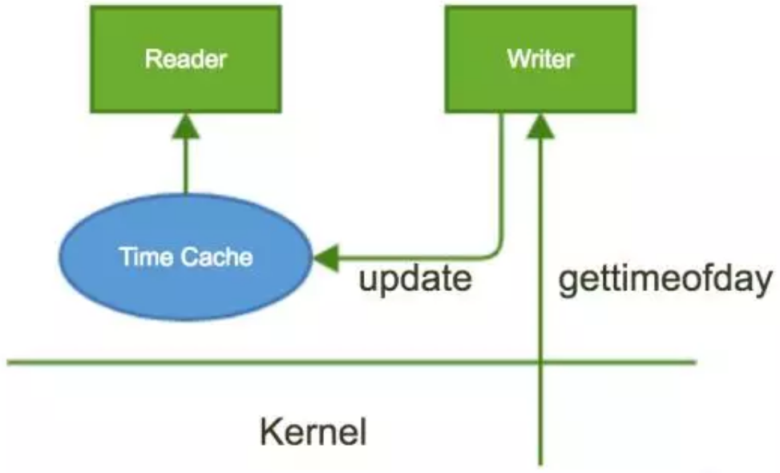
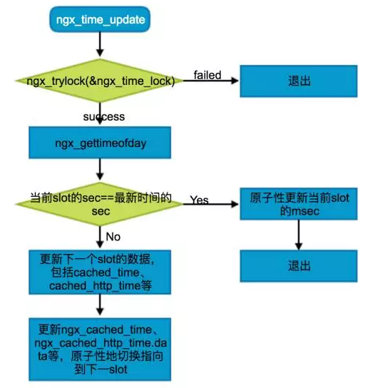
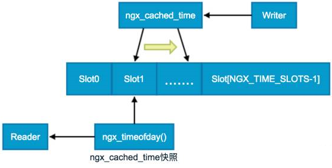

# nginx的时间缓存

对于频繁的数据获取，在数据未更改的情况下，可以通过增加缓存来优化性能。

## 设计



nginx时间缓存包括 Reader读取时间 和 Writer更新时间，在更新时间时，通过系统调用`gettimeofday`获取时间，然后更新缓存。Reader 则直接从时间缓存 获取时间。在并发场景下，有以下问题需要解决：

- 读写并发：读和写同时操作时间缓存导致获取的时间混乱
- 多写并发：多个线程 同时更新时间缓存，造成时间混乱

为了解决并发下的读写问题，通常采用 **加锁保证数据串行化** 和 **无锁化设计**，对于nginx这种极致追求性能的应用来说，其实现的`ngx_lock`和`ngx_unlock`的背后都是无锁化的原子操作。

1. 对于多写并发，nginx在`ngx_time_update`函数中通过全局的`ngx_time_lock`进行互斥，确保同一时刻只会存在一个执行体更新时间缓存。
2. 对于读写并发，nginx设计了`NGX_TIME_SLOTS`个slot，用于隔离读写操作的时间缓存。同时引入**时间缓存指针**，原子地更新当前缓存的指向位置。


## 实现

```
// nginx-1.13.1  src/core/ngx_times.c
void ngx_time_update(void) {
    ...
    //ngx_time_lock用于互斥，避免同时更新时间
    if (!ngx_trylock(&ngx_time_lock)) {
        return;
    }
    
    //获取当前时间
    ngx_gettimeofday(&tv);
    sec = tv.tv_sec;
    msec = tv.tv_usec / 1000;
    ngx_current_msec = (ngx_msec_t) sec * 1000 + msec;
    tp = &cached_time[slot];

    //秒值一致则只需要更新当前slot的msec
    if (tp->sec == sec) {
        tp->msec = msec; // 原子性更新
        ngx_unlock(&ngx_time_lock);
        return;
    }
    
    //获取下一slot
    if (slot == NGX_TIME_SLOTS - 1) {
        slot = 0;
    } else {
        slot++;
    }
    tp = &cached_time[slot];
    tp->sec = sec;
    tp->msec = msec;
    ngx_gmtime(sec, &gmt);
    p0 = &cached_http_time[slot][0];
    (void) ngx_sprintf(p0, "%s, %02d %s %4d %02d:%02d:%02d GMT",
                       week[gmt.ngx_tm_wday], gmt.ngx_tm_mday,
                       months[gmt.ngx_tm_mon - 1], gmt.ngx_tm_year,
                       gmt.ngx_tm_hour, gmt.ngx_tm_min, gmt.ngx_tm_sec);
    ...//类似更新ngx_cached_err_log_time.data等
    
    // 通过内存屏障保证之后的代码执行前，上面的代码都执行完成了
    // 防止内存重排、CPU优化等手段影响代码的执行顺序
    ngx_memory_barrier();

    ngx_cached_time = tp;
    ngx_cached_http_time.data = p0;
    ngx_cached_err_log_time.data = p1;
    ngx_cached_http_log_time.data = p2;
    ngx_cached_http_log_iso8601.data = p3;
    ngx_cached_syslog_time.data = p4;

    ngx_unlock(&ngx_time_lock);
}
```





## slot

nginx采用slot来从空间上避免读写执行体同时操作时间缓存，slot的设计规则为： 



- 获取时间的执行体采用`ngx_timeofday`获取了当前`ngx_cached_time`的快照，随后读取对应的slot中数据，包括sec和msec。
- 更新时间的执行体通过`ngx_time_update`原子更新`ngx_cached_time`指向，这样更新之后的时间读取就是新的slot中的时间数据。

**nginx利用了修改指针的原子性，确保读写不会造成时间数据混乱。而时间数据本身包括sec和msec，无法完成修改的原子性，则将非原子性修改操作转换为原子性修改操作。**


## Memory Barrier

[参考](https://blog.csdn.net/zhangxiao93/article/details/42966279)

程序在运行时内存实际的访问顺序和程序代码编写的访问顺序不一定一致，这就是内存乱序访问。内存乱序访问是为了提升程序运行时的性能，主要发生在两个阶段：

1. 编译时，编译器优化导致内存乱序访问（指令重排）
2. 运行时，多 CPU 间交互引起内存乱序访问

而Memory barrier 可以防止内存乱序访问的发生，**一个 Memory barrier 之前的内存访问操作必定先于其之后的完成**。Memory barrier 包括两类：

1. 编译器 barrier
2. CPU Memory barrier


